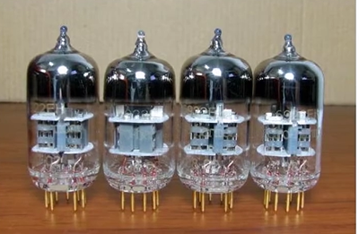

# 1. 【计算机系统概论】
## 1.1. 【信息的数字化表示】
1.  **控制信息 & 数据信息**
    1. **控制信息**
        * 指令序列 和 微命令（用指令产生的控制命令）序列 属于控制信息类
        * 数据信息是计算机加工处理的对象
        * 计算机根据指令要求取出的操作数以及对操作数处理的结果等，都属于数据信息类

    2. **数据信息**
        * **数值型数据**：有数值大小与正负之分
        * **非数值型数据**：字符、图像、音视频等

2.  **在计算机中用二进制表示各类信息**
    1. **数值型数据**
    2. **字符**：ASCII、UTF8 ...
    3. **图像**
        > * 一幅图像可以被细分为若干个像素。可用像素的组合来逼近真实的图像
        > * 例如，若像素是亮的，则用代码1表示；若像素是暗的，则用代码0表示。再将表示一幅图像所有像素的代码按照像素在图像中的位置进行组织，就可实现用数字代码来表示图像了

    4. **声音**
        > * 首先要将声波转换为电流波，再按一定频率对电流波进行采样，即在长度相同的时间间隔内分别对电流波的幅值进行测量，每次测到的电流幅值都用一个数字量来表示
        > * 只要采样频率足够高，所得到的数字信息就能逼真地保持声波信息，还原后真实地再现原来的声音

    5. **指令**
        > * 通常，一条指令需提供要求计算机做什么操作，以及如何获取操作数等信息
        > * 可以用一段数字代码表示操作类型，这段代码称为<mark>操作码</mark>；用另一段代码表示获取操作数的途径，这段代码称为<mark>地址码</mark>
        > * 将操作码和地址码组合在一起，就形成了机器指令代码

    6. **设备状态**
        > * 打印机等设备的状态可抽象、归纳为三种：空闲（设备没有工作）、忙（设备正在工作）、完成（设备做完一次操作）
        > * 相应地，可以用约定的数字代码表示这三种状态，如用 00 表示空闲，01 表示忙，10 表示完成

## 1.2. 【模拟信号 和 数字信号】

> * 电信号分为 模拟信号 和 数字信号 两种

1.  **模拟信号**
    * <mark>模拟信号</mark>：时间连续，幅值连续；<mark>数字信号</mark>：时间离散，幅值离散
    * 自然界中各种事物的变化，都是模拟信号，比如，太阳的升起，每一个时间点，对应于一个太阳的位置
    * 为了用计算机研究太阳位置的变化规律，必须要进行离散化的处理，比如早晨8点~10点，每隔5分钟，记录一个太阳的位置

2.  **数字信号**
    * 单个电信号一般只取两种状态，如电平的高或低、脉冲的有或无
    * `+5V` 为高电平，表示 1； `0V` 为低电平，表示 0
    * 有脉冲的状态表示 1，无脉冲的状态表示 0

## 1.3. 【计算机发展简史】
* **第一代，电子管计算机**（1946—1957）
    

* **第二代，晶体管计算机**（1958—1964）
    

* **第三代，中小规模集成电路计算机**（1965—1971）
* **第四代，大规模和超大规模集成电路计算机**（1972年至今）

## 1.4. 【计算机系统的基本组成及层次结构】

1. 这里说的计算机系统，是指电子数字通用计算机系统
    > * 电子：表明使用电子线路（不同于机械、继电器等）来实现计算机硬件的关键逻辑功能
    > * 数字：表明使用的电子线路是数字式电路（不同于模拟电路），运算和处理的数据是二进制的离散数据（不同于连续的电压或电流量）
    > * 通用：表明计算机本身的功能是多样的（不是专用于某种特殊应用的特定功能），具有完成各种运算或事务处理的能力
    
2. 计算机系统由硬件和软件两大部分组成
    * 硬件系统：计算机系统中看得见、摸得着的物理设备    
    * 软件系统：计算机系统中的程序和相关数据，包括系统软件和应用软件
    * 硬件是计算机软件运行的物质基础，软件则为硬件完成预期功能提供智力支持

3. 计算机系统的层次结构
    
    
    * 第0层是数字逻辑层
        > * 着重体现实现计算机硬件的最重要的物质材料——电子线路，能够直接处理离散的数字信号
        > * 设计计算机硬件组成的基础是数字逻辑和数字门电路
        > * 解决的基本问题包括使用何种器件存储信息、使用何种线路传送信息、使用何种器件运算与加工信息等

    * 第1层是微体系结构层，也称其为计算机裸机
        > * 计算机的核心功能是执行程序，程序是按一定规则和顺序组织起来的指令序列
        > * 这一层次着重体现的是：为了执行指令，需要在计算机中设置哪些功能部件（例如，存储、运算、输入和输出接口和总线等部件，当然还有更复杂一些的控制器部件），每个部件如何组成和怎样运行，这些部件如何实现相互连接并协同工作等方面的知识和技术
        > * 计算机硬件系统通常由运算器部件、控制器部件、存储器部件、输入设备和输出设备这五个部分组成
        
    * 第2层是指令系统层，该层介于硬件和软件之间
        > * 它涉及确定提供哪些指令，包括指令能够处理的数据类型和对各种类型数据可以执行的运算，每一条指令的格式和实现的功能，指出如何进行存储单元的读/写操作，如何执行外围设备的输入/输出操作，对哪些数据进行运算，执行哪一种运算，如何保存计算结果等
        > * 硬件系统的功能就是要实现每一条指令的功能。指令是用于程序设计的
        > * 方便程序设计、节省硬件资源、有利于提高程序运行效率是对指令系统的主要要求
        > * 合理选择可用的电子元件和线路来实现每一条指令的功能则是计算机组成的主要任务
    
    * 第3层是操作系统层
        > * 操作系统是计算机系统中最重要的系统软件，主要负责计算机系统的资源管理和调度执行，以及向使用者提供简单、方便、高效的服务（提供编程支持，与程序设计语言相结合）

    * 第4层是汇编语言层   
        > * 一台计算机的全部指令的集合构成了该计算机的指令系统
        > * 计算机可以直接识别和执行的只能是由机器语言构成的程序。但是使用计算机的人员却很难接受并使用这种语言。为此，必须找出一种折中方案，使得人们使用计算机和计算机实现都相对容易，这就要用到汇编语言、高级程序设计语言以及各种专用目标语言
        > * 用英文单词或其缩写形式代替二进制指令代码，使其更容易被人们记忆和理解
        > * 选用含义明确的英文单词来表示程序中用到的数据（常量和变量），可以避免程序设计人员直接为这些数据分配存储单元，这些工作由汇编程序完成
        > * 汇编语言是面向计算机硬件本身的、程序设计人员可以使用的一种计算机语言
        > * 汇编语言程序必须经过一个称为汇编程序的系统软件的翻译，将其转换为计算机机器语言后，才能在计算机的硬件系统上予以执行

    * 第5层是高级语言层
        > * 目前常用的高级语言有 C、C++、Java 等。用这些语言设计出来的程序通常需要经过一个称为编译程序的软件将其编译成机器语言程序，或者首先编译成汇编程序后，再经过汇编编程得到机器语言程序，才能在计算机的硬件系统上予以执行
        > * 通常把没有配备软件的纯硬件系统称为 “裸机”，这是计算机系统的根基或“内核”

## 1.5. 【存储程序概念】

* 世界上第一台电子数字计算机是 1946年2月15日 在美国宾夕法尼亚大学诞生的
* 存储程序概念是冯·诺依曼等人于 1946年6月 首先提出来的
    1. 计算机（指硬件）应由运算器、存储器、控制器、输人设备和输出设备5大基本部件组成
        
  
    2. 计算机内部采用二进制来表示指令和数据
    3. 将编好的程序和原始数据事先存人存储器中，然后再启动计算机工作，这就是存储程序的基本含义

* **冯·诺依曼瓶颈**
    * CPU 和 存储器 速率之间的问题无法调和
    
    
* **现代计算机的结构**
    * 现代计算机是在冯诺依曼体系结构基础上进行修改的
    * 解决 CPU 与 存储设备 之间的性能差异问题
        
    * **存储器**
        
    
## 1.6. 【计算机的硬件组成】


### 1.6.1. 【计算机的主要部件】

1. **输入设备**
    * 把编好的程序和原始数据送到计算机中去，并且将它们转换成计算机内部所能识别和接受的信息方式
    * 按输入信息的形态可分为字符输入、图形输入﹑图像输入及语音输入等
    * 常见的输入设备有：键盘﹑鼠标、扫描仪等。辅助存储器（磁盘）也可以看作输入设备

2. **输出设备**
    * 将计算机的处理结果以人或其他设备所能接受的形式送出计算机
    * 常用的输出设备有打印机和显示器。辅助存储器也可以看作输出设备

3. **存储器**
    * 常见的三级存储系统
        

    * 主存储器可由 CPU 直接访问，存取速度快但容量较小，一般用来存放当前正在执行的程序和数据
    * 辅助存储器设置在主机外部，它的存储容量大，价格较低，但存取速度较慢，一般用来存放暂时不参与运行的程序和数据，这些程序和数据在需要时可传送到主存，因此它是主存的补充和后援
    * 当 CPU 速度很高时，为了使访问存储器的速度能与 CPU 的速度相匹配，又在主存和 CPU 间增设了一级Cache（高速缓冲存储器）。Cache 的存取速度比主存更快，但容量更小，用来存放当前最急需处理的程序和数据，以便快速地向 CPU 提供指令和数据
    
4. **运算器**
    * 运算器是对信息进行处理和运算的部件
    * 因为经常进行的运算是算术运算和逻辑运算，所以运算器又称为算术逻辑运算部件（ALU）
    * 运算器的核心是加法器。运算器中还有若干个通用寄存器或累加寄存器，用来暂存操作数，并存放运算结果。寄存器的存取速度比存储器的存取速度快得多

5. **控制器**
    * 从主存中逐条地取出指令进行分析，根据指令的不同来安排操作顺序，向各部件发出相应的操作信号，控制它们执行指令所规定的任务
    * 控制器中包括一些专用的寄存器

### 1.6.2. 【计算机的总线结构】
 
1. **单总线结构**
    * 最简单的总线结构是单总线结构，各大部件都连接在单一的一组总线上，故将这个单总线称为系统总线
    * CPU 与主存、CPU 与外设之间可以直接进行信息交换，主存与外设、外设与外设之间也可以直接进行信息交换，而无须经过 CPU 的干预
    
    
    
    * 单总线结构提高了 CPU 的工作效率，而且外设连接灵活，易于扩充。但由于所有部件都挂在同一组总线上，而总线又只能分时的工作，故同一时刻只允许一对设备（或部件）之间传送信息
    * 所谓单总线并不是指只有一根信号线。系统总线按传送信息的不同可以细分为：地址总线﹑数据总线和控制总线
        > * 地址总线（Address Bus）：由单方向的多根信号线组成，用于 CPU 向主存、外设传输地址信息
        > * 数据总线（Data Bus）：由双方向的多根信号线组成，CPU 可以沿这些线从主存或外设读入数据，也可以沿这些线向主存或外设送出数据
        > * 控制总线（Control Bus）：传输的是控制信息，包括 CPU 送出的控制命令和主存（或外设）返回 CPU 的反馈信号

2. **总线电路**
    1. **三态门**
        * 总线电路主要由三态门组成。三态门是具有3种逻辑状态的门电路
        * 这3种状态为：逻辑“0”、逻辑“1” 和 浮空状态，所谓浮空状态，就是三态门的输出呈现开路的高阻状态
        * 三态门与普通门的不同之处在于，除了正常的输入端和输出端之外，还有一个控制端G(或G)。只有当控制端有效时,该三态门才满足正常的逻辑关系;否则输出将呈现高阻状态,相当于这个三态门与外界断开联系。根据输人输出的关系和控制端的有效电平,可以分成4种类型的三态门,如图1-4所示。


# 2. 【】

## 2.1. 【进制转换】

1. **N进制**：逢N进一位

2. **N进制转十进制**
    * **系数**：就是每一位上的数据
    * **基数**：N进制，基数就是N
    * **按权相加**
        > * **整数部分**：从右往左看，第i位的位权为 N^(i-1)^
        > * **小数部分**：从左往右看，第j位的位权为 N^(-j)^
    
    * **案例**： 八进制 423.5176 转换十进制
        > 423.5176 = 4×8^2^ + 2×8^1^ + 3×8^0^ + 5×8^-1^ + 1×8^-2^ + 7×8^-3^ + 6×8^-4^ = 275.65576171875

3. **十进制转N进制**
    1. **整数部分**：辗转相除法 => 除N取余，逆序排列
        * step1: 将N作为除数，用十进制整数除以N，可以得到一个商和余数
        * step2: 保留余数，用商继续除以N，又得到一个新的商和余数
        * step3: 仍然保留余数，用商继续除以N，还会得到一个新的商和余数
        * step4: 如此反复进行，每次都保留余数，用商接着除以N，直到商为0时为止
        * step5: 把先得到的余数作为N进制数的低位数字，后得到的余数作为N进制数的高位数字，依次排列起来，就得到了N进制数字

    2. **小数部分**：乘N取整，顺序排列
        * step1: 用N乘以十进制小数，得到的积包含了整数部分和小数部分
        * step2: 将积的整数部分取出，再用N乘以余下的小数部分，又得到一个新的积
        * step3: 再将积的整数部分取出，继续用N乘以余下的小数部分
        * step4: 如此反复进行，每次都取出整数部分，用N接着乘以小数部分，直到积中的小数部分为0，或者达到所要求的精度为止
        * step5: 把取出的整数部分按顺序排列起来，这样就得到了N进制小数

        > **注意**：十进制小数转换成其他进制小数时，结果有可能是一个无限位的小数
        > (0.51)~10~ = (0.100000101000111101011100001010001111010111...)~2~

4. **2、8、16 进制的转换**
    * **二进制整数转八进制整数**：每三位二进制数字转换为一位八进制数字，运算的顺序是从低位向高位依次进行，高位不足三位用零补齐
    * **八进制整数转二进制整数**：每一位八进制数字转换为三位二进制数字，运算的顺序也是从低位向高位依次进行
    * **二进制整数转十六进制整数**：每四位二进制数字转换为一位十六进制数字，运算的顺序是从低位向高位依次进行，高位不足四位用零补齐
    * **十六进制整数转二进制整数**：每一位十六进制数字转换为四位二进制数字，运算的顺序也是从低位向高位依次进行

## 2.2. 【补码】

> 整数是采用补码的形式来存储的，浮点数是采用 IEEE754 标准存储的

1. **原码**：一个整数本来的二进制形式
    
    ```c
    short a = 6;  // a的原码: 0000 0000 0000 0110 
    a = -18;      // a的原码: 1000 0000 0001 0010
    ```

2. **反码**
    * **正数**：反码和原码相同
    * **负数**：将原码中除符号位以外的所有位（数值位）取反

3. **补码**
    * **正数**：原码、反码、补码都相同
    * **负数**：反码加1

    ```c
    short a = 6;    // a的原码、反码、补码都是0000 0000 0000 0110 
    a = -18;        // a的补码是1111 1111 1110 1110
    ```

4. **案例**
    ```c
    // 【假设都是 short 类型】 
    6 - 18 = 6 + (-18) 
    = [0000 0000 0000 0110]补 + [1111 1111 1110 1110]补 
    = [1111 1111 1111 0100]补 
    = [1111 1111 1111 0011]反 
    = [1000 0000 0000 1100]原 
    = -12 

    18 - 6 = 18 + (-6) 
    = [0000 0000 0001 0010]补 + [1111 1111 1111 1010]补 
    = [1 0000 0000 0000 1100]补  //最高位溢出 
    = [0000 0000 0000 1100]补 
    = [0000 0000 0000 1100]反 
    = [0000 0000 0000 1100]原 
    = 12
    ```

5. **0的反码和补码**

    ```c
    // 在反码和补码表示中，0是一个比较特殊的数字
    // 由于0可表示为正0和负0，因此0的原码和反码分别有两种表示形式，如下表示
    [+0]原码=00000000000000000000000000000000
    [-0]原码=10000000000000000000000000000000
    
    [+0]反码=00000000000000000000000000000000
    [-0]反码=11111111111111111111111111111111
    
    // 而对于 +0 和 -0 的补码，有
    [+0]补码=00000000000000000000000000000000
    [-0]补码=00000000000000000000000000000000
    // 可见0的补码表示是唯一的
    ```

## 2.3. 【浮点型数据的存储方式】

* 对于浮点类型的数据采用单精度类型（float）和双精度类型（double）来存储
* float 数据占用 32bit，double 数据占用 64bit
* 通常 float 可以保证十进制科学计数法小数点后6位有效精度和第7位的部分精度，double 可以保证十进制科学计数法小数点后15位有效精度和第16位的部分精度
* float 和 double 的精度是由尾数决定的
* 不论是 float 还是 double 在存储方式上都是遵从 IEEE 的规范 的，float 遵从的是 IEEE R32.24 ,而 double 遵从的是 R64.53

* 无论是单精度还是双精度在存储中都分为三个部分
    > * **符号位**（Sign）：0 代表正，1 代表为负
    > * **指数位**（Exponent）：用于存储科学计数法中的指数数据，并且要加上偏移量（float偏移127，double偏移量1023）
    > * **尾数部分**（Mantissa）：尾数部分

* 单精度 float 的存储方式
    
    
* 双精度 double 的存储方式
    

* R32.24 和 R64.53 的存储方式都是用科学计数法来存储数据的，比如 8.25 用十进制的科学计数法表示就为：8.25 × 10^0^，而 120.5 可以表示为：1.205 × 10^2^
* 可是计算机根本不认识十进制的数据，只认识 0，1，所以在计算机存储中，首先要将上面的数更改为二进制的科学计数法表示，8.25 用二进制表示可表示为 1000.01，120.5 用二进制表示为：1110110.1。用二进制的科学计数法表示 1000.01 可以表示为 1.00001 × 2^3^，1110110.1 可以表示为 1.1101101 × 2^6^。任何一个数的科学计数法表示都为 1.XXX × 2^n^。尾数部分就可以表示为 xxxx，第一位都是 1 嘛，干嘛还要表示呀？可以将小数点前面的 1 省略，所以 23bit 的尾数部分，可以表示的精度却变成了 24bit。
    
    
* 奇怪输出结果
    
    
    * 2.25 的单精度存储方式，2.25 --> 10.01 --> 1.001 × 2^1^
    * 符号位0，指数部分 1+127 --> 10000000
    * 尾数部分：001 0000 0000 0000 0000 0000
    * 很简单 0  1000 0000   001 0000 0000 0000 0000 0000,
    * 而 2.25 的双精度表示为:0  100 0000 0000  0010 0000 0000 0000 0000 0000 0000 0000 0000 0000 0000 0000 0000，这样 2.25 在进行强制转换的时候，数值是不会变的
    
    ---

    * 再看看 2.2 呢
    * 发现小数部分的二进制是一个无限循环的排列 00110011001100110011... 
    * 对于单精度数据来说，尾数只能表示 23bit 的精度，所以 2.2 的 float 存储为：2.2 --> 10.0011001100110011001100 --> 1.00011001100110011001100 × 2^1^
    * 符号位0，指数部分 1+127 --> 1000 0000
    * 尾数部分：00011001100110011001100
    * 0  1000 0000  00011001100110011001100
    * 但是这样存储方式，换算成十进制的值，却不会是 2.2 的
    * 因为十进制在转换为二进制的时候可能会不准确，如 2.2，而 double 类型的数据也存在同样的问题，所以在浮点数表示中会产生些许的误差，在单精度转换为双精度的时候，也会存在误差的问题

## 2.4. 【】


1. **MAR**：地址寄存器，用来存放存储单元地址
2. **MDR**：数据寄存器，用来存放从存储单元中取出或将要存入存储单元的数据
3. **运算器**
    * `MQ`：乘商寄存器
    * `ACC`：累加器
    * `ALU`：算数逻辑单元
    * `X`：操作数寄存器

    

    ```
    M：主存中某一地址上的存储单元     (M)：取 M 中的数据

    加法
        (M) -> X
        (ACC) + (X) -> ACC

    乘法
        (M) -> MQ                # 乘数
        (ACC) -> X               # 将 ACC 的数据作为 被乘数
        0 -> ACC                 # ACC 清零
        (X) × (MQ) -> ACC//MQ    # 高位给 ACC，低位给 MQ，MQ 能存储多少，低位就是多少，多出来的都是高位，放入 ACC 中

    除法
        (M) -> X
        (ACC) ÷ (X) -> MQ
        (ACC) % (X) -> ACC
    ```

4. **控制器**
    * `CU`：控制单元，分析指令并发出各种控制信号来协调各部件完成指令所描述的操作
    * `IR`：指令寄存器，存放当前要执行的指令，其内容来自 MDR
    * `PC`：程序计数器，用来存放当前要执行的指令地址，与 MAR 直接连通且有自动加 1 的功能

指令：操作码 + 地址码

IR
(IR)  取 IR 的内容
OP(IR)  获取操作码
Ad(IR)  获取地址码
OP(IR)  ->  CU  送入控制单元中
Ad(IR)  ->  MAR
计算机硬件组成

硬盘类型：机械和固态
硬盘接口：IDE、SATA、SCSI、SAS（集 SATA + SCSI 优点）、光纤通道