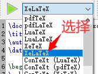

# 1. 【】

> Latex 是一种基于 Tex 的文档排版系统

1. **常用的 Tex 发行版**：TexLive 和 MikTex
    * **TexLive**：提供的包很全，但占用空间大
    * **MikTex**：占用空间小、安装速度快，但如果遇到本地缺少的包则需要联网下载

    > 在线使用Tex：[https://www.overleaf.com/](https://www.overleaf.com/)

2. **Tex 编辑器**
    1. TexLive自带编辑器：`TeXworks editor`
        
    
        * `Ctrl+单击`：在文本编辑区与PDF预览区之间切换
        * `tab`：自动补全命令或环境
            
            ```tex
            \doc --【tab】--> \documentclass{}
            beq  --【tab】-->  
                \begin{equation}

                \end{equation}•
                % 光标移动在环境中央等待输入，再次按 Ctrl + Tab 则可跳转到后面的圆点处继续下面内容的输人，而不需要使用方向键
            ```
        
        * **设置项**：编辑菜单 -- 首选项...
        
    2. 下载安装：`texstudio`

3. **案例**

    ```tex
    \documentclass[utf8]{ctexart}  % 声明文档类型为中文文章 or 
    \title{文章的标题}
    \author{yiyiqiang}
    \date{\today}

    \begin{document}
    \maketitle  	   % 应用标题设置
    Hello World!\\     % 用 \\ 表示换行
    \TeX               % 输出字符 tex，带特定格式

    \end{document}
    ```


    * **声明文档类型**（article，book，report）：`\documentclass{article}`
    * **标识正文范围**：`\begin{document} 和 \end{document}`
    * **导言区**
        > * 位于：`\documentclass` 和 `\begin{document}` 之间
        > * 除了使用 `\usepackage` 调用宏包之外，一些对文档的全局设置命令也在这里使用

    * **命令**
        > * 以反斜线 `\` 开头，对大小写敏感
        > * 大多数命令是带一个或多个参数，参数用 `{ }` 或 `[ ]` 包裹

    * **环境**：用以令一些效果在局部生效，或是生成特定的文档元素
        
        ```tex
        \begin{<environment name>}{<arguments>}
        ...
        \end{<environment name>}
        ```
        
        > * `⟨environment name⟩` 为环境名，`\begin` 和 `\end` 中填写的环境名应当一致
        > * `\begin` 在 `⟨environment name⟩` 后可以带一个或多个参数，环境允许嵌套使用

## 1.1. 【】


* **注释**：`%`
* 

+ **上标**：`2^2` => $2^2$
+ **下标**：`H_2O` => $H_2O$
+ **分式**：`\frac{a}{b}` => $\frac{a}{b}$
+ **根式**
    + `\sqrt{22}` => $\sqrt{22}$
    + `\sqrt[45]{3}` => $\sqrt[45]{3}$
+ **累加**
    + `\sum{a}` => $\sum{a}$
    + `\sum_{n=1}^{4}{a_n}` => $\sum_{n=1}^{4}{a_n}$
+ **累乘**：`\prod`
+ **极限**
    + `\lim{(a+b)}` => $\lim{(a+b)}$
    + `\lim_{x->0}{f(x)}` => $\lim_{x->0}{f(x)}$

+ **积分**
    + `\int_{i=0}^{5}{a_i}` => $\int_{i=0}^{5}{a_i}$

