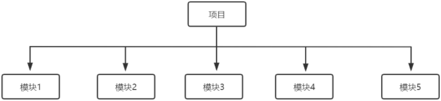
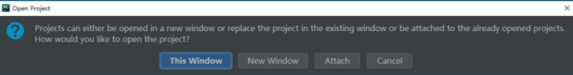

# 1. 【IDEA vs Eclipse】
* Eclipse 中 workspace 相当于 IDEA 中的 Project
* Eclipse 中 Project   相当于 IDEA 中的 Module
* 工程下的 src  目录，用于存放代码
* 工程下的 out 目录，用于存放编译后的字节码文件

* 目前主流的大型项目都是分布式部署的，结构都是类似这种多 Module 的
* 比如: 积分模块、任务模块、活动模块等等，这些 Module 之间都是处于同一个项目业务下的模块，彼此之间是有不可分割的业务关系的
* 对于每一个 IDEA 的项目工程（Project）而言，它的每一个子模块（Module）都可以使用独立的 JDK 和 MAVEN 配置。而这正是 Eclipse 所缺失的，因为开始 Eclipse 在初次使用时已经绑死了工作空间

# 2. 【打开与关闭项目】
1. **打开项目**：`File | Open`

    

    * This Window：覆盖当前项目，打开目标项目
    * New Window：在新窗口打开
    * Attach：当前窗口并存多个项目

1.  **关闭项目**：`File | Close Project / Close Projects in current window`

# 3. 【设置项】
1. **修改 Python 解释器**：`[Project: 项目名称] → [Project Interpreter]`

2. **代码模板**
   1. `Settings | Editor | File and Code Templates`
      * ↘ `Files`：修改文件的模板
      * ↘ `Includes | File Header`：新建类时自动添加文档注释信息
   2. `Settings | Editor | General | Postfix Completion`：只能用，不能修改
   3. `Settings | Editor | Live Templates`：可以个性化定制

3. **关闭更新**
    * `Settings | Appearance & Behavior | System Settings | Updates`
        * ↘ 勾选  `Automatically check updates for`

4. **设置项目文件编码**
    * `Settings | Editor | File Encodings`
        * ↘ `Global Encoding`
        * ↘ `Project Encoding`
        * ↘ `Default encoding for properties files`
        * ↘ 取消勾选 `“Transparent native-to-ascii conversion”`

5. **自动编译**
    * `Settings | Build, Execution, Deployment | Compiler`
        * ↘ 勾选  `Build project automatically`
        * ↘ 勾选  `Compile independent modules in parallel`

6. **垂直或水平展示代码区**
    * 右键代码区上方的文件名，选择 `Split Vertically` 或 `Split Horizontally`

7. **导入 jar 包**：`File | Project Structure | Libraries`

8. **显示行号、空白字符**
    * `Settings | Editor | General | Appearance`
        * ↘勾选  `show line numbers`
        * ↘勾选  `show whitespaces`

9. **Ctrl + 滚轮 调节字体大小**
    * `Settings | Editor | General`
        * ↘ 勾选  `change font size (Zoom) with Ctrl+Mouse wheel`

10. **隐藏开发工具的配置目录**
    * `Settings | Editor | File Types`
        * ↘ 在 `Ignore files and folders` 末尾加上  `*.idea;*.iml`

# 4. 【快捷键】
* **main方法**：`psvm`
* **输出语句**：`sout`
* **for循环**：`fori`

---

* **复制行**：`Ctrl + D`
* **删除行**：`Ctrl + Y`
* **单行注释 或 多行注释**：`Ctrl + / ` 或 `Ctrl + Shift + /`
* **搜索类**：`Ctrl + N`
* **弹出 Search Everywhere 弹出层**：`连按两次 Shift`
* **多光标**：`Alt + Shift + 单击`
* **查看类的UML关系图**：`Ctrl + Alt + U`

---

* **智能提示**：`Alt + Enter` => 导包，生成变量等
* **自动生成变量**：`Ctrl + Alt + V`
* **快速文档**：`Ctrl + Q`
* **提示方法形参**：`Ctrl + P`
* **代码自动补全提示**：`Alt + /`
* **快捷模板提示**：`Ctrl + J`
* **使用xx块环绕**：`Ctrl + Alt + T`
* **查看类、方法等的定义**：`Ctrl + 单击`
* **多态引用时查看子类重写方法的源码**：`Ctrl + Alt + B`
* **显示当前类的继承层次**：`Ctrl + H`
* **显示代码结构**：`Alt + 7`
* **显示导航栏**：`Alt + 1`

---

* **自动生成构造器、get/set**：`Alt + Insert`
* **重写父类的方法**：` Ctrl + O`
* **实现接口的方法**：`Ctrl + i`
* **抽取代码重构方法**：`Ctrl + Alt + M`
* **重命名类、变量等**：`Shift + F6`

# 5. 【调试】
1. **Debug 的优化设置**
    > * 设置 Debug 连接方式，默认是 Socket
    > * Shared memory 是 Windows 特有的一个属性，建议使用此设置，内存占用相对较少

    

2. **调试相关按钮**

    
