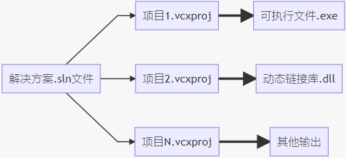

# 1. 【解决方案与项目的关系】

1. 双击后缀为 `.sln` 的文件即可打开解决方案

2. 生成解决方案
    * 解决方案上右击选择**生成解决方案** => 针对该方案下的所有项目
    * 项目上右击选择**生成** => 仅针对当前项目
    * 若项目没有改动时，再次点击生成后，其输出信息中将不包括该项目，除非项目有改动或点击重新生成

3. 筛选器 与 文件夹
    * 用于项目中文件的分类管理
    * VS 默认新建了**头文件**、**源文件**、**资源文件** 这三个筛选器
    * 新建筛选器
        > * 项目 -> 右击选择添加 -> 新建筛选器
        > * 筛选器（filter）并不对应真实的物理存储结构，仅仅是逻辑上的分类
        > * 位于项目文件夹内的 “项目名.vcxproj.filters” 文件记录着筛选器的相关信息

    * 新建文件夹
        > * 项目菜单 > 显示所有文件：单击后将发现**解决方案资源视图**中所有的筛选器都不见了
        > * 此时：项目 -> 右击选择添加 -> 新建文件夹 => 由新建筛选器变成了 新建文件夹
        > * 文件夹对应真实的物理存储结构，而筛选器只是逻辑上的分类
        > * 不断切换 **项目菜单 > 显示所有文件**，可查看或新建文件夹与筛选器两种结构

# 2. 【设置项】
1. **字体和颜色**：环境 -> 字体和颜色

2. **行号**：文本编辑器 -> 所有语言

3. **制表符** 文本编辑器 -> 所有语言 -> 制表符
    > * 制表符大小=4 、缩进大小=4 、勾选“插入空格”

4. **开启 minimap 功能**
    > * 文本编辑器 —> 所有语言 —> 滚动条
    > * 使用垂直滚动条的缩略图模式 & 源代码概述选择宽

5. **左大括号的位置**
    > * 文本编辑器 -> C/C++ -> 格式设置 -> 新行
    > * 函数的左大括号的位置：保持在同一行上

6. **编码**：在线安装 “ForceUTF8” 插件

7. **更改目标文件名**
   * 默认目标文件名与项目名同名
   * 项目属性 -> 配置属性 -> 常规 ->> 默认目标文件名
   * 最终决定：配置属性 -> 链接器 -> 常规 ->> 输出文件

# 3. 【Debug 与 Release】
1. **Debug**：称为调试版本，它包含调试信息，不作任何优化
2. **Release**：称为发布版本，不包含调试信息，并对代码进行了优化

# 4. 【设置头文件包含目录与库目录】
1. 指定 `.h` 头文件所在目录 （附加包含目录）
    > * 配置属性 -> C/C++ -> 常规 ->> 附加包含目录

2. 指定 `.lib` 所在文件目录 （附加库目录）
    > * 配置属性 -> 链接器 -> 常规 ->> 附加库目录

3. 指定需要使用到的 `.lib` （附加依赖项）
    > * 配置属性 -> 链接器 -> 输入 ->> 附加依赖项

# 5. 【快捷键】

1. **复制、剪切与删除当前行**：`Ctrl + C、X、L`
2. **查找、替换与定位**：`Ctrl + F、H、G`
3. **注释与取消注释**：`Ctrl + K + C、U`
4. **大小写转换**：`Ctrl + [Shift] + U`
5. **框式选择**：`Shift + Alt + 方向键（或鼠标）`
6. **上下插行**：`Ctrl + [Shift] + Enter`
7. **当前行向下交换位置**：`Shift + Alt + T`
8. **鸟瞰视图**：`Ctrl + Tab`
9. **格式化代码**：`Ctrl + K + D`
10. **把空格变为绿点**：`Ctrl + R + W`
11. **删除光标到行尾的所有字符**：`Ctrl + Delete`
12. **快速隐藏或显示当前代码段**：`Ctrl + M + M`
13. **生成解决方案**：`Ctrl + Shift + B`
14. **定位到行首与行尾**：`home/end`
15. **选中从光标起到行首（尾）间的代码**：`Shift + Home/End`

---

1. **智能提示**：`Ctrl + J 或 Alt + →`
2. **方法参数提示**：`Ctrl + Shift + 空格`
3. **将选择的代码进行快捷嵌套**：`Ctrl + K + S`
4. **对象重命名（变量、函数）**：`Ctrl + R`
5. **定义与引用**：
    * **转跳到定义**：`F12`
    * **查找所有引用**：`Shift + F12`
    
---

1. **书签**：
    * **切换书签**：`Ctrl + K + K`
    * **上/下一个书签**：`Ctrl + K + P、N`
    * **书签视图**：`Ctrl + K + W`

2. **调试相关**
    * **调试（启动）**：`F5`
    * **调试（重新启动）**：`Ctrl + Shift + F5`
    * **调试（开始执行不调试）**：`Ctrl + F5`
    * **调试（逐语句）**：`F11`
    * **调试（逐过程**）：`F10`
    * **设置断点**：`F9`

# 6. 【技巧篇】
1. **tab键代码补全**：for语句补全 => 输入 “for” 按 tab 键

2. **任务列表**
    * **标记**：`// TODO: Do something...`
    * **查看**：视图 —> 任务列表

3. **Peek View**
    * **作用**：快速查看、编辑一个函数的代码
    * **用法**：光标移至某个函数下，按 Alt + F12
        > 在 Peek 窗口可继续按 `Alt + F12`。 然后按 `Ctrl + Alt + -/+` 可前后跳转，按 ESC 关闭 Peek 窗体

7. **智能提示**
    * **实现 ExtJS 智能提示**
        > * 在js脚本文件中的头部加入: `/// <reference path="ext-all-dev.js" />`

    * **实现 JQuery 的智能提示**
        > * 在JS文件中加入：`/// <reference path="jquery-1.4.1-vsdoc2.js" />`
