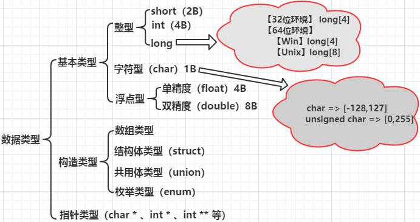

# 1. 【数据类型和运算符】

## 1.1. 【基础热身】

1. **程序与指令**
    - 指令是对计算机进行程序控制的最小单位
    - 所有的指令的集合称为计算机的指令系统。电脑是X86，手机是ARM
    - 机器指令格式: 操作码 + 操作数
        - **操作码**: 机器执行什么操作
        - **操作数**: 执行对象（具体数、存放位置）
    - 程序是为完成一项特定任务而用某种语言编写的一组指令序列

2. **C语言程序的结构**
    1. **一个程序由一个或多个源程序文件组成**
    2. **一个源程序文件通常由三部分组成**
        - **预处理指令**
            - 对源程序进行编译之前，先由预处理器对预处理指令进行预处理
            - 以 `#` 开头，如  `#include`  、 `#define`  指令
            - 一定要是第一个非空白字符
        - **全局声明**：即在函数之外进行的数据声明
        - **函数定义**
            - 函数是 C语言 的基本单位
            - 有且只有一个 main 函数，程序总是从 main 函数开始执行，又从 main 结束
            - 函数首部：即函数的第一行，包括函数名、函数类型、函数参数名、参数类型
            - 函数体
                - **声明部分**：变量的定义、被调函数的声明
                - **执行部分**：由若干语句组成
    3. **C源代码是自上而下执行的**
    4. **语句和代码块**
        - 语句以 `;` 分号结尾
        - 预编译指令行结尾是没有分号的
        - 代码块由 `{}` 内部的一条或多条语句组成

3. **C语言的三套标准**
    - **C89与C90**：细微的差别,通常来讲 C89 和 C90 指的是同一个版本
    - **C99**：变量声明可以不放在函数开头, 支持变长数组等
    - **C11**：增加了安全函数: gets_s()、fopen_s() 等

4. **符号：链接的粘合剂**
    - 链接就是通过 符号 将各个模块组合成一个独立的程序的过程
    - 函数和变量在本质上是一样的，都是地址的助记符，在链接过程中，它们被称为符号
    - 链接器的一个重要任务就是找到符号的地址
    - 在程序运行之前确定符号地址的过程叫做静态链接
        - **静态链接库**：Win：`.lib`  、Linux：`.a`
    - 在程序运行期间确定符号地址，就叫做动态链接
        - **动态链接库**：Win： `.dll` ，Linux：`.so`
    - 查找程序所依赖的动态库
        - **Linux**：`ldd /usr/bin/ls`
        - **Win**：`使用 Depends.exe 工具`

## 1.2. 【Linux 下开发】

1. **编译器**：`gcc`

2. **从源程序到可执行程序的流程**
    1. **​预处理**：处理文件包含、宏、条件编译 和 注释，保留 #pragma
        - `gcc -E hello.c -o hello.i`
    2. **编译**：编译为汇编文件
        - `gcc -S hello.i -o hello.s`
    3. **汇编**：经汇编后为二进制的机器指令
        - `gcc -c hello.s -o hello.o`
    4. **链接**：设置运行环境，堆栈等，将编译生成的多个目标文件以及系统中的库、组件等合并成一个可执行程序
        - `gcc hello.o -o hello` 若不添加 -o 选项 默认名字是 a.out
    
3. **开发技巧**
    1. **查看函数用法**：`man 3 exit`
    2. **自动补全**：`Ctrl + P`
    3. **查看函数原型**：`Shift + K`  连按 `q` 两次回到 `vim`
    4. **显示所有警告**：`gcc hello.c -Wall`  

4. **写程序的思路**
    1. **头文件应正确包含**：当没有引入对应的头文件时，会默认函数的返回值是 `int` 类型
    2. 以函数为单位来进行程序的编写
    3. 声明部分放在 `.h` 头文件中，实现部分放在 `.c` 源文件中
    4. 函数返回值
        
        ```c
        exit(0)   // 结束当前进程
        
        // return 和 exit 的返回值都是给父进程看的，`echo $?` => 0
        return 0;
        exit(0);
        
        // 当 main 函数没有 return 和 exit 语句时，返回值则是 printf() 的返回值
        // printf() 如果成功，则返回所写的字符总数
        printf("Hello World\n");  // 执行C程序后，使用 `echo $?` 会输出 12
        ```

    5. 多用空格空行
    6. 添加注释
        * **单行注释**：`//`
        * **多行注释**：`/* ... */`

## 1.3. 【C语言嵌套汇编】

```c
#include <stdio.h>

int main()
{
    int a;
    int b;
    int c;

    __asm
    {
        mov a, 3      // 3 的值放在 a 对应内存的位置
        mov b, 4      // 4 的值放在 b 对应内存的位置
        mov eax, a    // 把 a 内存的值放在 eax 寄存器
        add eax, b    // eax 和 b 相加，结果放在 eax
        mov c, eax    // eax 的值放在 C 中
    }
    printf("%d\n", c);
    return 0;
}
```

## 1.4. 【常量】

1. **整型常量**：默认为 int 类型
    - **十进制数**
        - `123456L`  long 类型的整数
        - `123456LL` long long 类型的整数
        - `123456U`、`123456UL`、`123456ULL` 无符号类型
    - **二进制数**：以 0b 或 0B 开头
        - 标准C语言不支持二进制写法，只是有些编译器自己进行了扩展，才支持二进制数字
        - 高版本的 VS 支持，低版本的不支持
        - 高版本的 GCC 支持，低版本的不支持
        - LLVM/Clang 支持
    - **八进制数**：以 0 开头
    - **十六进制**：以 0x 或 0X 开头

2. **实型常量**：默认为 double 类型
    * **十进制小数形式**
        * `123.456F`  加上后缀 “f或F” 表明是float类型
    * **指数形式**：aEn 或 aen
        * `a`：尾数部分，取值为: 0 ≤ 尾数 < 10
        * `n`：指数部分，必须为整数
        * `E 或 e`：固定字符，用于分割尾数部分和指数部分。整个表达式等价于 a×10^n^
        * 字母 `e` 或 `E` 之前必须有数字，而 e 后面必须是整数，不能有小数
            > * 即使实型数是 10 的幂，如 10^5^，也不能表示成 e5，而要表示成 1e5。因为表示成 e5 就产生了二义性，编译器无法确定它是一个实型数还是一个变量名

3. **字符型常量**
    - **普通字符**：只能是一个字符，由单引号引起
    - **转义字符**：以字符 `\` 开头的字符序列
        - `\'`：单引号
        - `\"`：双引号
        - `\\`：反斜杠
        - `\a`：警告
        - `\b`：退格
        - `\n`：换行
        - `\r`：回车
        - `\t`：水平制表符
        - `\数字`：八进制
        - `\x数字`：十六进制
    - **反斜线**：还可作为接续符
        - 跟在反斜杠后面的字符自动接续到前一行
        - 反斜杠之后不能有空格，反斜杠的下一行之前也不能有空格

4. **字符串常量**
    - **双引号引起**：`"boy"`、`"123"`, `"A"`（代表: `'A'` 和 `'\0'`）
    - 每个字符串尾自动加个 `\0` 作为字符串结束标志
        > 数字0  => 内存中存的是 0
        > '0'   => 内存中存的是 48
        > '\0'  => 内存中存的是 0
    
    - C语言中没有专门的字符串类型，只能使用数组或指针来间接地存储字符串
        - `char str1[] = "http://c.biancheng.net";`
        - `char *str2 = "C语言中文网";`

5. **符号常量**
    - `#define PI 3.14` <font>注意行末没有分号</font>
    - 在程序编译前，预处理器先对字符名称进行处理，把所有字符名称全部替换为指定的常量
    - 符号常量不占用内存，只是一个临时符号，在预编译后这个符号就不存在了
    - 习惯上符号常量用大写表示

## 1.5. 【变量】

1. **先定义后赋值**：`int a; a = 123;`  第一次赋值: 变量的初始化
2. **定义的同时赋值**：`int a = 123;`
3. **连续定义多个变量**
    - `int a, b, c;`
    - `char p, q = '@';`
    - `int a = 3, b = 3, c = 3;`
    - `int a=b=c=3;`  错误的写法
    - `int (i = 8) = 6;`   错误，左值只能是变量，不能为常量或表达式

> - 在 Java 中，对于局部变量，如果没有经过初始化赋值就使用该变量，编译器会直接报错
> - 在 C语言 中，对于局部变量，没有经过初始化赋值是可以使用的。但不建议这样做，因为系统会随意给变量赋值，得到的是垃圾数据

## 1.6. 【数据类型】



1. **双长整型：C99** `long long`
    - long long 在 32 位系统和 64 位系统下都是 8 个字节

2. **布尔型：C99** `_Bool`
    - `_Bool` 类型的变量值可以是 0 或 1
    - 在头文件 `<stdbool.h>` 中，定义了 `bool` 类型 和 两个符号常量: `true` 和 `false`

3. **浮点型**
    - IEEE754 标准规定，小数在内存中是以科学计数法的形式来存储的
    - `%f` 和 `%lf` 默认保留六位小数，不足六位以 0 补齐，超过六位按四舍五入截断
    - 不能精确输出：
        - `float money = 93.96;`   输出: money=93.959999
        - `if(f == 0)` 错误的写法，正确写法：`if(fabs(f-0) <= 1e-6)`

4. **char 类型**
    * C语言标准，并没有规定字符型是无符号还是有符号类型的
    
    ```
    signed char
        1 0000000 - 1 1111111  -0 ~ -127
        0 0000000 - 0 1111111  +0 ~ +127
        规定: 将 -0 表示成 -128
        -128 ~ 127
    
    unsigned char
        00000000 - 11111111
        0 ~ 255
    ```

## 1.7. 【数据类型转换】

1. **自动类型转换**
    - **赋值**：`float f = 100;`、`int n = f;`
    - **混合运算**
        - char 和 short 参与运算时，必须先转换成 int 类型
        - int 和 long 参与运算时，int 类型的数据会先转成 long 类型再进行运算
        - 所有的浮点运算都是以 双精度 进行的，即使运算中只有 float 类型，也要先转换为 double 类型，才能进行运算

2. **强制类型转换**：`(数据类型)表达式`

## 1.8. 【存储类型】

1. **auto**：默认，自动分配空间，自动回收空间

2. **register**：寄存器类型
    - 建议型，最终是否为寄存器类型的变量由 gcc 决定
    - 只能定义局部变量，不能定义全局变量
    - 大小有限制，只能定义 32 位大小的数据类型，如 double 就不可以
    - 寄存器没有地址，所以寄存器类型的变量是不能打印出地址查看或使用的

3. **static**
    - 静态型，自动初始化为 0 值或空值，并且其变量的值有继承性
    - 常用于修饰变量或函数

4. **extern**
    - 声明外部变量，将其它文件中的全局变量的作用域扩展到当前文件中
    - C语言代码是由上到下依次执行的，不管是变量还是函数，原则上都要先定义再使用，否则就会报错
    - 实际开发中，经常会在函数或变量定义之前就使用它们，这个时候就需要提前声明
    - **函数的声明**：有无 extern 一样，四种形式：
        - `datatype function( datatype1 name1, datatype2 name2, ... );`
        - `datatype function( datatype1, datatype2, ... );`
        - `extern datatype function( datatype1 name1, datatype2 name2, ... );`
        - `extern datatype function( datatype1, datatype2, ... );`
    - **变量的声明**
        - 变量和函数不同，编译器只能根据 extern 来区分
        - 声明格式：`extern datatype name;`
    - **声明和定义区别**
        - 声明变量不需要建立存储空间
        - 定义变量需要建立存储空间
        - 定义只能有一次，声明可以有多次

5. **const**
    - const 修饰的值不是常量，而是修饰只读变量

        ```c
        const int Max = 100; 
        int Array[Max];
        ```

      - 在 `.c` 文件中报错；在 `.cpp` 文件中顺利运行
      - 定义一个数组必须指定其元素的个数，所以，运行结果也说明了const 修饰的 Max 仍然是变量，只不过是只读属性

   - 常变量与符号常量的区别 

        ```c
        #define PI 3.14         // 定义符号常量 
        const float pi = 3.14;  // 定义常变量
        ```

      - 符号常量的名字是不分配存储单元的
      - 常变量要占用存储单元，有变量值，只是该值不改变而已

6. **volatile**：防止编译器优化代码，强制访问内存操作
    - 每次访问被 volatile 修饰的变量值时都需要从内存中重新取值

## 1.9. 【作用域与生命周期】

| 类型  | 作用域 | 生命周期   |
| ----------------- | ---------- | -------------- |
| auto 局部变量     | 一对 {} 内 | 当前函数       |
| static 局部变量   | 一对 {} 内 | 整个程序运行期 |
| register 局部变量 | 一对 {} 内 | 当前函数       |
| extern 全局变量   | 整个程序   | 整个程序运行期 |
| [static] 全局变量   | 当前文件   | 整个程序运行期 |
| [extern] 函数     | 整个程序   | 整个程序运行期 |
| static 函数       | 当前文件   | 整个程序运行期 |

1. **【局部变量】** 默认为自动变量，如果没有赋初值，内容为随机
2. **【全局变量】**
    - 若其它文件中的函数调用此变量, 须用 extern 声明
    - 没有初始化的全局变量会自动被初始化成 0
    - 不同文件的全局变量不可重名，若重名会报变量重定义的错误
    - 全局变量和局部变量可以重名，重名变量名优先代表局部变量
3. **【静态变量】**
    - 所有的全局变量都是静态变量
    - 被关键字static修饰的局部变量也是静态变量
    - 若未赋初值，则自动赋值为 0
    - 不同文件静态全局变量可以重名

## 1.10. 【运算符】

### 1.10.1. 【sizeof 操作符】

- **获取某个数据类型或变量所占用的字节数**
    - `sizeof(数据类型);`  必须带上()
    - `sizeof(变量);`  可以省略()
    - `sizeof(常量);`  可以省略()，`sizeof 'a'` => 4字节
- sizeof 是操作符，不是函数
- sizeof 的返回值是 `size_t` 类型
- size_t 类型在头文件 `<stddef.h>` 、 `<stdio.h>` 、 `<stdlib.h>` 等中都有定义
- size_t 类型通常等价于 `unsigned int`

### 1.10.2. 【算术运算符】

1. **正号运算符、加法**​：`+`
2. **负号运算符、减法**：`-`
3. **乘法**：​`*`
4. **除法**：​`/`
    - 两个整数相除的结果仍为整数，舍去小数部分
    - 如果除数或被除数中有一个为负值，则舍入方向为“向零取整”(多数编译器采取的方式)
    - 除数不能为 0
5. **取余**：​`%`
    - 要求两个操作数均为整数
    - 运算结果的符号取决于 % 左边的操作数
6. **自增和自减**
    - `++`：在前面叫做前自增。先进行自增运算，再进行其他操作
    - `++`：在后面叫做后自增。先进行其他操作，再进行自增运算

### 1.10.3. 【关系运算符】

- **优先级相同(高)**:  `>` 、 `<` 、 `>=` 、 `<=`
- **优先级相同(低)**:  `==` 、 `!=`
- 关系运算符的优先级低于算术运算符，高于赋值运算符
- 关系表达式的值是一个逻辑值，即“真”(非零) 或 “假”(零)
- 以 “1” 代表“真”，以 “0” 代表“假”

### 1.10.4. 【逻辑运算符】

1. **分类**：​`&&` (逻辑与) 、 `||` (逻辑或) 、 `!` (逻辑非)
1. **优先级**：​`!` > 算术运算符 > 关系运算符 > `&&` > `||` > 赋值运算符
1. **逻辑运算的结果**：不是 0(假) 就是 1(真)
1. **短路现象**
    - 对于逻辑或，若前者为真，则后者不会执行
    - 对于逻辑与，若前者为假，则后者不会执行

### 1.10.5. 【位运算符】

> 位运算仅针对整数和字符型数据，不适用于浮点型数据

1. **按位与:  &**
    - 只有参与 & 运算的两个位都为1时，结果才为1，否则为0
    - 应用场景
        1. **清零特定位**：mask中特定位置 0,  s = s & mask  
        1. **取某数中指定位**：mask中特定位置 1,  s = s & mask
        1. **通过位运算符求余**（不使用求余运算符%）
            - 【前提】右操作数是2的整数次幂
            - 【例如】求  n%32=?  
            - 【公式】n & (32-1)  
            - 【证明】把 n 表示为二进制即可一目了然
2. **按位或:  |**
    - 参与 `|` 运算的两个二进制位有一个为1时，结果就为1，两个都为0时结果才为0
    - 常用来将源操作数的某些位置变为1（mask 中特定位置 1，s = s | mask）
3. **按位异或:  ^**
    - 参与 `^` 运算两个二进制位不同时，结果为 1，相同时结果为 0
    - 应用场景1：不出现第三方变量就可交换两个变量的值

        ```c
        // 方法1.【定义第三方变量】
        int temp = a; 
        a = b; 
        b = temp;

        // 方式2.【相加法】
        // 缺点:两个int类型的数据相加，有可能会出现超出 int 的表示范围 
        a = a+b; 
        b = a-b; 
        a = a-b;

        // 方式3.【使用异或】
        // 如果操作数A连续异或同一个操作数两次，那么结果还是操作数A 
        a = a^b; 
        b = a^b; 
        a = a^b; 
        ```

   - 应用场景2：使用异或对数据进行加密

        ```c
        #include <stdio.h>
        #include <stdlib.h>
        int main(){
        char plaintext = 'a';  // 明文
        char secretkey = '!';  // 密钥
        char ciphertext = plaintext ^ secretkey;    // 密文
        char decodetext = ciphertext ^ secretkey;    // 解密后的字符
        char buffer[9]; 
        printf("            char    ASCII\n");
        // itoa()用来将数字转换为字符串，可以设定转换时的进制(基数)
        // 这里将字符对应的ascii码转换为二进制
        printf("plaintext    %c     %7s\n", plaintext, itoa(plaintext, buffer, 2));
        printf("secretkey    %c     %7s\n", secretkey, itoa(secretkey, buffer, 2));
        printf("ciphertext   %c     %7s\n", ciphertext, itoa(ciphertext, buffer, 2));
        printf("decodetext   %c     %7s\n", decodetext, itoa(decodetext, buffer, 2));
        return 0;
        }

        /*
        运行结果：
                char    ASCII
        plaintext    a     1100001
        secretkey   !     100001
        ciphertext   @     1000000
        decodetext   a     1100001
        */
        ```

      - 上面的加密算法称为对称加密算法，加密和解密使用同一个密钥
      - 如果加密和解密的密钥不同，则称为非对称加密算法。在非对称算法中，加密的密钥称为公钥，解密的密钥称为私钥
      - `itoa()` 位于 stdlib.h 头文件，它不是标准C函数，仅适用Windows

4. **取反:  ~**
    - 单目运算符，对参与运算的二进制位取反
5. **左移:  <<**
    - 把操作数的各个二进制位全部左移若干位，高位丢弃，低位补0
    - 如果数据较小，被丢弃的高位不包含1，那么左移n位相当于乘以2的n次方
6. **右移:  >>**
    - 把操作数的各个二进制位全部右移若干位，低位丢弃，高位补0或1。如果数据的最高位是0，那么就补0; 如果最高位是1，那么就补1
    - 如果被丢弃的低位不包含1，那么右移n位相当于除以2的n次方

### 1.10.6. 【其他运算符】

1. **赋值运算符**：​`=`  及其  扩展赋值运算符
1. **条件运算符**：​`表达式1 ? 表达式2 : 表达式3`
1. **逗号运算符**：
    - `i = 6, 8;`   i=6, 赋值运算符的优先级高于逗号运算符 
    - `i = (6, 8);`  i=8

## 1.11. 【运算符的优先级和结合性】

1. **第一阶梯**：左到右（结合性）
    - `[]` 数组下标
    - `()` 圆括号
    - `.` 对象.成员名
    - `->` 对象指针->成员名
2. **第二阶梯**：右到左
    - 负号运算符、强制类型转换、自增自减
    - 取值运算符、取地址运算符
    - 逻辑非运算符、按位取反运算符、sizeof
3. **第三阶梯**：​`!` > 算术运算符 > 关系运算符 > `&&` > `||`
4. **第四阶梯**：条件运算符 > 赋值运算符 > 逗号运算符

> - 所有双目运算符中只有赋值运算符的结合方向是从右往左
> - 单目运算符和三目运算符的结合方向都是从右往左
> - 逗号运算符的优先级最低
> - 同一优先级的运算符，结合次序由结合方向所决定

# 2. 【输入输出】

> **input & output**  -> I/O（标准IO，文件IO）
>> * 格式化输入输出函数：scanf，printf
>> * 字符输入输出函数：getchar，putchar
>> * 字符串输入输出函数：gets，puts

## 2.1. 【printf】

> `int printf(const char *format, ...)`

1. **printf 与 puts 在输出字符串时的区别**
    * puts 输出完成后会自动换行，而 printf 不会，要自己添加换行符

1. **输出长文本**
    
    ```c
    // 方式1
    puts(
    "************"
    "############"
    "&&&&&&&&&&&&"
    );
    // 方式2
    puts("C语言中文网" "C++" "http://c.biancheng.net");
    ```

   - puts、printf、fprintf、fputs等与字符串输出有关的函数，都支持这种写法

1.  **格式控制符的完整形式**：`%[flags][width][.precision][length]specifier`
    > 格式控制符均以 `%` 开头，建议将格式控制符和数据类型严格对应起来
    1. **specifier**
        *  `%d`、`%i`：以十进制形式输出有符号数
        * `%u`：以十进制形式输出无符号数
        * `%hd`、`%ld`、`%hu`、`%lu`：输出 短、长有无符号整数类型
        * `%o`、`%x`、`%X`、`%#X`：八进制与十六进制
        * `%f`、`%lf`：单双精度类型
        * `%e`、`%E`、`%le`、`%lE`：指数形式
        * `%g`、`%lg`、`%G`、`%lG`：对比小数的十进制形式和指数形式，以最短的方式来输出小数
        * `%p`、`%P`：以十六进制的形式输出数据的地址
        * `%c`：字符
        * `%s`：字符串
        * `%zu`：输出 size_t 类型
        * `%%`：输出一个%符号
    1. **width**：表示最小输出宽度
        * 当输出结果的宽度不足 width 时，以空格补齐
        * 如果没有指定对齐方式，默认会在左边补齐空格
        * 当输出结果的宽度超过width时，按照数据本身的宽度来输出
    1. **.precision**：表示输出精度
        * 当小数部分的位数大于precision时，会按照四舍五入的原则丢掉多余的数字
        * 当小数部分的位数小于precision时，会在后面补 0
        * **整数**：表示最小输出宽度
        * **字符串**：表示最大输出宽度。当字符串的长度大于 precision 时,会截掉多余的字符
    1. **flag**：标志字符
        * `-`：表示左对齐。 默认一般为右对齐
        * `+`：用于整数或者小数，表示输出符号(正负号)
        * `0`：输出的空位用0填充
        * `空格`：用于整数或者小数，输出值为正时冠以空格，为负时冠以负号
        * `#`：表示在输出时添加前缀，以区分不同进制的数字

1. **格式控制符中 `*` 号的利用**
    ```c
    double db = 1.123456789123;
    for (int i = 0; i < 10; i++)
    {
        //printf("%.*lf\n",i,db);   // [* -> i] i控制保留小数点的位数
        printf("%*.*lf\n", i,i, db);
    }
    ```
1. **linux 不能立即输出的问题**
    ```c
    /*
    sleep：秒：Linux特有函数，位于 <unistd.h>
    Sleep：毫秒：Windows下暂停函数，位于 <windows.h>
    */

    printf("C语言中文网");
    sleep(5);  // 程序暂停5秒钟
    printf("http://c.biancheng.net\n");

    /* Linux运行结果
        第一个 printf 并没有立即输出，而是等待 5 秒以后，和第二个 printf 一起输出
        当在第一个 printf 的最后添加一个换行符时，会发现第一个 printf 首先输出，等待 5 秒以后，第二个 printf() 才输出
    */
    ```

## 2.2. 【getchar】
1. `getchar()`
    ```c
    char c;
    c = getchar();
    printf("c: %c\n", c);
    ```
1. `getche()`：Windows 特有，<conio.h>
    * 没有缓冲区，输入一个字符后会立即读取，不用等待用户按下回车键
        * 这是它和 scanf()、getchar() 的最大区别
1. `getch()`：Windows特有，<conio.h>
    * 和 getche() 不同的地方是 getch() 没有回显

## 2.3. 【gets】
```c
char author[30], lang[30], url[30]; 
gets(author); 
printf("author: %s\n", author); 
gets(lang); 
printf("lang: %s\n", lang); 
gets(url); 
printf("url: %s\n", url);
```
1. gets() 是有缓冲区的，每次按下回车键，就代表当前输入结束了，开始从缓冲区中读取内容
1. **gets() 和 scanf() 的主要区别**
    * scanf() 读取字符串时以空格为分隔，所以无法读取含有空格的字符串
    * gets() 认为空格也是字符串的一部分，只有遇到回车键时才认为字符串输入结束
1. **不建议使用 gets，而应该使用 fgets 替代**
    ```c
    #include <stdio.h>
    #define STRSIZE 5
    int main()
    {
        char str[STRSIZE];
        gets(str);
        puts(str);
        return 0;
    }

    #if 0
    除去“\0”，实际上最多只能存储 4 个字符
    输入：helle world
    输出：helle world
    并没有报错，实际上已经超出了能存储的范围了
    所以不建议使用 gets，而应该使用 fgets 替代
    char *fgets(char *s, int size, FILE *stream);
    #endif
    ```
    
## 2.4. 【scanf 基本用法】
```c
int a = 0, b = 0, c = 0, d = 0;
scanf("%d", &a);
scanf("%d", &b);
printf("a+b=%d\n", a+b);
scanf("%d %d", &c, &d);
printf("c*d=%d\n", c*d);

/*
    12↙      // ↙表示按下回车键
    60↙
    a+b=72
    10 23↙
    c*d=230
*/
```
* `&` 为取地址符，也就是获取变量在内存中的地址
* 输入数据的格式要和控制字符串的格式保持一致
* `int a;` 会在内存中分配四个字节的空间，将第一个字节的地址称为变量 a 的地址
* `%s` 的使用是比较危险，因为不知道存储空间大小
    ```c
    #include <stdio.h>
    #define STRSIZE 5
    int main()
    {
        char str[STRSIZE];  // 除去 \0，实际上只能存储 4 个字符
        scanf("%s", str);   // 字符串不需要加&
        puts(str);
        return 0;
    }

    #if 0
    输入：HelloWorld
    输出：HelloWorld
    注意：并不会报错，但实际上已经超出了字符串能存储的范围了
    #endif
    ```

*  scanf 放在循环结构中要注意能否接收到正常有效的内容
    ```c
    int i;
    int ret;
    while(1)
    {
        ret = scanf("%d", &i);
        if(ret != 1)
        {
            printf("Enter error!\n");
            break;
        }
        printf("i = %d\n", i);
    }

    #if 0
    当输入：字符 a 时，因为与控制字符串的格式不匹配
    导致运行程序时，会发现进入了死循环，只能强制终止程序
    改善程序：
        scanf 的返回值：返回成功匹配并赋值的输入项的数量...
        ret = scanf("%d", &i);
        if(ret != 1)
        {
            printf("Enter error!\n");
            break;
        }
    #endif
    ```
## 2.5. 【缓冲类型】
1. **全缓冲**
    * 当缓冲区被填满以后才进行真正的输入输出操作
    * 缓冲区的大小都有限制的，比如1KB、4MB等
    * 全缓冲的典型代表是对硬盘文件的读写
1. **行缓冲**
    * 在输入或者输出的过程中遇到换行符时，才执行真正的输入输出操作
    * 行缓冲的典型代表就是 “标准输入设备” 和 “标准输出设备”
    * Linux平台下，printf() 不能立即输出的问题，就是 printf() 带有行缓冲区
    * scanf() 带有行缓冲区，直到按下回车键，产生换行符 `\n` ，才会刷新缓冲区,进行真正的读取
1. **不带缓冲**
    * 不带缓冲区，数据就没有地方缓存，必须立即进行输入输出
    * getche()、getch() 就不带缓冲区，输入一个字符后立即就执行了，根本不用按下回车键
    * Windows下的 printf() 也不带缓冲区，不管最后有没有换行符 `\n` ，都会立即输出
1. **输入输出设备**
    * 对于输入设备，没有缓冲区将导致非常奇怪的行为
        > 比如，本想输入整数 947，没有缓冲区的话 ，输入 9 就立即读取了，根本没有机会输入 47
    * Windows、Linux 在实现时都给输入设备带上了行缓冲
    * 某些情况下，希望程序能够立即响应用户按键，所以就不能带有缓冲区了
        > Windows 下特有的 getche() 和 getch() 函数就不带缓冲区
    * 对于输出设备，有没有缓冲区影响不大，顶多是晚一会看到内容，不会有功能性的障碍
        > Windows 平台下，输出设备是不带缓冲区的
        > Linux 和 MacOS 平台下，输出设备带有行缓冲区
1. **缓冲区的刷新（清空）**
    * 所谓刷新缓冲区，就是将缓冲区中的内容送达到目的地
    * 不管是行缓冲还是全缓冲，缓冲区满时会自动刷新
    * 行缓冲遇到换行符 `\n` 时会刷新
    * 关闭文件时会刷新缓冲区
    * 程序关闭时一般也会刷新缓冲区，这个是由标准库来保障的
    * 使用特定的函数也可以手动刷新缓冲区

## 2.6. 【结合缓冲区谈 scanf 函数】
* 当遇到 scanf() 函数时，程序会先检查输入缓冲区中是否有数据
    * 如果没有，就等待用户输入
        > * 用户从键盘输入的每个字符都会暂时保存到缓冲区，直到按下回车键，产生换行符 `\n` ，输入结束
        > * scanf() 再从缓冲区中读取数据，赋值给变量
    * 如果有数据，那就看是否符合控制字符串的规则
        > * 如果能匹配整个控制字符串，那就直接从缓冲区中读取，而不用等待用户输入
        > * 如果缓冲区中剩余的所有数据只能匹配前半部分控制字符串，那就等待用户输入剩下的数据
        > * 如果不符合，scanf() 还会尝试忽略一些空白符（空格、制表符、换行符等）
        >     * 尝试成功，则再重复以上的匹配过程
        >     * 尝试失败，则读取失败

1. 【案例1】**连续输入**
    ```c
    int a, b, c;
    scanf("%d", &a);
    scanf("%d", &b);
    scanf("%d", &c);
    printf("a=%d, b=%d, c=%d\n", a, b, c);

    /*
    100 200 300↙
    a=100, b=200, c=300
    */
    ```
    * step1: 程序执行到第一个 scanf()，由于缓冲区中没有数据，所以会等待用户输入。从键盘输入 100 200 300 后按下回车键，输入就结束了，scanf() 开始从缓冲区中读取数据
    * step2: 第一个 scanf() 的控制字符串是 "%d"，会匹配到第一个整数，也就是100，于是将100赋值给变量a，并将内部的位置标记移动到 100 以后，此时缓冲区中剩下 200 300↙。注意，换行符也是一个字符，也会进入缓冲区
    * step3: 第二个 scanf() 的控制字符串也是"%d"，需要读取一个整数，而此时缓冲区中的内容是 200 300↙，开头是一个空格，并不是一个有效的数字，不符合控制字符串的规则。空格是一个空白符，此处是可以忽略的，于是 scanf() 忽略空格后再继续匹配，就得到了数字200，终于匹配成功了
    * step4: 到了第三个 scanf()，缓冲区中剩下 300↙，同样会忽略开头的空格，匹配到数字300
    * step5: 最终，三个 scanf() 都匹配成功了，缓冲区中只留下了↙。嗯，那就留着吧，已经没用了，等程序运行结束了，会释放缓冲区内存，一切数据都灰飞烟灭

1. 【案例2】**读取失败**
    ```c
    int a, b=999;
    char str[30];
    printf("b=%d\n", b);
    scanf("%d", &a);
    scanf("%d", &b);
    scanf("%s", str);
    printf("a=%d, b=%d, str=%s\n", a, b, str);

    /*
        b=999
        100 lite↙
        a=100, b=999, str=lite
    */
    ```
    * step1: 程序执行到第一个 scanf() 时等待用户输入，从键盘输入100 lite，按下回车键，scanf()匹配到100，赋值给变量a，同时将内部的位置指针移动到100后面
    * step2: 到了第二个 scanf()，缓冲区中有数据，会直接读取。此时缓冲区中的内容为 litec↙，即使忽略开头的空格也不是 scanf() 想要的整数，所以匹配失败了，不会给变量b赋值，b的值保持不变，这就是两次输出变量b的值相同的原因
    * step3: 匹配失败意味着不会移动内部的位置指针，此时缓冲区中的内容仍然是lite↙。执行到底三个 scanf() 时，它想要一个字符串，这不是正好捡漏吗，把 lite 赋值给 str 就好了
    > scanf()、gets() 在读取字符串时会忽略换行符，不会把换行符作为字符串的内容

1. 【案例3】**不能忽略空白符的情形**
    ```c
    int a = 1, b = 2;
    scanf("a=%d", &a);
    scanf("b=%d", &b);
    printf("a=%d, b=%d\n", a, b);
    ```
    1. 输入示例1
        ```c
        a=99↙ 
        a=99, b=2 

        /*
        输入 a=99，按下回车键，程序竟然运行结束了，只有第一个 scanf() 成功读取了数据
        第二个 scanf() 仿佛没有执行一样，根本没有给用户任何机会去输入数据。为什么？
        */
        ```
        * 第一个 scanf() 执行完后，将 99 赋值给了 a，缓冲区中只剩下一个换行符 `\n` ；到了第二个 scanf()，发现缓冲区中有内容，但是又不符合控制字符串的格式，于是尝试忽略这个空白符。注意，这个时候的空白符是不能忽略的，所以就没有办法了，只能读取失败了
        * 空白符在大部分情况下都可忽略。但是当控制字符串不是以格式控制符 %d、%c、%f 等开头时，空白符就不能忽略了，它会参与匹配过程，如果匹配失败，就意味着 scanf() 读取失败了
    1. 输入示例2
        ```c
        a=99 b=200↙
        a=99, b=2

        // 执行到第二个scanf()时，缓冲区中剩下 b=200↙，开头的空格依然不能忽略，然而又和控制字符串不匹配，所以只能读取失败了

        a=99b=200↙
        a=99, b=200

        // 这样 a 和 b 都能够正确读取了

        // 修改代码，将第二个scanf()改成:scanf("%d", &b);
        a=100↙
        200↙
        a=100, b=200

        // 第二个 scanf() 的控制字符串以 %d 开头，就可以忽略换行符了。忽略换行符以后，缓冲区中就没有内容了，所以会等待用户输入。输入 200以后，第二个scanf()就匹配成功了，将200赋值给变量b
        ```

## 2.7. 【清空（刷新）缓冲区】
1. **清空输出缓冲区**
    ```c
    // Linux 平台下刷新缓冲区：fflush(stdout)

    #include<stdio.h>
    #include<unistd.h>
    int main()
    {
        printf("Hello");
        fflush(stdout);  // 本次输出结束后立即清空缓冲区
        sleep(5);
        printf("World\n");

        return 0;
    }
    ```

1. **清空输入缓冲区**
    1. 使用 getchar() 清空缓冲区
        ```c
        int c;
        while((c = getchar()) != '\n' && c != EOF);
        ```

    1. 使用 scanf() 清空缓冲区
        ```c
        scanf("%*[^\n]"); scanf("%*c");
        ```
        * 第一个 scanf() 将逐个读取缓冲区中 \n 之外的其它字符， % 后面的 * 表示将读取的这些字符丢弃，遇到 \n 字符时便停止读取。此时，缓冲区中尚有一个 \n 遗留
        * 第二个 scanf() 再将这个 \n 读取并丢弃

## 2.8. 【scanf 的高级用法】
1. **指定读取长度**
    * `%2d` 表示最多读取两位整数
    * `%10s` 表示最多读取10个字符

1. **匹配特定的字符**
    * `%[abcd]` 表示只读取字符abcd，遇到其它的字符就读取结束
    * `%[a-z]` 小写字母
    * `%[A-Z]`
    * `%[0-9]`
    * `%[a-zA-Z]`
    * `%[a-z-A-Z0-9]`
    * `%[^\n]` 表示匹配除换行符以外的所有字符，遇到换行符就停止读取
    * `%[^0-9]`

1. **丢弃读取到的字符**
    * `%*d` 读取一个整数并丢弃
    * `%*[a-z]` 读取小写字母并丢弃
    * `%*[^\n]` 将换行符以外的字符全部丢弃

## 2.9. 【统计字符的个数: %n】
```c
char str[20] = "change 123";
char word[10] = {0};
int count;
int num;
/*
sscanf(str,"%s%n%d", word,&count,&num); // change, 6, 123
*/
sscanf(str,"%s%d%n", word,&count,&num); // change, 123, 10
```

## 2.10. 【取消 _s 版本安全函数的限制】

* 方法1. **关闭安全检查** `#define _CRT_SECURE_NO_WARNINGS`
* 方法2. **关闭 SDL 检查**
    * step1: “项目”菜单 -> xxx属性（xxx为创建的项目名称）
    * step2: 在对话框中，选择左侧的 “C/C++” 这一栏
    * step3: 右侧关闭SDL检查
* 方法3. **使用pragma指令** `#pragma warning(disable:4996)`

# 3. 【流程控制】
* **程序结构**
    * **顺序结构**：各语句按自上而下的顺序执行
    * **选择结构**：也叫分支结构
    * **循环结构**：重复执行同一段代码

## 3.1. 【if...else 语句】
```c
if(判断条件1){
    语句块1
}else if(判断条件2){
    语句块2
}else if(判断条件3){
    语句块3
}else if(判断条件m){
    语句块m
}else{
    语句块n
}
```

* 如果语句块中只有一个语句，也可省略 `{}`
* “判断条件” 可以是关系表达式、逻辑表达式、数值表达式、赋值表达式 甚至 也可以是一个变量
* if 语句嵌套时，else 总是与它前面最近的 if 配对

## 3.2. 【switch 语句】
```c
switch(表达式){
    case 整型数值1: 语句1; break;
    case 整型数值2: 语句2; break;
    ......
    case 整型数值n: 语句n; break;
    default: 语句n+1; break;
}
```

* switch 后面括号内的 “表达式”，其值类型应该为整数类型（包括字符型）
* case 后面必须是一个整数（包括字符常量），或者是结果为整数的表达式
* 各个 case 标号出现次序不影响执行结果
    * 例如，可先出现 default 标号，再出现 case 语句
* 如果某 case 子句中没有 break 语句，将发生 case 穿透现象，导致连续输出，直至遇到 break 语句或 switch 语句执行完毕才结束
* default 不是必须的
    * 当没有 default 时，如果所有 case 都匹配失败，那么就什么都不执行
* 虽然 default 作为最后一个分支，可以不添加 break 语句，但为了避免在调整分支子句的顺序时出现 case 穿透现象，建议添加 break 语句

## 3.3. 【while & do-while 循环】
```c
while(表达式){   // 表达式: 循环条件
    语句块       // 语句块: 循环体
}


do{
    语句块
}while(表达式);  // do-while 循环至少要执行一次“语句块”
```

* **案列**
    ```c
    /* 计算1加到100的值 */
    int i=1, sum=0;
    while(i<=100){
        sum+=i;
        i++;
    }
    printf("%d\n",sum);

    /* 死循环 */
    while(1){
        printf("1");
    }
    ```

## 3.4. 【for 循环】
```c
for(表达式1; 表达式2; 表达式3){
    语句块
}
```

* **表达式1**：仅在第一次循环时执行，通常是一个初始化语句
* **表达式2**：一般是一个关系表达式，决定了是否还要继续下次循环，称为“循环条件”
* **表达式3**：通常是一个带有自增或自减操作的表达式，以使循环条件逐渐变得“不成立”

```c
// for循环中的三个表达式都是可选项，都可省略（但分号;必须保留）
 for( ; i<=100; i++){ sum+=i; }
 for(i=1; ; i++) sum=sum+i;
 for(i=1; i<=100; ){ sum=sum+i; i++; }
 for( ; i<=100 ; ){ sum=sum+i; i++; }
 for( ; ; )  // 死循环
 for( sum=0; i<=100; i++ ) sum=sum+i;
 for( sum=0,i=1; i<=100; i++) sum=sum+i;
 for( i=0,j=100; i<=100; i++,j-- ) k=i+j;
 for( i=0; (c=getchar())!='\n'; i+=c );
```

## 3.5. 【goto】

* **if-goto 实现循环**
    ```c
    int sum = 0;
    int i = 1;
    loop:
        sum += i;
        i++;
        if(i <= 100)
        {
            goto loop;
        }
    printf("sum = %d\n", sum);
    ```

* <mark>慎用</mark>：goto 实现的是无条件的跳转，且不能跨函数跳转

## 3.6. 【break & continue】

1. **break 关键字**
    * 跳出 switch 语句
    * 终止循环而执行整个循环语句后面的代码
    * break 关键字通常和 if 语句一起使用，即满足条件时便跳出循环
    * 在多层循环中，一个 break 语句只向外跳一层

1. **continue 关键字**
    * 结束当前循环，进入下一循环
    * 常与 if 条件语句一起使用，判断条件是否成立
