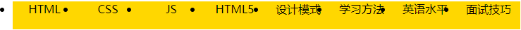

# 1. 【CSS 知识点】

## 1.1. 【引入 CSS】

1. **内联样式**：`style="color: #F00; background-color: #0FF"`
2. **内部样式表（内嵌式）**：`<style>...</style>`
3. **外部样式表（外联式）**：`<link rel="stylesheet" href="..." />`

> **外联式 与 导入式 的区别**
> > * `@import`  方式是先加载 HTML 后加载 CSS。如果 HTML 在 CSS 之前加载，页面用户体验非常差
> > * `link` 是先加载 CSS 后加载 HTML

## 1.2. 【CSS 语法】

* `选择器 {属性:值; 属性:值; ...}`

## 1.3. 【关于手册】

```
Value: [<length> | thick | thin ]{1,4}
Value: [<family-name>,]*<family-name>
Value: <url>?<color>[/<color>]?
Value: <url>||<color>
```

* `<>`：尖括号之间的词表示某种值的类型，或是对另一种属性的引用
* `x|y`：竖线表示必须出现其中之一
* `x||y`：双竖线表示出现 X 或 Y，或者二者都必须出现（但是必须以先 X 后 Y 的顺序出现）
* `[...]`：中括号用于分组。两项并列优先级要高于双竖线，而双竖线则高于单竖线
* 每个单词或加中括号的分组后面可以跟以下修饰符
    * `*`：指示前面的值或分组重复 0 或 多次
    * `+`：表示前面的值或分组可以重复 1 或 多次
    * `?`：表示前面的值或分组是可选的
    * `{M,N}`：表示前面的值或分组至少重复 M 次，最多 N 次

## 1.4. 【度量单位】

* `%`：百分数
* `em`：1em 等于 “当前元素” 字体大小
* `rem`：1rem 等于 “根元素” 字体大小
* `ex`：1ex  是字体中小写字母 x 的高度
* `in`：英寸
* `px`：像素
* `pt`：1pt  等于 1英寸的 1/72

## 1.5. 【颜色的显示方式】
* **方式1**：颜色名
    1. **CSS2.1 规范定义了 17 个颜色名** （CSS3 中又扩展了众多颜色）
        > aqua fuchsia lime olive red white black gray maroon orange silver yellow blue green navy purple teal

    2. **Web安全颜色**
        > * **使用 RGB 百分数**：要么是 0%，要么是能被 20 整除，如 `rgb(40%,100%,80%)`
        > * **使用 0~255 范围的RGB值**：要么是 0 要么是能被 51 整除，如 `rgb(0,204,153)`
        > * **使用十六进制**：Web安全值：00 33 66 99 CC FF， 如 `#669933`、`#0C6`

* **方式2**：通过十六进制显示：`#rrggbb` 、 `#rgb`
* **方式3**：通过 RGB 方式显示：`rgb(r,g,b)` 、 `rgb(r%,g%,b%)`
* **方式4**：通过 RGBA 方式显示：`rgba(0,255,255,.5)` => a（alpha）：设置透明度 0-1
* **方式5**：通过 HSL 方式显示：`hsl(360, 100%, 50%)`
* **方式6**：通过 HSLA 方式显示：`hsla(100, 100%, 50%, .6)`

# 2. 【CSS 选择器】

* 建议选择器命名时，CSS 使用中横线，JS 使用下划线
* 建议 class 针对 CSS，id 针对 JS
* 一个标签可以有多个类选择器的值，不同的值用空格分开

## 2.1. 【基础选择器】

1. **标签选择器**：`element`
2. **类选择器**：`.class`
3. **ID选择器**：`#id`
4. **通配符选择器**：`*`

> * 通配符 `*` 的性能非常低

## 2.2. 【复合选择器】

1. **交集选择器**：`p.info`
2. **并集选择器（分组选择器）**：`element,element`
3. **子代选择器**：`element1>element2` <mark>IE6 不兼容</mark>
4. **后代选择器**：`element1 element2`
5. **相邻兄弟选择器**：`element+element` <mark>IE6 不兼容</mark>
    * 选择紧接在另一元素后的元素，且二者有相同父元素

6. **兄弟选择器**：`element1~element2` <mark>IE6 不兼容</mark>
    * 选择前面有 element1 元素的每个 element2 元素

## 2.3. 【属性选择器】

> * IE6 不支持属性选择器

1. `[attribute][attribute]`
2. `[attribute=value]`
3. `[attribute~=value]` 选择属性值中包含「单词」value的所有元素
4. `[attribute|=value]` 选择属性值中等于"value"或以"value-"开头的所有元素
5. `[attribute^=value]` 选择属性值以value开头的所有元素  <mark>CSS3 IE7+</mark>
6. `[attribute$=value]` 选择属性值以value结尾的所有元素  <mark>CSS3 IE7+</mark>
7. `[attribute*=value]` 选择属性值中包含value子串的所有元素   <mark>CSS3 IE7+</mark>

## 2.4. 【伪元素】

1. `::first-letter`：设置文本中第一个字符的样式
2. `::first-line`：设置文本中第一行的样式
3. `::before`：在元素开头添加内容  <mark>IE8+</mark>

    ```css
    h1:before{content:url(logo.gif);}
    h1:before{content:"]]"; color:silver;}
    ```

4. `::after`：在元素结尾添加内容  <mark>IE8+</mark>

5. `E::selection`：匹配 E 元素中被用户选中或处于高亮状态的部分 <mark>CSS3</mark>
    * 只能定义被选择时的 `background-color` 和 `color`
    * Firefox 支持替代的 `::-moz-selection`

6. `E::placeholder`：可改变 placeholder 默认样式  <mark>CSS3</mark>

    ```css
    input::-webkit-input-placeholder { color: blue; }  /* chrome */
    input::placeholder { color: blue; }

    <input type="text" placeholder="这是一个占位符">
    ```

## 2.5. 【伪类】

1. `:link`：选择所有未被访问的链接
2. `:visited`：选择所有已被访问的链接
3. `:active`：选择活动链接  <mark>IE8+</mark>
4. `:hover`：选择鼠标指针位于其上的链接
5. `:focus`：选择获得焦点的元素（`input:focus` 、 `a:focus`） <mark>IE8+</mark>

    > * IE 6、7 不支持在除链接之外的其他元素上使用伪类选择器
    > * 所有链接要么是已访问，要么是未访问，所以 `:link` 和 `:visited` 会覆盖 `:hover` 和 `:active` 规则
    > * `:link` 伪类 IE6 不兼容，解决此问题，直接使用 a 标签
    > * 可在同一个选择器中结合使用伪类：`a:visited:hover{...}`
    > * 建议声明链接的顺序: link、visited、focus、hover、active

6. `E:first-child`：匹配父元素的第一个子元素E  <mark>IE9+</mark>

---

> * **CSS3**

1. `E:last-child`：匹配父元素的最后一个子元素E
2. `E:nth-child(n)`：匹配父元素的第 n 个子元素 E，假设该子元素不是 E，则选择符无效
    * 参数 n 的可选值: `<number> | <odd | even> | <an+b>`
3. `E:nth-last-child(n)`：匹配父元素的倒数第 n 个子元素 E，假设该子元素不是 E，则选择符无效
4. `E:first-of-type`：匹配同类型中的第一个同级兄弟元素E
5. `E:last-of-type`：匹配同类型中的最后一个同级兄弟元素E
6. `E:nth-of-type(n)`：匹配同类型中的第 n 个同级兄弟元素E
7. `E:nth-last-of-type(n)`：匹配同类型中的倒数第 n 个同级兄弟元素E
8. `E:only-of-type`：匹配同类型中的唯一的一个同级兄弟元素E
9. `E:only-child`：匹配父元素仅有的一个子元素E
10. `E:root`：匹配 E 元素在文档的根元素。在 HTML 中，根元素永远是HTML
11. `E:not(s)`：匹配不含有s选择符（不加引号）的元素E
12. `E:empty`：匹配没有任何子元素（包括 text 节点）的元素E
13. `E:target`：匹配相关 URL 指向的 E 元素
14. `E:checked`：匹配处于选中状态的元素E （`type=radio/checkbox`）
15. `E:enabled`：匹配处于可用状态的元素E
16. `E:disabled`：匹配处于禁用状态的元素E
17. `E:read-write`：匹配可读写元素
18. `E:read-only`：匹配只读元素

# 3. 【文本与背景】

## 3.1. 【字体】

1. **font-family**
    * **方式1**：宋体、微软雅黑
    * **方式2**：SimSun、"Microsoft Yahei"
    * **方式3**："\5B8B\4F53" 、"\5FAE\8F6F\96C5\9ED1"

    1. **获取字体对应的 unicode 编码**：在浏览器控制台中输入: `escape("宋体");`
    2. **常用的字体组合**
        * `Georgia, serif`
        * `'Times New Roman', Times, serif`
        * `Arial, Helvetica, sans-serif`
        * `Verdana, Geneva, sans-serif`
        * `'Courier New', Courier, monospace`
        * `'Lucida Console', Monaco, monospacer`

2. **font-size**：`<length>` | `<percentage>` 根据父元素的字体大小来计算
3. **font-style**：`normal` | `italic`
    * `italic`：是使用文字的斜体
    * `oblique`：是让没有斜体属性的文字倾斜
4. **font-variant**：`normal` | `small-caps` 小型大写字母
5. **font-weight**：`normal`（400） | `bold`（700） 建议使用数字代替关键字

---

* **属性联写**：`h2 {font: italic 700 normal 24px Arial,sans-serif;}`
    * size 、 family 必须有，必须作为声明中的最后两个值，必须按此先后顺序
    * style 、 weight 、 variant 顺序任意，如果不写，则隐含使用默认值声明了一次
    * line-height 作为对 font-size 值的一个补充，并用一个斜线（/）与之分隔，如果不写，则隐含使用默认值声明了一次

## 3.2. 【文本】

1. **color**：元素前景色
2. **text-indent**：段落首行缩进大小: `p {text-indent: 2em;}`
3. **text-align**：文本对齐方式（`left` | `center` | `right`）
4. **text-decoration**：文本修饰风格。可结合多种装饰，以空格相隔
    > `none` | `underline` | `overline` | `line-through`

5. **text-transform**：文本转换
    > `none` | `uppercase` | `lowercase` | `capitalize`

6. **letter-spacing**：字符间距（`normal` | `<length>`）

7. **word-spacing**：词间距（`normal` | `<length>`）

8. **white-space**：处理空白符
    * **normal**：默认。空白会被浏览器忽略
    * **pre**：空白会被浏览器保留
    * **nowrap**：文本不会换行，文本会在在同一行上继续，直到遇到 `<br>` 标签为止
    * **pre-wrap**：保留空白符序列，但是正常地进行换行
    * **pre-line**：合并空白符序列，但是保留换行符

9. **vertical-align**：初始值: baseline。百分数: 相对于元素的 line-height 值
    * `baseline` | `sub` | `super` | `top` | `middle` | `bottom` | `<percentage>` | `<length>`
    * 对 inline 元素、inline-block 元素 和 table-cell 元素有效，对块元素无效
    * 用于定义 “周围的文字、inline 元素 以及 inline-block 元素” 相对于该元素基线的垂直对齐方式。这里的 “该元素” 指的是被定义了 vertical-align 属性的元素
    * inline 元素和 inline-block 元素的 vertical-align 是针对周围的元素来说的，vertical 定义的是周围元素相对于当前元素的对齐方式。table-cell 元素的 vertical-align 属性是针对自身而言，定义的是内部子元素相对于自身的对齐方式

   ```html
       <p>
           top:
           middle:
           bottom:
           super:
           sub:
       </p>
   ```

10. **line-height**：行高（`normar` | `<length>` | `<percentage>` | `<number>`）
    * 应用于：所有元素
    * 行高：指文本行基线之间的距离
    * 行高 = 文字大小 + 上间距 + 下间距
    * 行高和字体大小之差就是行间距；行间距除以 2，将行间距的一半分别应用到内容区的顶部和底部，其结果就是该元素的行内框
    * 文本行中的每个元素都会生成一个内容区，这由字体的大小确定。这个内容区则会生成一个行内框（行内框=内容区+行间距）
    * 所有的行，都有行高。盒模型的 padding，绝对不是直接作用在文字上的，而是作用在“行”上的。文字，是在自己的行里面居中
    * 单行文本垂直居中：行高=盒子高；如果想让多行文本垂直居中，需要设置盒子的padding

    ```css
    p {
        ...
        height: 50px;
        padding-top: 10px;
        line-height: 20px;      /* 假设只有两行文本 */
    }
    ```

    * **行高单位问题**
        1. **单独给一个标签设置行高**
            * 如果行高单位是 `px`：行高与文字大小无关
            * 如果行高单位是 `em`：行高 = 文字大小 `*` 行高值
            * 如果行高单位是 `%`：同上
            * 如果行高没有单位：同上

        2. **盒子嵌套：给父元素设置行高值，子元素的行高问题（行高可以实现继承）**
            * 父元素行高单位是 `px`：子元素行高 = 父元素行高
            * 父元素行高单位是 `em`：子元素行高 = 父元素文字大小 `*` 行高值
            * 父元素行高单位是 `%`：同上
            * 父元素行高单位无：子元素行高 = 子元素文字大小 `*` 行高值

## 3.3. 【背景】

1. **background-color**：`transparent` | `<color>`
2. **background-image**：`none` | `url(bg.jpg)`
    * 背景颜色 与 背景图片 的作用区域包括边框
3. **background-repeat**：`repeat` | `repeat-x` | `repeat-y` | `no-repeat`
4. **background-position**
    * `length` | `percentage` 、 `left|center|right` 、 `top|center|bottom`
    * 初始值：0% 0%
    * position 后面是 x 坐标 和 y 坐标，可以使用方位名词 或者 精确单位
    * 如果只指定了一个值，该值将用于横坐标，此时纵坐标将默认为 50%
    * 如果精确单位和方位名字混合使用，则前者是 x 坐标，后者是 y 坐标
5. **background-attachment**：`scroll` | `fixed`

---

* **属性联写**
    > * `background: color || image || repeat || attachment || position`

## 3.4. 【列表】

1. **list-style-type**：`none` | `disc` | `circle` | `square` | `decimal`
2. **list-style-image**：`none` | `<uri>`
3. **list-style-position**：`inside` | `outside`

---

* **属性联写**：`list-style: type || image || position`
    * 通常列表图片不是由 `list-style-image` 属性实现的，而是用背景属性来实现的，前提是需要设置 `list-style：none;`
    * 应用于 display 值为 list-item 的元素

# 4. 【继承性 & 层叠性】

1. **继承性**
    > **前提**：标签之间属于一种嵌套关系

    * 所有字相关的都可以继承：color、text-系列、font-系列、line-系列、cursor
    * 所有关于盒子的、定位的、布局的属性都不能继承
    * `a` 标签、`h1` 标签不会实现继承

2. **层叠性**
    > **前提**：样式冲突

    1. **权重**
        * 继承得到的样式，权重最低；如果都是靠继承得来的样式，则最靠近元素的样式具有最大的优先级
        * **权重叠加**：选择器的特殊性：特殊性值分为 4 个部分（如：0, 0, 0, 0）
            1. **内联样式**：1, 0, 0, 0
            2. **ID**：0, 1, 0, 0
            3. **类、属性 和 伪类**：0, 0, 1, 0
            4. **元素 和 伪元素**：0, 0, 0, 1
            5. **通配符**：0, 0, 0, 0；这与根本没有特殊性有区别（继承）
            6. **继承**：没有优先级

        > * 权重一样时，声明靠后的优先级大
        > * 同一个标签，携带了多个类名且样式有冲突时，与类名书写顺序无关，与 css 定义顺序有关
        > * CSS 定义了一个 `!important` 命令，该命令被赋予最大的优先级
        >     * `!important` 对继承而来的样式是不起作用

    2. **权重计算的总结**
        1.  选中了 -> 比权重 -> 权重不同，谁大听谁的 / 权重相同，谁写在后面听谁的
        2.  没选中(即样式靠继承) -> 就近原则 -> 如果一样近，比权重

    3. **综述**
        *   行内样式 > 页内样式 = 外部引用样式 > 浏览器默认样式
        *   `!important` > 内联 > ID > 伪类|类|属性选择 > 标签|伪元素 > 通配符 > 继承

# 5. 【布局】

## 5.1. 【文档流】normal flow
* 网页是一个多层的结构，通过 CSS 可以为每一层设置样式
* 作为用户来讲只能看到最顶上一层
* 这些层中，最底下的一层称为文档流，文档流是网页的基础
* 我们所创建的元素默认都是在文档流中进行排列，对于元素而言，主要有两个状态
    * 在文档流中
    * 不在文档流中（脱离文档流）

* 元素在文档流中的特点
    1. **块级元素**
        * 元素独占一行（自上向下垂直排列）
        * 元素的高度、宽度、行高以及顶和底边距都可设置
        * 默认宽度是父元素的全部（会把父元素撑满）
        * 默认高度是被内容撑开（子元素）

    2. **行内元素**
        * 行内元素不会独占页面的一行，只占自身的大小
        * 行内元素在页面中自左向右水平排列，如果一行之中不能容纳下所有的行内元素，则元素会换到第二行继续自左向右排列
        * 行内元素的默认宽度和高度都是被内容撑开
        * 空白折叠现象
            > * 比如，想让 img 标签之间没有空隙，必须紧密连接：``

        * 高矮不齐，底边对齐
            ```html
            <span>姚明</span>
            
            
            ```

        1. **行内非替换元素**
            > * 元素的高度、宽度、行高及顶部和底部边距不可设置

        2. **行内块元素**
            > * img、input 标签就是这种内联块状标签（inline-block）
            > * 元素在一行上显示；可设置宽度和高度

* **脱离标准文档流的方式**
    * 浮动
    * 绝对定位
    * 固定定位

## 5.2. 【盒模型】

1. **内容区**
    1. **width** / **height**
        * 初始值：auto
        * 指内容宽高度，而不是盒子宽高度
        * 应用于：块级元素和替换元素
    2. **overflow** / **overflow-x** / **overflow-y** 内容溢出
        * `visible`：默认值，子元素始终可见
        * `hidden`：溢出裁剪
        * `scroll`：始终生成两个滚动条
        * `auto`：根据需要生成滚动条

2. **内边距**：`padding`
    * 设置单边样式：`padding-left: 100px;`
    * 四边整体设置时顺序为上右下左
        * `padding:10px;`
        * `padding:10px 20px 3px;`
    * 内边距和边框不能是负值，但是外边距可以
    * 竖直方向的 margin、padding 对内联元素的设置无效

3. **边框**：`border`
    * **border-style**：`none` | `hidden` | `dotted` | `dashed` | `solid` | ...
    * **border-width**：`thin` | `medium` | `thick` | `<length>`
    * **border-color**：`<color>` | `transparent`
    * **属性联写**：`border: width || style || color`

    ```css
    border-width:1px;
    border-top: 1px solid green;
    border-top-style: solid;
    border: solid 1px red;

    /* 三角形 */
    div {
        width: 0;
        height: 0;
        border: 50px solid transparent;
        border-top-color: purple;
    }
    ```

    1. 默认的边框颜色是元素本身的前景色
    2. `border:0` 和 `border:none` 的区别
        1. **性能差异**
            * `border:0`：浏览器依然会对 border 进行渲染，需要占用内存
            * `border:none`：浏览器解析时并不会作出渲染
        2. **兼容差异**
            * 兼容性差异只存在于 IE6 和 IE7 的 `<input type="button"/>` 及 `<button>` 标签中
            * `border:0`：在所有浏览器中的效果都一样，都是把边框隐藏（不是去掉）
            * `border:none`：对 IE6 和 IE7 按钮的边框无效，在其他浏览器则会去掉按钮的边框

4. **外边距**：`margin: <length> | <percentage> | auto`
    * 初始值：0
    * 上、下外边距的设置对不可替换内联元素（如 `<span>` ）无效
    * 外边距不会影响盒子可见框的大小，但是会影响盒子的位置
    * margin 也可以设置负值，如果是负值则元素会向相反的方向移动

## 5.3. 【盒子的水平布局】

1. **元素在其父元素中水平方向的位置由以下几个属性共同决定**
    * `margin-left`
    * `border-left`
    * `padding-left`
    * `width`
    * `padding-right`
    * `border-right`
    * `margin-right`

2. **一个元素在其父元素中，水平布局必定会满足以下等式**
    * 其父元素内容区的宽度 = `margin-left` + `border-left` + `padding-left` + `width` + `padding-right` + `border-right` + `margin-right`
    * 如果这七个值中没有为 auto 的情况，则浏览器会自动调整 `margin-right` 值以使等式满足
    * 只有 `width`、`margin-left`、`margin-right` 可设置为 `auto`
        > * 如果某个值为 auto，则会自动调整为 auto 的那个值以使等式成立
        > * 如果将一个宽度和一个外边距设置为 auto，则宽度会调整到最大，设置为 auto 的外边距会自动为 0
        > * 如果将三个值都设置为 auto，则外边距都是 0，宽度最大
        > * 如果将两个外边距设置为 auto，宽度固定值，则会将外边距设置为相同的值

        * 位于最右边：`margin-left: auto;`
        * 位于最左边：`margin-right: auto;`
        * 标准流中在父元素中居中：`margin: 0 auto;` 必须有明确的 `width`

    ```css
    .outer{
        width: 800px;
        height: 200px;
        border: 10px red solid;
    }

    .inner {
        width: 200px;
        height: 200px;
        background-color: #bfa;
        margin-right: 100px;      /* 实际上是 400px */
        margin-left: 200px;
    }

    <div class="outer">
        <div class="inner"></div>
    </div>
    ```

## 5.4. 【垂直方向的布局】

1. 默认情况下父元素的高度被内容撑开
2. 如果子元素的大小超过了父元素，则子元素会从父元素中溢出
    * 可使用 overflow 属性来设置父元素如何处理溢出的子元素

## 5.5. 【外边距叠加（折叠）】

> * 相邻的垂直方向外边距会发生重叠现象

1. **兄弟元素**
    * 在标准文档流中，对于块级元素其上下相邻的上下边距并非简单的相加，而是取其中较大的边距值（两者都是正值）
    * 如果相邻的外边距一正一负，则取两者的和
    * 如果相邻的外边距都是负值，则取两者中绝对值较大的

    > * 外边距还可以与本身发生叠加，假设有一个空元素，它有外边距，但是没有边框或内边距，这种情况下，顶外边距与底外边距就会发生叠加问题

2. **父子元素**
    * 也可叫外边距塌陷：垂直方向上相邻的父子元素
    * 标准文档流中，两个 div 嵌套，对子 div 设置 `margin-top` 后，父 div 也向下移动了指定的像素
    * 即给子元素设置外边距的同时也传递给了父盒子这样一个属性

    1. **解决方法1**：不让父子元素的外边距相邻
        * **方式1**：给父元素设置边框
        * **方法2**：给父元素设置内边距：`padding-top: 1px;`
        * **方法3**：父子元素之间增加内容，不让其相邻
        * **方式4**：<mark>使用伪元素</mark>

            ```css
            <div class="one">
                <div></div>      /* 不起作用 */
                <div class="two"> 设置 margin-top </div>
            </div>
            ----------------------------------
            <div class="one">
                <table></table>  /* 成功解决外边距塌陷的问题 */
                <div class="two"> 设置 margin-top </div>
            </div>
            ----------------------------------
            <div class="one clearfix">
                <div class="two"></div>
            </div>

            .clearfix:before {
                content: "";
                display: table;   /* display: block 不起作用 */
            }
            .clearfix {
                _zoom: 1;
            }
            ```

    2. **解决方法2**：不使用外边距
        * margin 属性，本质上描述的是兄弟和兄弟之间的距离；最好不要用这个 marign 表达父子之间的距离
        * 所以，我们一定要善于使用父亲的 padding，而不是儿子的 margin

    3. **解决方法3**：触发bfc
        * 给父元素设置：`overflow: hidden`

## 5.6. 【行内元素的盒模型】

* 行内元素不支持设置 宽度 和 高度
* 行内元素可以设置 padding，但是垂直方向 padding 不会影响页面的布局
* 行内元素可以设置 border，垂直方向的 border 不会影响页面的布局
* 行内元素可以设置 margin，垂直方向的 margin 不会影响布局

# 6. 【元素显示模式与轮廓】

## 6.1. 【设置元素显示的类型】

* **display**：`none | inline | block | inline-block | list-item | table | inline-table | table-row | table-cell | table-caption | run-in | ...`

	* 初始值：`inline`
	* 块级元素 和 `display=block` 的元素不是一个概念
        * `<li>` => `display=list-item`
            * `<table>` => `display=table`

---

1. `display:inline-table`

    * 可以和文字在一行中显示的表格

    ```css
    和文字平起平坐的表格：<div class="inline-table">
       <p>第1列</p>
       <p>第2列</p>
    </div>
    ------------------------
    .inline-table {
        display: inline-table;
        width: 128px;
        margin-left: 10px;
        border: 1px solid #cad5eb;
    }
    .inline-table > p {
        display: table-cell;
    }
    ```

2. `display: table-cell`

    > * 可让元素以表格单元格的形式呈现。即具备 td 元素的特点
    > * IE6 、7 不支持
    >

    1. **图片垂直居中于元素**

        ```css
        父元素 {
          display: table-cell;
          vertical-align: middle;
        }
        ```
        
    2. **等高布局**
    
        * 同一行的单元格 td 元素高度是相等的
        
        ```css
        <div id="wrapper">
        	<div id="img-box">
        　　　　　　
        	</div>
        	<div id="text-box">
        　　　　　　　<span>海贼王</span>
        	</div>
        </div>
        
        ------------------------------
        
        #wrapper{display:table-row;}
        #img-box {
            display: table-cell;
            vertical-align: middle;　　 /*垂直居中*/
            text-align: enter;　　　　   /*水平居中*/
            width: 150px;
            border: 1px solid red;
        }
        #text-box {
            display: table-cell;
            width: 200px;
            border: 1px solid red;
            border-left: none;
            padding: 10px;
        }
        ```
        
        * 高度由两者高度最大值决定。这就是自适应的等高布局
        
    3. **自动平均划分元素，并且在一行显示**
    
        ```css
        1.【语法】
        父元素{display: table;}
        子元素{display: table-cell;}
        如果给父元素一定的宽度，父元素宽度就会根据子元素的个数进行自动平均划分
        
        2.【案例】
        <ul>
            <li>1</li>
            <li>2</li>
            <li>3</li>
            <li>4</li>
            <li>5</li>
        </ul>
        
        ------------------------------
        　　
        ul {
            list-style-type: none;
            display: table;
            width: 300px;
        }
        li {
            display: table-cell;
            height: 60px;
            line-height: 60px;
            text-align: center;
            color: White;
        }
        ul li:nth-child(1){background-color:Red;}
        ul li:nth-child(2){background-color:Orange;}
        ul li:nth-child(3){background-color:Blue;}
        ul li:nth-child(4){background-color:silver;}
        ul li:nth-child(5){background-color:Purple;}
        ```

## 6.2. 【visibility 元素可见性】

1. **visibility**：`visible | hidden | collapse`
    * `visible`：设置对象可视
    * `hidden`：设置对象隐藏。元素仍占用空间，就好像它还可见一样
    * `collapse`：主要用来隐藏表格的行或列。隐藏的行或列能够被其他内容使用。对于非表元素，collapse 与 hidden 含义相同

2. **CSS 的可见性**
    * `overflow: hidden`：将超出部分进行隐藏
    * `display: none`：不占位隐藏
    * `visibility: hidden`：占位隐藏

## 6.3. 【轮廓】

> * **outline-style**：`none | dotted | dashed | solid | ...`
> * **outline-width**：`thin | medium | thick | <length>`
> * **outline-color**：`<color> | invert:执行颜色反转(逆向的颜色)`

* IE6、7 不支持
* 对于轮廓没有诸如 `outline-top` 之类的属性
* 轮廓线不会占据空间，不影响布局

```css
a:hover { outline: 20px solid #00f; }

/*去掉表单input的边框*/
input{
	border: 0 none;
	outline-style: none; /* 取消轮廓线；若不设置，则获取表单焦点时仍然会出现边框 */
}
```

# 7. 【浮动】

* **float**：`left | right | none`
* **CSS 的定位机制有 3 种**：普通流(标准流)、浮动 和 绝对定位

## 7.1. 【特性】

1. **脱标**：脱离标准文档流，不再区分行内块了，可使元素的显示模式体现为行内块特性

2. **收缩**：一个浮动的元素，如果没有设置 width，那么将自动收缩为文字的宽度

3. **贴边**：当浏览器的显示区域无法全部显示横排浮动元素时，对应靠边的浮动元素会向下贴靠就近能够并排显示的浮动元素或靠边

4. **字围**：浮动元素不会盖住文字，文字会自动环绕在浮动元素的周围，可用于解决文字图片环绕问题

    ```css
    div{
        float: left;
        width: 344px;
        height: 516px;
    }
    
    <div>
        
    </div>
    <p>文字...</p>
    
    /* 
    	结果：div 挡住了 p，但是 p 中的文字不会被挡住，形成 “字围” 效果
    */
    ```

## 7.2. 【高度塌陷】

* 当父容器没有设置高度，里面的盒子没有设置浮动的情况下会将父容器的高度撑开
* 一旦父容器中的盒子设置浮动，脱离标准文档流，父容器立马没有高度（即：“高度塌陷” 现象），下面的盒子会跑到浮动的盒子下面。出现这种情况，我们需要**清除浮动**

* 清除浮动主要是为了解决父级元素因为子级浮动引起内部高度为 0 的问题

```css
li {
    float: left;
    width: 90px;
    height: 40px;
    background-color: gold;
    text-align: center;
}
------
<div class="box1">
    <ul>
        <li>HTML</li>
        <li>CSS</li>
        <li>JS</li>
        <li>HTML5</li>
        <li>设计模式</li>
    </ul>
</div>
<div class="box2">
    <ul>
        <li>学习方法</li>
        <li>英语水平</li>
        <li>面试技巧</li>
    </ul>
</div>

/*
	第二组的第 1 个 li 去贴靠第一组的最后一个 li 了
	原因就是 div 没有高度，不能给自己浮动的孩子们一个容器
*/
```



## 7.3. 【清除浮动】

> * 清除浮动元素对当前元素所产生的影响：**clear**：`left | right | both | none`
> * 设置清除浮动以后，可以假想浏览器会自动为元素添加一个上外边距，以使其位置不受其他元素的影响

* **高度塌陷的解决方法**
    
    * 方式1. **给浮动的元素的祖先元素加高度**：`div {height: 40px;}`
	
	* 方式2. **清除别人对我的影响**：`.box2 { clear: both;}`
		
	* 方式3. **隔墙法**
	
	    ```css
	    .cl { clear: both;}
	    .h16 { height: 16px;}
	    
	    <div class="box1"> ... </div>
	    <div class="cl h16"></div>      <!-- 墙用自己的身高当做了间隙 -->
	    <div class="box2"> ... </div>
	    ```
	
	* 方式4. **内墙法**
	
	    ```
	    <div class="box1">
	    	...
	    	<div class="cl h16"></div> 	<!-- 使用内墙法 -->
	    </div>
	        ■ 此时盒子的高度为: 40+16=56px
	        ■ 内墙法的优点就是不仅能够清除浮动，还能让浮动的子元素撑出高度
	        ■ 类似方法
	            .box1:after {
	                content: "";
	                display: block;
	                clear: both;
	            }
	            .box1 {        /* IE6、7不支持“:after” */
	                *zoom: 1;  /* 针对IE6、7，触发IE“hasLayout”特性 */
	            }
	    ```


# 8. 【知识点】
