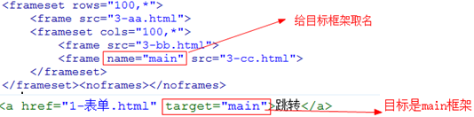

# 1. 【概述】

## 1.1. 【Web标准】

> * 由 w3c 万维网联盟组织制定

1. **结构标准**：html（超文本标记语言）
    * 从语义的角度描述页面结构

2. **表现标准**：css（层叠样式表）
    * 从审美的角度负责页面样式

3. **行为标准**：javascript
    * 从交互的角度描述页面行为

## 1.2. 【浏览器内核】

* **IE**：trident
* **FireFox**：gecko
* **Safari**：webkit
* **Chrome/Opera**：blink（基于 webkit，二次开发）

---

* **浏览器内核分成两部分**
    1. **渲染引擎**：决定了浏览器如何显示网页的内容以及页面的格式信息 => 浏览器兼容问题出现
    2. **JS引擎**：解析 Javascript 语言

> * 最开始 渲染引擎 和 JS引擎 并没有区分的很明确，后来 JS引擎 越来越独立，内核就倾向于只指渲染引擎

## 1.3. 【XHTML规范】

* 标签名、属性名必须使用小写
* 所有属性都必须指定值，属性值都必须用引号括起
* 所有元素都必须闭合：`<p></p>`、`<br/>`
* 避免使用表现性元素: `<i>`、`<b>`、`<big>`、`<small>`、`<tt>`、`<sup>`、 `<sub>`、`<font>`、`<center>`

---

* **为了网页语义化，`<small>` 可用于网页底部的版权声明**
    `<small>Copyright ©2015-2016 嘿嘿学习网(www.hhxxw.com), All Rights Reserved</small>`

## 1.4. 【文档声明头】

* 即文档类型定义，简称 DTD
* 用于告知浏览器文档使用哪种HTML或XHTML规范，这两种规范又各有3种小规范 (Strict、Transitional、Frameset)
* 文档类型定义是一种标签，尽管也使用尖括号，但它并不是XHTML元素，因此并不需要一个闭标签或结尾斜线。它只是向用户代理传达关于文档的信息
* 若没有文档声明头，浏览器将呈现怪异模式
* HTML5简化了书写： `<!DOCTYPE html>`

## 1.5. 【head元素】

1. **title**：`<title>标题</title>`

2. **meta**：元信息标签
    1. **必须属性**：content => 与一个 name 或 http-equiv 关联的值
    2. **可选属性**
       * **http-equiv**：把 content 属性值与一个特定的 HTTP 响应头相关联
       * **name**：用于为文档赋予额外的信息（author、keywords、description、summary等）
       * **charset**：HTML5中新增属性

   ```html
   1.【关键字】
   <meta name="Keywords" content="关键字1,关键字2,关键字3,..." />

   2.【页面描述】
   <meta name="Description" content="..." />

   3.【作者】
   <meta name="author" content="yyq@yyq.com">

   4.【版权声明】
   <meta name="copyright" content="本站所有教程均为原创，版权所有，禁止转载。否则将追究法律责任。"/>

   5.【字符集】
   <meta http-equiv="Content-Type" content="text/html;charset=UTF-8">
   => HTML5: <meta charset="UTF-8">

   6.【自动刷新】
   <meta http-equiv="refresh" content="5" />
   <meta http-equiv="refresh" content="5; http://www.baidu.com" />

   7.【浏览器不缓存】
   <meta http-equiv="pragma" content="no-cache">
   <meta http-equiv="cache-control" content="no-cache">
   <meta http-equiv="expires" content="0">
   ```

3. **style**
    * `type="text/css"`
    * `media`

4. **script**
    * `type="text/javascript"`
    * `charset`
    * `src`

5. **link**
    1. `rel`：“当前文档” 与 “所链接的文档” 之间的关系（stylesheet、copyright、help、index、next、prev）
    2. `type`：指定链接资源的 MIME（Multipurpose Internet Mail Extensions多用途互联网邮件扩展类型）类型（如:text/css）；用于告诉浏览器所下载文件的类型是什么
    3. `href`：指向所链接的文档的 URL
    4. `charset`：设置所链接的文档使用的字符集
    5. `media`：指定所链接的文档用于的设备（all、screen等）

    ```html
    <link rel="stylesheet" type="text/css" href="main.css" />
    <link rel="shortcut icon" type="image/x-icon" href="favicon.ico">
        ■ ico图标一般放在网站根目录, 如 https://www.baidu.com/favicon.ico
        ■ ico图标的大小: 64*64 48*48 32*32 16*16
    ```

6. **base**
    * 为相对链接设置基本URL
    * 相对链接是省略URL的协议，主机和端口部分的链接
        * 也可指定打开链接的方式
    * 两个属性: href、target
    * HTML文档最多只能包含一个base元素

# 2. 【常见标签】

## 2.1. 【基本标签】

1. **段落**：`<p></p>`

2. **标题**：`<h1></h1> ... <h6></h6>`
    * 一般 h1 都是给 logo 使用

3. **列表**

    1. **无序列表**

        ```html
        <ul>
            <li>1</li>
            ...
            <li>N</li>
        </ul>
        ```

    2. **有序列表**

        ```html
        <ol>
            <li>1</li>
            ...
            <li>N</li>
        </ol>
        ```

    3. **定义列表**

        ```html
        <dl>
            <dt>1</dt>
            <dd>1.1</dd>
            <dt>2</dt>
            <dd>2.1</dd>
            <dd>2.2</dd>
            ...
        </dl>
        ```

4. **文本格式化标签**
    * `<em>强调/斜体</em>`
    * `<strong>强调/粗体</strong>`
    * `<del>表示被删除的文本</del>`
    * `<ins>表示插入的文本</ins>`

5. **计算机代码元素**
    * `<pre>定义预格式化文本</pre>`
    * `<code>程序代码片段</code>`
    * `<kbd>由用户从键盘输入的内容或命令</kbd>`
    * `<samp>表示程序或脚本的输出样例</samp>`
    * `<var>定义变量</var>`

6. **引用和术语定义**
    * `<abbr> 指示简称和缩写，title属性显示简称/缩写的完整版本 </abbr>`
    * `<cite> 标明对某一资源的引用；常说明引文的来源。若引用资源有联机版本还可使用 <a> 标签 </cite>`
    * `<dfn> 用于术语的定义，若术语的上下文未说明术语的含义，可使用 title 属性提供简短的定义 </dfn>`
    * `<blockquote> 定义块引用：左、右缩进; 属性 cite：指定原始来源的 URL </blockquote>`
    * `<q> 定义行引用，内容头尾处会包有"" </q>`
    * `<address> 定义文档作者或拥有者的联系信息 </address>`

7. **布局**
    * `<div></div>`
    * `<span></span>`

## 2.2. 【图像】

* ``
    * **必须属性**：src、alt
    * **可选属性**：width、height、usemap
        > * 宽度 和 高度 中如果只修改了一个，则另一个会等比例缩放

---

1. **图片的格式**
    1. **jpg**：支持的颜色比较丰富，不支持透明效果，不支持动图
    2. **gif**：支持的颜色比较少，支持简单透明，支持动图
    3. **png**：支持的颜色丰富，支持复杂透明，不支持动图
    4. **webp**
        * 谷歌新推出的专门用来表示网页中的图片的一种格式
        * 具备其他图片格式的所有优点，而且文件还特别的小
        * 缺点：兼容性不好
    5. **base64**
        * 将图片使用 base64 编码，将图片转换为字符，通过字符的形式来引入图片
        * 一般都是一些需要和网页一起加载的图片才会使用 base64

2. **图像映射**
    * `<map>` 必须属性 id，可选属性 name
    * `<area>` 必须属性 alt，可选属性 coords、href、shape

    ```html
    
    <map name="planetmap" id="planetmap">
        <area shape="circle" coords="180,139,14" href ="venus.html" alt="Venus" />
        <area shape="rect" coords="0,0,110,260" href ="sun.html" alt="Sun" />
    </map>
    ```

## 2.3. 【超链接】

```html
<a href="http://www.baidu.com">Search</a>
<a href="ftp://ftp.microsoft.com">FTP</a>
<a href="menu.pdf">Download</a>
<a href="mailto:webmaster@web.com?subject=Feedback">Feedback</a>
<a href="..."></a>
```

* **href**
* **target**
    * `_blank`：在新选项卡中打开文档
    * `_parent`：打开父框架集中的文档
    * `_self`：在当前窗口中打开文档(默认行为)
    * `_top`：在窗口的整个主体中打开文档
    * `<frame>`：在指定的框架中打开文档
* **title**
* **charset**：说明目标URL使用的编码字符集

---

1. **刷新**：`href=""`
2. **回到顶部**：`href="#"`
3. **禁止跳转**
    * `href="javascript:;"`
    * `href="javascript:void(0)"`
    * `href="####"`

4. **锚点跳转**：链接到文档中的特定位置
    * **设置锚点**：`<标记 id="top"></标记>`：也可使用 name 属性设置锚点
    * **锚点链接1**：`<a href="#top">top</a>`
    * **锚点链接2**：`<a href="http://www.myweb/index.html#top">top</a>`

## 2.4. 【表格】

1. **table**：border / cellpadding / cellspacing / summary / Width / align / ...
2. **tr**
    * **align**：center、 left、 right
    * **valign**：baseline、 bottom、 middle、 top

3. **td/th**
    * align / valign / colspan / rowspan /...
    * 空单元格应放入 `&nbsp;` 作为一个数据占位符

4. **caption**：定义表格标题
    * **align**：top、 bottom

5. **thead、tbody、tfoot**：用于组织表格中的行
    * align / valign /...
    * 写与不写（thead，tbody，tfoot）的区别
        * 写了的话，顺序可以任意，浏览器在解析的时候还是按照 thead，tbody，tfoot 的顺序显示
        * 当表格的内容非常多的情况下，写了就会边传输边显示，不写的话就是必须传输完毕再显示
        * 不写时，浏览器也会自动加上 `<tbody>`，通过控制台可查看

## 2.5. 【框架】

1. **四部分组成**（文档类型声明、html元素、head元素、frameset元素）

    ```html
    <frameset cols="25%,*,25%">
        <frame src="frame_a.htm" />
        <frame src="frame_b.htm" />
        <frame src="frame_c.htm" />
    </frameset>

    ■ frameset属性 => cols、rows
    ■ frame属性
    ■ src
    ■ frameborder   => 0：无分割线/1：默认
    ■ scrolling     => auto/yes/no
    ■ noresize="noresize"
    ■ marginwidth
    ■ marginheight
    ■ name
    ```

   * 框架中跳转

       

2. **内联框架**

    ```html
    <iframe>浏览器不支持该属性时，显示的内容</iframe>
        ■ src / width / height
        ■ name         => 规定 <iframe> 的名称
        ■ frameborder  => 1或0
        ■ scrolling    => yes/no/auto
    ```

## 2.6. 【表单】

> * 用于收集用户信息

### 2.6.1. 【form】

1. **action**：表单提交地址，如果不写表示将表单的数据提交给当前页面进行处理
2. **method**：发送的HTTP方法: get、post
3. **name**：规定表单的名称
4. **enctype**：表单信息提交的编码方式
    * `application/x-www-form-urlencoded`：默认的编码方式
    * `multipart/form-data`：MIME 编码，文件上传时必设属性
5. **target**

### 2.6.2. 【input】

* **name**：用于标识控件，与控件值组成一个名/值对
* **value**：指定控件的初始值
* **type**：指定控件类型，默认为 text 类型
* **maxlength**：指定文本框中允许输入的最大字符数（只用于 `type=text/password` ）
* **size**：指定 “文本、密码或文件” 控件显示的宽度
* **checked="checked"**：设置为选定状态（只用于 `type=checkbox/radio`）
* **disabled="disabled"**：禁用该控件
* **readonly="readonly"**：表明该控件只能显示值，不能被修改（只用于 `type=text/password`）
* **src**：指定图像文件的URL （只用于 `type=image`）
* **alt**：指定一个替代性文字说明 （只用于 `type=image`）
* **usemap**：指定所使用的客户端图像映射的URL （只用于 `type=image`）
* **accept**：规定通过文件上传来提交的文件的类型（包含一个用逗号分隔的 MIME 类型列表）
* **tabindex**：指定控件在用制表键遍历活动的控件的顺序中所处的位置
* **accesskey**：为控件提供快捷键

### 2.6.3. 【控件类型】

1. **文本框**：`type="text"`
2. **密码框**：`type="password"`
3. **单选框**：`type="radio"` => name 属性必须相同，但有不同的 id 属性
4. **复选框**：`type="checkbox"` => 最好也有相同的 name 属性
5. **文件控件**：`type="file"` => 可选属性：accept，还应设置 `<form>` 中的 accept 属性
    * 上传必须在 form 标签中设置 enctype，而且必须是 post 方式
6. **四种按钮**
    1. `type="submit"/"reset"/"button"`
        * value 属性用于设置按钮上所显示的文字
        * 一般情况下 name 属性不用写，因为不需要接受按钮的 value 属性值
        * 普通按钮不具有表单提交和重置功能，一般需要配合 JavaScript 来使用
    2. `type="image"`：行为上基本与提交按钮一样

7. **隐藏控件**：`type="hidden"`
    * 用于传送用户不需要看见或修改的额外数据（如订单编号或内部跟踪ID）
    * 所传送的数据由 value 属性提供

### 2.6.4. 【下拉列表】

```html
<select>
    <optgroup label="北京市">
        <option>西城区</option>
        <option>东城区</option>
        <option>海淀区</option>
        <option>昌平区</option>
    </optgroup>
</select>
```

1. **select**
    * **size**：用来定义下拉列表展开之后可见选项的数目
    * **multiple**：多选；可将单行列表框转变为多行列表框
    * **name**：用于保持控件与其值之间的联系

    > * 可容纳一个或多个 option 或 optgroup 元素，必须至少包含一个 option

2. **option**
    * **value**：指定随表单提交一起传送的值，如果未设置该属性，则它所包含的文本将随表单一起提交
    * **selected**：设定为选定状态

3. **optgroup**
    * **label**：设置选项组的标题
    * **disabled**：禁用整个选项组

    > * 选项组中只能包含 option 元素，不能包含其他任何元素

### 2.6.5. 【多行文本框】

* `<textarea> 包含的文本将作为其初始值而被显示 </textarea>`
    * **rows**：指定不进行垂直滚动时所能显示的文本行数
    * **cols**：指定一行上所能显示的字符数
    * **name**：用于标识控件
    * **disabled**：禁用控件
    * **readonly**：只读控件

> * 现在一般会用 富文本编辑器 替换 文本域

### 2.6.6. 【button】

* type 属性值（submit、reset 或 button）
    * 触发 button 元素，将提交或重置表单，或触发由脚本控制的响应
    * button 元素必须包含一些内容，因为空的 button 元素呈现的按钮没有默认的文字

### 2.6.7. 【label】

```html
<label for="top1">
    <input type="checkbox" name="top1" id="top1" value="pepperoni" checked="checked" />
    Pepperoni
</label>
```

* 用于为表单控件创建文本签条
    * for 属性设置为它所说明的控件的 id 属性，从而强化控件与签条的联系
    * 可通过点击签条把焦点移到它所说明的控件上

### 2.6.8. 【组织表单】

1. `<fieldset>`
    * 用于把一批相关控件包装在一起，形成一个逻辑组
    * 可包含其他结构性标记代码（段落、列表等）
    * 可再嵌套 fieldset 元素，以建立组中之组
    * 必须包含一个 legend 元素，为其中的控件提供标题
2. `<legend>`
    * 只能出现在 fieldset 元素中，为 fieldset 元素所包含的一组控件提供一个标题

# 3. 【知识点】

## 3.1. 【空白折叠现象】

* HTML中所有的文字之间，如果有空格、换行、tab 都将被折叠为一个空格显示

## 3.2. 【注释】

```
HTML: <!-- 注释内容 -->
CSS:  /* 注释内容 */
```

## 3.3. 【通用属性】

1. **标准属性**
    * **class**：多个元素可同属一个类，一个元素也可以属于不止一个类，多个类名用空格分隔
    * **id**：在一个文档中必须是唯一的，不能有多个元素共用一个标识符
    * **style**：内联样式定义，指定css属性；应避免使用，因为内容和表现混在了一起
    * **title**：工具提示，即当鼠标停留在元素上时所呈现的那个浮动窗口
2. **国际化属性**
    * **dir**：设置文本的阅读方向（ltr 或 rtl），通常用不着该属性，因为语言的方向可从 lang 和 xml:lang 属性推断
    * **lang**：指定内容的语言。如 en 代表英语，zh-CN 代表汉语
    * **xml:lang**：lang属性的xml形式，用于xml文档；XHTML文档既是XML又是HTML（取决于服务器），因此元素均可指定这两个属性，属性值相同
3. **焦点属性**
    * **accesskey**：为元素分配快捷键
    * **tabindex**：指定元素在使用制表键遍历链接和表单控件时所形成的访问顺序中的位置

## 3.4. 【字符实体】

```html
■ &        => &amp;  或 &#38;
■ <        => &lt;   或 &#60;
■ >        => &gt;   或 &#62;
■ 空格      => &nbsp; 或 &#160;
■ ©        => &copy; 或 &#169;
■ ®        => &reg;  或 &#174;
■ ¥        => &yen;  或 &#165;
■ 摄氏度    => &deg;
■ 正负号    => &plusmn;
■ 平方      => &sup2;
■ 立方      => &sup3;
```

## 3.5. 【通用字体族】

1. **Serif**：衬线字体（"Times New Roman" Georgia SimSun）
1. **Sans Serif**：无衬线字体（Helvetica Arial "Microsoft Yahei"）
1. **Monospace**：等宽字体（Courier Monaco）
1. **Cursive**：草体
1. **Fantasy**：梦幻

## 3.6. 【标签分类】

1. **容器级、文本级**

    * 容器级的标签，可以放置任何东西；文本级的标签，只能放置行内元素 和 行内块元素
    * 如 `h` 系列标题标签、 `div` 、 `li` 、 `dt` 、 `dd` 是容器级的标签； `p` 标签是一个文本级标签，只能放文字、图片、表单元素，其他的一律不能放

    ```html
    【源代码】 <p>永远相信美好的事情即将发生<h1>小米雷军</h1>我所有的向往</p>
    【审查元素】 <p>永远相信美好的事情即将发生</p><h1>小米雷军</h1>我所有的向往<p></p>
    ```

    * **特例**： `a` 标签可以嵌套除 `a` 标签自身以外的任何标签

2. **单标签、双标签**

    * **单标签（空元素）**： `<meta />` 、 `<link />` 、 `<base />` 、 `<br />` 、 `<hr />` 、 `<input />` 、 `<col />` 、 `<param />` 、`<frame />` 、 `` 、 `<area />`
    * **双标签**：`<h1></h1>`  、 `<p></p>`

3. **块级元素、行内元素**
    * **块元素**：不管内容有多少，都会占整个浏览器的一行。一般都是块元素布局
    * **行内元素**：内容多少占多少，一般都是行内元素嵌套到块元素中
        * **行内替换元素**：即行内块元素；浏览器根据其标签的元素与属性来判断显示具体的内容，如: `` 、 `<input />`  、 `<textarea />`  、`<select />` 、 `<object />`
        * **行内非替换元素**：将内容直接告诉浏览器，将其显示出来

## 3.7. 【URL 字符编码】

* URL 只能使用 ASCII 字符集；由于 URL 常常会包含 ASCII 集合之外的字符，所以 URL 必须转换为有效的 ASCII 格式
* URL 编码使用 `%` 其后跟随两位的十六进制数来替换非 ASCII 字符；一个中文字符对应: `%xx%xx%xx`
* URL 不能包含空格。URL 编码通常使用 `+` 来替换空格

## 3.8. 【标签使用规范】

* `` 一定要设置 alt 属性，alt 属性是给搜索引擎看的，title 属性是给用户看的
* `<br />` 尽量只用于段落 p 标签内部的换行，不用于其它场合
* `strong` 和 `em` 标签，被 W3C 赋予了 “强调” 的语义，搜索引擎对这两个标签也赋予一定的权重
* 如果图片作为HTML的一部分，并且想要被搜索引擎识别，则应该使用 img 标签。如果图片仅仅是起到修饰作用，并且不想被搜索引擎识别，则应该使用背景图片
