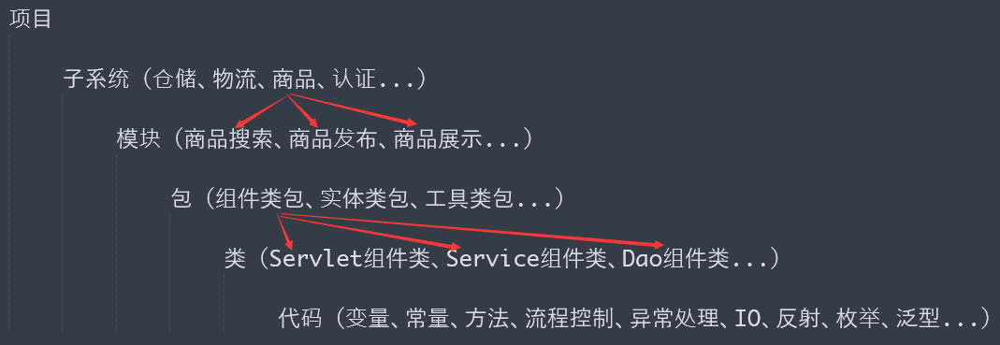
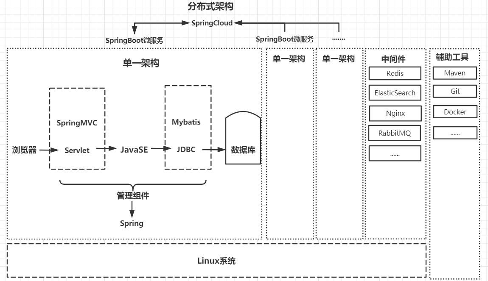
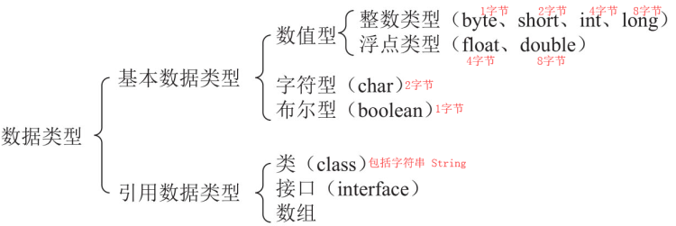
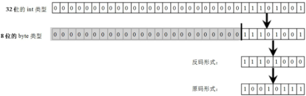
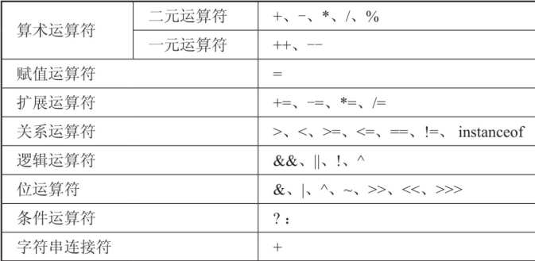
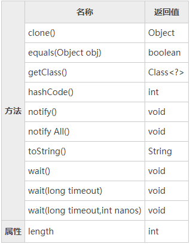

# 1. 【概述】

## 1.1. 【从项目到代码】

 



## 1.2. 【三大平台】

1.  **Java SE**

    * **JVM**：Java程序唯一认识的操作系统，其可执行文件为 `.class` 文档
    * **JRE**：JVM + 核心类库 + 类加载器 + 字节码校验器
    * **JDK**：JRE + 开发工具(javac、java、javadoc 等)
    * **Java语言**

2.  **Java EE**：包含 13 种核心技术 (如：JDBC、XML、JSP、Servlet、EJB、JavaMail)
3.  **Java ME**

## 1.3. 【JSR 与 JCP】

> * **JSR规范**：Java Specification Request
> * **JCP组织**：Java Community Process

* 为了保证 Java 语言的规范性，SUN 公司搞了一个 JSR 规范，凡是想给 Java 平台加一个功能，比如说访问数据库的功能，大家要先创建一个 JSR 规范，定义好接口，这样，各个数据库厂商都按照规范写出 Java 驱动程序，开发者就不用担心自己写的数据库代码在 MySQL 上能跑，却不能跑在 PostgreSQL 上

* 所以 JSR 是一系列的规范，从 JVM 的内存模型到 Web 程序接口，全部都标准化了。而负责审核 JSR 的组织就是 JCP

* 一个 JSR 规范发布时，为了让大家有个参考，还要同时发布一个 “参考实现”，以及一个 “兼容性测试套件”：
    * **RI**：Reference Implementation
    * **TCK**：Technology Compatibility Kit

* 比如有人提议要搞一个基于 Java 开发的消息服务器，这个提议很好啊，但是光有提议还不行，得贴出真正能跑的代码，这就是 RI。如果有其他人也想开发这样一个消息服务器，如何保证这些消息服务器对开发者来说接口、功能都是相同的？所以还得提供TCK

* 通常来说，RI 只是一个 “能跑” 的正确的代码，它不追求速度，所以，如果真正要选择一个 Java 的消息服务器，一般是没人用 RI 的，大家都会选择一个有竞争力的商用或开源产品

## 1.4. 【半编译半解释性语言】

1.  **编译**
    *   源文件（`*.java`）-> 使用 `javac` 编译 -> 并不会生成特定平台的机器码，而是生成一种与平台无关的字节码（`*.class` ）文件
    *   传统的编译器是编译一条，运行完后将其扔掉
    *   JDK1.1 增加了JIT（即时编译）编译器，即时编译会将一些 “热点” 字节码编译成本地机器码，并将结果缓存起来，在需要的时候重新调用。这样使得Java程序的执行效率大大提高，某些代码甚至接近C++的效率

2.  **【解释】**
    *   字节码文件 -> 使用 java 解释执行 -> 特定平台的机器码

## 1.5. 【配置环境变量】

> * 相同的变量名，**系统变量**的优先级高于**用户变量**，故配置环境变量时，建议使用**用户变量**

1.  **步骤**
    * step1. 新建环境变量：`JAVA_HOME="C:\Develop\Java\jdk1.8.0_162"`
        * 以后运行 Tomcat、Maven、Eclipse 等都需要依靠此变量

    * step2. 编辑 Path，在最后添加: `;%JAVA_HOME%\bin`

2.  **验证**
    * `java -version`
    * `javac -version`

3.  **了解 CLASSPATH 环境变量**
    * JDK1.4 以前的版本须配置: `CLASSPATH=".;%JAVA_HOME%\lib\dt.jar;%JAVA_HOME%\lib\tools.jar"`
    * JDK1.5 以上的版本不用设置 CLASSPATH 环境变量
        > * 原因：JDK 会自动搜索当前路径下的类文件，且在使用 Java 的编译和运行工具时，系统会自动加载 dt.jar 和 tools.jar 文件中的 Java 类

    *   PATH 与 CLASSPATH 是不同层次的环境变量，实际操作系统搜索可执行文件是看 PATH，JVM 搜索可执行文件（.class）是看 CLASSPATH

4.  **临时配置方式**
    * `set`：查看本机所有环境变量的信息
    * `set 变量名`：查看指定环境变量的值
    * `set 变量名=`：清空一个环境变量的值
    * `set 变量名=具体值`：给指定变量定义具体值

    ***

    * 在原有环境变量值基础上添加新值：`set path=新值;%path%`
    * 这种配置方式只在当前 dos 窗口有效

## 1.6. 【两大特性】

1.  **跨平台**
    * 不同的操作系统有不同的 JVM（Java虚拟机），JVM 屏蔽了底层系统的差异性，实现了 “一次编译，到处运行” 的机制
    * 跨平台的是 Java 程序，不是 JVM。JVM 是用 C/C++ 开发的，是编译后的机器码，不能跨平台，不同平台下需要安装不同版本的 JVM

2.  **垃圾回收机制**
    1.  **对于程序员**
        * 分配对象：new 关键字
        * 释放对象：赋值 null
        * 不可达：让程序不能够再访问到这个对象
        * GC 将负责回收所有的“不可达”对象的内存空间

    2.  **自动回收无用内存空间**
        *  与 C/C++ 程序不同，Java语言不需要程序员直接控制内存回收，Java程序的内存分配和回收都是由 JRE 在后台自动进行的
        * JRE 会负责回收那些不再使用的内存，这种机制被称为垃圾回收（Garbage Collection，GC）
        * 通常 JRE 会提供一个后台线程来进行检测和控制，一般都是在CPU空闲或内存不足时自动进行垃圾回收
        * 虽然程序员可以通过调用 Runtime 对象的 gc() 或 System.gc() 等方法来建议系统进行垃圾回收，但这种调用仅仅是建议，依然不能精确控制垃圾回收机制的执行
        * 一般来说，堆内存的回收由垃圾回收器来负责，所有的 JVM 实现都有一个由垃圾回收器管理的堆内存
        * 垃圾回收是一种动态存储管理技术，它自动释放不再被程序引用的对象，按照特定的垃圾回收算法来实现内存资源的自动回收功能
        * 为了更快地让垃圾回收器回收那些不再使用的对象，可以将该对象的引用变量设置为 null，通过这种方式暗示垃圾回收器可以回收该对象

## 1.7. 【编译与运行语法】

```java
public class Hello {
    public static void main(String[] args){
        System.out.println("Hello World");
    }
}
```

1. **编译**：`javac Hello.java`
2. **解释执行**：`java Hello`

* 严格区分大小写
* 一个 Java 源文件可以定义多个类，但是只能有一个公共（public）类，且源文件名必须与公共类名相同
* 一个源文件中包含 N 个 Java 类时，成功编译后会生成 N 份字节码文件，且字节码文件名和其对应的类名相同
* 建议：一个源文件一个类且使用 public 修饰

---

1. **编译语法**：`javac [-d destdir] srcFile`
    * `-d destdir`：编译生成的字节码文件的存放路径
    * `srcFile`：源文件所在位置

    > 【案例】`javac -d . srcFile` <=> `javac srcFile`

2. **执行语法**：`java [-classpath dir1;dir2;dir3...;dirN] Java类名`
    * `-classpath dir1;dir2;dir3...;dirN`：临时指定 JRE 搜索 Java 类的路径
    * `-classpath` <=> `-cp`

    * **使用 JAR 文档**
        * JAR 文档实际使用 ZIP 格式压缩，可将 JAR 文档当作特别的文件夹
            > `java  -cp c:\workspace;c:\lib\abc.jar SomeApp`

        * 如果某个文件夹中有许多 `.jar` 文档，从 JavaSE 6 开始，可以使用 `*` 表示该文件夹中的所有 `.jar` 文档
            > `java  -cp .;c:\jars\* com.yyq.JNotePad`

3. **javac 与 classpath**
    ```
    ...\Desktop\Hello.java
    ...\Desktop\lib\Console.class
    => Hello.java 拥有对 Console类的引用

    javac Hello.java           // 报错，找不到符号Console.mi();
    javac -cp lib Hello.java   // 编译成功
    java Hello                 // Exception: NoClassDefFoundError: Console
    java -cp lib Hello         // 错误: 找不到或无法加载主类 Hello
    java -cp .;lib Hello       // 正确执行，OK
    ```

## 1.8. 【管理源文件和字节码文件】
```
① workspace
    ② Hello
        ③ src
            ④ Console.java
            ④ Main.java
        ③ classes
```

* `javac -sourcepath src -d classes src/Main.java`
    * 编译 Main.java 时，由于引用了 Console 类，所以必须告诉编译器 Console 类的源文件存放位置
    * 使用 `-sourcepath` 表示指定从 src 文件夹中寻找源文件
    * 选项 `-d` 指定了编译完成后的字节码存放文件夹，编译器会将使用到了相关源文件也一并进行编译
    * 查看编译过程: 加上 `-verbose` 选项
    * 若编译时，类路径已存在字节码，且源文件没有修改，则无须重新编译浪费时间，而应指定 `-cp` 为 classes

## 1.9. 【使用 package 管理类】
*   `src\Console.java` 新增: `package com.yyq.util`
*   `src\Main.java` 新增: `package com.yyq`

> * 包通常会用组织或单位的网址命名，例如，网站是 `yyq.com`，包就会反过来命名为 `com.yyq`

***

1.  **手动建立文件夹**
    *   `src\cc\openhome\Main.java`
    *   `src\cc\openhome\util`

2.  **修改 Main.java**
    *   要使用 Console 类，必须使用完整类名（包名+类名）或 使用 import 语句
    *   在编译时若使用 `-d` 指定字节码文件的存放位置，就会自动建立对应包层级的文件夹，并将编译出来的字节码文件放置对应的位置

```
javac -sourcepath src -d classes -cp classes src/cc/openhome/Hello.java
java -cp classes com.yyq.Hello
```

# 2. 【数据类型和运算符】
## 2.1. 【注释】
1.  **单行注释** `// 单行注释`
2.  **多行注释** `/* 多行注释 */`
3.  **文档注释** `/** 文档注释 */`
    * 注释内容可被 JDK 提供的工具 javadoc 所解析，生成一套以网页文件形式体现的该程序的说明文档
    * javadoc 工具默认只处理以 public 或 protected 修饰的类、接口、方法、成员变量、构造器和内部类之前的文档注释
    * 提取 private 修饰的内容：需指定 `-private` 选项
    * 提取 @author 和 @version 两个标记的信息：需指定 `-author` 和 `-version` 两个选项

## 2.2. 【关键字与保留字】
1.  **关键字**：编程语言中事先定义的，有着特殊含义和用途的单词
2.  **保留字**：编程语言中事先定义好的，只是暂时没有特殊的用途，但说不定以后某天会被赋予意义和使用到。goto 和 const 就是 Java 的保留字

## 2.3. 【命名规则】
1.  **包名**：全部小写，多单词使用 `.` 连接
2.  **类名 & 接口名**：帕斯卡命名法（每个单词的首字母都大写）
3.  **变量名 & 方法名**：驼峰式命名法（第一个单词首字母小写，后面其他单词首字母大写）
4.  **常量名**：全部大写，多单词使用 `_` 连接

## 2.4. 【变量】

> * 变量作为程序中最基本的存储单元，其要素包括<mark>变量名</mark>、<mark>变量类型</mark>和<mark>作用域</mark>
> * 变量在使用前必须对其进行声明，只有在声明变量以后，才能为其分配相应长度的存储空间

1.  **声明格式**：`type varName [=value] [, varName [=value]...];`
2.  **变量分类**

    |        类型         |      声明位置       |   从属于    |                       生命周期                        |
    | :----------------: | :----------------: | :--------: | :--------------------------------------------------: |
    |      局部变量       |  方法或语句块内部   | 方法/语句块 |   从声明位置开始，直到方法或语句块执行完毕，局部变量消失   |
    | 成员变量（实例变量） |  类内部，方法外部   |    对象     | 对象创建，成员变量也跟着创建。对象消失，成员变量也跟着消失 |
    |  静态变量（类变量）  | 类内部，static 修饰 |     类      |     类被加载，静态变量就有效；类被卸载，静态变量消失      |

    * **局部变量**：使用前必须先显示初始化
    * **成员变量 & 静态变量**

        | 数据类型 | 默认初始值 |
        | :------: | :-------: |
        |   int    |     0     |
        |  double  |    0.0    |
        |   char   | '\\u0000' |
        | boolean |   false   |


## 2.5. 【常量】

1. **Java直接量（字面量）**
    1. **整型类型的直接量**
        * 整型常量默认为 int 型，声明 long 型常量须后加 `l` 或 `L`
        * JDK1.7 新增二进制表示形式
            * JDK1.7 前支持十进制（123）、八进制（0123）、十六进制（0X12AB）
            * JDK1.7 添加二进制表示（0B11110001、0b11110001）
        * JDK1.7 支持在数字（包括浮点数）中间添加 `_` 作为分隔符，编译时编译器会删除数字中的下划线

    2. **浮点类型的直接量**
        * 浮点型常量默认为 double 型，声明 float 型常量须后加 `f` 或 `F`
        * 两种表示形式：十进制数形式 和 科学计数法形式

    3. **布尔类型的直接量**
        * boolean 类型数据只允许取值 true 和 false
        * 不可以 0 或 非0 的整数替代 false 和 true，这点和C语言不同

    4. **字符类型的直接量**
        * 单引号形式：`'A'`
        * 转义字符形式：`'\n'`
            * `\ddd`：1~3 位八进制数所表示的字符
            * `\uxxxx`：1~4 位十六进制数所表示的字符 <=> `\xhhh`（C语言）

    5. **字符串类型的直接量**：用 双引号 括起来的字符序列
    6. **null 类型的直接量**
        *   null 类型是一种特殊类型，它只有一个值：null
        *   这个直接量可以赋给任何引用类型的变量，用以表示这个引用类型变量中保存的地址为空，即还未指向任何有效对象

2.  **自定义常量**：`final type varName = value;`

## 2.6. 【数据类型】


1.  **boolean**：`true` 和 `false`
    * 在 Java 语言中，布尔类型的值不能转换成任何数据类型，true 常量不等于 1，而 false 常量也不等于 0
    * 这两个值只能赋给声明为 boolean 类型的变量，或者用于布尔运算表达式中

2.  **浮点数值**
    * java.math 包下面的两个有用的类：`BigInteger` 和 `BigDecimal`，这两个类可以处理任意长度的数值
        > * **BigInteger**：实现了任意精度的整数运算
        > * **BigDecimal**：实现了任意精度的浮点运算
    
    * 在商业计算中要用：`java.math.BigDecimal`
        * 对于 BigDecimal 的构造方法通常建议使用 String 类型参数的构造方法
        * BigDecimal 有加减乘除等相关方法

        ```java
        import java.math.BigDecimal;
        public class Main {
            public static void main(String[] args) {
                BigDecimal bd = BigDecimal.valueOf(1.0);
                bd = bd.subtract(BigDecimal.valueOf(0.1));
                bd = bd.subtract(BigDecimal.valueOf(0.1));
                bd = bd.subtract(BigDecimal.valueOf(0.1));
                bd = bd.subtract(BigDecimal.valueOf(0.1));
                bd = bd.subtract(BigDecimal.valueOf(0.1));
                System.out.println(bd);  // 0.5
                System.out.println(1.0 - 0.1 - 0.1 - 0.1 - 0.1 - 0.1); //0.5000000000000001
            }
        }
        ```

3.  **引用数据类型**：占 4 个字节，记录的是其引用对象的地址

## 2.7. 【基本数据类型转换】
1. **自动类型转换**
    * 容量小的类型自动转换为容量大的数据类型
    * 数据类型按容量大小排序为：`byte、short、char` -> `int` -> `long` -> `float` -> `double`
    * 多种类型的数据混合运算时，系统首先自动将所有数据转换成容量最大的那种数据类型，然后再进行计算
    * `byte`，`short`，`char` 之间不会相互转换，他们三者在计算时首先转换为 `int` 类型
    * 当把任何基本类型的值和字符串值进行连接运算时（`+`），基本类型的值将自动转化为字符串类型

    ```java
    String str1 = 4;                       // 错
    String str2 = 3.5f + "";               // 对
    System.out.println(str2);              // 3.5
    System.out.println(3+4+“Hello!”);      // 7Hello!
    System.out.println(“Hello!”+3+4);      // Hello!34
    System.out.println(‘a’+1+“Hello!”);    // 98Hello!
    System.out.println(“Hello”+‘a’+1);     // Hello!a1


    byte b = 66;
    short h = 66;
    char ch = 66;
    // 正常运行，不会报错，因为 66 虽然是 int 类型，但作为常量，编译器在编译之前就能确认数值在 byte、short、char 的取值范围内


    short s = 10;
    s += 10;       // 等价于 s = (short)(s+10);
    s = s + 10;    // 报错；可能损失精度


    byte b1 = 22;
    byte b2 = b1;  // 报错；b1 会先转换为 int 类型, int -> byte 报错
    ```

2. **强制类型转换**
    *   将容量大的数据类型转换为容量小的数据类型
    *   使用时要加上强制转换符：`()` 可能会造成精度降低或溢出
    *   通常，字符串不能直接转换为基本类型，但通过基本类型对应的包装类则可实现把字符串转换成基本类型
    *   boolean 类型不可以转换为其它的数据类型

    ```java
    int  iValue = 233;
    byte bValue = (byte)iValue;  // 溢出，截断前面的24位
    System.out.println(bValue);  // -23
    ```

    

    ```java
    String str = "123";
    int num = (int)str;               // 错误的
    int num = Integer.parseInt(str);  // 借助包装类的方法才能转
    ```

## 2.8. 【运算符】


1.  **算术运算符**
    *   `/` 当两边为整数时，取整数部分，舍余数；当其中一边为浮点型时，按正常规则相除
    *   `%` 整除取余，小数取余没有意义。结果符号与被取余符号相同

2.  **逻辑运算符**
    *   `&` 逻辑与（单与） `|` 、`^` 、`!`
    *   `&&` 短路与，只有左边的布尔表达式为 false 时，双与的效率才要高于单与的
    *   `||` 短路或

3. **位运算符**
    *   `>>>` 无符号右移
        1. **右移**：如果操作数是一个正数，那么左边的空缺位使用 0 补，如果操作数是一个负数，那么左边的空缺位使用 1 补
        2. **无符号右移**：不管是正数还是负数都统一使用 0 补

    * 对于低于 int 类型（如 byte、short 和 char）的操作数总是先自动类型转换为 int 类型后再移位
    * 对于 int 类型的整数移位 `a>>b`，当 `b>32` 时，系统先用 b 对 32 求余（因为 int 类型只有 32 位），得到的结果才是真正移位的位数
        > * 例如，`a>>33` 和 `a>>1` 的结果完全一样，而 `a>>32` 的结果和 `a` 相同

    * 对于 long 类型的整数移位 `a>>b`，当 `b>64` 时，总是先用 b 对 64 求余（因为 long 类型是 64 位），得到的结果才是真正移位的位数
    * 当进行移位运算时，只要被移位的二进制码没有发生有效位的数字丢失（对于正数而言，通常指被移出的位全部都是0），不难发现左移 n 位就相当于乘以 2 的 n 次方，右移 n 位则是除以 2 的 n 次方

    ```java
    System.out.println(16 >> 4);      // 1
    System.out.println(16 >> 36);     // 1
    ```

4.  **等于号：==**
    * 用于比较两个<mark>基本数据类型</mark>数据的时候，比较的是两个变量所存储的值是否一致
    * 用于比较两个<mark>引用类型变量</mark>的数据时候，比较的是两个引用类型变量所记录的内存地址是否一致
    * 如果进行比较的两个操作数都是数值类型，即使它们的数据类型不同，只要它们的值相等，也都将返回 true
        > *  `97=='a'` 返回 true，`5.0==5` 也返回 true

    * 如果两个操作数都是<mark>引用类型</mark>，那么只有当两个引用变量的类型具有父子关系时才可以比较，而且这两个引用必须指向同一个对象才会返回 true

# 3. 【流程控制语句】

1. `if ... else if ... else`
2. `switch ... case`
    * switch 语句使用的变量只能是 byte、 char、 short、int、枚举、String（jdk7.0支持）
    * case 后面跟的数据必须是一个常量
    * Java 11 编译器做了一些改进，如果开发者忘记了 case 块后面的 break 语句，Java 11 编译器会生成警告

3. `while、do...while、for`
    * break 语句不仅可以结束其所在的循环，还可以直接结束其外层循环。此时需要在 break 后紧跟一个标签，这个标签用于标识一个外层循环
    * 与其他语言不同的是，Java 中的标签只有放在循环语句之前才有作用

    ```java
    outer:
    for (int i = 0; i < 5; i++) {
        for (int j = 0; j < 3; j++) {
            System.out.println("i的值为：" + i + " j的值为： " + j);
            if( j == 1){
                break outer;
            }
        }
    }
    /* **运行结果**
    i的值为：0 j的值为： 0
    i的值为：0 j的值为： 1
    */
    ```

    * 与 break 类似的是，continue 后也可以紧跟一个标签，用于直接跳过标签所标识循环的当次循环的剩下语句，重新开始下一次循环

4. `foreach`
    > * JDK1.5 提供，方便遍历集合、数组元素

    ```java
    for(类型 变量名:集合) {
        语句块;
    }
    ```

    * foreach 循环和普通循环不同的是，它无须循环条件，无须循环迭代语句，这些部分都由系统来完成，foreach 循环自动迭代数组的每个元素，当每个元素都被迭代一次后，foreach 循环自动结束
    * foreach 中的循环变量相当于一个临时变量，系统会把数组（或 集合）元素依次赋给这个临时变量，而这个临时变量并不是数组元素，它只是保存了数组元素的值。因此，如果希望改变数组元素的值，则不能使用这种 foreach 循环

# 4. 【从键盘获取数据】

1.  **java.util.Scanner**
    *   `next()`：输入字符串，一遇空格就截断
    *   `nextLine()`：输入一行字符串
    *   `nextInt()`：输入整数
    *   `nextDouble`：输入浮点数
    *   `nextBoolean()`：输入 true 或 false
    *   `hasNextXxx()`：是否还有下一个输入项
        > * Xxx: Int、Long、Double、Boolean 等
        > * 如果只是判断是否包含下一个字符串，则直接使用 hasNext()
        > * 逐行读取: hasNextLine()

*   `nextXxx()`：获取下一个输入项

2.  **异常**：若输入不匹配，会报错：java.util.InputMismatchException
3.  **分隔符**：默认，Scanner 使用空白（包括空格、Tab空白、回车）作为多个输入项之间的分隔符

```java
Scanner input = new Scanner(System.in);  // 创建一个扫描器对象

String str = input.next();
int i = input.nextInt();
boolean b = input.nextBoolean();

System.out.println(str);
System.out.println(i);
System.out.println(b);

/* --------------------------------------------------------------------- */

Scanner sc = new Scanner(System.in);    // System.in 代表标准输入，就是键盘输入
sc.useDelimiter("\n");                  // 只把回车作为分隔符

while(sc.hasNext()){  // 判断是否还有下一个输入项
      System.out.println("键盘输入的内容是：" + sc.next());  // 输出输入项
}

/* ------------------------------------------------------------------- */

Scanner sc = new Scanner(new File("ScannerFileTest.java"));  // 读取文件内容
System.out.println("ScannerFileTest.java文件内容如下：");
while(sc.hasNextLine()){ // 判断是否还有下一行
     System.out.println(sc.nextLine()); // 输出文件中的下一行
}
```

# 5. 【伪随机数类: Random】

* **方式1**. `java.lang.Math.random()`
    * 用于产生一个 `[0.0, 1.0)` 区间的 double 类型的随机数
    * `int i = (int)(6 * Math.random());` // 产生：`[0, 5]` 之间的随机数

* **方式2**. `java.util.Random`
    * Random 类比 Math 的 random() 方法提供了更多的方式来生成各种伪随机数
    * `nextInt(int n)` => `[0, n)`
    * `nextDouble()` => `[0.0, 1.0)`
    * `nextBoolean()` => `true、false`
    * `nextBytes(byte[] bytes)` => 生成随机字节并将它们放入字节数组中

```java
byte[] b = new byte[10];
Random r = new Random();
r.nextBytes(b);
System.out.println(Arrays.toString(b));
```

# 6. 【数组】

* 数组只能存储一种数据类型的数据，不能存储多种数据类型的数据
* 数组元素可以是任何类型，包括数组类型
* 数组一旦初始化，则数组的长度将不可变
* 数组可以是一维数组、二维数组或多维数组
* 数组的索引从 0 开始，如果数组有 n 个元素，那么数组的索引是从 0 到（n-1）
* 数值数组元素的默认值为 0，而引用元素的默认值为 null
    > * 整数类型 => `0`
    > * 浮点类型 => `0.0`
    > * 字符类型 => `'\u0000'`
    > * 布尔类型 => `false`
    > * 引用类型（类、接口和数组）=> `null`

* 数组类型是从抽象基类 Array 派生的引用类型
* 数组作为引用数据类型，具有如下的方法和属性
    
    
## 6.1. 【一维数组】

* **方式1**. `数据类型[] 数组名;`  <font>推荐</font>
* **方式2**. `数据类型 数组名[];`

```java
// 方式1.使用 new 指定数组大小后进行初始化
int[] number = new int[5];
number[0] = 1;
number[1] = 2;
number[2] = 3;
number[3] = 5;
number[4] = 8;

// 方式2. 使用 new 指定数组元素的值
// new 数组的同时为数组元素分配初始值时，不能指定数组的长度
int[] number = new int[]{1, 2, 3, 5, 8};

// 方式3. 直接指定数组元素的值
int[] number = {1,2,3,5,8};
```

1. **获取单个元素**
    * 当指定的下标值超出数组的总长度时，会拋出 `ArraylndexOutOfBoundsException` 异常

    ```java
    int[] number = {1,2,3,5,8};
    System.out.println("获取第一个元素：" + number[0]);
    System.out.println("获取最后一个元素：" + number[number.length-1]);
    ```

2. **获取全部元素**
    
    ```java
    int[] number = {1,2,3,5,8};
    for (int i=0; i<number.length; i++) {
        System.out.println("第"+(i+1)+"个元素的值是：" + number[i]);
    }

    // 使用 foreach 遍历数组中的元素
    for(int val:number) {
        System.out.print("元素的值依次是：" + val + "\t");
    }
    ```

## 6.2. 【二维数组】

* 二维数组可被看作是数组的数组，即二维数组为一个特殊的一维数组，其每个元素又是一个一维数组
* 声明二维数组的语法
    * `type arrayName[][];`
    * `type[][] arrayName;`  <font>推荐</font>

* 初始化二维数组

    ```java
    int[][] temp = new int[][]{{1,2},{3,4}};
    int[][] temp = new int[2][2];
    int[][] temp = new int[2][];
    double[][] class_score = { { 100, 99, 99 }, { 100, 98, 97 }, { 100, 100, 99.5 }, { 99.5, 99, 98.5 } };

    String[][] str1 = new String[][]{new String[3], new String[]{"hello"}};
    String[][] str2 = {new String[3], new String [] {"hello"}};
    ```

* 在一维数组中，直接使用数组的 length 属性获取数组元素的个数
* 在二维数组中，直接使用 length 属性获取的是数组的行数，在指定的索引后加上 length（如 `array[0].length`）表示的是该行拥有多少个元素，即列数
* 获取全部元素

    ```java
    // 创建一个二维矩阵
    int[][] matrix = new int[5][5];

    // 随机分配值
    for (int i = 0; i < matrix.length; i++) {
        for (int j = 0; j < matrix[i].length; j++) {
            matrix[i][j] = (int) (Math.random() * 10);
        }
    }
    System.out.println("下面是程序生成的矩阵\n");

    // 遍历二维矩阵并输出
    for (int k = 0; k < matrix.length; k++) {
        for (int g = 0; g < matrix[k].length; g++) {
            System.out.print(matrix[k][g] + "");
        }
        System.out.println();
    }
    ```

* foreach 循环语句不能自动处理二维数组的每一个元素。它是按照行，也就是一维数组处理的。要想访问二维教组 a 的所有元素， 需要使用两个嵌套的循环

    ```java
    double[][] class_score = { { 100, 99, 99 }, { 100, 98, 97 }, { 100, 100, 99.5 }, { 99.5, 99, 98.5 } };
    for (double[] row : class_score) {
        for (double value : row) {
            System.out.println(value);
        }
    }
    ```

* 快速打印一个二维数组的数据元素列表：`System.out.println(Arrays.deepToString(arrayName));`

## 6.3. 【多维数组】

* Java 还支持更多维的数组，如三维数组、四维数组和五维数组等，它们都属于多维数组
* 可将三维数组理解为一个一维数组，其内容的每个元素都是二维数组。依此类推，可以获取任意维数的数组

```java
String[][][] namelist = { { { "张阳", "李风", "陈飞" }, { "乐乐", "飞飞", "小曼" } },
            { { "Jack", "Kimi" }, { "Lucy", "Lily", "Rose" } }, { { "徐璐璐", "陈海" }, { "李丽丽", "陈海清" } } };

for (int i = 0; i < namelist.length; i++) {
    for (int j = 0; j < namelist[i].length; j++) {
        for (int k = 0; k < namelist[i][j].length; k++) {
            System.out.println("namelist[" + i + "][" + j + "][" + k + "]=" + namelist[i][j][k]);
        }
    }
}
```

## 6.4. 【不规则数组】

* 规则的 4×3 二维数组有 12 个元素，而不规则数组就不一定了

    ```java
    // 静态初始化一个不规则数组
    int intArray[][] = {{1,2}, {11}, {21,22,23}, {31,32,33}};
    ```
    
* 动态初始化不规则数组比较麻烦，不能使用 `new int[4][3]` 语句，而是先初始化高维数组，然后再分别逐个初始化低维数组

    ```java
    int intArray[][] = new int[4][];  // 先初始化高维数组为4
    // 逐一初始化低维数组
    intArray[0] = new int[2];
    intArray[1] = new int[1];
    intArray[2] = new int[3];
    intArray[3] = new int[3];

    // for循环遍历
    for (int i = 0; i < intArray.length; i++) {
        for (int j = 0; j < intArray[i].length; j++) {
            intArray[i][j] = i + j;
        }
    }

    // for-each循环遍历
    for (int[] row : intArray) {
        for (int column : row) {
            System.out.print(column);
            // 在元素之间添加制表符，
            System.out.print('\t');
        }
        // 一行元素打印完成后换行
        System.out.println();
    }
    System.out.println(intArray[0][2]); // 发生运行期错误
    ```
    
* 不规则数组访问和遍历可以使用 for 和 for-each 循环，但要注意下标越界异常发生

## 6.5. 【Arrays 工具类】

> **包全称**： java.util.Arrays

* `int binarySearch(type[] a, type key)`
    * 前提：调用该方法时要求数组中元素己经按升序排列
    * 使用二分法查询 key 元素值在 a 数组中出现的索引，如果 a 数组不包含 key 元素值，则返回负数

* `int binarySearch(type[] a, int fromIndex, int toIndex, type key)`
    * 只搜索 a 数组中 fromIndex 到 toIndex 索引的元素

* `type[] copyOf(type[] original, int length)`
    * 把 original 数组复制成一个新数组，其中 length 是新数组的长度
    * 如果 length 小于 original 数组的长度，则新数组就是原数组的前面 length 个元素
    * 如果 length 大于 original 数组的长度，则新数组的前面元索就是原数组的所有元素，后面补充 0（数值类型）、false（布尔类型）或者 null（引用类型）

* `type[] copyOfRange(type[] original, int from, int to)`
    * 只复制 original 数组的 from 索引到 to 索引的元素

* `boolean equals(type[] a, type[] a2)`
    * 如果 a 数组和 a2 数组的长度相等，而且 a 数组和 a2 数组的数组元素也一一相同，该方法将返回 true

* `void fill(type[] a, type val)`
    * 把 a 数组的所有元素都赋值为 val

* `void fill(type[] a, int fromIndex, int toIndex, type val)`
* `void sort(type[] a)`
* `void sort(type[] a, int fromIndex, int toIndex)`
* `String toString(type[] a)`
    * 将数组转换成字符串。该方法按顺序把多个数组元素连缀在一起，多个数组元素使用英文逗号和空格隔开

***

* 在 System 类里包含：`static void arraycopy(Object src, int srePos, Object dest, int destPos, int length)`
    * 可将 src 数组里的元素值赋给 dest 数组的元素
    * srcPos 指定从 src 数组的第几个元素开始赋值，length 参数指定将 src 数组的多少个元素值赋给 dest 数组的元素

## 6.6. 【数组使用中常见的异常】

* `NullPointerException` 空指针异常
* `ArrayIndexOutOfBoundsException` 索引值越界

# 7. 【方法】

> 参数传递为值传递

1. **声明格式**

    ```
    [修饰符1 修饰符2 ...]  返回值类型  方法名(形式参数列表){
	    java语句; ...
        [return 结果;]
    }

    /**
	    return 语句用于终止函数的执行或退出类的方法，并把控制权返回该方法的调用者
	    如果这个方法带有返回类型，return 语句就必须返回这个类型的值
	    如果这个方法没有返回值，可以使用没有表达式的 return 语句
    */
    ```

2. **调用方式**：`对象名.方法名(实参列表)`

3. **方法重载**
    * 在一个类中存在两个或者两个以上的同名函数，称作为方法重载
    * 作用：简化API，降低使用复杂度，为使用者提供方便
    * 要求
        1. 函数名要一致
        1. 形参列表不一致（形参的个数或形参的类型不一致）
        1. 与返回值类型无关
        
4. **方法重写**
    * **原因**：父类的功能无法满足子类的需求
    * **前提**：必须要存在继承的关系
    * **方法的重写**：子父类出了同名的函数，这个我们就称作为方法的重写
    * **注意事项**
        > * 方法重写时，方法名与形参列表必须一致
        > * 方法重写时，子类的权限修饰符必须要大于或者等于父类的权限修饰符
        > * 方法重写时，子类的返回值类型必须要小于或者等于父类的返回值类型
        > * 方法重写时，子类抛出的异常类型要小于或者等于父类抛出的异常类型
        >> Exception(最坏)
        >> RuntimeException(小坏)

5. **递归**
    * **基本思想**：自己调用自己
    * **递归结构包括两个部分**
        1. **递归头**：什么时候不调用自身方法。如果没有头，将陷入死循环，也即递归的结束条件
        2. **递归体**：什么时候需要调用自身方法

    ```java
    /* 求n的阶乘：n! */
    static long  factorial(int n){
        if(n==1){      // 递归头
            return 1;
        }else{         // 递归体
            return n*factorial(n-1);  // n! = n * (n-1)!
        }
    }
    ```
    
    * 递归调用会占用大量的系统堆栈，内存耗用多，在递归调用层次多时速度要比循环慢的多，所以在使用递归时要慎重
    * 任何能用递归解决的问题也能使用迭代解决。当递归方法可以更加自然地反映问题，并且易于理解和调试，并且不强调效率问题时，可以采用递归
    * 在要求高性能的情况下尽量避免使用递归，递归调用既花时间又耗内存
