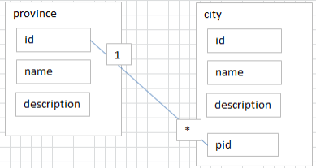

# 1. 【数据库概述】

## 1.1. 【持久化保存】

* 把数据保存到可掉电式存储设备中以供之后使用
* 数据持久化意味着将内存中的数据保存到硬盘上加以“固化”，而持久化的实现过程大多通过各种关系数据库来完成
* 持久化的主要作用是**将内存中的数据存储在关系型数据库中**，当然也可以存储在磁盘文件、XML数据文件中


## 1.2. 【数据库技术的发展】

1. **人工管理阶段**（20世纪50年代中之前）
2. **文件系统阶段**（20世纪50年代末--60年代中） 
3. **数据库系统阶段**（20世纪60年代末--现在）
    1. **层次数据模型**：以 “树结构” 方式表示数据记录之间的联系  
    2. **网状数据模型**：以 “图结构” 方式表示数据记录之间的联系
    3. **关系数据模型**
        * 用 “关系二维表” 方式来表示数据记录之间的联系，格式统一，易于维护
        * 关系型数据库以 `行(row)` 和 `列(column)` 的形式存储数据
        * 这一系列的行和列被称为 `表(table)`，一组表组成了一个 `库（database）`
        * 支持SQL、复杂查询
        * 支持事务
        * 常见的关系型数据库
            1. **Oracle**：Oracle 公司开发的中大型数据库，可用于各种操作系统
            2. **SQL Server**：Microsoft 开发的中型数据库，只用于 Windows 系统
            3. **DB2**：IBM公司的数据库产品，收费的。常应用在银行系统中
            4. **PostgreSQL**：开源中小型数据库，稳定性极强，最符合SQL标准，对数据量大的文本以及SQL处理较快
            5. **SQLite**
                * 嵌入式的小型数据库，应用在手机端。零配置，SQlite3 不用安装，不用配置，不用启动，关闭或者配置数据库实例
                * 当系统崩溃后不用做任何恢复操作，再下次使用数据库的时候自动恢复

            6. **MySQL**
                * 开源中小型数据库，可用于各种操作系统
                * 由瑞典 MySQL AB 公司 1995 年开发，迅速成为开源数据库的 No.1
                * 2008 被 Sun 收购，2009 年 Sun 被 Oracle 收购
                * MySQL 的创造者担心 MySQL 有闭源的风险，因此创建了 MySQL 的分支项目 <font>MariaDB</font>
                * MySQL 从 5.7 版本直接跳跃发布了 8.0 版本

    4. **非关系型数据库（NoSQL）**
        * 基于键值对存储数据，不需要经过SQL层的解析，性能非常高
        * 目前基本上大部分主流的非关系型数据库都是免费的
        * 相比于SQL，NoSQL 泛指非关系型数据库
    
        ---

        1. **键值型数据库**
            * 通过 Key-Value 的方式来存储数据，其中 Key 和 Value 可以是简单的对象，也可以是复杂的对象
            * Key 作为唯一的标识符，优点是查找速度快，在这方面明显优于关系型数据库，缺点是无法像关系型数据库一样使用条件过滤（比如 WHERE），如果不知道去哪里找数据，就要遍历所有的键，这就会消耗大量的计算
            * 键值型数据库典型的使用场景是作为**内存缓存**。`Redis` 是最流行的键值型数据库

        2. **文档型数据库**
            * 此类数据库可存放并获取文档，可以是 XML、JSON 等格式
            * 在数据库中文档作为处理信息的基本单位，一个文档就相当于一条记录
            * 文档数据库所存放的文档，就相当于键值数据库所存放的“值”
            * `MongoDB` 是最流行的文档型数据库。此外，还有 `CouchDB` 等
            
        3. **搜索引擎数据库**
            * 虽然关系型数据库采用了索引提升检索效率，但是针对全文索引效率却较低
            * 搜索引擎数据库是应用在搜索引擎领域的数据存储形式，由于搜索引擎会爬取大量的数据，并以特定的格式进行存储，这样在检索的时候才能保证性能最优。核心原理是 “倒排索引”
            * 典型产品：`Solr`、`Elasticsearch`、`Splunk` 等
            
        4. **列式数据库**
            * Oracle、MySQL、SQL Server 等数据库都是采用的行式存储（Row-based）
            * 而列式数据库是将数据按照列存储到数据库中，这样做的好处是可以大量降低系统的 I/O，适合于分布式文件系统，不足在于功能相对有限
            * 典型产品：`HBase` 等
            
        5. **图形数据库**
            * 利用了图这种数据结构存储了实体（对象）之间的关系
            * 图形数据库最典型的例子就是社交网络中人与人的关系，数据模型主要是以节点和边（关系）来实现，特点在于能高效地解决复杂的关系问题
            * 典型产品：`Neo4J`、`InfoGrid` 等

## 1.3. 【数据库的相关概念】

1. **数据库系统**（DBS）：一般由数据库、数据库管理系统、应用程序、数据库管理员组成
2. **数据**（Data）：数据库中存储的基本对象（数字、文字、图形、图像、音频、视频）
3. **数据库**（Database）：存储数据的 “仓库”，保存了一系列有组织的数据
4. **数据库管理系统**（DBMS）：用于实现对数据进行管理和维护的系统软件
5. **数据库应用程序**：使用 DBMS 提供的标准接口（如 ODBC、JDBC 等）驱动程序连接数据库
    1. **ODBC**
        * ODBC（Open Database Connectivity，开放数据库互连）为访问不同的 SQL 数据库提供了一个共同的接口
        * 一个应用程序可以通过共同的一组代码访问不同的 SQL 数据库管理系统
        * 一个基于 ODBC 的应用程序对数据库的操作不依赖任何 DBMS，不直接与 DBMS 打交道，所有的数据库操作由对应的 DBMS 的 ODBC 驱动程序完成
        
    2. **JDBC**
        * 用于 Java 应用程序连接数据库的标准方法，是一种用于执行 SQL 语句的 Java API
        * 可以为多种关系数据库提供统一访问，它由一组用 Java 语言编写的类和接口组成
        
    3. **ADO.NET**
        * 微软在 `.NET` 框架下开发设计的一组用于和数据源进行交互的面向对象类库
        * ADO.NET 提供了对关系数据、XML 和应用程序的访问，允许和不同类型的数据源以及数据库进行交互

    4. **PDO**
        * PDO（PHP Data Object）为 PHP 访问数据库定义了一个轻量级的、一致性的接口
        * 这样，无论使用什么数据库，都可以通过一致的函数执行查询和获取数据
        * PDO 是 PHP5 新加入的一个重大功能

## 1.4. 【数据模型】

1. **数据模型的分类**
    1. **概念模型**：对数据和信息建模，主要用于数据库设计，ER模型
    2. **逻辑模型**：层次模型、网状模型 、关系模型
    3. **物理模型**：数据在具体 DBMS 产品中的物理存储方式和存取方法

2. **数据模型的组成要素**
    > * 学生信息（2017010101，李光明，男，19，计算机科学学院，软件工程）

    * **数据结构**：描述的是学生的特征信息，即学生数据的基本结构
    * **数据操作**：主要包括对学生信息的增删查改
    * **数据的完整性约束**：如对性别（只能是男或女）和年龄（15到40岁）约束

## 1.5. 【概念模型】

### 1.5.1. 【信息世界中的基本概念】
    
* **实体/记录/元组**：客观存在并可相互区别的事物称为实体
    > * 表格中的一行即为一个记录
    > * 事物特征的组合，可以描述一个具体的事物

* **实体集/表**
    > * 记录的组合，表示同一类事物的组合
    > * 一个实体集（class）对应于数据库中的一个表（table） 

* **字段**：表格中的一列即为一个字段，实体所具有的某一特性
* **主键/码**：能唯一标识信息的事物
* **外键/外码**：以另一个关系的外键作主关键字的表被称为主表，具有此外键的表被称为主表的从表

```
学生实体型（学号，姓名，性别，院系，专业）
教师实体型（工号，姓名，性别，院系）

全体学生是一个实体集
全体教师是一个实体集
学生和教师之间的联系：选课
```  

### 1.5.2. 【实体型之间的联系】

1. **一对一**：1:1
    * 在实际的开发中应用不多，因为一对一可以创建成一张表
    * 设计 `学生表`：学号、姓名、手机号码、班级、系别、身份证号码、家庭住址、籍贯、紧急联系人、...
    * 拆为两个表：两个表的记录是一一对应关系
        * `基础信息表`（常用信息）：学号、姓名、手机号码、班级、系别
        * `档案信息表`（不常用信息）：学号、身份证号码、家庭住址、籍贯、紧急联系人、...

        

2. **一对多**：1:n
    * 常见实例场景：`客户表和订单表`，`分类表和商品表`，`部门表和员工表`
    * 一对多建表原则：在从表（多方）创建一个字段，字段作为外键指向主表（一方）的主键

    

3. **多对多**：m:n
    > * 要表示多对多关系，必须创建第三个表，该表通常称为 `联接表`，它将多对多关系划分为两个一对多关系。将这两个表的主键都插入到第三个表中

    1. **学生-课程**
        * `学生信息表`：一行代表一个学生的信息（学号、姓名、手机号码、班级、系别...）
        * `课程信息表`：一行代表一个课程的信息（课程编号、授课老师、简介...）
        * `选课信息表`：一个学生可以选多门课，一门课可以被多个学生选择
            
            ```
            学号     课程编号  
            1        1001
            2        1001
            1        1002
            ```

    2. **产品-订单**
        * `产品表`：每条记录表示一个产品
        * `订单表`：每条记录表示一个订单
        * `订单明细表`
            * 每个产品可以与“订单”表中的多条记录对应，即出现在多个订单中
            * 一个订单可以与“产品”表中的多条记录对应，即包含多个产品

        
    3. **用户-角色**
        

### 1.5.3. 【E-R模型】
    
* **实体**：使用矩形框表示，框内标注实体名称
* **属性**：使用椭圆框表示，并用连线与实体连接起来
    > * 如果属性较多，可将实体与其属性单独用列表表示
    
* **联系**：使用菱形框表示，框内标明联系名称，并用连线将菱形框分别与有关实体相连，并在连线上注明联系类型（ `1:1`、`1:n` 或 `m:n` ）


## 1.6. 【数据库系统的三级模式】


## 1.7. 【数据库的二级映像】

1. **外模式/概念模式映像**
    * 每一个外模式，数据库系统都有一个外模式／模式映象 
    * 外模式／模式映象定义了该外模式与概念模式之间的对应关系
    * 保证数据的逻辑独立性

2. **概念模式／内模式映象**
    * 定义了数据全局逻辑结构与存储结构之间的对应关系
    * 记录和字段在内部是如何表示的
    * 数据库中模式／内模式映象是唯一的
    * 保证数据的物理独立性

## 1.8. 【关系的完整性】

1. **域完整性**
    * 指属性的值域的完整性
    * 包括数据类型、格式、取值范围、是否允许空值等

2. **实体完整性**
    * 指的是关系数据库中所有的表都必须有主码
    * 而且表中不允许存在如下两种情况的记录：
        > * 无主码值的记录
        > * 与其他记录的主码值相同的记录

3. **参照完整性**
    * 指外码的取值必须参照主码的取值，不允许引用不存在的记录
    * 若关系 R 中的属性 A 参照关系 S 中的属性 B，则对于 R 中的每个元组在属性A上的值必须为下面两种之一：
        > * 空值
        > * S中某个元组的属性B的取值

4. **用户自定义完整性**
    * 即业务规则
    * 如一个人口登记系统添加一个公民，其出生日期不能晚于当前日期
    * 银行取款时的取款金额不能大于当前余额等

## 1.9. 【MySQL 内部结构】

> * MySQL 由 `连接池`、`SQL 接口`、`解析器`、`优化器`、`缓存`、`存储引擎` 等组成
> * 分为三层，即 `MySQL Server 层`、`存储引擎层` 和 `文件系统层`
> * MySQL Server 层又包括 `连接层` 和 `SQL 层`


1. **文件系统层**
    * 主要是将数据库的数据存储在操作系统的文件系统之上，并完成与存储引擎的交互

2. **存储引擎层**
    * 存储引擎层是 MySQL 数据库区别于其他数据库最核心的一点
    * 主要负责 MySQL 中数据的存储和提取
    * 因为在关系数据库中，数据的存储是以表的形式存储的，所以存储引擎也可以称为表类型（即存储和操作此表的类型）
    
3. **SQL层**
    > * SQL 层是 MySQL 的核心，MySQL 的核心服务都是在这层实现的
    > * 主要包含权限判断、查询缓存、解析器、预处理、查询优化器、缓存和执行计划
    
    1. **Management Services & Utilities**
        * MySQL 的系统管理和控制工具，包括备份恢复、MySQL 复制、集群等

    2. **SQL Interface**（SQL 接口）
        * 用来接收用户的 SQL 命令，返回用户需要查询的结果

    3. **Parser**（查询解析器）
        * 针对 SQL 语句进行解析，判断语法是否正确

    4. **Optimizer**（查询优化器）
        * SQL 语句在查询之前会使用查询优化器对查询进行优化，同时验证用户是否有权限进行查询，缓存中是否有可用的最新数据。它使用 “选取-投影-连接” 策略进行查询
        * 例如 `SELECT id, name FROM student WHERE gender = "女";` 语句中，SELECT 查询先根据 WHERE 语句进行选取，而不是将表全部查询出来以后再进行 gender 过滤。SELECT 查询先根据 id 和 name 进行属性投影，而不是将属性全部取出以后再进行过滤，将这两个查询条件连接起来生成最终查询结果

    5. **Caches & Buffers**（查询缓存）
        * 如果查询缓存有命中的查询结果，查询语句就可以直接去查询缓存中取数据
        * 这个缓存机制是由一系列小缓存组成的，比如表缓存、记录缓存、key 缓存、权限缓存等

4. **连接层**
    * 连接层不属于以上任何一层，可以将连接层理解为各种客户端、应用服务，主要指的是不同语言与 SQL 的交互
    * 应用程序通过接口（如 ODBC、JDBC）来连接 MySQL，最先连接处理的是连接层。连接层包括通信协议、线程处理、用户名密码认证 3 部分
    * 通信协议负责检测客户端版本是否兼容 MySQL 服务端
    * 线程处理是指每一个连接请求都会分配一个对应的线程，相当于一条 SQL 对应一个线程，一个线程对应一个逻辑 CPU，在多个逻辑 CPU 之间进行切换
    * 密码认证用来验证用户创建的账号、密码，以及 host 主机授权是否可以连接到 MySQL 服务器
    * Connection Pool（连接池）属于连接层。由于每次建立连接都需要消耗很多时间，连接池的作用就是将用户连接、用户名、密码、权限校验、线程处理等需要缓存的需求缓存下来，下次可以直接用已经建立好的连接，提升服务器性能

### 1.9.1. 【自我引用】


## 1.10. 【SQL分类】

> **SQL**（Structured Query Language）：结构化查询语言

1. **DDL（数据定义语言）**：`CREATE`、`DROP`、`ALTER`、`RENAME`、`TRUNCATE` 等
2. **DML（数据操作语言）**：`INSERT`、`DELETE`、`UPDATE`、`SELECT` 等
3. **DCL（数据控制语言）**：`GRANT`、`REVOKE`、`COMMIT`、`ROLLBACK`、`SAVEPOINT` 等

> * 有人把查询语句单拎出来一类：DQL（数据查询语言）
> * 还有单独将 `COMMIT`、`ROLLBACK` 取出来称为 TCL（事务控制语言）

## 1.11. 【SQL语言的规则与规范】

* SQL可以写在一行或者多行。为了提高可读性，各子句分行写，必要时使用缩进
* 每条命令以 `;` 或 `\g` 或 `\G` 结束
* 字符串型和日期时间类型的数据可以使用单引号表示
* 列的别名，尽量使用双引号，而且不建议省略 `as`
* 数据库名、表名、表的别名、变量名是严格区分大小写的，建议小写
* 关键字、函数名、字段名、字段的别名是忽略大小写的，建议都大写
* 注释
    > * `#`：MySQL 特有的方式
    > * `--`
    > * `/* ... */`

* 必须保证定义字段名时没有和保留字、数据库系统或常用方法冲突。如果坚持使用，可在SQL语句中使用 `` ` `` （着重号）引起来

# 2. 【】

## 2.1. 【小试牛刀】

1. **显示当前 MySQL 版本**
    * `mysql -V`
    * `mysql --version`

2. **控制台访问**：`mysql -u用户名 [-h主机名] -p密码 [-P端口号] [-D数据库名]`
    * **退出连接**：`\q` 、`quit`、 `exit`
    * **查看MySQL详细信息**：`status`

3. **查看数据的存放目录**：`show variables like '%datadir%';`

4. **查看数据库与表**
    * **查看所有数据库**：`SHOW DATABASES;`
    * **使用指定数据库**：`USE 数据库名`
    * **查看某个库的所有表格**
        * `SHOW TABLES;`
        * `SHOW TABLES FROM 数据库名;`

5. **创建数据库与表**
    * **创建数据库**：`CREATE DATABASE 数据库名;`
    * **查看数据库的创建信息**：`SHOW CREATE DATABASE 数据库名;`
    * **创建表格**：`create table 表名称(字段名1 数据类型, ... 字段名N 数据类型);`
        
        ```sql
        CREATE DATABASE yyq;
        USE yyq;

        CREATE TABLE student(
	        id INT,
	        NAME VARCHAR(20)
        )

        INSERT INTO student VALUES(1, '张三');
        INSERT INTO student VALUES(2, '李四');

        SELECT * FROM student;
        ```

    * **查看表的创建信息**：`SHOW CREATE TABLE 表名称;`

6. **删除数据库和表**
    * **删除数据库**：`DROP DATABASE 数据库名;`
    * **删除表格**：`DROP TABLE 表名称;`

7. **查看与设置编码**
    
    ```sql
    # 查看编码命令
    show variables like 'character_%';
    show variables like 'collation_%';       

    # 创建的时候设置编码
    CREATE DATABASE 数据库名 CHARSET 字符集;
    CREATE TABLE 表名(字段1 数据类型, ... , 字段N 数据类型) CHARSET 字符集;

    # 修改数据库、表、字段 的编码
    ALTER DATABASE 数据库名 CHARSET 字符集;
    ALTER TABLE 表名 CHARSET 字符集;
    ALTER TABLE 表名 MODIFY 字段名 数据类型 CHARSET 字符集;
    ```

## 2.2. 【基本的 select 结构】

1. **数据导入指令**
    * **方式1**. 在命令行登录 mysql，使用 source 指令导入
        
        ```bash
        mysql> source d:\mysqldb.sql
        ```

    * **方式2**. 基于图形化界面的工具导入数据
        > * SQLyog：选择 “工具” -- “执行sql脚本” 
    
2. **SELECT...**
    ```sql
    SELECT 1+1, 3*2;
    SELECT 2/3 FROM DUAL;  # dual：伪表
    ```

3. **SELECT ... FROM**
    
    ```sql
    # 选择全部列
    SELECT * FROM employees;

    # 选择指定的列
    SELECT employee_id, last_name, salary
    FROM employees;
    ```
    
    > * 一般情况下，除非需要使用表中所有的字段数据，最好不要使用通配符 `*`
    > * 使用通配符，会获取不需要的列数据，通常会降低查询和所使用的应用程序的效率
    > * 通配符的优势是，当不知道所需要的列的名称时，可以通过它获取它们
    > * 在生产环境下，不推荐直接使用 `SELECT *` 进行查询   

4. 