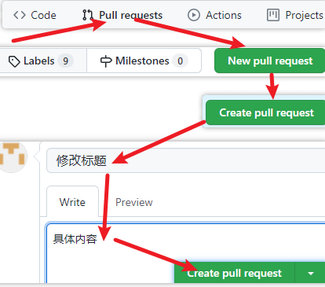

# 1. 【概述】
1. **版本管理工具应该具备的功能**

    1. **协同修改**
        * 多人并行不悖的修改服务器端的同一个文件

    1. **数据备份**
        * 不仅保存目录和文件的当前状态，还能够保存每一个提交过的历史状态

    1. **版本管理**
        * 在保存每一个版本的文件信息的时候不保存重复数据，以节约存储空间，提高运行效率
        * SVN 采用的是增量式管理的方式，而 Git 采取了文件系统快照的方式

    1. **权限控制**
        * 对团队中参与开发的人员进行权限控制
        * 对团队外开发者贡献的代码进行审核：Git 独有

    1. **历史记录**
        * 查看修改人、修改时间、修改内容、日志信息
        * 将本地文件恢复到某一个历史状态

    1. **分支管理**
        * 允许开发团队在工作过程中多条生产线同时推进任务，进一步提高效率

2. **集中式与分布式**

    1. **集中式**
        

    2. **分布式**
        

    3. **集中式 VS 分布式**

        |    |集中式（CVS、SVN）|分布式（Git、Mercurial、Darcs）|
        |----|------------|------------|
        |是否有中央服务器|有。开发人员需要从中央服务器获得最新版本的项目然后在本地开发，开发完推送给中央服务器。因此脱离服务器开发者是几乎无法工作的|没有中央服务器，开发人员本地都有 Local Repository|
        |网络依赖|必须要联网才能工作，而且对网络的依赖性较强，如果推送的文件比较大而且网络状况欠佳，则提交文件的速度会受到很大的限制|分布式在没有网络的情况下也可以执行commit、查看版本提交记录、以及分支操作，在有网络的情况下执行 push 到 Remote Repository|
        |文件存储格式|按照原始文件存储，体积较大|按照元数据方式存储，体积很小|
        |是否有版本号|有|没有|
        |分支操作的影响|创建新的分支则所有的人都会拥有和你一样的分支|分支操作不会影响其他开发人员|
        |提交|提交的文件会直接记录到中央版本库|提交是本地操作，需要执行 push 操作才会到主要版本库|

3. **代码托管中心**

    * **局域网环境下**：GitLab 服务器
    * **外网环境下**：GitHub、码云

4. **本地库和远程库**
    1. **团队内部协作**
        

    2. **跨团队协作**
        

# 2. 【创建版本库】

1. **检查安装结果**：`git --version` ：查询 git 版本

2. **获取 git 命令的帮助信息**

    * `git` <=> `git help`

    * `git help -a` ：查看所有 git 的子命令
    * `git help 命令`
    * `git 命令 --help`

3. **配置信息**

    1. **设置提交仓库时的用户名和邮箱信息**

        * `git config --global user.name "yiyiqiang"`

        * `git config --global user.email "984771890@qq.com"`

    2. **设置别名**

        * **命令形式**：`git config –-global alias.ci commit`

        * **配置文件**

            

    3. **config 的三个作用域**

        * `git config --local`：默认，只对当前仓库有效：配置文件位于：`当前仓库的根目录/.git/config`
        * `git config --global`：对登录用户的所有仓库有效：配置文件位于：`当前用户家目录/.gitconfig`
        * `git config --system`：对系统的所有用户有效，配置文件位于：`git软件的安装根目录/etc/gitconfig`

        > * **优先级**：local > global > system

    4. **显示 config 的配置**

        * `git config --list`
        * `git config --list --local`
        * `git config --list --global`
        * `git config --list --system`
        * `git config user.name`：获取名字
        * `git config user.name`：获取邮箱

    5. **其它相关配置**
        * **区分文件名大小写**
            > * git 默认对于文件名大小写是不敏感的

            * `git config core.ignorecase` 默认为 true ，忽略文件名大小写
            * `git config core.ignorecase false`

4. **创建版本库**

    * `git init`
        * 将当前目录变成 Git 可以管理的仓库
        * 初始化后可以发现当前目录下多了一个 `.git` 的目录，该目录是 Git 用来跟踪管理版本库的

    * `git init project-name`：新建一个目录，将其初始化为 Git 代码库

    * `git clone url`：克隆远程仓库

# 3. 【基本操作】
1. **增加/删除文件**
    1. **添加指定文件到暂存区**：`git add [file1] [file2] ...`
    2. **添加指定目录到暂存区**：`git add [dir]`
    3. **添加当前目录的所有文件到暂存区**：`git add .`
    4. **只更新已跟踪的文件**：`git add -u`
    5. **文件删除**：`git rm [filename]`
    6. **重命名或移动**：`git mv [oldname] [newname]`

2. **提交**
    1. **提交暂存区到本地仓库中**
        * `git commit -m "描述内容"`
        * `git commit [file1] [file2] ... -m "描述内容"`
    2. **直接从工作区提交到仓库**
        * 前提：该文件在仓库中有历史版本
        * `git commit -am "描述内容"`
    3. **创建空的 commit**
        * `git commit --allow-empty -m "initial"`
    4. **修改上一条提交信息**：`git commit --amend`

3. **显示有变更的文件**
    * `git status`
    * `git status -s`：获取简短的输出结果

# 4. 【查看提交历史】
* `git log`：按时间列出所有提交日志
* `git log -p`：显示每次提交的内容差异
* `git log –p -2`：显示最近两次的提交
* `git log --oneline`：将每个提交放在一行显示
* `git log --pretty=oneline`：哈希值显示更完整
* `git log --pretty=format`：按指定格式输出

    > * `git log --pretty=format:"%h %ad | %s %d [%an]" --graph --date=short`

---

* `git log --author="用户名"`：只查询指定用户提交的日志
* `git log --grep="关键字"`：仅显示提交说明中包含指定字符串的提交
* `git log --after="2021-09-10"`：仅显示指定时间之后的提交
* `git log --before="2021-09-10"`：仅显示指定时间之前的提交
* `git log -- file1 file2 ...`：按文件，可直接省略 `--`

---

* `git log --graph`：以图表形式显示分支与合并历史
* `git log --oneline --graph --all`：显示所有分支的提交日志
* `git log --oneline --graph -N`：查看最近 N 次提交的版本日志

---

* `git log` 和 `git reflog`
    * **前者**：可显示所有提交过的版本信息，不包括已经被删除的 commit 记录和 reset 的操作
    * **后者**：显示所有的操作记录，包括提交，回退的操作。一般用来找出操作记录中的版本号，进行回退

* `git blame <file>`：以列表形式查看指定文件的历史修改记录
* `git show [commit]`：显示某次提交的元数据和内容变化
* `git show --name-only [commit]`：显示某次提交发生变化的文件
* `git show [commit]:[filename]`：显示某次提交时，某个文件的内容

# 5. 【比较文件差异】
* **显示暂存区和工作区的差异**：`git diff [文件名]`
* **显示暂存区和上一次提交的差异**:
    * 方式1. `git diff --cached [file]`
    * 方式2. `git diff --staged [file]`
* **显示工作区与当前分支最新 commit 之间的差异**
    * `git diff HEAD`
* **显示两次提交之间的差异**
    * `git diff [first-branch]...[second-branch]`

# 6. 【版本回退】

* `git reflog`
    
    * HEAD 指向的版本就是当前版本
    * HEAD@{移动到当前版本需要多少步}

---

1. **前进后退**

    1. **基于索引值操作** <span style="color: red">★</span>
        * `git reset --hard 索引值`

    2. **使用 `^` 符号：只能后退**
        * `git reset --hard HEAD^`：n 个 `^` 表示后退 n 步

    3. **使用 `~` 符号：只能后退**
        * `git reset --hard HEAD~n`：表示后退 n 步

    4. **回退到没有合并分支之前的状态**
        * `git reset –-hard ORIG_HEAD`

2.  **reset 命令的三个参数对比**

    1. `--soft`：仅仅在本地库移动 HEAD 指针
        

    2. `--mixed`：在本地库移动 HEAD 指针 且 重置暂存区（reset 默认操作）
        

    3. `--hard`
        * 在本地库移动 HEAD 指针
        * 重置暂存区
        * 重置工作区

3. **revert 和 reset**
    

    * `git reset`：会丢弃掉一些版本历史
    * 已经 push 到远程仓库的 commit 不允许 reset
        > * 如果 commit 已经被 push 到远程仓库上了，也就意味着其他开发人员就可能基于这个 commit 形成了新的 commit，这时你去 reset，就会造成其他开发人员的提交历史莫名其妙的丢失，或者其他灾难性的后果
        > * 因此，一旦 commit 已经被 push 到远程仓库，那么是坚决不允许去 reset 它的
    * `git revert HEAD~3`

        > * 恢复 HEAD 中最后一次提交的第四次提交所指定的更改，并使用恢复的更改创建一个新提交

# 7. 【分支管理与回到旧版本】

## 7.1. 【分支管理】
* `git branch`：列出所有本地分支
* `git branch -r`：列出所有远程分支
* `git branch -a`：列出所有本地分支和远程分支
* `git branch -v`：查看每一个分支的最后一次提交
* `git branch --merged`：显示已经合并到当前分支的分支列表
* `git branch --no-merged`：显示还没有合并的分支，尝试删除会报错

---


* `git branch <branch>`：创建分支
* `git branch <branch> <start point>`：基于当前分支的某一次 commit 来创建分支
* `git checkout <branch>`：切换分支
* `git checkout -`：切换至上一个分支
* `git checkout –b <branch>`：建立并切换分支
* `git checkout -b <new_branch> <start point>`
* `git branch <branch> -d`：删除分支
* `git branch <branch> -D`：强制删除分支
* `git checkout -B <branch>`：重置分支

## 7.2. 【找回误删的分支】
```
$ git branch -D master
	Deleted branch master (was d73e0a5).  # 可根据 hash 值 重新找回分支
$ git branch
	* develop
$ git branch master d73e0a5   # 根据 hash 值 找回 master
$ git branch
	* develop
	master
```

## 7.3. 【合并分支】
> * `git merge [branch name]`

1. **合并冲突**：当两个分支都存在同时修改某个文件时，合并会发生冲突

    * `git merge [branch name]`：合并分支

    * `git status`：查看冲突的解决方案
        * **方式1**: `git merge --abort` => 忽略合并
        * **方式2**：`vim 冲突的文件名`
            * git 用 `<<<<<<<`，`=======`，`>>>>>>>` 标记出不同分支的内容
            * 接着 `git status` 、`git add` 、`git commit`

2. **`--no-ff`**

    

    1. `git merge dev`  默认为 Fast-forward

    2. `git merge dev --no-ff`

        * 确保不会发生快进合并，并且始终创建新的提交对象
        * 可保存之前的分支历史，而默认情况下合并只保留单条分支记录

3. **`--squash`**

    > * 把多次分支 commit 历史压缩为一次

    

## 7.4. 【回到旧版本】

> * **checkout**：切换分支或还原工作树文件

* `<commit>`
    * 取值：hash值、分支名、tag 名
    * 分支 和 tag 在本质上对应的都是一个 commit hash 值
    * 指定  `<commit>`，表示用指定提交中的文件覆盖暂存区和工作区中对应文件
    * 省略  `<commit>`，表示用暂存区的文件覆盖工作区中的文件

*  `<paths>`
    * `--` ：表示之后跟着的是 `<paths>` （目录名、文件名）
    * 指定 `<paths>` 不会改变 HEAD 头指针
    * 不指定 `<paths>`，单纯的检出某个 commit 或 分支，是会改变 HEAD 头指针的

---

1. **HEAD 是 checkout 的灵魂**

    ```
    $ git log --oneline
        23f0e65 (HEAD -> master) v5
        1e8cf4d v4
        c60bcb7 v3
        7bc13b1 v2
        a04a35a v1

    $ cat .git/HEAD
    	ref: refs/heads/master
    $ cat .git/refs/heads/master
    	23f0e6564b3a65e9ae89ada2f02e3574650e3c61

    $ git checkout -b dev

    $ cat .git/HEAD
    	ref: refs/heads/dev
    $ cat .git/refs/heads/dev
    	23f0e6564b3a65e9ae89ada2f02e3574650e3c61
    ```

    * 在切换分支的时候，HEAD 会相应的指向对应的分支引用

2. **回到旧版本**

    * `git checkout -- .`
    * `git checkout HEAD -- .`
    * `git checkout hash号 -- .`
    * `git checkout hash号 -- 文件名`

# 8. 【文件忽略】
1. **放弃追踪**
    * `git rm --cached [file1] [file2]`
    * `git rm –r --cached .`
    * `git rm –r --cached stuff/`

2. **文件忽略**
    * 只针对未处于追踪状态的文件有效，用于设置某些文件不被 git 追踪管理
    * github 官网样例文件：[https://github.com/github/gitignore](https://github.com/github/gitignore)
    * 在仓库根文件夹中新建：`.gitignore`

    * 查看 `.gitignore` 策略生效行号：`git check-ignore –v <file name>`

# 9. 【基本原理】

1. **哈希**

    > 明文 ---> 加密算法 ---> 密文

    * 哈希是一个系列的加密算法，各个不同的哈希算法虽然加密强度不同，但是有以下几个共同点：
        * 不管输入数据的数据量有多大，输入同一个哈希算法，得到的加密结果长度固定
        * 哈希算法确定，输入数据确定，输出数据能够保证不变
        * 哈希算法确定，输入数据有变化，输出数据一定有变化，而且通常变化很大
        * 哈希算法不可逆
    * git 底层采用的是 SHA-1 算法
        * 哈希算法可以被用来验证文件。原理如下图所示
            

        * git 就是靠这种机制来从根本上保证数据完整性的

2. **git 保存版本的机制**

    * git 把数据看作是小型文件系统的一组快照。每次提交更新时 git 都会对当前的全部文件制作一个快照并保存这个快照的索引。为了高效，如果文件没有修改，git 不再重新存储该文件，而是只保留一个链接指向之前存储的文件。所以 git 的工作方式可以称之为快照流

# 10. 【远程仓库操作】
* **创建远程仓库地址别名**：`git remote add [别名] [远程地址]`
* **显示所有远程仓库的地址别名**：`git remote -v`
* **显示某个远程仓库的信息**：`git remote show [remote]`
* **取消连接远程仓库**：`git remote remove [远程仓库别名]`
* **重命名远程仓库的别名**：`git remote rename [旧别名] [新别名]`

---

* **推送**：`git push [别名] [分支名]`
* **克隆**：`git clone [远程地址]`

---

* **删除远程分支**：`git push 远程仓库别名 --delete 远程分支名`

---

1. **团队成员邀请**

    * 克隆项目后，只有接受邀请了，才能推送文件到对方的远程仓库

        


2. **拉取**

    * pull = fetch + merge
    * 推送信息到远程仓库，是需要登录账号的；使用拉取相关命令是不需要登录账号信息的

    * `git fetch [远程库地址别名] [远程分支名]`：下载远程仓库的所有变动
        > * `git checkout origin/main`
        > * `cat 远程仓库已更改的文件名`

    * `git merge [远程库地址别名/远程分支名]`

        > * `git checkout main`
        > * `git merge origin/main`

    * `git pull [远程库地址别名] [远程分支名]`

3. **解决冲突**

    * 如果不是基于 GitHub 远程库的最新版所做的修改，不能推送，必须先拉取
    * 拉取下来后如果进入冲突状态，则按照 “分支冲突解决” 操作解决即可
    * 对已解决冲突的文件进行提交时，不能指定某个文件名进行提交

4. **跨团队协作**

    * step1. Fork项目
        

    * step2. 本地修改，然后推送到远程

    * step3. Pull Request
        

    * step4. 原仓库的创建者审核
        

    * step5. 原仓库的创建者将远程库修改拉取到本地

# 11. 【git 协议】

## 11.1. 【本地协议】

* **克隆本地仓库**
	* 方式1. `git clone /c/wd/test.git`
	* 方式2. `git clone file:///c/wd/test.git`：不建议使用
		* 指定 `file://` 会触发用于网路传输资料的进程，传输效率低

* **添加远程仓库的链接**
	* `git remote add origin /c/wd/test.git`

## 11.2. 【HTTPS】

* 每次 push  都需要输入 github 的账号密码
* 对于 windows10，只需要输入一次，因为控制面板里的 windows 凭据会记录输入的账号信息
* 如果系统没有记住账号信息，可执行
    * 存储凭证：`git config –-global credential.helper wincred`

## 11.3. 【SSH】

* `cd ~`：进入当前用户的家目录
* `ssh-keygen -t rsa -C 984771890@qq.com` ：生成密钥，参数 -C 是大写的
* `cd .ssh`
* `cat id_rsa.pub`
    * 复制 id_rsa.pub 文件内容，登录 GitHub，点击用户头像 → Settings → SSH and GPG keys，单击 New SSH Key，输入复制的密钥信息

* **创建远程地址别名**
    * `git remote add origin_ssh git@github.com:yiyiqiang/test`
    * **拉取**：`git pull origin_ssh 分支名`
    * **推送**：`git push origin_ssh 分支名`

# 12. 【】

## 12.1. 【获取远端项目】

1. `git clone [远端仓库地址]` ：本地仓库名与远程仓库名相同
2. `git clone [远端仓库地址] 自定义本地仓库名 ` ：指定本地仓库名

3. `git clone --no-checkout [远端仓库地址]`

    * 适用于仓库内容很多的情况下，通过  `--no-checkout` 快速获取远端项目

    * 克隆完后，还可自定义 checkout 到指定的分支上

    ```
    $ git clone --no-checkout git@gitee.com:yiyiqiang/test.git test2
    $ cd test2/
    $ ll -a
        total 4
        drwxr-xr-x 1 Administrator 197121 0  9月 17 16:21 ./
        drwxr-xr-x 1 Administrator 197121 0  9月 17 16:21 ../
        drwxr-xr-x 1 Administrator 197121 0  9月 17 16:21 .git/

    $ git status
        deleted:    a
        deleted:    b
        deleted:    test.md

    $ git branch
    	* master

    $ git checkout master
        Already on 'master'
        Your branch is up to date with 'origin/master'.
    $ git status
    $ ll -a
        total 5
        drwxr-xr-x 1 Administrator 197121  0  9月 17 16:23 ./
        drwxr-xr-x 1 Administrator 197121  0  9月 17 16:21 ../
        drwxr-xr-x 1 Administrator 197121  0  9月 17 16:26 .git/
        -rw-r--r-- 1 Administrator 197121  0  9月 17 16:23 a
        -rw-r--r-- 1 Administrator 197121  0  9月 17 16:23 b
        -rw-r--r-- 1 Administrator 197121 19  9月 17 16:23 test.md
    ```

4. `git clone --bare [远端仓库地址]`

    * 克隆裸仓库，只会获取 `.git` 目录里面的信息，用于快速获取远端项目

    ```
    $ git clone --bare git@gitee.com:yiyiqiang/test.git bare-test
    $ cd bare-test/
    $ ll -a
        total 12
        drwxr-xr-x 1 Administrator 197121   0  9月 17 16:45 ./
        drwxr-xr-x 1 Administrator 197121   0  9月 17 16:45 ../
        -rw-r--r-- 1 Administrator 197121 162  9月 17 16:45 config
        -rw-r--r-- 1 Administrator 197121  73  9月 17 16:45 description
        -rw-r--r-- 1 Administrator 197121  23  9月 17 16:45 HEAD
        drwxr-xr-x 1 Administrator 197121   0  9月 17 16:45 hooks/
        drwxr-xr-x 1 Administrator 197121   0  9月 17 16:45 info/
        drwxr-xr-x 1 Administrator 197121   0  9月 17 16:45 objects/
        -rw-r--r-- 1 Administrator 197121 105  9月 17 16:45 packed-refs
        drwxr-xr-x 1 Administrator 197121   0  9月 17 16:45 refs/

    $ git clone /c/MyNote/bare-test/ test
    $ cd test
    $ ll -a
        total 9
        drwxr-xr-x 1 Administrator 197121  0  9月 17 17:03 ./
        drwxr-xr-x 1 Administrator 197121  0  9月 17 17:03 ../
        drwxr-xr-x 1 Administrator 197121  0  9月 17 17:03 .git/
        -rw-r--r-- 1 Administrator 197121  0  9月 17 17:03 a
        -rw-r--r-- 1 Administrator 197121  0  9月 17 17:03 b
        -rw-r--r-- 1 Administrator 197121 19  9月 17 17:03 test.md
    ```

## 12.2. 【push 详解】


本地仓库

远程追踪仓库

远程仓库


