# 1. 【概述】
## 1.1. 【运维岗位】
1. **云计算架构**  
    > * 云计算 = 公有云（阿里云、百度云、华为云） + 私有云（OpenStack） + 混合云
    > * 云服务器免去了采购IT硬件的前期准备，让企业像使用水、电、天然气等公共资源一样便捷、高效地使用服务器，实现计算资源的即开即用和弹性伸缩

2. **DevOps**：运维开发工程师  
    > * DevOps = Development + Operations，大概 6 : 4 = 6运维 : 4开发（Python/Go）
    > * DevOps 把原本独立的开发和运营工作融合到一起，运营团队时刻了解开发人员的进展，并与他们形成互动，共同监控 IT 业务进展
    > * 在运维方面，DevOps 可以打通从需求到结果运行的所有环节，以提高业务价值为目标

3. **AIOps**：智能运维  
    > * 解决<mark>未来</mark>企业可能遭遇的因IT故障而导致的业务中断
    > * 结合了大数据和机器算法、机器学习技术，通过海量信息的搜集和处理，发现、预测、解决故障，进一步推动了IT运维自动化，减少了人力成本

4. **CI/CD**  
    > * 核心概念是持续集成、持续交付和持续部署
    > * 作为一个面向开发和运营团队的解决方案，CI/CD 主要针对在集成新代码时所引发的问题

5. **Docker**：容器化技术  
    > * 一个开源的应用容器引擎，通常包括客户端、守护进程、镜像、容器，让开发者可以打包他们的应用以及依赖包到一个可移植的镜像中，再发布出去
    > * 类似于一个集装箱，可以把货物规整的摆放起来

## 1.2. 【部门与部门职责】
1.  **产品部门**（PM、UI、UE）：设计产品的需求，确定需要做的项目的功能和细节问题
2.  **研发部门**（前端、后端）：根据产品部门/测试部门提供的项目模块需求进行编程
3.  **测试部门**：对于研发部门提供的代码进行运行测试，检查是否存在 bug 和 一些需要改善的体验
4.  **运维部门**：负责项目环境部署、上线、架构的搭建等等

## 1.3. 【服务器种类】

1.  **虚拟服务器**（云服务器）
    > 将多台硬件服务器进行整合，根据用户的需求，分配硬件资源给相应用户

    * 阿里云服务器
    * 亚马逊AWS
    * 腾讯云

2.  **物理主机服务器**
    1.  **机架式服务器**
        * 外形看起来不像计算机，而像“抽屉”
        * 有 1U、2U、4U、8U 等规格
            * 服务器的尺寸：一般用来描述服务器的高度（厚度）
            * 服务器的尺寸是按 U 计算的：1U = 1.75英寸 = 4.445cm  
            
            

    2.  **刀片服务器**
        * 外观类似一个箱子里摆放了整齐的书

        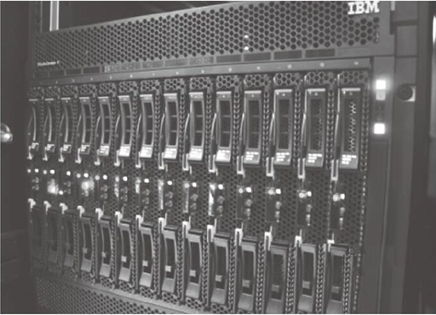

    3.  **塔式服务器**
        * 它的外形以及结构都跟立式PC差不多  
        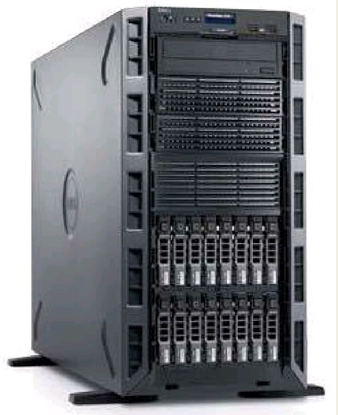
        
## 1.4. 【服务器品牌】

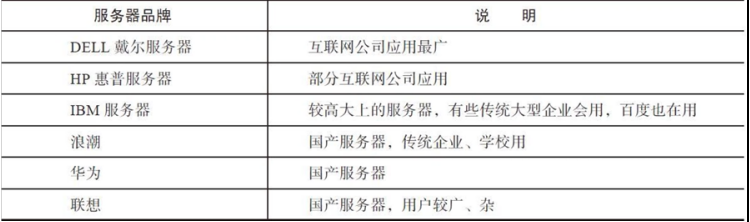

## 1.5. 【服务器硬件组成】

1.  **电源**：备用电源 、电池(UPS) 、发电机
2.  **CPU**
    * CPU 常见的种类分为 精简指令集 和 复杂指令集 两类
        * 精简指令集的 CPU 设计代表有 SUN 公司的 SPARC 系列和 ARM 系列等
        * 复杂指令集的设计代表有 Intel至强系列（XEON）和 AMD系列 等
    * Intel、AMD 作为 x86 架构的 CPU，主要用于 PC 或 DELL 等常见品牌的系列服务器上
    * **CPU路数**：服务器中有多少个CPU。单路=1个CPU   双路=2个CPU
    * **CPU核数**：决定了服务器并行（同时）处理任务能力
    * CPU 一般通过频率吉赫兹（GHz）表示性能的好坏，频率越高速度越快，简单地说，CPU频率就是用来表示CPU每秒钟的工作次数

3. **内存**
    * 内存（RAM）是 CPU 和 磁盘 之间的缓冲设备，是临时存储器（用于存放数据）。若断电，数据就会丢失
    * 程序运行的时候，一般会被调度到内存中执行，服务器关闭或程序关闭之后，数据将自动从内存中释放掉
    * 程序和进程

        | 例称 | 实际名称 | 实际含义说明 |
        | :---: | :---: | :---: |
        | 影片 | 程序 | C/Python/Java，代码文件 |
        | 放片 | 进程 | 正在运行的各类程序（放在内存里执行） |
        | 没完没了地放片 | 守护进程 | 持续保持运行着的程序 |
        
    * 缓冲与缓存
        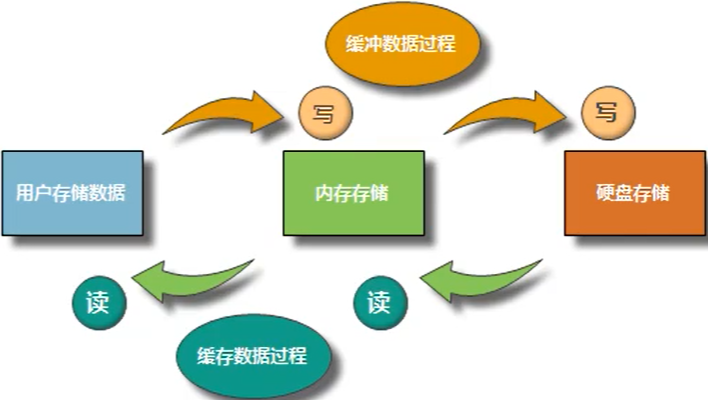

        > * 用于写数据存储空间：buffer 缓冲  => 用户写数据：写缓冲
        > * 用于读数据存储空间：cache 缓存  => 用户读数据：读缓存

        1. **缓冲区**
            > * 缓冲区是内存空间中预留的一部分存储空间，用来缓冲输入或输出的数据
            > * 缓冲区根据其对应的是输入设备还是输出设备，分为输入缓冲区和输出缓冲区
            
            * 为什么要引入缓冲区 
                * 高速设备与低速设备的不匹配，势必会让高速设备花时间等待低速设备，此时可在这两者之间设立一个缓冲区，提高工作效率
            * 缓冲区的类型 
                * **全缓冲**：当填满标准 I/O 缓存后才进行实际 I/O 操作。全缓冲的典型代表是对磁盘文件的读
                * **行缓冲**：当在输入和输出中遇到换行符时，执行真正的 I/O 操作。典型代表是键盘输入数据
                * **不带缓冲**：标准出错情况 stderr 是典型代表，这使得出错信息可以直接尽快地显示出来
            * 缓冲区的刷新 
                * 缓冲区满时
                * 关闭文件
                * 调用相关API
                
        2. **缓存** 
            * CPU的 Cache  
                * 用来解决 CPU 与 内存 之间速度不匹配的问题，以提高系统的执行效率
                * 一旦需要时，先检查 Cache，若有就从 Cache 中读取，若无再访问内存
            * 磁盘也有 Cache  
                * 用于解决总线接口的高速需求和读写硬盘的矛盾以及对某些扇区的反复读取
            * 浏览器缓存  
                * 浏览器会对最近请求过的文档进行存储，当再次请求这个页面时，浏览器会从本地磁盘显示文档，加速页面的阅览，减少服务器压力
                
4. **硬盘**
    * **硬盘分类**：机械硬盘、固态硬盘SSD
    * **硬盘接口**：SATA < SCSI < SAS < PCI-E
    * **磁盘阵列卡（Raid卡）**：将多块硬盘进行整合

5.  **光驱**（安装系统）：淘汰
    * U盘安装系统：适用于数量较少的服务器
    * 无人值守安装系统：Kickstart、cobbler
    
6. **主板**
    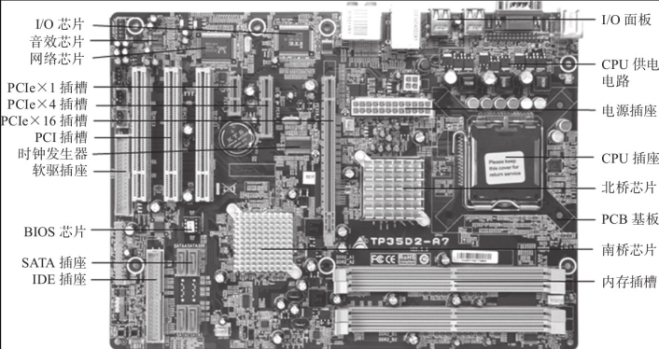

    1. **南桥芯片**
        * 一般位于主板上离CPU插槽较远的下方、PCI插槽的附近
        * 相对于北桥芯片来说，其数据处理量并不算大，所以南桥芯片一般都没有覆盖散热片
        * 南桥芯片不与处理器直接相连，而是通过一定的方式与北桥芯片相连
        * 南桥芯片负责I/O总线之间的通信，如PCI总线、USB、LAN、ATA、SATA、音频控制器、键盘控制器、实时时钟控制器、高级电源管理等
        * 南桥芯片的发展方向主要是集成更多的功能，例如网卡、Raid、IEEE 1394，甚至是Wi-Fi无线网络等

    2. **北桥芯片**
        * 北桥芯片就是主板上离CPU最近的芯片
        * 主要负责CPU与内存、CPU与PCI-E之间的通信。掌控项目多为高速设备
        * 因为北桥芯片的数据处理量非常大，发热量也越来越高，所以现在的北桥芯片都覆盖着散热片以加强散热

    3. **BIOS 芯片**
        * BIOS（Basic Input Output System）芯片（CMOS芯片）负责主板通电后各部件的自检、设置和保存，一切正常后才能启动操作系统
        * 其记录了电脑最基本的信息，是软件与硬件打交道的最基础的桥梁，没有它，电脑就不能正常工作
        
## 1.6. 【企业案例】

1. **高并发数据存储方式**
    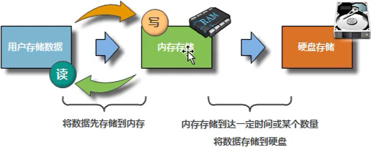
    
    * **存数据**：将数据先存储到内存再存储到磁盘中
    * **读数据**：将磁盘中的热点数据存储到内存中

2. **低并发数据存储方式**
    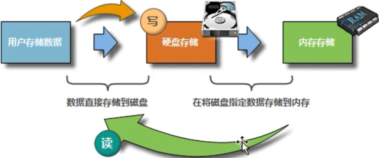
    
    * **存**：将数据先放到硬盘里
    * **读**：将磁盘中的热点数据存储到内存中
    
## 1.7. 【远程管理卡】

1. **利用远程管理卡实现远程管理**
    * 远程开关机
    * 远程制作raid
    * 远程安装系统

2. **分为集成与独立远程管理卡**
3. **远程管理卡不同厂商分类说明**
    * **Dell**：idrac
    * **HP**：ilo
    * **IBM**：RSA

> 一定要确认远程管理卡的默认地址信息

## 1.8. 【Linux 发展历史】

1.  1969年，KenThompson 等开发者在贝尔实验室成功开发了 Unix 操作系统
2.  1987年，Andrew S. Tanenbaum 教授开发了用于教学的 UNIX 系统，命名为 Minix
3.  Richard Stallman 发起了开发自由软件的运动
    * **目标**
        * 自由软件的核心就是没有商业化软件版权制约，源代码开放，可以无约束地自由传播
        * 自由软件强调的是权利问题，而非是否免费的问题
        * 自由软件中的自由是“言论自由”中的“自由”，而不是“免费啤酒”中的“免费”
        * 自由意味着freedom，而免费意味着free，这是完全不同的两个概念。例如，Red HatLinux自由但不免费，CentOs Linux则是自由且免费的
        * 自由软件赋予软件使用者四种自由:
            * 不论目的为何，有运行该软件的自由
            * 有研究该软件如何运行，以及按需改写该软件的自由
            * 有重新发布拷贝的自由
            * 有改进该软件，以及向公众发布改进版本的自由

    * **组织**：自由软件基金会（Free Software Foundation，FSF）
    * **项目**：GNU 项目
        * GNU＝GNU is not unix
        * 优秀软件：gawk、bash、gcc、Emacs
        * GNU 自己的内核 Hurd 尚未开发成功

    * **规则**：GPL协议（通用公共许可）
        * 开源的，自由传播
        * 必须将修改之后的代码公布出来

4. 1991年，林纳斯·托瓦兹 发布 Linux 内核
    * Linux = GNU/Linux内核
    
## 1.9. 【发行版】

1. **Unix 发行版**
    * IBM：AIX
    * Sun：Solaris
    * HP：HPUX

2. **Linux 发行版**
    > Linux操作系统 ＝ Linux内核 ＋ GNU软件及系统软件 ＋ 必要的应用程序

    * **RedHat Linux**
        * **RHEL**：RedHat Enterprise Linux, 开源，但升级系统或安装软件需要收费
        * **CentOS**：RHEL的社区克隆版本，免费版本，去掉了红帽商标
        * **Fedora Core**：免费版本，属于 rhel 的测试版
            * Fredora → 稳定之后 → Redhat → 去除 logo，去除收费 → CentOS
    * **Debian**
        * Ubuntu
        * deepin
        * KaliLinux
        * 优麒麟
    * **SUSE**
        * **openSUSE**：基于企业版的社区提供的免费 SUSE Linux
        
## 1.10. 【开源协议】

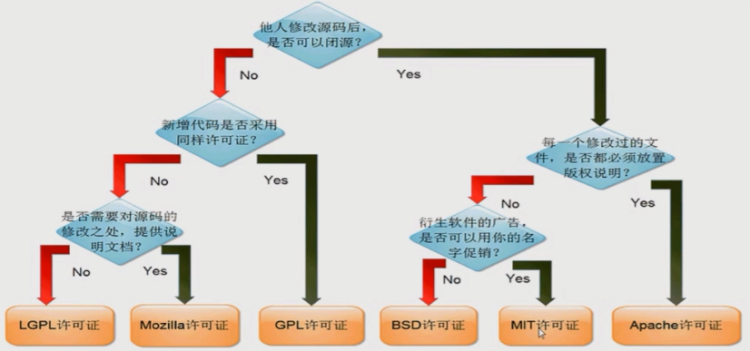

> LGPL（Lesser General Public License）相对于GPL则较为宽松，其允许不公开全部源代码

## 1.11. 【开发接口标准】

* **ABI**：Application Binary Interface
    > 描述了应用程序与OS之间的底层接口，允许编译好的目标代码在使用兼容ABI的系统中无需改动就能运行

* **API**：Application Programming Interface
    > 定义了源代码和库之间的接口，因此同样的源代码可以在支持这个API的任何系统中编译

* **POSIX**：Portable Operating System Interface
    > * IEEE 在操作系统上定义的一系列 API 标准
    > * POSIX 兼容的程序可在其它 POSIX 操作系统编译执行

* **运行程序格式**
    > * **Windows**: `EXE` 、`dll` 、 `lib`
    > * **Linux**: `ELF` 、 `.so`（shared object）、 `.a`

## 1.12. 【用户和内核空间】

1. **Library function 和 system call**
    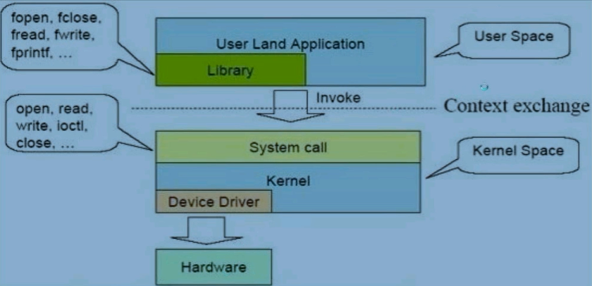
    
2. **用户和内核空间**
    * **用户空间**：User space
        * 用户程序的运行空间。为了安全，它们是隔离的，即使用户的程序崩溃，内核也不受影响
        * 只能执行简单的运算，不能直接调用系统资源，必须通过系统接口（system call），才能向内核发出指令

    * **内核空间**：Kernel space
        * 是 Linux 内核的运行空间, 可以执行任意命令，调用系统的一切资源
        
    ```
    str = "Hello"           // 用户空间
    x = x + 100             // 用户空间
    file.write(str)         // 切换到内核空间
    y = x + 200             // 切换回用户空间
    ```
    
# 2. 【初识 Linux】

## 2.1. 【安装 CentOS】

1. **修改网卡名称为：eth0**
    * 方式1. **安装的过程中修改**
        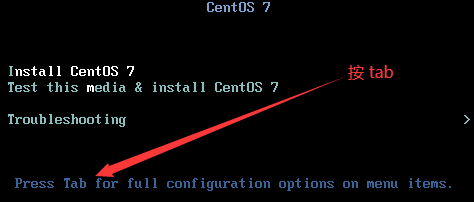
        
        * 增加内核参数：`net.ifnames=0` `biosdevname=0`
            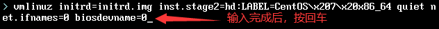

    * 方式2. **安装后修改**
        
        ```
        vim /etc/sysconfig/network-scripts/ifcfg-ens33    
	        ↘ NAME=eth0
            ↘ DEVICE=eth0
        
        mv ifcfg-ens33 ifcfg-eth0

        /etc/default/grub
	        ↘ 将 net.ifnames=0 biosdevname=0 添加到 GRUB\_CMDLINE\_LINUX 变量后
                    
        grub2-mkconfig -o /boot/grub2/grub.cfg
        ```

2. **自定义分区**
    1. **必须分区**
        * `/`：根分区
        * `swap分区`：交换分区
            * 如果真实内存小于 4GB，swap设置为内存的两倍
            * 如果真实内存大于 4GB，swap设置和内存一致

    2.  **推荐分区**
        * `/boot`：启动分区，500MB

3. **关闭安全配置**
    * `system-kdump`：将宕机前系统中的内存异常信息进行保存
    * `system-security policy`：系统的安全策略配置

## 2.2. 【网络配置】

1. **VMware 虚拟出的两个网卡**
    * `VMware Network Adapter VMnet1`：用于仅主机模式
    * `VMware Network Adapter VMnet8`：用于NAT模式

2. **仅主机模式**
    * 通过 VMnet1 这个虚拟网卡和真实计算机通信
    * 只能和真实计算机进行通信，不能访问互联网

3.  **桥接模式**
    * 虚拟机会利用真实的网卡跟当前真实计算机进行通信
    * 须设置与真实计算机同网段的 ip 地址
    * 可和局域网内同网段的计算机进行通信
    * 设置桥接到的外部网络（是宽度连接的形式还是 WIFI 的形式）：编辑 → 虚拟网络编辑器

4.  **NAT模式**
    * NAT（Network Address Translation）网络地址转换，NAT模式虚拟机就是通过宿主机进行上网和交换数据的
    * 物理机会充当一个 “路由器” 的角色，虚拟机要想上网，必须经过物理机，那物理机如果不能上网，虚拟机也就不能上网了
    * 这种模式兼容性最好，因为当物理机的网络环境变化时，虚拟机的网络并不会有影响
    * 在 NAT 模式下，虚拟机的网卡连接到宿主机的 VMnet8 上。此时系统的 VMware NAT Service 服务就充当了路由器，负责将虚拟机发到 VMnet8 的包进行地址转换之后再发到实际的网络上，再将实际网络上返回的包进行地址转换后通过 VMnet8 发送给虚拟机。VMware DHCP Service 负责为虚拟机分配 IP 地址
    * 编辑 →  虚拟网络编辑器：查看 NAT 模式下的子网IP、网关 等

5. **手动设置IP**
    * step1. **修改网络配置文件**：`vi /etc/sysconfig/network-scripts/ifcfg-eth0`
    
        ```
        TYPE=Ethernet       # 指定网络类型，Ethernet：以太网
        ONBOOT=yes          # 网卡随系统一同启动
        BOOTPROTO=static    # 网卡启动类型，dhcp 表示自动获取IP地址，static/none：手动设置静态IP地址
        IPADDR=192.168.188.128
        NETMASK=255.255.255.0  # 或者设置：PREFIX=24
        GATEWAY=192.168.188.2
        DNS1=119.29.29.29      # 主DNS，会覆盖以及优先于 /etc/resolv.conf 的配置生效
        # 常见的公用DNS为：223.5.5.5 / 223.6.6.6 / 114.114.114.114 / 114.114.115.115
        ```
 
    * step2. **重启网络服务** 
        * **方法1**：`systemctl restart network` 针对所有网卡进行重启  
            * CentoS 6.x：`service network restart`

        * **方法2**：`ifdown ens33 && ifup ens33` 针对指定网卡进行重启 
        * **方法3**
            
            ```
            nmcli  c  reload  ens33
            nmcli  d  reapply ens33
            # 第一条命令的作用是重新加载网卡配置文件，但它并不会马上生效
            # 第二条命令的作用是使第一条命令马上生效
            ```
            
    * step3. **查看与测试**
        *   `ip addr`
        *   `ping -c 4 www.baidu.com`
        
## 2.3. 【初次使用命令行登陆】

1. **显示当前的终端文件名**：`tty`
    > * 在命令行模式下，默认有6个终端，即 /dev/tty1，/dev/tty2 ... /dev/tty6；以图形形式登录会显示 /dev/tty7
    > * 如果是通过远程登录的，那会显示 /dev/pts/0，/dev/pts/1，/dev/pts/2 ..
    > * 在命令行模式下﹐比如在终端 tty1，可使用 Alt+F2 切换到终端 tty2，Alt+F7 切换到图形模式
    >     * 即 tty1-tty6 为命令行的终端，而 tty7 为图形的终端
    >     * 如果启动的图形服务是在 tty1 的基础上起来的，那图形界面就是 tty1

2. **图形和命令行切换**
    1.  **图形模式 to 命令行模式**：Ctrl + Alt + F2-F6
    2.  **命令行模式 to 图形模式**：Ctr + Alt + F1

3. **注销登录**：`logout` 或 `Ctrl+D`

## 2.4. 【快捷键】

* `ctrl + A`：把光标移动到命令行开头
* `ctrl + E`：把光标移动到命令行结尾
* `ctrl + ←/→`：按照一个英文单词进行移动光标
* `ctrl + F`：光标向右移动一个字符
* `ctrl + B`：光标向左移动一个字符
* `ctrl + C`：强制终止当前的命令
* `ctrl + L`：清屏，相当于 clear 命令
* `ctrl + W`：将空格分隔的一个字符串整体进行剪切
* `ctrl + U`：剪切光标之前的内容
* `ctrl + K`：剪切光标之后的内容
* `ctrl + Y`：粘贴 Ctrl+U 或 Ctrl+K 剪切的内容
* `ctrl + R`：在历史命令中搜索
* `ctrl + D`：退出当前终端（或 `exit` 或 `logout`）
* `ctrl + Z`：暂停当前进程，并放入后台（使用 `fg` 恢复）
* `ctrl + S`：暂停屏幕输出
* `ctrl + Q`：恢复屏幕输出
* `tab`：命令与文件补全，连按可列出所有可能的命令或文件

---

1. **修改终端命令行的相关设置**：`stty`
    1. **查看 Shell 中所有已定义的快捷键**：`stty -a`
    2. **修改快捷键**：`stty 关键字 快捷键`
        > `stty intr ^p` => 定义 `Ctrl + P` 为强制中止

2. **显示或设置键盘按键与其相关的功能**：`bind`

    ```bash
    # 列出所有快捷键
    bind -P
    
    # 键盘绑定
    bind '"\eH":"\eb"'       # 绑定 ALT+H 为光标左移一个单词，同 ALT-b 
    bind '"\eJ":"\C-a"'      # 绑定 ALT+J 为移动到行首，同 CTRL+a
    bind '"\e;":"ls -l\n"'   # 绑定 ALT+; 为执行 ls -l 命令
    ```

## 2.5. 【注意事项】

* 严格区分大小写
* 所有内容以文件形式保存，包括硬件设备
* 不靠扩展名区分文件类型，而是通过<mark>权限位标识</mark>来确定文件类型
* 所有的存储设备都必须在挂载之后才能使用
* 所有的存储设备都有设备文件名，挂载就是给存储设备分配盘符
* Windows 中的盘符用英文字母表示；Linux 中的盘符则是一个已经建立的空目录。这个空目录叫作挂载点
* 把设备文件（如 `/dev/sdb`）和挂载点（已经建立的空目录）连接的过程叫作挂载
* 安装软件时先看 Readme 文档，再看 Install 文档，然后看 FAQ 文档
* 远程服务器不允许关机，只能重启
* 不要在服务器访问高峰运行高负载命令
* 如复制大量的数据、压缩或者解压缩大文件、大范围的硬盘搜索等
* 建议通过系统的计划任务在凌晨 4:00—5:00 执行这些命令
* 远程配置防火墙时不要把自己踢出服务器
* 指定合理的密码规范并定期更新
* 合理分配权限
* 定期备份重要数据和日志

## 2.6. 【Xshell】

> **远程连接工具**：Xshell、SecureCRT、Putty、MobaXterm

1. **文件 → 默认会话属性**

    1. **终端**
        * 终端类型：Linux
        * 缓冲区大小：102400 回看操作过的记录时，可向上翻得更远一些
        * 终端 → VT 模式
            * 初始数字键盘模式：勾选“设置为普通”  => 让小键盘区的数字生效
        * 终端 → 高级
            * 勾选 “禁用更改终端标题”

    2. **外观**
        * 配色方案：保持默认的 XTerm
        * 设置字体、字体大小
        * 勾选 “使用闪烁的光标”，速度设为 500

    3. **高级**
        * 高级 → 日志记录
            * 取消勾选 “文件已存在时覆盖”
            * 勾选 “连接时开始日志记录”，否则不会记录
            * 日志名称格式保持默认即可
            * 建议将日志的目录统一放在一个固定目录下
            * 在 shell 命令输入区，右击选择日志，可随时启动、停止、暂停日志记录

    4. **文件传输**
        * 设置下载路径 和 加载路径。设置完毕后，就可使用 rz 和 sz 命令了
        * rz、sz 命令的安装方法：`yum install lrzsz -y`
            * 上传： `rz` 直接回车即可，会打开一个上传文件的窗口
            * 下载： `sz filename`
        * 只能上传、下载文件而不能是目录，如果是目录则需要打包成文件再传
        * 上传的文件可以是电脑里的任意文件，下载的文件会下载到Xshell配置的对应下载路径目录中
        * 除了 rz、sz 等传输文件命令之外，还可以使用 ftp、sftp（SSH服务）、winscp 等工具来传输文件

2. **工具 → 选项**
    * **常规 → 会话文件夹**：保存所有会话信息，可方便复制粘贴到其他主机，避免重复新建会话
    * **键盘和鼠标 → 鼠标向右按钮**：打开弹出式菜单
    * **日志 → 日志文件夹**：打开日志文件夹

3. **实现批量部署和管理功能**
    * 确保所有的标签是在同一个 Xshell 窗口中打开的
    * 在任何一个窗口中，右键点击选择最后一个选项 “发送键输入到所有会话”
    * 此时输入的命令和输出，所有的标签都可以看到
    * 如果需要批量部署或执行任务的服务器为数十台，则可以利用 Xshell 的这个小功能
    * 如果是大规模服务器数量，则可以使用 ansiable 等批量管理工具
    
## 2.7. 【使用密钥认证】

* SSH 服务支持一种安全认证机制，即密钥认证 
* 所谓密钥认证，实际上是使用一对加密的字符串

> * 其中一个称为公钥（public key），用于加密，任何人都可以看到其内容
> * 另一个称为私钥（private key），用于解密，只有拥有者才能看到其内容
> * 通过公钥加密过的密文，使用私钥可以轻松解密，但根据公钥来猜测私钥却十分困难

* 服务器和客户端都各自拥有自己的公钥和私钥，MobaXterm 可以使用密钥认证登录 Linux

***

* step1. **复制公钥到Linux** 
    
    ```
    mkdir /root/.ssh
    chmod 700 /root/.ssh
    vi /root/.ssh/authorized_keys  # 把公钥粘贴到文件 authorized_keys 中
    ```

* step2. **关闭 SELinux** 
* step3. **设置 MobaXterm 通过密钥登录**
    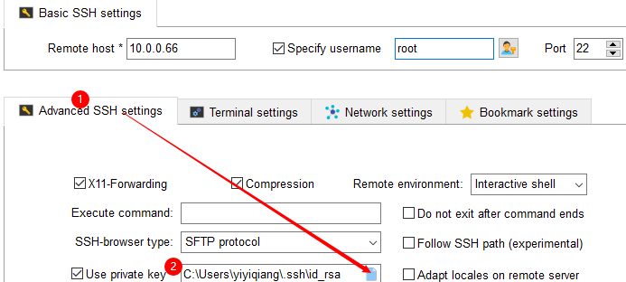
    
* step4. **使用密钥验证登录 Linux** 
    * 会发现登录的提示内容有所不同，输入为密钥设置的密码即可进入系统
    
## 2.8. 【目录结构】

> Linux 文件层级结构标准（FHS）：[https://www.pathname.com/fhs/](https://www.pathname.com/fhs/)

* `/boot` 引导分区的挂载点
    > * `/boot/vmlinuz`：内核文件
    > * `/boot/grub`：系统引导管理器

* `/sbin` 超级用户才可执行的命令; `/sbin -> /usr/sbin`
* `/bin` 常用的二进制命令所在的目录，`/bin -> /usr/bin`
* `/root` 超级用户家目录
    > * `/root/anaconda-ks.cfg` 以 Kickstart 配置文件的格式记录安装过程中设置的选项信息（自动化安装使用）

* `/home` 普通用户的家目录
* `/lib` 系统调用的函数库保存位置；`/lib -> /usr/lib`
* `/media` 挂载目录
* `/mnt` 挂载目录
* `/tmp` 临时目录
* `/run` 系统运行时产生的数据， `/var/run -> ../run`
* `/srv` srv（service）服务数据目录，保存服务所需要的数据，例如，www、ftp 数据
* `/sys` 虚拟文件系统。用于存放内核等信息
* `/usr` 系统软件资源目录：Unix Software Resource
    
    ```
    /usr/include 包含C语言的头文件
    /usr/lib     应用程序调用的函数库保存位置
    /usr/lib64
    /usr/src     源码包保存位置
    /usr/local   用于存放用户自己安装的程序，相当于 c:/program files
    /usr/share   应用程序的资源文件保存位置，如帮助文档
    ```

* `/opt` 第三方安装的软件保存位置
* `/dev` 存放设备文件

    ```
    /dev/hd*  IDE设备
    /dev/fd*  标准软驱
    /dev/sd*  代表SATA/SCSI设备。sdb3:代表第二块SATA硬盘的第3个主分区或者扩展分区
    /dev/vd*  虚拟化设备

    /dev/pty*  代表网络中登录的远程终端设备
    /dev/tty*  代表 Linux 上的虚拟控制台，也叫字符控制台

    /dev/sr0  光驱挂载目录 /dev/cdrom -> sr0

    /dev/stderr  标准错误输出    stderr -> /proc/self/fd/2
    /dev/stdin   标准输入        stdin -> /proc/self/fd/0
    /dev/stdout  标准输出        stdout -> /proc/self/fd/1

    /dev/null    输入设备文件，黑洞文件
    /dev/zero    输出设备文件，会源源不断的产生0
    /dev/random  随机设备文件
    /dev/urandom 随机设备文件
    ```

* `/var` 存放动态数据。主要保存缓存、日志以及软件运行所产生的文件

    ```
    /var/www   RPM包安装的 Apache 的网页主目录
    /var/log   系统日志保存位置
    /var/mail  邮件存放的目录 mail -> spool/mail
    /var/run   某些程序或服务启动后，会将他们的PID放置在该目录下  run -> ../run
    /var/lib   存放系统正常运行时需要改变的库文件
    /var/spool/cron   系统的定时任务队列保存位置
    /var/tmp   允许比 /tmp 存放更大的文件
    /var/lock  存放被锁定的文件，以保证其他程序不能同时使用这个设备或文件 lock -> ../run/lock
    ```

* `/lost+found`
    * 使用标准的 ext3 / ext4 文件系统格式才会产生的一个目录
    * 当系统意外崩溃或意外关机时，会在此产生一些文件碎片。系统在开机启动过程中会使用 fsck 工具检查修复已损坏的文件系统
    * 不过如果使用的是 xfs 文件系统的话，就不会存在这个目录了

* `/proc` 虚拟文件系统。保存在内存中，用于获取系统信息

    ```
    /proc/cpuinfo   当前 CPU 信息文件
    /proc/meminfo   当前内存信息文件
    /proc/loadavg   当前系统的平均负载文件
    /proc/mounts    当前设备挂载列表信息文件
    /proc/interrupts  当前系统中断信息文件
    /proc/uptime      系统总的启动时间和空闲时间
    /proc/version     内核版本信息
    ```

* `/etc` 存放配置文件

    ```
    /etc/passwd  用户库文件
    /etc/shadow  存放用户密码的文件
    /etc/group   主要存储用户组信息
    /etc/skel    用于在建立新用户时，初始化用户家目录

    /etc/sysconfig/network-scripts/ifcfg-ens33  IP地址配置文件
    /etc/resolv.conf  查看DNS设置，优先级低于网卡配置文件，建议使用 ifcfg-ens33 配置
    /etc/hosts 设定用户自己的IP与名字的对应表

    /etc/vimrc         vim 配置文件
    /etc/chrony.conf   设置网络时间

    /etc/hostname       设置主机名
    /etc/redhat-release 发行版本
    /etc/sysctl.conf    内核参数信息文件
    /etc/shells         当前 Linux 支持的 Shell

    /etc/filesystems 查看系统所支持的文件系统类型
    /etc/fstab       实现存储设备开启自动挂载配置文件
    /etc/init.d      软件启动程序所在的目录 init.d -> rc.d/init.d
    /etc/rc.local    文件中的命令信息，在开机时会自动执行 rc.local -> rc.d/rc.local
        ✨ 从 CentOS7 开始，rc.d/rc.local 文件必须要先分配执行权限，里面的脚本才能执行

    /etc/profile       环境变量配置文件
    /etc/bashrc        配置函数和别名
    /etc/locale.conf   系统语系设置
    /etc/issue         本地终端登录信息
    /etc/issue.net     远程终端登录信息
    /etc/motd          登录后欢迎信息
    ```

## 2.9. 【文件分类】

1. **普通文件**：以字节为单位的数据流，包括文本文件、源码文件、可执行文件等
2. **目录文件**
    > * Unix/Linux 系统把目录看成是一种特殊的文件
    > * 每个目录文件至少包括两个条目，`..` 表示上一级目录，`.` 表示当前目录

3. **设备文件**
    > * Unix/Linux 系统把每个设备都映射成一个文件
    > * 字符设备文件的存取以一个字符为单位
    > * 块设备文件的存取以数据块为单位

4. **管道文件**：用于进程间的通信
5. **链接文件**：类似于 win 下的快捷方式，分为软链接（符号链号接）和硬链接

> **查看文件类型**：`file 文件名或目录名`

# 3. 【打怪升级】

## 3.1. 【利用 emergency 模式重置密码】

> * **CentOS 6**：利用单用户模式修改 root 密码
> * **CentOS 7**：已没有单用户模式，而是 emergency 模式

* step1. 按 `e` 进入 CentOS 7 的启动选项
    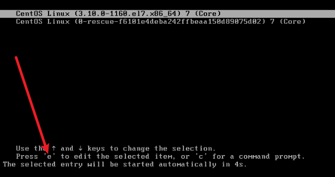
    
* step2. 进入 emergency 模式
    * 把 `ro` 改成 `rw init=/sysroot/bin/bash`
    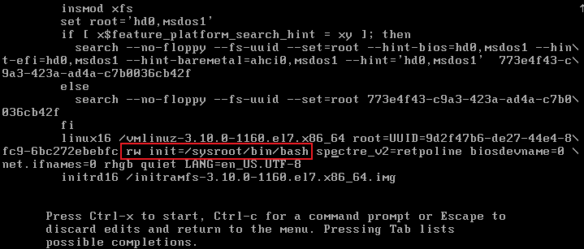
    
    * 按 `Ctrl+X` 正式进入 emergency 模式
    
* step3. 修改 root 密码
    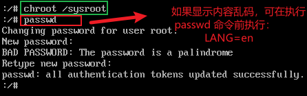
    
    * `chroot`：用来切换系统
    * `/sysroot`：即原始系统（CentOS 7 系统）
    * 接着： 
        * `touch /.autorelabel`：让 SELinux 生效，如果不执行，则修改的密码不会生效
        * `Ctrl + D`
        * `reboot`
        
## 3.2. 【使用救援模式】

> 救援模式即 rescue 模式，主要应用于系统无法进入的情况，比如 grub 损坏或者某一个配置文件修改出错

* step1. **光盘启动**
    
    
    * 设置 VMware 的 BIOS
        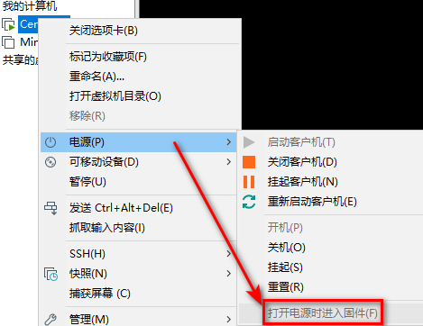
        
        * 进入 BIOS 后，按向右方向键，选择 Boot，让 CD-ROM 在最前面，也就是让它第一个启动
        
* step2. **进入 rescue 模式**
    1. 进入光驱启动界面后，使用上下方向键选择 Troubleshooting
        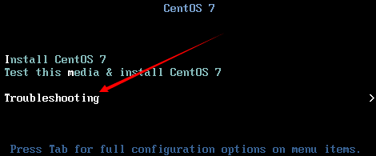
        
    2. 回车后，使用向下方向键选择 Rescue a CentOS Linux system
        
        
    3. 连续敲两次回车，会出现如下界面
        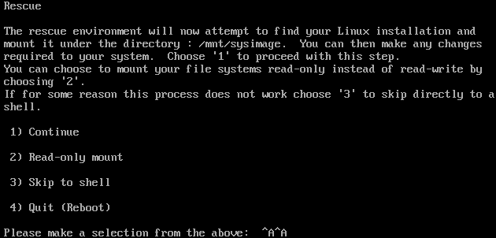
        
        * 上图告诉我们，初始系统在 `/mnt/sysimage` 下面 
        * 这里有4个选项 
            > * 选择第1项：将会继续往下走
            > * 选择第2项：将会把初始的系统挂载为只读模式，我们不能写磁盘，也就意味着不能再修改配置文件，也不能更改root密码
            > * 选择第3项：会直接出现一个shell
            > * 选择第4项：则会重启

        * 这里选择第1项，所以输入数字 “1”，回车后，再次回车 
        * 如图，再次告诉我们：初始系统已经挂载到了 `/mnt/sysimage` 下面 
        * 要想进入初始系统下面，需要执行 `chroot /mnt/sysimage` 命令
            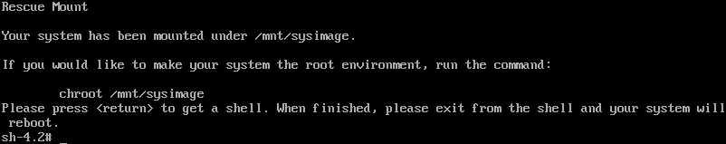
        
        * 进入初始系统后，执行修改 root 密码的命令 passwd
            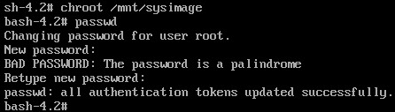
            
            * 执行完 chroot 命令之后，会发现原来的 sh-4.2 变成了 bash-4.2，这是因为环境变量发生了变化
            * 当然，救援模式并非只有改 root 密码这么简单的作用，还可以处理一些故障、修复数据等
            * 退出救援模式：先使用 Ctrl+D 退出原始系统，然后执行 `init 0` 关机命令
            * 最后再设置一遍BIOS，让硬盘第一个启动

## 3.3. 【访问其它宿主机里的虚拟主机】

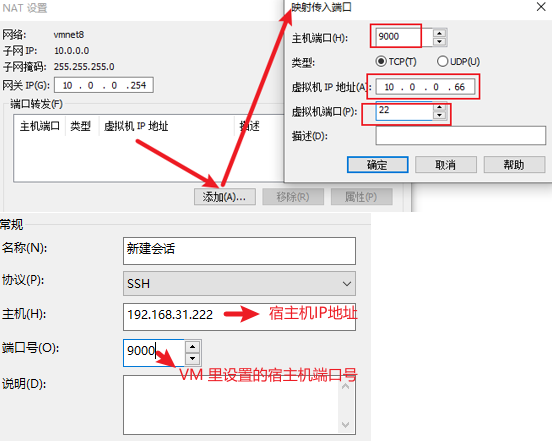  

