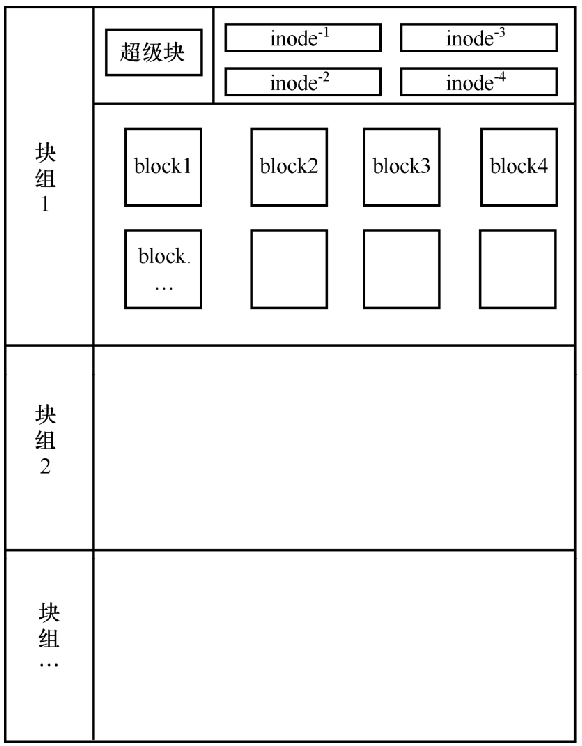
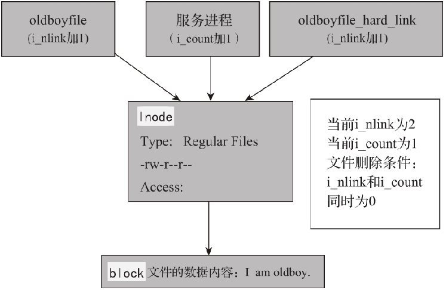
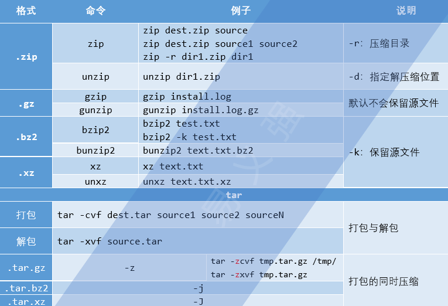

# 1. 【命令格式】

1. **命令提示符**：`[root@localhost ~]#`
    * `[]`：提示符的分隔符号，没有特殊含义
    * `root`：当前登录用户
    * `@`：分隔符号，没有特殊含义
    * `localhost`：简写主机名（完整主机名是 localhost.localdomain）
    * `~`：当前所在路径的最后一级目录，此例中所在的目录是家目录
    * `#`：对于超级用户，提示符就是 `#`；对于普通用户，提示符就是 `$`

2. **命令的基本格式**：`命令 [选项] [参数]`
    * 当有多个选项时，可以写在一起
    * 简化选项与完整选项：`-a` 等于 `--all`
    * 有些命令短选项可以不带 `-` ；通常称作 BSD 风格的选项
    * 长选项的参数通常需要 “=” 号：`--size=1G`
    * 指令太长时，可以使用 `\` 来使指令连续到下一行

# 2. 【文件与目录操作命令】

## 2.1. 【pwd】

* `pwd`：显示当前路径 `echo $PWD`
* `pwd -P`：显示真实路径，而非使用链接路径

## 2.2. 【cd】

1. **路径分隔符** 
    * **Unix/Linux**：正斜杠 `/`
    * **DOS**：反斜杠 `\`

2. **绝对路径 & 相对路径** 
    * **绝对路径**：从根路径 `/` 开始
    * **相对路径**：相对于当前目录的位置

3. **切换目录** 
    * `cd` 或 `cd ~`：回到当前用户家目录（由系统环境变量 HOME 进行定义）
    * `cd /`：切换到根目录
    * `cd .`：当前目录
    * `cd ..`：回到上一级目录
    * `cd ~用户名`：回到指定用户家目录
    * `cd -`：回到上次所在目录
    * `cd -P 目录`：如果切换的目标目录是一个软链接，则切换到软链接指向的真正物理目标目录

## 2.3. 【tree】

* `tree`：默认显示当前所在路径目录的目录结构
* `tree 目录`：显示指定目录的目录结构
* `tree -a 目录`：显示所有文件，包括隐藏文件（以 `.` 开头的文件）
* `tree -d 目录`：只显示目录
* `tree -L level 目录`：遍历目录的最大层数，level 为大于 0 的正整数
* `tree -F 目录`：在目录后面添加 `/`，以方便区分目录和文件

## 2.4. 【ls】

* `ls [选项] [文件名或目录名]`
    * `-a`：显示所有文件，包括隐藏文件
    * `-A`：显示所有文件，包括隐藏文件，但不包括 `.` 与 `..` 这两个目录
    * `-d`：仅列出目录本身
    * `-h`：人性化显示，按照我们习惯的单位显示文件大小
    * `-l`：显示文件详细信息
    * `-i`：显示文件的 i 节点号
    * `-R`：连同子目录内容一起列出
    * `-t`：依时间排序，而不是用文件名
    * `-r`：逆序排列
    * `--time-style=long-iso`：显示完整时间属性的参数
    * `--color=always/never/auto`：支持颜色输出
    * `-F`：在不同的文件结尾，输出不同的特殊符号
        > * 以 `/` 结尾的就是文件夹
        > * 以 `*` 结尾的就是可执行的文件
        > * 以 `@` 结尾的就是软连接
        > * 普通文件类型，结尾什么都没有
    
    * `-S`：按文件大小进行排序，默认是从大到小
    
```bash
[root@yyq-pc ~]# ll
-rw-------. 1 root root 1407 Oct 15 05:55 anaconda-ks.cfg

# 【第一列】
#     ↘ 【第1位】描述文件类型
#        - => 普通文件
#        b => 块设备文件。比如/dev/sda1
#        c => 字符设备文件。比如键盘、鼠标、打印机、终端
#        d => 目录文件
#        l => 符号链接（软链接）。类似于 Windows 中的快捷方式
#        p => 命名管道。管道是进程间的一种通信机制
#        s => 用于进程间通信的套接字
#
#     ↘ 【第2-10位】描述文件权限；每3个为一组，分别对应所属者、所属组、其他人
#     ↘ 【最后1位 “.”】“.” 表示这个文件受 SELinux 的安全规则管理，如果赋予了ACL权限将变为“+”
#
# 【第二列】硬链接个数
#    ↘ 对于目录而言，硬链接个数至少为2
#    ↘ 目录硬链接个数 = 目录自己 + 当前目录（`.`）+ 所有子目录的（`..`）
# 【第三列】文件的所属者
# 【第四列】文件所属者所在的用户组
# 【第五列】文件大小（默认以字节计）
# 【第六、七、八列】默认显示的是文件最后一次修改的时间（mtime）
# 【第九列】文件名
```

## 2.5. 【mkdir & touch & stat】

1. **mkdir**
    * `mkdir -p /tmp/Japan/boduo`：递归建立所需目录
    * `mkdir /tmp/Japan/longze /tmp/Japan/cangji`：创建多个目录

2. **touch**
    * **更改文件 时间戳 或 创建文件**：`touch [选项] 文件名`
        * `-a`：只更改指定文件的最后访问时间
        * `-d STRING`：使用字符串代表的时间作为模板设置指定文件的时间属性
        * `-m`：只更改指定文件的最后修改时间

    ```bash
    touch stu{01..05}             # 利用 “{}” 输出的字符序列批量创建文件
    touch -d 20201001 text.txt    # 指定创建文件后的文件修改时间
    ```

    * 在 Linux 中，一切皆文件。虽然 touch 命令不能创建目录，但是可以修改目录的时间戳
    * 每个文件都有三个时间，分别是访问时间（Access Time）、数据修改时间（Modify Time）和状态修改时间（Change Time）
    * 使用 touch 命令触摸文件，文件的三个时间都会改变
    * 在 Linux 中，文件没有创建时间

3. **stat**
    * **显示文件或文件系统的详细信息**：`stat [选项] 文件名或目录名`
        * `-f`：査看文件所在的文件系统信息，而不是査看文件的信息

    ```bash
    [root@yyq-pc ~]# stat anaconda-ks.cfg
    文件："anaconda-ks.cfg"
    大小：1380       块：8          IO 块：4096   普通文件
    设备：802h/2050d Inode：912136      硬链接：1
    权限：(0600/-rw-------)  Uid：(    0/    root)   Gid：(    0/    root)
    环境：system_u:object_r:admin_home_t:s0
    最近访问：2020-11-29 07:04:46.602963503 +0800
    最近更改：2020-11-29 07:04:46.604963503 +0800
    最近改动：2020-11-29 07:04:46.604963503 +0800
    创建时间：-
    ```
    
    * 在 CentOS 7.x 中，虽然出现了创建时间，但是这个时间不论怎么修改文件，都是“-”（空的），所以目前 Linux 依然无法记录文件的创建时间
    * **编辑文件内容**：数据修改时间 和 状态修改时间 会改变、而访问时间不变
    * **修改文件属性**：只有 状态修改时间 会改变
    * **访问文件信息**：只有 访问时间 会改变

## 2.6. 【cp & mv】

1. **复制文件和目录**：`cp [选项] 源文件 目标文件`
    * `-d`：如果源文件为软链接（对硬链接无效），则复制出的目标文件也为软链接
    * `-i`：如果目标文件已经存在，则会询问是否覆盖
    * `-l`：把目标文件建立为源文件的硬链接文件，而不是复制源文件
    * `-s`：把目标文件建立为源文件的软链接文件，而不是复制源文件
    * `-p`：复制后目标文件保留源文件的属性（包括所有者、所属组、权限和时间）
    * `-r`：递归复制，用于复制目录
    * `-a`：等同于上面的 p、d、r 这 3 个选项的功能总和 :pushpin:

    > * CentOS 系统默认为 cp 命令设置了别名，即增加了 `-i` 的参数
    > * 但是在 Shell 脚本中执行 cp 命令时，没有 `-i` 参数时并不会询问是否覆盖
    >     * 这是因为命令行和Shell脚本执行时的环境变量不同。不过在脚本中一般使用命令的全路径

2. **移动或重命名文件**：`mv [选项] 源文件 目标文件`
    * `-f`：如果目标文件已经存在，则不询问，直接强制覆盖
    * `-v`：显示详细信息

    > * **目标文件是目录，但该目录不存在**：会把源目录重命名为给定的目标文件名
    > * **目标文件是目录，且该目录存在**：会把源文件或目录移动到该目录中
    > * **目标文件是文件，且该文件不存在**：会把源文件重命名为给定的目标文件名
    > * **目标文件是文件，但该文件存在**：会询问是否覆盖

## 2.7. 【rm】

* **删除文件或目录**：`rm [选项] 文件或目录`
    * `-f`：强制删除（force）
    * `-i`：交互删除，在删除之前会询问用户
    * `-r`：用于删除目录，递归删除（recursive）

## 2.8. 【cat & tac & nl】

1. **查看文件**：`cat [选项] 文件名`
    * `-A`：相当于 `-vET` 选项的整合，用于列出所有隐藏符号
    * `-E`：列出每行结尾的回车符 `$`
    * `-n`：显示行号
    * `-T`：把 Tab 键 `^I` 显示出来
    * `-V`：列出特殊字符
    
    > **同时查看多个文件**：`cat 文件1 文件2`

2. **反向查看文件内容**：`tac`
3. **查看文件内容时添加行号**：`nl [选项] 文件`
    * `-b a`：不论是否为空行，都列出行号

## 2.9. 【more & less】

> * less 指令的功能与 more 指令类似，但是比 more 指令更加强大，支持各种显示终端
> * less 指令在显示文件内容时，并不是一次将整个文件加载之后才显示，而是根据显示需要加载内容，对于显示大型文件具有较高的效率

1. **分页显示文件内容**：`more/less [选项] 文件名`
    * `-i`：忽略搜索时的大小写
    * `-m`：显示类似 more 命令的百分比
    * `-N`：显示每行的行号

2. **常用交互命令**
    * `b / 空格键 / pagedown`：向下翻动一页
    * `pageup`：向上翻动一页
    * `d`：向后翻半页
    * `u`：向前滚动半页
    * `Enter`：滚动一行
    * `y`：向前滚动一行
    * `Ctrl+F`：向前移动一屏
    * `Ctrl+B`：向后移动一屏
    * `Ctrl+D`：向前移动半屏
    * `Ctrl+U`：向后移动半屏
    * `j`：向前移动一行
    * `k`：向后移动一行
    * `g`：跳转到首行
    * `G`：跳转到末行
    * `q / ZZ`：退出less命令
    * `/字符串`：向下搜索"字符串"的功能
    * `?字符串`：向上搜索"字符串"的功能
    * `n`：重复前一个搜索（与/或?有关）
    * `N`：反向重复前一个搜索（与/或?有关）
    * **标记导航**
        > * `ma`：使用a标记文本的当前位置
        > * `'a`：导航到标记 a 处

    * **其它有用的命令**
        > * `v`：使用配置的编辑器编辑当前文件
        > * `h`：显示 less 的帮助文档

3. **浏览多个文件**：`less log2013.log log2014.log`
    * 输入 `:n` 后，切换到 log2014.log
    * 输入 `:p` 后，切换到 log2013.log
    * 按 `:e` 查看下一个文件

## 2.10. 【head & tail】

1. **显示文件前面几行的内容**：`head [选项] 文件名`
    * `-n 行数`：指定显示行数，默认显示前 10 行 （`-n 5` <=> `-n5` <=> `-5`）
    * `-v`：显示文件名

2. **显示文件后面几行**：`tail [选项] 文件名`
    * `-n`：从文件末尾开始，显示指定行数
    * `-f`：follow；监听文件的新增内容

## 2.11. 【ln】

### 2.11.1. 【文件系统原理】
1. **Ext4 文件系统原理**
    

    * Ext4 文件系统会把整块硬盘分成多个块组（Block Group），块组主要分为以下三部分
        > 1. **超级块（Super Block）**：记录整个文件系统的信息，包括 block 与 inode 的总量、已经使用的 inode 和 block 的数量、未使用的 inode 和 block的数量、block 与 inode的大小、文件系统的挂载时间、最近一次的写入时间、最近一次的磁盘检验时间等
        > 2.  **i节点表（inode Table）**：inode的默认大小为 128 Byte，用来记录文件的权限（r、w、x）、文件的所有者和属组、文件的大小、文件的状态改变时间（ctime）、文件的最近一次读取时间（atime）、文件的最近一次修改时间（mtime）、文件的特殊权限（如 SUID、SGID等）、文件的数据真正保存的 block编号。每个文件需要占用一个 inode。inode 中是不记录文件名的，那是因为文件名是记录在文件上级目录的 block 中的
        > 3. **数据块（block）**：block的大小可以是 1KB、2KB、4KB，默认为 4KB。block用于实际的数据存储，如果一个 block放不下数据，则可以占用多个 block。例如，有一个 10KB的文件需要存储，则会占用 3个 block，虽然最后一个 block不能占满，但也不能再放入其他文件的数据。这 3个 block有可能是连续的，也有可能是分散的。目录的 block 中记录的是所有一级子文件和子目录的文件名及inode的对应

    * **查看每个分区 inode 的使用情况**：`df -i`
    * **查看每个分区 block 的使用情况**：`df`

2. **XFS 文件系统原理**
    * XFS 文件系统是一种高性能的日志文件系统，在格式化速度上远超 Ext4 文件系统
    * XFS 理论上可以支持最大 18EB 的单个分区，9EB的最大单个文件，这都远远超过 Ext4 文件系统
    * XFS 文件系统主要分为三个部分
        1. **数据区**（Data section）
            * 在数据区中，可以划分多个分配区群组（Allocation Groups），这个分配区群组可以看成 Ext4 文件系统中的块组
            * 在分配区群组中也划分为超级块、i节点、数据块，数据的存储方式也和 Ext4 类似
        2. **文件系统活动登录区**（Log section）
            * 文件的改变会在这里记录下来，直到相关的变化记录在硬盘分区中之后，这个记录才会被结束
            * 那么如果文件系统由于特殊原因损坏，可以依赖文件系统活动登录区中的数据修复文件系统
        3. **实时运行区**（Realtime section）
            * 不建议更改，有可能会影响硬盘的性能

### 2.11.2. 【软链接与硬链接】
* **创建链接文件**：`ln [选项] 源文件 目标文件`
    * `-s`：建立软链接文件。默认建立硬链接文件
    * `-f`：强制。如果目标文件已经存在，则删除目标文件后再建立链接文件

    > * **注意事项**：软链接文件的源文件必须写成绝对路径，而不能写成相对路径（硬链接无此要求）
    > * **硬链接文件**
    >     * 修改文件（源文件或硬链接文件），另一个文件中的数据也会发生改变
    >     * 删除文件（源文件或硬链接文件），另一个文件依然可以被访问
    >     * 源文件和硬链接文件的 inode 号相同
    >     * 不能跨文件系统（分区）。因为在不同的文件系统中，inode 号是重新计算的
    >     * 不能链接目录
    >     * 文件硬链接数为 0 时，表示数据真正删除了
    > * **软链接文件**
    >     * 软链接和源文件的 inode 号不同
    >     * 软链接通过 `->` 明显地标识出源文件的位置
    >     * 在软链接的权限位 `lrwxrwxrwx` 中， `l` 就代表软链接文件
    >     * 修改源文件或软链接文件，另一文件中的数据也会发生改变
    >     * 删除软链接文件，源文件不受影响
    >     * 删除源文件，软链接文件将找不到实际的数据，从而显示文件不存在
    >     * 软链接可以链接目录，也可以跨分区
    >     * 软链接会新建自己的 inode 信息和 block，只是在 block 中不存储实际文件数据，而存储的是源文件的文件名及 inode号

### 2.11.3. 【查找文件所经过的步骤】

* **当我们查找一个文件，比如 /root/test 时，要经过以下步骤**
    1. 首先找到根目录的 inode（根目录的 inode是系统已知的，inode号是 2），然后判断用户是否有权限访问根目录的 block
    2. 如果有权限，则可以在根目录的 block 中访问到 /root 的文件名及对应的 inode 号
    3. 通过 /root 目录的 inode号，可以查找到 /root 目录的 inode 信息，接着判断用户是否有权限访问 /root 目录的 block
    4. 如果有权限，则可以从 /root 目录的 block 中读取到 test 文件的文件名及对应的 inode 号
    5. 通过 test 文件的 inode 号，就可以找到 test 文件的 inode 信息，接着判断用户是否有权限访问 test 文件的 block
    6. 如果有权限，则可以读取 block 中的数据，这样就完成了 /root/test 文件的读取与访问

### 2.11.4. 【Linux 系统文件删除原理】

1. **从 ext 文件系统的角度描述文件删除的原理**
    > * Linux 系统上的文件名是存储在父目录的 Block 里面的，并指向了这个文件的 Inode 节点，这个文件的 Inode 节点再标记指向存放这个文件的 Block 的数据块
    > * 删除一个文件时，实际上并不会清除 Inode 节点和 Block 的数据。只是在这个文件的父目录中的 Block 里，删除这个文件的名字，从而使这个文件名消失，并且无法指向这个文件的 Inode 节点
    > * 当没有文件名指向这个 Inode 节点的时候，释放 Inode 节点和存放这个文件数据的 Block 块会同时进行，并且会更新 Inode MAP 和 Block MAP，以便让这些位置用于放置其他文件数据

2. **从文件引用的角度深入描述文件删除的原理**
    * Linux 系统是通过 Link 的数量来控制文件是否被删除的，只有当一个文件不存在任何 Link 的时候，这个文件才会被删除
    * 一般来说，每个文件都有 2 个 Link 计数器，既 i_count 和 i_nlink
        > * i_nlink 就是文件硬链接的数量，可以理解为磁盘的引用计数器
        > * i_count 就是当前文件使用者（例如，被进程调用）的数量，可以理解为内存的引用计数器
        > * 当为文件创建硬链接的时候，对应 i_nlink 的数量就会增加，而当一个文件被某个进程调用时，对应 i_count 的数量就会增加
        > * 通过 rm 删除命令删除文件，实际上就是减少文件的磁盘引用计数 i_nlink 的数量

    * 【问题1】如果一个文件正在被某个进程调用，而用户却执行 rm 操作将文件删除了，那么会出现什么结果呢？
        > * 在用户执行 rm 操作删除文件之后，再执行 ls 或者其他文件管理命令，将会无法再找到这个文件，但是调用这个被删除文件的进程却在继续正常执行，依然能够从文件中正确地读取及写入内容。这又是为什么呢？

        * 这是因为 rm 操作只是将文件的 i_nlink 数减少了，如果没其他的链接，i_nlink 就为 0 了
        * 但由于该文件依然在被进程引用，因此，此时文件对应的 i_count 数并不为0
        * 所以即使执行了 rm 操作，但系统并没有真正删除这个文件，因此该文件还会占用磁盘空间
        * 只有当 i_nlink 及 i_count 都为 0 的时候，这个文件才会真正被删除，也就是说，还需要解除该进程对该文件的调用，被 rm 删除的文件才会真正被删除

    * 【问题2】当文件没有被调用时，执行 rm 操作删除文件后是否还可以找回被删的文件呢？
        
        > * rm 操作只是将文件的 i_nlink 减少了，或者说置 0 了，实际就是将文件名到 Inode 的链接删除了，此时，并没有删除文件的实体即 Block 数据块，如果及时停止机器工作，数据还是可以找回的，但如果此时继续写入数据，那么新的数据可能就会被分配到被删除数据的 Block 数据块了，此时，文件就是被真正地回收了，那时就是神仙也没有办法了
    
3. **Linux文件删除原理的基本示意图**
    

## 2.12. 【rename】

> * 批量改变文件名

```bash
# 【格式】rename 文件名称需要修改的部分信息 修改成什么信息 将什么样的文件进行修改
# 更改扩展名：jpg -> txt
rename .jpg .txt yyq*.jpg
```

## 2.13. 【basename & dirname】

* **取得路径的文件名称与目录名称**
    * `basename /etc/sysconfig/network` ：network
    * `dirname  /etc/sysconfig/network` ：/etc/sysconfig

## 2.14. 【dos2unix & unix2dos】

* **DOS 与 UNIX之间文本的相互转换**：`dos2unix/unix2dos 文本文件`
    * `DOS` ：文本以 `\r\n` 作为断行标志 (行尾显示 `^M$`)
    * `Unix` ：文本以 `\n` 作为断行标志 (行尾显示 `$`)

## 2.15. 【expand & unexpand】

* **tab与空白之间的相互转换**：`expand/unexpand [-t 数字] 文件`
    * `expand` ：将 tab 按键转成空白键
    * `unexpand` ：将空白转成 tab

## 2.16. 【diff & vimdiff】

> * 比较文件的差异

```bash
diff file1 file2
diff -u file1 file2
vimdiff file1 file2
```

# 3. 【帮助与查找命令】

## 3.1. 【man】

> * 获取命令、配置文件、系统调用、库函数等的帮助信息

1. **man 命令的帮助级别**
    * 1  => 用户命令相关
    * 2  => 系统调用相关
    * 3  => C的库函数相关
    * 4  => 设备和特殊文件相关
    * 5  => 文件的格式和规则（配置文件）
    * 6  => 游戏及其他
    * 7  => 宏、包及其他杂项
    * 8  => 系统管理员命令和进程
    * 9  => 内核的帮助

    > * `man ls`   # LS(1)       User Commands       LS(1)
    >     * 这里 (1) 就表示这是 ls 的 1 级别的帮助信息

2. **查看配置文件的帮助信息**

    ```
    man services   # 配置文件，不用输入文件的绝对路径
    man passwd     # 默认查找到的是 passwd 命令的文档

        whereis passwd
            passwd: /usr/bin/passwd /etc/passwd /usr/share/man/man5/passwd.5.gz /usr/share/man/man1/passwd.1.gz
            ■ 1 => 命令的帮助   5 => 配置文件的帮助

        whatis passwd
            sslpasswd (1ssl)     - compute password hashes
            passwd (1)           - update user's authentication tokens
            passwd (5)           - password file

    man 1 passwd   # 查看 passwd 命令的帮助信息
    man 5 passwd   # 查看 passwd 配置文件信息
    ```

3.  `whatis`  <=>  `man -f`：查看命令拥有哪个级别的帮助

4.  `apropos` <=> `man -k`

    * 可查看命令名中包含指定字符串的所有相关命令的帮助
    * `man -k ls`：会发现输出内容会多出几页，那是因为很多命令中都包含 `ls` 这个关键字
    * 这条命令适合只记得命令的几个字符，用来查找相关命令的情况

---

* **问题**：`man 5 passwd` => 显示： No manual entry for passwd in section 5
    * **解决**：`yum install -y man-pages`

## 3.2. 【help】

1. **获取Shell内置命令的帮助信息**：`help 内置命令`
2. **列出所有Shell内置命令**：`man help`
3. **获取命令的选项信息**：`命令 --help`

## 3.3. 【whatis】

* **査看命令拥有哪个级别的帮助**：`whatis 命令`
    * `whatis`：是根据数据库执行查找操作的，这个数据库是定期更新的，新安装的系统，系统还未自动更新
    * `mandb`：手动更新；旧版的Linux使用的是 makewhatis 指令

## 3.4. 【whereis】

* 搜索命令所在目录及帮助文档路径
* 不能搜索普通文件，只能搜索系统命令
* 通过预先生成的一个文件列表库查找与给出的文件名相关的文件
* **格式**：`whereis [选项] 命令`
    * `-b`：只查找二进制文件
    * `-m`：只查找帮助文件
    * `-s`：只查找源代码文件
    * `-l`：列出 whereis 会去查询的几个主要目录

## 3.5. 【which】

* **搜索命令所在目录及别名信息**：`which 命令`
    * which 默认是找 PATH 内所规范的目录，且对应的命令文件必须要有执行权限

## 3.6. 【locate】

* `whereis` 和 `which` 只能搜索系统命令，而 `locate` 命令还可按照文件名搜索普通文件
* `locate` 命令只能按照文件名来搜索文件，不能执行更复杂的搜索（如按权限、大小等搜索）
* `locate` 命令的优势是搜索速度快，耗费系统资源小
* `locate` 命令不会直接搜索硬盘空间，而会先建立 locate 数据库，然后在数据库中按照文件名进行搜索
* `locate` 命令的数据库：`/var/lib/mlocate/mlocate.db`
* 默认情况下，这个数据库每周更新一次。可到文件 `/etc/updatedb.conf` 中配置这个数据库生成（或更新）的规则
* 只要包含要搜索的关键词，都会列出来，所以 locate 不适合精准搜索
* 手动更新数据库：`updatedb`

1. `locate [选项] 文件名`
    * `-i`：忽略大小写
    * `-r`：使用正则表达式

2. 配置文件：`/etc/updatedb.conf`
    ```
    PRUNE_BIND_MOUNTS = "yes"
    # 开启搜索机制，也就是让这个配置文件生效

    PRUNEFS = "9p afs anonjnodefs auto autofs bdev binfmt_misc cgroup cifs coda
    configfs cpuset debugfs devpts ecryptfs exofe fuse fusectl gfs gfe2 hugetlbfs
    inotifyfs iso9660 jffs2 lustre mqueue ncpfs nfe nfs4 nfsd pipefe proc ramfs rootfs
    rpc_pipefs securityfs selinuxfs sfs sockfs sysfs tmpfs ubifs udf usbfs"
    # 在local执行搜索时，禁止搜索这些文件系统类型

    PRUNENAMES = ".git.hg.svn"
    # 在locate执行搜索时，禁止搜索带有这些扩展名的文件

    PRUNEPATHS = "/afs /media /net /sfs /tmp /udev /var/cache/ccache /var/spod/cups /var/spool/squid /var/tmp"
    # 在locat执行搜索时，禁止搜索这些系统目录
    ```

## 3.7. 【find】

* 是在硬盘中进行搜索，会消耗较大的系统资源，导致服务器压力过大
* 使用 find 命令搜索时，不要指定过大的搜索范围
* find 命令使用完全匹配模式，必须和搜索关键字一模一样才会列出

### 3.7.1. 【找出来输出到屏幕】

> **格式**：`find 搜索路径 [选项] 搜索内容`

1. **根据文件名查找**
    * `find /etc -name init`
    * `find /etc -iname init`：不区分文件名大小
    * `find /etc -type f -name "*eth0"`：模糊查找

2. **根据i节点查找**：`find . -inum 262147`

3. **根据文件大小查找**
    * `find / -size +204800`：在 根目录 中查找 大于 100MB 的文件
    * `find / -size -204800`：在 根目录 中查找 小于 100MB 的文件
    * `find / -size =204800`：在 根目录 中查找 等于 100MB 的文件
    * `find . -size 25M`：按照MB搜索

    > * 如果单位为 b 或不写单位，则按照 512Byte 搜索
    > * 按照字节搜索，必须是小写的 `c`
    > * 按照 KB 单位搜索，必须是小写的 `k`
    > * 按照 MB 单位搜索，必须是大写的 `M`
    > * 按照 GB 单位搜索，必须是大写的 `G`

4. **根据时间查找**
    * `find . -type f -mtime -7`：搜索最近七天内被修改过的所有文件
    * `find . -type f -mtime 7`：搜索恰好在七天前被修改过的所有文件
    * `find . -type f -mtime +7`：搜索超过七天内被修改过的所有文件

    > * atime 、 mtime 、 ctime：以 天 为单位
    > * amin 、 mmin 、 cmin：以 分钟 为单位

5. **根据目录指定层级进行查找数据**（进行递归查找）

    ```bash
    find /oldboy -type f -name "Oldboy*"
        /oldboy/oldboy01/Oldboy.txt
        /oldboy/Oldboy.txt

    find /oldboy -maxdepth 1 -type f -name "Oldboy*"
        /oldboy/Oldboy.txt

    find /oldboy -maxdepth 2 -type f -name "Oldboy*"
        /oldboy/oldboy01/Oldboy.txt
        /oldboy/Oldboy.txt
    ```

6. **根据所有者和所属组查找**
    * `-uid 用户ID`：按照用户ID査找所有者是指定ID的文件
    * `-gid 组ID`：按照用户组ID査找所属组是指定ID的文件
    * `-user 用户名`：按照用户名査找所有者是指定用户的文件
    * `-group 组名`：按照组名査找所属组是指定用户组的文件
    * `-nouser`：査找没有所有者的文件
        > * 主要用于查找垃圾文件。在Linux中，所有的文件都有所有者，只有一种情况例外，那就是外来文件
        > * 比如光盘和U盘中的文件如果是由 Windows 复制的，在 Linux 中查看就是没有所有者的文件
        > * 再比如手工源码包安装的文件，也有可能没有所有者
        > * 除这种外来文件外，如果系统中发现了没有所有者的文件，一般都是没有作用的垃圾文件（比如用户删除之后遗留的文件），这时需要手工处理

7. **按照权限搜索**
    * `-perm 权限模式`：查找文件权限刚好等于“权限模式”的文件
    * `-perm -权限模式`：查找文件权限全部包含“权限模式”的文件
    * `-perm +权限模式`：查找文件权限包含“权限模式”的任意一个权限的文件

    ```bash
    find . -type f -perm 644
    ```

8. **根据文件类型查找**
    * `-type d`：查找目录
    * `-type f`：查找普通文件
    * `-type l`：查找软链接文件

9. **逻辑运算符**
    * `-a`：and逻辑与
    * `-o`：or逻辑或
    * `-not`：not逻辑非

    > * `find . -size +2k -a -type f`
    > * `find . -not -name cangls`

### 3.7.2. 【找出来执行命令】

> **格式**：`find 路径 选项 关键字 动作`

| 常见动作 |                    说明                    |
| :------: | :---------------------------------------: |
|  -exec   |  对查找到的文件直接执行该参数后的 shell 命令  |
|   -ok    | 对查找到的文件询问式执行该参数后的 shell 命令 |
| -delete  |              删除查找到的文件               |
|   -ls    |          列出查找到的文件，详细信息          |
|  -print  |        打印出查找到的文件（默认选项）         |

```bash
# 1. 演示：-exec 和 -ok
find /etc -name inittab -exec ls -l {} \;
    # -exec 或者 -ok 后面写完命令必须以空格反斜杠\;结尾（ \;）
    # {} 表示 find 命令所找出来的内容


# 2. 删除所有的以 “.txt” 结尾的文件【3种方法】
find . -type f -name "*txt" -delete
find . -type f -name "*txt" -exec rm -rf {} \;
find . -type f -name "*txt" | xargs rm -rf


# 3. 将某目录中的以 “.txt” 结尾的文件，统一进行压缩处理【2种方法】
find . -type f -name "*txt" | xargs tar -zcvf test.tar.gz
tar -tvf test.tar.gz

tar -zcvf test.tar.gz $(find . -type f -name "*.txt")
tar -tf test.tar.gz

# 4. 将某目录中的以 “.txt” 结尾的文件，统一复制到某目录
find . -type f -name "*.txt"
    ./1.txt
    ./2.txt
    ./3.txt

find . -type f -name "*.txt" | xargs
    ./1.txt ./2.txt ./3.txt

find . -type f -name "*.txt" | xargs cp /root
# 报错，此时 /root 是源目录，并不是目标目录

#【解决方法1】
find . -type f -name "*.txt" | xargs -i cp {}  /root
# 通过 -i 将查找出的文件放在大括号所在位置

#【解决方法2】
find . -type f -name "*.txt" | xargs cp -t /root
# 通过 -t 指定目标目录
# 通过 -exec 方式时也是通过这种方式解决
```

# 4. 【压缩和解压缩命令】



1. **归档**
    * 默认情况下，Linux 的压缩概念一次只能压缩一个文件。针对多文件或文件夹无法进行直接压缩
    * 归档也称为打包，指的是对多个文件或文件夹进行打包，没有经过压缩
    * 常用归档命令有 2 个，分别是 `tar` 和 `dd`

2. **压缩**
    * 利用算法对文件进行处理，最大限度的保留文件信息，达到让文件体积变小的目的
    * 基本原理：通过查找文件内的重复字节，建立一个相同字节的词典文件，并用一个代码表示
    * 无损压缩：指的是压缩数据必须准确无误
    * 有损压缩：广泛应用于动画、声音和图像文件中
    * 常用的压缩命令有很多，比如 `gzip`、`zip`、`bzip2` 等

## 4.1. 【tar】

1. **打包**：`tar -cvf dest.tar source1 source2 sourceN`

2. **解打包**
    * `tar -xvf source.tar`：解打包到当前目录下
    * `tar -xvf source.tar -C /tmp`：解打包到/tmp/目录下
    * `tar -tvf source.tar`：查看文件包中有哪些文件

3. **打包的同时压缩**
    * `-z` => 压缩和解压缩 `.tar.gz` 格式
    * `-j` => 压缩和解压缩 `.tar.bz2` 格式
    * `-J` => 压缩和解压缩 `.tar.xz` 格式

```bash
tar -zcvf tmp.tar.gz /tmp/
tar -zxvf tmp.tar.gz

tar -jcvf tmp.tar.bz2 /tmp/
tar -jxvf tmp.tar.bz2

tar -Jcvf workspace.tar.xz workspace
tar -Jxvf workspace.tar.xz
```

4. **tar 命令所有选项**
    * `-c`：创建 tar 包（打包）
    * `-x`：解压
    * `-v`：显示详细信息
    * `-f`：指定包名
    * `-z`：调用 gzip 工具压缩
    * `-j`：调用 bzip2 工具压缩
    * `-J`：调用 xz 工具压缩
    * `-C`：指定解压路径
    * `-t`：列出或查看tar包内容
    * `-r`：往 tar 包里追加文件
    * `-k`：保留原有文件不覆盖
    * `--exclude=PATTERN`：排除指定的文件后进行压缩
    * `--exclude-from=FILE`：根据文件里的内容排除要进行压缩的文件

    > 1. 以上选项前面的横杠 "-" 可以省略
    > 2. 如果已经将文件压缩打包，那么就不能追加；如果只是打包就可以追加
    > 3. 参数顺序需要注意，最好把 `-f` 参数放到所有参数后面
    > 4. 当出现以下提示时，加一个大 P 参数解决
    >     * `tar: Removing leading '/' from member names`

## 4.2. 【zip & unzip】

1. **zip**
    * `zip dest.zip source`
    * `zip dest.zip source1 source2`：所有的压缩命令都可以同时压缩多个文件
    * `zip -r dir1.zip dir1`：压缩目录（-r）

2. **unzip**
    * `unzip dir1.zip`：不论是文件压缩包，还是目录压缩包，都可以直接解压缩
    * `unzip -d /tmp/ ana.zip`：指定解压缩位置（-d）

## 4.3. 【gzip & gunzip】
* `gzip [选项] 源文件选项`
    * `-c`：将压缩数据输出到标准输出中，可以用于保留源文件
    * `-d`：解压缩  `gzip-d 压缩包`  <=>  `gunzip 压缩包`
    * `-r`：把目录下所有的子文件分别压缩
    * `-v`：显示压缩文件的信息
    * `-数字`：用于指定压缩等级，-1压缩等级最低，压缩比最差；-9压缩比最高。默认压缩比是-6

------

1. **压缩文件**：`gzip`
    * `gzip install.log`：不需要指定压缩之后的压缩包名
    * `gzip -c anaconda-ks.cfg > anaconda-ks.cfg.gz`：保留源文件压缩
        * 在 Linux 中，打包 和 压缩是分开处理的。而 gzip 命令只会压缩，不能打包

2. **解压缩文件**：`gunzip`
    * `gunzip install.log.gz`

3. **在不解压缩的情况下查看这个文本文件中的内容**：`zcat anaconda-ks.cfg.gz`

## 4.4. 【bzip2 & bunzip2】
1. **bzip2**
    * `bzip2 test.txt`
    * `bzip2 -k test.txt`：压缩的同时保留源文件

2. **bunzip2**
    * `bunzip2 text.txt.bz2`
    * `bunzip2 -k text.txt.bz2`：保留源文件
    * `bzcat install.log.syslog.bz2`：不解压缩直接查看纯文本文件

## 4.5. 【xz & unxz】
* `xz text.txt` => -k：保留源文件
* `unxz text.txt.xz`
* **查看压缩文件对应原文件的内容**：`xzcat / xzmore / xzless / xzgrep`

# 5. 【网络命令】
## 5.1. 【ping】

* 向网络主机发送 ICMP 请求，测试网络中主机的通信情况   `ping [选项] IP`
    * `-b`  后面加入广播地址，用于对整个网段进行探测
    * `-c 次数`   用于指定 ping 的次数
    * `-s 字节`   指定探测包的大小

* `ping -b -c 3 192.168.103.255`   # 探测192.168.103.0/24网段中有多少可以通信的主机

## 5.2. 【netstat & ss】
1. **netstat**：网络状态查看命令
    * `-a`：列出所有网络状态
    * `-c 秒数`：指定每隔几秒刷新一次网络状态
    * `-n`：使用 IP 地址和端口号显示，不使用域名与服务名
    * `-p`：显示 PID 和 程序名
    * `-t`：只显示 TCP
    * `-u`：只显示 UDP
    * `-l`：仅显示连接状态为 "LISTEN" 的服务的网络状态
    * `-r`：显示路由表

    1. **查看本机开启的端口**：`netstat -tuln`
    2. **查看本机有哪些程序开启的端口**：`netstat -tulnp`
    3. **查看所有连接**：`netstat -an`

2. **ss**
    * CentOS 7.x 默认没有安装 netstat 命令，而是通过 ss 命令取代了 netstat 命令
    * ss 命令的选项
        * `-a`：列出所有网络状态，包括 Socket 程序
        * `-l`：显示监听套接字
        * `-n`：使用 IP 地址和端口号显示，不使用域名与服务名
        * `-p`：显示 PID 和程序名
        * `-t`：显示 TCP 端口的连接状态
        * `-u`：显示 UDP 端口的连接状态

## 5.3. 【ip address】

```bash
# 查看IP地址
ip a
ip addr
ip address
ip address show
ifconfig
hostname -I
hostname -i

# 查看指定网卡信息
ip a show eth0
ip a s eth0

# 关闭/启用 ens33 网卡
ifdown ens33
ifup  ens33

# 查看路由信息表（获取网关等信息）
ip route
```

## 5.4. 【write】

* **向其他用户发送信息**：`write 用户名 [终端号]`

```bash
write user1 pts/1
# 向在 pts/1（远程终端1）登录的 user1 用户发送信息
# 使用 "Ctrl+D" 保存发送的数据
# 执行该指令后，发送的信息会打断对方原本的工作
# 若用户不想接受任何消息，可执行 “mesg n”
# mesg 指令用于设置是否让其他用户向本终端发信息
mesg   # 查看 mesg 的状态
mesg n # 禁止向当前终端写信息
mesg y # 允许向当前终端写信息
# mesg 指令对 root 传送来的消息没有抵挡的能力
```

## 5.5. 【mail】

1. **发送和接收电子邮件**：`mail -s "邮件标题" username@localhost`
    > 如果是寄给本机上的使用者，那 “@localhost” 可不用写

2. **发送邮件**
    * **方式1**：`mail -s "您有新的消息，请注意查收！" root`
        > 结束需要另起一行输入一个点 "." 再按回车键以结束输入

    * **方式2**：`mail -s "nice to meet you" root < filename`
    
3. **查收邮件**

    ```bash
    [yyq@yyq-pc ~]$ mail
    **************
    "/var/spool/mail/root": 1 message 1 new
    >N 1 root Mon Jun 26 09:11 18/607 "test"
    未读 邮件序列号 发信者 发信的时间 发信的标题
    ***************
    >> help  # 查看支持的命令格式
    >> 1     # 输入邮件序列号，查看对应邮件
    >> h     # 查看邮件列表
    >> d 1   # 删除序列号为1的邮件
    >> q     # 退出
    ```
    
## 5.6. 【wall】

> * **发送广播信息**：`wall 信息`

## 5.7. 【rz & sz】

```bash
# 安装 lrzsz 软件包
yum -y install lrzsz

# 上传
rz
# 下载
sz 需要下载文件的路径
```

## 5.8. 【wget & curl】

1. **wget**

    ```bash
    # 使用 wget 下载单个文件
    wget http://www.yiyiqiang.com/testfile.zip

    # 下载并以不同的文件名保存：
    wget -O test.zip http://www.yiyiqiang.com/testfile.zip

    # 使用 wget 后台下载
    wget -b http://www.yiyiqiang.com/testfile.zip

    # 使用 wget 断点续传
    wget -c http://www.yiyiqiang.com/testfile.zip
    ```

2. **curl**
    
    ```bash
    # 不带有任何参数时，curl 就是发出 GET 请求
    # 服务器返回的内容会在命令行输出
    curl https://www.baidu.com

    # 【-i】显示 HTTP 响应头
    curl -i https://www.example.com
    
    # 【-o】将服务器的响应保存成文件，并指定文件名
    # 将 www.example.com 保存成 example.html
    curl -o example.html https://www.example.com
    
    # 【-O】将服务器的响应保存成文件，并将 URL 的最后部分当作文件名
    # 将服务器响应保存成文件，文件名为 bar.html
    curl -O https://www.example.com/foo/bar.html
    ```

## 5.9. 【nmap】

```bash
# 端口扫描
nmap [-sT] www.baidu.com  # 扫描 www.baidu.com 开放的TCP端口，-sT 可省略
nmap [-sU] www.baidu.com  # 扫描所有开放的 UDP 端口
nmap -F www.baidu.com     # 加速扫描，时间较短
nmap -O 192.168.137.88    # 扫描主机操作系统版本
nmap -sN IP地址或域名      # 扫描防火墙安全漏洞
```

## 5.10. 【traceroute】

> * 显示数据包到主机间的路径：`traceroute 域名/IP地址`

## 5.11. 【】
