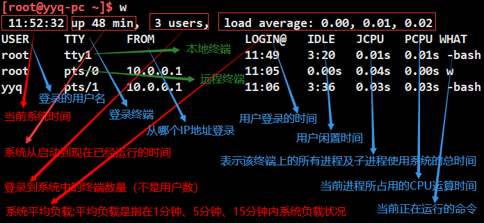

# 1. 【用户和用户组管理】

## 1.1. 【相关配置文件】

### 1.1.1. `/etc/passwd`

* 用户信息文件，查看 passwd 配置文件的说明：`man 5 passwd`
* `root:x:0:0:root:/root:/bin/bash`
    * 【字段1】用户名称
    * 【字段2】密码标志（真实密码位于 `/etc/shadow` 中）
        > * "x" 代表用户是拥有密码的
        > * 删除了密码标志 "x"，那么系统会认为这个用户没有密码

    * 【字段3】UID
        > * `0`：超级用户（UID为0的用户是超级用户）
        > * `1-999`：虚拟用户（不能登录系统/没有家目录）
        > * `1000+`：普通用户（可登录系统/有家目录）

    * 【字段4】GID（用户初始组id）
        > * 【初始组】只能有一个，一般初始组的名称与用户的用户名称相同
        > * 【附加组】指用户可以加入多个其他的用户组，并拥有些这些组的权限，附加组可以有多个

    * 【字段5】用户说明
    * 【字段6】家目录
    * 【字段7】登陆之后的 shell
        > * `/sbin/nologin`：禁止登录

### 1.1.2. `/etc/shadow`
* `root:经过加密的密码::0:99999:7:::`
    * 【字段1】用户名

    * 【字段2】加密密码
        > * 采用 SHA512 散列加密算法
        > * 如果密码位是 `!!` 或 `*` 代表没有密码，不能登录
        > * 可通过在密码前加上 `!` 或 `*` 以改变密码的长度，来达到让密码“暂时失效”的效果

    * 【字段3】上次更改密码的日期
        > * 这个数字以 1970年1月1日 和 上次更改密码的日期 为 基准 计算而来

    * 【字段4】要过多少天才可以更改密码（和字段3相比）
        > * 默认是0，即不受限制
        > * 如果是10，则代表密码修改后 10 天之内不能再次修改这个密码

    * 【字段5】密码的有效期（和字段3相比）
        > * 如 90，表示 90 天要换密码
        > * 默认是 99999，可以理解为永远不需要改

    * 【字段6】密码到期前的警告期限（和字段5相比）
        > * 默认值是7，即从密码到期前的7天开始，每次登录系统都会警告该用户修改密码

    * 【字段7】密码有效期过后的宽限天数（和字段5相比）
        > * 天数如果是 10，则代表密码过期 10天 后失效
        > * 如果是 0，则代表密码过期后立即失效
        > * 如果是 -1，则代表密码永远不会失效

    * 【字段8】账号失效时间
        > * 失效后，就算密码没有过期，用户也无法使用了
        > * 跟第3个字段一样，这个周期是按距离1970年1月1日多少天算的

    * 【字段9】保留

### 1.1.3. `/etc/group`

* **记录着 GID 和 组名的对应关系**
    * 【字段1】组名
    * 【字段2】组密码标志（密码位于 `/etc/gshadow`）
    * 【字段3】GID
    * 【字段4】组中附加用户
        * 如果该用户组是这个用户的初始组，则该用户不会写入这个字段

### 1.1.4. `/etc/gshadow`

* **组密码文件**
    * 【字段1】组名
    * 【字段2】组密码
    * 【字段3】组管理员用户名
    * 【字段4】组中附加用户

## 1.2. 【用户相关命令】
### 1.2.1. 【创建用户】

1. **格式**：`useradd [选项] 用户名`
    * `-u UID`：指定 UID 号，CentOS6 从 500 开始，CentOS7 中从 1000 开始
    * `-d 家目录`：指定用户家目录
    * `-c 用户说明`：指定用户的说明
    * `-g 组名`：指定用户初始组，后面可以跟组id，也可以跟组名
    * `-G 组名`：指定用户附加组（多个组用逗号分隔）
    * `-s shell`：指定用户登录的 shell。默认是 `/bin/bash`
    * `-M`：不创建家目录，用于创建虚拟用户

    ```bash
    useradd lamp

    useradd wamp -M -s /sbin/nologin   # 创建虚拟用户
    # passwd 文件中虚拟用户的家目录字段是一个假象，该目录实际上是不存在的
    ```

2. **useradd 命令的工作原理**

    1. **useradd 命令的工作原理**
        > * 当不带任何参数使用 useradd 命令添加用户时，首先会读取配置文件 `/etc/login.defs` 和 `/etc/default/useradd` 中预先定义的规则，并根据设置的规则添加用户
        > * 同时还会向 `/etc/passwd` 和 `/etc/group` 文件内添加新建的用户和用户组记录。当然，`/etc/shadow` 和 `/etc/gshadow` 也会同步生成记录
        > * 同时系统还会根据 `/etc/default/useradd` 及 `/etc/login.defs` 文件中配置的信息建立用户的家目录，并复制 `/etc/skel` 中所有隐藏的环境配置文件到新用户的家目录中，以完成对用户环境的初始化设置

    2. **与创建用户相关的文件：/etc/login.defs**
        ```bash
        ...
        MAIL_DIR        /var/spool/mail
        
        PASS_MAX_DAYS   99999
        PASS_MIN_DAYS   0
        PASS_MIN_LEN    5
        PASS_WARN_AGE   7
        
        UID_MIN                  1000
        UID_MAX                 60000
        SYS_UID_MIN               201
        SYS_UID_MAX               999
        
        GID_MIN                  1000
        GID_MAX                 60000
        SYS_GID_MIN               201
        SYS_GID_MAX               999
        
        CREATE_HOME     yes
        UMASK           077
        USERGROUPS_ENAB yes
        ENCRYPT_METHOD SHA512
        ...
        ```

    3. **与创建用户相关的文件：/etc/default/useradd**
        ```bash
        GROUP=100
        HOME=/home
        INACTIVE=-1
        EXPIRE=
        SHELL=/bin/bash
        SKEL=/etc/skel
        CREATE_MAIL_SPOOL=yes
        ```

    4. **与创建用户相关的目录：/etc/skel**
        > * 用来存放新用户需要的所有基础环境变量文件的目录，当添加新用户时，这个目录下的所有文件都会被自动复制到新添加的用户的家目录下
        > * 默认情况下，`/etc/skel` 目录下的所有文件都是隐藏文件（以点号开头的文件）
        > * 通过修改、添加、删除 `/etc/skel` 目录下的环境变量文件，可为新创建的用户提供统一的、标准的、定制化的初始化用户环境

        ```bash
        [root@yyq-pc ~]$ ls -la /etc/skel/
        total 24
        drwxr-xr-x.  2 root root   62 Oct 15 05:49 .
        drwxr-xr-x. 76 root root 8192 Nov 22 17:50 ..
        -rw-r--r--.  1 root root   18 Apr  1  2020 .bash_logout
        -rw-r--r--.  1 root root  193 Apr  1  2020 .bash_profile
        -rw-r--r--.  1 root root  231 Apr  1  2020 .bashrc
        ```

3. **不用任何参数，创建用户，系统会默认执行以下操作**
    1. 在 `/etc/passwd` 文件中创建一行关于 zhangsan 用户的数据
    2. 在 `/etc/shadow` 文件中新增了一行关于 zhangsan 密码的数据
    3. 在 `/etc/group` 文件中创建一行与用户名相同的组 zhangsan
    4. 在 `/etc/gshadow` 文件中新增一行关于 zhangsan 组相关的密码信息
    5. 自动创建用户的家目录：`/home/zhangsan`

### 1.2.2. 【设置用户密码】

1. **修改用户密码**：`passwd [选项] [用户名]`
    * `-S`：查询用户密码的密码状态
    * `-l`：暂时锁定用户（实质是在 shadow 配置文件中的密码前面加上 “!!”）
    * `-u`：解锁用户
    * `--stdin`：可通过管道符输出的数据作为用户的密码

    ```bash
    passwd          # 修改自己的密码
    passwd 用户名    # 超级用户修改指定用户密码
    echo "123" | passwd --stdin lamp
    ```

2. **自动生成密码**：`mkpasswd [-lsd]`
    * `-l`：指定密码长度
    * `-s`：指定特殊字符的个数
    * `-d`：指定数字的个数

    ```bash
    mkpasswd
    mkpasswd -l 12 -s 0 -d 3
    ```

3. **批量更新用户的密码**：`chpasswd`
    > * 可从标准输入中读取一定格式的用户名、密码来批量更新用户的密码。这个格式为 “用户名:密码”
    > * 用户名必须事先真实存在

    ```bash
    [root@yyq-pc ~]$ chpasswd
    root:123456
    yyq:123456
    yiyiqiang:123456          # 在新的空行输入 Ctrl+D 结束输入

    [root@yyq-pc ~]$ cat user.txt
    root:123456
    yyq:123456
    yiyiqiang:123456
    [root@yyq-pc ~]$ chpasswd <user.txt
    ```

### 1.2.3. 【删除用户】

* `userdel -r 用户名`
    * `-r`：删除用户的同时删除用户家目录

### 1.2.4. 【切换用户身份】

* **切换用户身份**：`su [选项] [用户名]`
    * `-`：代表切换用户的同时，切换用户的家目录（强烈建议加上 `-`）
    * `-c`：改变身份运行一个指令后就结束

> * 普通用户的 su 命令不加 username 时，就是切换到 root 用户

```bash
su -             # 普通用户变超级用户，需要输入密码
su - lamp        # 超级用户切换为普通用户，不需要输入密码
su -c passwd     # 普通用户下修改 root 密码
```

* **禁止普通用户 su 至 root**
    > 只有在 wheel 组内的用户才可以 su 到 root

    * step1. 去除 `/etc/pam.d/su` 文件中如下行的注释
        > `#auth      required    pam_wheel.so use_uid`

    * step2. 在 `/etc/login.defs` 文件中加入如下配置项
        > `SU_WHEEL_ONLY yes`

    > 经过上述配置后，普通用户将被禁止 su 至 root
    > 指定普通用户 su 至 root：将该用户添加至 wheel 组中
    >> `usermod -G wheel username`

### 1.2.5. 【修改用户信息】

1. **修改用户信息**：`usermod [选项] 用户名`
    * `-u UID`：修改用户的 UID
    * `-c 用户说明`：修改用户的说明信息
    * `-d 家目录`：修改用户的家目录。家目录必须写绝对路径
    * `-g 组名`：修改用户的初始组
    * `-G 组名`：修改用户的附加组
    * `-s`： 修改用户所使用的 shell
    * `-L`：临时锁定用户
    * `-U`：解锁用户锁定

2. **修改用户密码状态**：`chage [选项] 用户名`
    * `-l`：列出用户的详细密码状态
    * `-d 日期`：修改密码最后一次更改日期
        * 选项多不易记，建议直接修改配置文件...

    ```bash
    chage -d 0 lamp
    # 把密码修改日期归 0，这样用户一登陆就要修改密码
    ```

## 1.3. 【用户组相关命令】

1. `groupadd [选项] 组名`
    * `-g GID`：指定组ID

2. `groupmod [选现] 组名`
    * `-g GID`：修改组ID
    * `-n 新组名`：修改组名

3. `groupdel 组名`
    * 要删除的组不能是其他用户的初始组
    * 如果组中有附加用户，则删除组时不受影响

4. `gpasswd 选项 组名`：把用户添加进组或从组中删除
    * `-a 用户名`：把用户加入组
    * `-d 用户名`：把用户从组中删除

    * 把用户加入某个组的方式对比
        * `usermod` 命令的操作对象是用户，把用户名作为参数放在最后
        * `gpasswd` 命令的操作对象是组，把组名作为参数放在最后
        * 推荐使用 `gpasswd` 命令，因为该命令还可把用户从用户组中删除

5. `newgrp 组名`：切换用户的有效组
    * 默认用户创建的文件的属组为和用户同名的初始组
    * 当用户属于多个组（初始组和附加组）时，使用 `newgrp` 命令，可决定在创建文件时哪个组身份生效

6. `groups 用户名`：显示用户所属的组

## 1.4. 【用户查询相关命令】

### 1.4.1. 【id】

* 用来查询用户和组信息以及对应的UID、GID等信息
    ```bash
    id [用户名]     # 查看用户及组相关的信息
    id -u 用户名    # 只查看用户UID
    id -g 用户名    # 只查看用户组GID
    id -un 用户名   # 只查看用户名
    id -gn 用户名   # 只查看用户组名
    ```

### 1.4.2. 【whoami、who、w、last、lastlog】
1. `whoami`：显示当前实际操作的用户名
2. `who am i`：显示当前终端的登录用户名、登录终端、登录时间、IP地址
    * 显示的是当前登录的用户名，不是实际进行操作的用户名
    * 登录的用户名，执行 `su` 命令就变成了实际进行操作的用户名
3. `users`：显示所有的登录用户
4. `who`：显示所有的登录用户名、登录终端、登录时间、IP地址
5. `w`
    

    ```bash
    echo "10分钟后系统重启，请及时将数据存盘" > /dev/pts/1
    ```

6. `last`：列出目前与过去登入系统的用户信息
    > * 查看的信息与 `/var/log/wtmp` 及 `/var/log/btmp` 两个文件有关

7. `lastlog`：显示所有用户最近一次登录信息
    > * 查看的信息与 `/var/log/lastlog` 日志有关
    
8. `finger`：显示用户的相关信息
    
    ```bash
    [yyq@yyq-pc ~]$ finger
    Login     Name       Tty      Idle  Login Time   Office     Office Phone   Host
    root      root       pts/0    7:00  Dec  2 09:22                           (10.0.0.1)
    root      root       pts/1          Dec  2 09:22                           (10.0.0.1)

    [yyq@yyq-pc ~]$ finger -l    # 显示用户的详细信息
    Login: root                             Name: root
    Directory: /root                        Shell: /bin/bash
    On since Thu Dec  2 09:22 (CST) on pts/0 from 10.0.0.1
    6 hours 54 minutes idle
    On since Thu Dec  2 09:22 (CST) on pts/1 from 10.0.0.1
    5 seconds idle
    No mail.
    No Plan.
    ```

# 2. 【权限管理命令】

## 2.1. 【基本权限介绍】

1. **访问用户**
    * **所有者**：只允许用户自己访问
    * **用户组**：允许一个预先指定的用户组中的用户访问
    * **其他用户**：允许系统中的任何用户访问

2. **访问权限**
    * `r`：读权限；可查看文件内容；可列出目录中的内容
    * `w`：写权限；可修改文件内容；可在目录中创建、删除文件
    * `x`：执行权限；可执行文件；可进入目录

3. **权限对文件的作用**
    * **读**（r）
        > * 对文件有读权限，就可以对文件执行 cat、more、less、head、tail 等文件查看命令

    * **写**（w）
        > * 对文件有写权限，就可以对文件执行 vim、echo 等修改文件数据的命令
        > * 对文件有写权限，是不能删除文件本身的，只能修改文件中的数据
        > * 如果要想删除文件，则需要对文件的上级目录拥有写权限

    * **执行**（x）
        > * 在 Linux 中，只要文件有执行权限，这个文件就是执行文件了
        > * 只是这个文件到底能不能正确执行，不仅需要执行权限，还要看文件中的代码是不是正确的语言代码
        > * 对文件来说，执行权限是最高权限

4. **权限对目录的作用**
    * **读**（r）
        > * 对目录有读权限，代表可以查看目录下的内容，也就是可以查看目录下有哪些子文件和子目录
        > * 对目录拥有了读权限，就可以在目录下执行  ls 命令，查看目录下的内容
    
    * **写**（w）
        > * 对目录有写权限，代表可以修改目录下的数据，也就是可以在目录中新建、删除、复制、剪切子文件或子目录
        > * 对目录拥有了写权限，就可以在目录下执行 touch、rm、cp、mv 命令。对目录来说，写权限是最高权限
    
    * **执行**（x）
        > * 对目录拥有执行权限，代表可以进入目录
        > * 对目录拥有了执行权限，就可以对目录执行 cd 命令，进入目录

5. **为什么对文件有写权限，却不能删除文件**
    * 对文件拥有写权限，只能删除文件中的数据（也就是文件 block 中的内容）
    * 因为文件名保留在上级目录的 block 中，所以要想删除文件名，需要对文件所在目录拥有写权限

6. **文件默认权限**：<mark>644</mark> => 保证属主用户对文件可以编辑，保证其他用户可以读取文件

7. **目录默认权限**：<mark>755</mark> => 保证属主用户对目录可以编辑，保证其他用户可以读取目录中的信息

## 2.2. 【chmod】

* **修改文件或目录的权限**：`chmod [选项] 权限模式 文件名`

    * `-R`：递归设置权限

    * **权限模式<mark>方式1</mark>**：`[ugoa] [+-=] [rwx]`

        > * `+`：加入权限
        > * `-`：减去权限
        > * `=`：设置权限

    * **权限模式<mark>方式2</mark>**：`数字权限`
        > * `4`：代表"r"权限
        > * `2`：代表"w"权限
        > * `1`：代表"x"权限

* `chmod g+w,o+w test.txt`
* `chmod u=rwx,g=rw,o=rw test.txt`
* `chmod 755 test.txt`

1. **【普通文件】**
    1. **root用户**
        * 对任何文件都可读可写，对于没有 w 权限的文件，需要 `:wq!`
        * 对于没有 x 权限的文件，可通过 `bash 脚本文件` 和 source 的形式执行

    2. **普通用户**
        * 当没有 r 权限，只有 w 权限时，只可<mark>覆盖式</mark>强制保存（:wq!）<mark>危险！</mark>
        * 当没有 r 权限时，即使有 x 执行权限也不可运行
        * 当有 r 权限时，即使没有 x 权限，也可通过 `bash 脚本文件` 和 source 的形式执行
        * 对于属主是自己的普通文件，即使没有设置任何权限，也可覆盖式强制保存写入数据，可理解为自带 w 权限

2. **【目录】**
    1. **root用户**：没有任何限制
    2. **普通用户**
        * 权限（000）不可 cd
        * 权限（111）可以 cd、cat，不可以 ls、touch、rm、vi
        * 权限（333）不能 ls
        * 权限（555）可以 cd、ls、cat 不可以创建、删除、修改

## 2.3. 【chown & chgrp】
1. **修改文件和目录的所有者和所属组**   `-R`：递归设置权限
    * `chown 用户 文件或目录`
    * `chown 用户:组 文件或目录`
    * `chown 用户.组 文件或目录`   => 和上面的冒号等价
    * `chown .组 文件或目录` => 只修改文件或目录的所属组

2. **修改文件和目录的所属组**：`chgrp [-R] 用户组 文件或目录`

## 2.4. 【umask】

> * 让新建文件和目录拥有默认权限
> * 默认情况下，目录的权限值为755，普通文件的权限值为644 ，这个值由 umask 决定

1. **查看 umask 值**
    ```bash
    # 方式1
    # 最前面的 0 表示 umask 数值是八进制的
    # 设置 umask 值时，最前面的 0 加与不加没有影响
    umask       # 0022

    # 方式2. 直接用字母表示目录的初始权限
    umask -S    # u=rwx,g=rx,o=rx
    ```

    * 第一个数字 "0" 代表文件的特殊权限（SetUID、SetGID、Sticky BIT)
    * 后 3 位数字 "022" 才是真正的 umask 默认权限
    * 若用户建立普通文件，则预设没有可执行权限，只有 r、w 两个权限，最大值为 666（-rw-rw-rw-）
    * 若用户建立目录，则预设所有权限均开放，即 777 （drwxrwxrwx）
    * umask 数值代表的含义为以上两条规则中的默认值（文件为666，目录为777）需要减掉的权限，所以:
        > * 目录的权限为 (rwxrwxrwx) - (----w--w-) = (rwxr-xr-x)
        > * 普通文件的权限为 (rw-rw-rw-) - (----w--w-) = (rw-r--r--)

    * umask 的值是可以自定义的，比如设定 umask 为 002，则再创建目录或者文件时，默认权限分别为:
        > * 目录的权限：(rwxrwxrwx) - (-------w-) = (rwxrwxr-x)
        > * 文件的权限：(rw-rw-rw-) - (-------w-) = (rw-rw-r--)

    * umask 默认权限不能使用权限数字相减得到，而应该使用权限字母来计算
        * 比如当 umask = 033 时，如果使用单纯的减法，文件的默认权限则为 666-033=633
        * 但实际权限应该为 (rw-rw-rw-) - (----wx-wx) = (rw-r--r--) = 644

2. **修改默认权限**
    * **临时生效**：`umask 002`
    * **永久生效**：`vi /etc/bashrc`
        * 默认情况下，root 的 umask 为 022，而一般使用者则为 002

## 2.5. 【chattr & lsattr】

1. **设置文件的特殊属性**：`chattr [+-=] [Asaci] [文件或目录]`
    * `A`：增加该属性后，表示文件或目录的 atime 将不可修改
    * `s`：增加该属性后，会将数据同步写入磁盘中
    * `c`：增加该属性后，表示自动压缩该文件，读取时会自动解压
    * `e`：表示该文件是使用 ext 文件系统进行存储的，不能使用 `chattr -e` 命令取消 e 属性
    * `a` :pushpin:
        * **文件**：只能增加数据，不能删除也不能修改数据
        * **目录**：只允许建立和修改文件，但是不允许删除
    * `i` :pushpin:
        * **文件**：不允许删除、改名，也不能添加和修改数据
        * **目录**：只能修改目录下文件的数据，但不允许建立和删除文件

2. **查看文件的特殊属性**：`lsattr [-aRd] [文件/目录名]`
    * `-a`：连同隐藏文件一同列出
    * `-R`：连同子目录的数据一同列出
    * `-d`：若目标是目录，仅列出目录本身的属性

## 2.6. 【特殊权限】

### 2.6.1. 【set uid】

* 只有可执行的二进制文件才能设定 SUID 权限
* 命令执行者要对该程序拥有 x（执行）权限
* 命令执行者在执行该程序时获得该程序文件属主的身份
* 身份改变只在程序执行过程中有效
* passwd 命令拥有 set uid 权限，所以普通用户可以修改自己的密码

```bash
ll /usr/bin/passwd
    # -rwsr-xr-x. 1 root root 27856 Apr  1  2020 /usr/bin/passwd
    # 可知所属者的权限为 rws，其 x 变成了 s

ll /etc/shadow
    # ----------. 1 root root 601 Oct 24 00:05 /etc/shadow
    # 设置的密码最终都会写入 shadow 配置文件中，而对该文件而言普通用户没有任何权限
    # 之所以用户可执行 passwd 命令，是因为该命令拥有 SUID 权限

ll /bin/cat
    # -rwxr-xr-x 1 root root 47976 6月 22 2012 /bin/cat
    # cat 命令没有 SetUID 权限，所以普通用户不能查看 /etc/shadow 文件内容
```

1. **设定 set uid**
    + **方式1**：`chmod 4755 文件名`
        > 4 代表 SUID

    + **方式2**： `chmod u+s 文件名`
        > `-rwSr--r--.` => S大写表示该文件没有 X 权限，同理 set_gid 和 sticky_bit 也一样

2. **取消 set uid**
    + **方式1**：`chmod 755 文件名`
    + **方式2**：`chmod u-s 文件名`

### 2.6.2. 【set gid】

1. **针对文件的作用**
    * 只有可执行的二进制程序才能设置 SetGID 权限
    * 命令执行者要对该程序拥有 x（执行）权限
    * 命令执行者在执行程序的时候，组身份升级为该程序文件的属组
    * 组身份改变只在程序执行过程中有效

    ```bash
    ll /usr/bin/locate             # -rwx--s--x
    ll /var/lib/mlocate/mlocate.db # -rw-r-----

    # /usr/bin/locate 是可执行二进制程序，可以赋予 SGID
    # 执行用户 lamp 对 /usr/bin/locate 命令拥有执行权限
    # 执行 locate 命令时，组身份会升级为 slocate 组，而 slocate 组对 mlocate.db 数据库拥有 r 权限，故普通用户可使用 locate 命令查询 mlocate.db 数据库
    # 命令结束，lamp 用户的组身份返回为 lamp 组
    ```
2. **针对目录的作用**
    * 普通用户必须对此目录拥有 r 和 x 权限，才能进入此目录
    * 普通用户在此目录中的有效组会变成此目录的属组
    * 若普通用户对此目录拥有 w 权限，则新建文件的默认属组是这个目录的属组

3. **设定 set gid**
    * **方式1**：`chmod 2755 文件名`
    * **方式2**：`chmod g+s 文件名`

### 2.6.3. 【Stick BIT】

* `sticky bit` 意为粘着位，简称为 SBIT，可以理解为防删除位
* 用于创建一个共享目录，可实现不同用户数据可以互相查看，但是不可以互相随意修改
* 粘着位目前只对目录有效
* 一旦被赋予了粘着位，除了 root 可以删除所有文件，普通用户就算对目录拥有 w 权限，也只能删除自己建立的文件，而不能删除其他用户建立的文件

```bash
ll -d /tmp/
    # drwxrwxrwt，其他人的 x 权限位，被 t 符号占用
```

* **设置粘着位**
    + **方式1**. `chmod 1755 目录名`
    + **方式2**. `chmod o+t 目录名`

### 2.6.4. 【总结】

* `4`：代表 SetUID
* `2`：代表 SetGID
* `1`：代表 SBIT

> * `set uid`：只针对文件
> * `set gid`：可针对文件也可针对目录
> * `sticky bit`：只针对目录

## 2.7. 【ACL 访问控制权限】

* ACL 是 Access Control List（访问控制列表）的缩写
* 用于解决三种身份（属主、属组和其他人）不够用的问题
* 针对特定的用户、用户组设置权限

1. **设定 ACL 权限**：`setfacl 选项 文件名`
    * `-m`：设定 ACL 权限。格式 `u:用户名:权限` 和 `g:组名:权限`
    * `-x`：删除指定的 ACL 权限
    * `-b`：删除所有的 ACL 权限
    * `-d`：设定默认 ACL 权限。只对目录生效

        > + 指目录中新建立的文件拥有此默认权限
        >     + `-k`：删除默认 ACL 权限
        >     + `-R`：递归设定 ACL 权限

    ```bash
    setfacl -m u:st:rx /project/
    # 给用户 st 赋予 r-x 权限

    ll -d /project/
    # drwxrwx---+ ...
    # 在权限位后面多了一个 "+"，表示此目录拥有 ACL 权限

    setfacl -m g:tgroup2:rwx project/
    # 为组 tgroup2 分配 ACL 权限
    ```

2. **查看 ACL 权限**：`getfacl 文件名`

    ```bash
    getfacl project/
    「
        # file: project/
        # owner: root
        # group: root
        user::rwx         # 用户名栏是空的，说明是属主的权限
        user:yyq:rwx      # 用户 yyq 的权限
        group::r-x        # 组名栏是空的，说明是属组的权限
        mask::rwx
        other::r-x
    」
    ```

3. **最大有效权限 mask**
    * mask 是用来指定最大有效权限的，其默认权限是 rwx
    * 用户和用户组所设定的权限必须在 mask 权限设定的范围之内才能生效
    * 只要给予 mask 最大权限 rwx，那么任何权限和 mask 权限相与，得出的值都是权限本身
    * **设置 mask**：`setfacl -m m:rx project/`

4. **默认 ACL 权限和递归 ACL 权限**
    1. **默认 ACL 权限**
        * 默认 ACL 权限只对目录生效
        * 默认 ACL 权限是针对新建立的文件生效的
        * 父目录设定默认 ACL 权限，那么父目录中所有新建的子文件都会继承父目录的 ACL 权限
        * **格式**：`setfacl -m d:u:用户名:权限 文件名`

    2. **递归 ACL 权限**
        * 指父目录在设定 ACL 权限时，所有的子文件和子目录也会拥有相同的 ACL 权限
        * **格式**：`setfacl -m u:用户名:权限 -R 目录名`
            * `-R`：只能写在后面，不能出现在 `-m` 的前面
            * 对命令执行之后再创建的文件和目录不起作用，即只对现有的子文件和子目录有效

5. **删除 ACL 权限**
    ```bash
    setfacl -x u:用户名 文件名  # 删除指定用户的 ACL 权限
    setfacl -x g:组名 文件名    # 删除指定用户组的 ACL 权限
    setfacl -b 文件名           # 删除文件所有的 ACL 权限
    ```

## 2.8. 【sudo】

* sudo 的操作对象是系统命令
* root 把本来只能由超级用户执行的命令赋予普通用户执行

1. **配置文件**
    ```bash
    visudo   # 实际修改的是 /etc/sudoers 文件；最好不使用 vi 修改，使用 visudo 可支持检查语法
    「
        # 用户名 登陆者的来源主机名称=(可切换的身份: 可省略) 授权命令(绝对路径)
        root ALL=(ALL) ALL
        # %组名 被管理主机的地址=(可切换的身份) 授权命令(绝对路径)
        # %wheel ALL=(ALL) ALL
    」
    ```

    + **使用者帐号**：哪个帐号可使用 sudo 指令
    + **登陆者的来源主机名称**：默认 root 可来自任何一部网络主机
    + **可切换的身份**：默认 root 可切换成任何人
    + **可下达的指令**：必须使用绝对路径撰写。默认 root 可使用任何指令

2. **配置授权命令**
    ```bash
    # 授权 sc 用户可以重启服务器，授权命令细化到选项和参数
    sc ALL= /sbin/shutdown -r now

    # 【授权命令的各种形式】
    # 1. 授权单个命令或多个命令
    /usr/sbin/useradd, /usr/bin/rm

    # 2. 授权多个命令目录，并排除部分特权命令
    /usr/sbin/*, !/usr/sbin/visudo , /usr/bin/*

    # 3. 不需要输入用户密码，就可以直接以 sudo 方式执行命令
    NOPASSWD: /usr/sbin/*, !/usr/sbin/visudo , /usr/bin/*
    ```

    * 多个授权命令之间用逗号分隔
    * 指定切换的用户要用 `()`（括号）括起来。如果省略括号，则默认为root用户；如果括号里是 ALL，则代表能够切换到所有用户
    * 如果希望不需要密码就直接运行命令，则应该加上 `NOPASSWD:` 参数
    * 若想禁止某类程序或命令执行，则要在命令动作前面加上 `!` 号，并且放在允许执行命令的后面
    * 用户组前面必须加 `%` 号

3. **使用 sudo 功能**：`sudo 授权的命令`
4. **查看可用的 sudo 命令**：`sudo -l`
5. **对以 Vi 的方式编辑的文件进行语法检测**：`visudo -c`