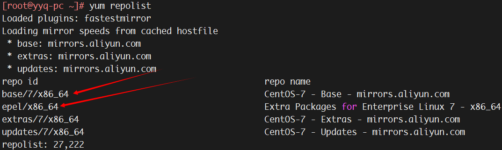

# 1. 【源码包和二进制包】
1. **源码包** 
    * 源码包是多个文件的集合，出于发行的需要，一般会把源码包打包压缩之后发布
    * 最常用的格式是 `.tar.gz`，所以也把源码包叫作 Tarball
    * 开源，可修改源代码；可自由选择所需的功能
    * 软件是编译安装，所以更适合自己的系统，也更稳定效率也更高
    * 卸载方便
    * 编译过程时间长；安装过程一旦报错新手很难解决

2. **二进制包** 
    * 二进制包是源码包经过编译之后的包
    * 二进制包是 Linux 下的默认安装软件包
    * 安装速度较快；报错也大大减少
    * 目前主要有两个系列的二进制包管理系统
        > * RedHat 上的 `RPM` 包管理系统
        > * Debian 上的 `DPKG` 包管理系统
   
    * yum 工具是 CentOS 下最好用的包管理器和安装软件包的工具
    * CentOS 的二进制软件包是 rpm 包，类似于 Windows 下的 exe 程序

# 2. 【源码包安装和卸载过程】

1. **安装源码包通常需要以下3个步骤** 
    1. step1. `./configure`  
        > * 加上相应的选项，可以定制功能，具体有什么选项可通过 `./configure --help` 来查看
        > * 会自动检测你的Linux系统与相关的套件是否有编译该源码包时所需要的库
        > * 一旦缺少某个库，就不能完成编译。只有检测通过后，才会生成 Makefile 文件

    2. step2. `make`  
        > 会根据 Makefile 文件中预设的参数进行编译，这一步其实就是 gcc 在工作了

    3. step3. `make install`  
        > 这一步是安装步骤，用于创建相关软件的存放目录和配置文件

    > * 对于以上这3个步骤，并不是所有的源码包软件都一样，即源码包的安装并没有标准的安装步骤
    > * 安装步骤可参考：源码包目录中的帮助文档（Install 或 Readme）

2. **演示** 
    1. **下载与解压源码包**  

        ```bash
        cd /usr/local/src/
        wget http://nginx.org/download/nginx-1.17.8.tar.gz
        tar -zxvf nginx-1.17.8.tar.gz
        ```

    2. **配置相关的选项并生成 Makefile**  
        ```bash
        cd nginx-1.17.8
        ./configure --help |less

        ./configure --prefix=/usr/local/nginx  # 定义软件包的安装路径
        「
            ./configure: error: the HTTP rewrite module requires the PCRE library.
            You can either disable the module by using --without-http_rewrite_module
            option, or install the PCRE library into the system, or build the PCRE library
            statically from the source with nginx by using --with-pcre=<path> option.
        」
        # 报错：因为 Nginx 需要 pcre 库，该系统并未安装。安装命令如下：
        yum install -y pcre-devel

        ./configure --prefix=/usr/local/nginx
        # 此时又有新的错误：
        「
            ./configure: error: the HTTP gzip module requires the zlib library.
            You can either disable the module by using --without-http_gzip_module
            option, or install the zlib library into the system, or build the zlib library
            statically from the source with nginx by using --with-zlib=<path> option.
        」
        # 根据提示，安装 zlib 即可
        yum install -y zlib-devel

        ./configure --prefix=/usr/local/nginx
        echo $?    # 验证这一步是否成功，返回 “0” 说明执行成功
        ls -l Makefile
        ```

    3. **编译**  

        ```bash
        make         # yum install –y make
        echo $?      # 验证编译是否成功
        ```

    4. **安装**  

        ```bash
        make install
        echo $?
        ls /usr/local/nginx/
        ```

3.  **源码包卸载** 
    * 找到软件安装位置，直接删除即可
    * 如果待删除的软件是某服务并启动了，则需要先停止服务再删除

# 3. 【RPM 包管理器】

> 常用的 RPM 包都在安装光盘中

1. **RPM 包的一般命名规则**：`mailx-12.5-19.el7.x86_64.rpm` 
    * `i386、i586、i686`：都为 32 位平台
    * `x86_64`：64位平台
    * `noarch`：表示该包没有硬件平台限制

2. **RPM 包依赖性** 
    * **树形依赖**：a  -> b -> c
    * **环形依赖**：a  -> b -> c -> a 
        * 只要在一条命令同时安装 a、b、c 三个软件包，就可以解决环形依赖
    * **函数库依赖** 
        * `rpm -ivh 软件包`：假设报错，缺  `***.so.数字`   依赖包 
            > * 只要依赖的包是以  `.so.数字结尾`  的，就表示是一个库依赖包
            > * 想要安装库文件，就必须知道这个库文件属于哪个软件包
            > * 只要安装了该库文件所在的软件包，就解决了函数库依赖的问题
            > * 查询该软件所在的软件包名称: [http://www.rpmfind.net/](http://www.rpmfind.net/)

3. **包名与包全名** 
    * **包名**：操作已经安装的软件包时，使用包名；搜索 `/var/lib/rpm/` 中的数据库
    * **包全名**：操作的包是没有安装的软件包时，使用包全名

4. **RPM包默认安装路径**  
    
    | 安装路径 | 含义 |
    | --- | --- |
    | /etc/ | 配置文件安装目录 |
    | /usr/bin/ | 可执行的命令安装目录 |
    | /usr/lib/ | 程序所使用的函数库保存位置 |
    | /usr/share/doc/ | 基本的软件使用手册保存位置 |
    | /usr/share/man/ | 帮助文件保存位置 |

5. **RPM 安装、升级、卸载和查询** 
    * **安装**：`rpm -ivh 包全名`（install、verbose：表示可视化、hash：显示安装进度）
    * **升级**：`rpm -Uvh 包全名`
    * **查询** 
        * `rpm -q 包名`：查询包是否安装
        * `rpm -qa`：查询所有已经安装的 RPM包：`rpm -qa | grep vim`
        * `rpm -qi 包名`：查询已安装软件包详细信息（-i：information）
        * `rpm -ql 包名`：列出软件包中所有的文件列表和软件所安装的目录（-l：list）
        * `rpm -qf 文件名`：查询系统文件属于哪个 RPM包：`rpm -qf $(which ssh)`
        * `rpm -qR 包名`：查询软件包的依赖性
        * `rpm -qip 包全名`：查询未安装软件包详细信息（-p：package）
        * `rpm -qlp 包全名`
        * `rpm -qRp 包全名`：查询未安装软件包的依赖性
    * **卸载**：`rpm -e 包名` 
        * 卸载也是有依赖性的。比如，在安装的时候，要先安装 httpd 软件包，再安装 httpd 的功能模块 mod_ssl 包。那么，在卸载的时候，一定要先卸载 mod_ssl软件包，再卸载httpd软件包，否则就会报错
        * `rpm -e 包名 --nodeps`：<font>推荐使用</font>

# 4. 【yum 工具】

| 发行版代表 | 软件管理机制 | 使用指令 | 线上升级机制（指令）|
| --- | --- | --- | --- |
| RedHat / Fedora | RPM | rpm | yum |
| Debian / Ubuntu | DPKG | dpkg | apt |

* **RPM**：通过将 安装规则 与 源代码 打包到一起，来降低软件的安装难度
* **YUM**：通过将大量的常用RPM软件存放在一起，解决软件包之间的依赖关系，进一步降低软件的安装难度

## 4.1. 【yum 源搭建及配置】

1. **yum 源搭建及配置**  

    ```bash
    # yum 源配置文件
    ls /etc/yum.repos.d/
        ↘ CentOS-Base.repo    # 默认情况下此文件生效
        ↘ CentOS-Debuginfo.repo
        ↘ CentOS-Media.repo   # 以本地光盘作为 yum 源服务器的模板文件
        ↘ CentOS-Vault.repo
        ↘ CentOS-CR.repo
        ↘ CentOS-fasttrack.repo
        ↘ CentOS-Sources.repo
        
    # 使用网络 yum 源
    vim /etc/yum.repos.d/CentOS-Base.repo
        ↘ [base]：容器名称，一定要放在 [] 中
        ↘ name：容器说明，可以自己随便写
        ↘ mirrorlist：镜像站点，这个可以注释掉
        ↘ baseurl：yum 源服务器的地址。默认是官方的 yum 源服务器，可改成你喜欢的 yum 源地址
        ↘ enabled：如果不写或写成 enabled 则表示此容器生效，写成 enable=0 则表示此容器不生效
        ↘ gpgcheck：如果为 1 则表示 RPM 的数字证书生效；如果为 0 则表示 RPM 的数字证书不生效

    # 或者直接使用
    curl -o /etc/yum.repos.d/CentOS-Base.repo http://mirrors.aliyun.com/repo/Centos-7.repo
    ```

2. **使用本地光盘作为 yum 源**  

    ```bash
    # 【step1】挂载光盘
    mkdir /mnt/cdrom
    mount /dev/cdrom /mnt/cdrom/

    # 【step2】让所有网络 yum 源文件失效
    mv CentOS-Base.repo CentOS-Base.repo.bak
    mv CentOS-Debuginfo.repo CentOS-Debuginfo.repo.bak
    mv CentOS-Vault.repo CentOS-Vault.repo.bak
    ...

    # 【step3】修改光盘 yum 源文件
    vim CentOS-Media.repo
    「
        baseurl=file:///mnt/cdrom
        #地址为你自己的光盘挂载地址
        #file:///media/cdrom/
        #file:///media/cdrecorder/
        #注释这两个的不存在地址
        #注意配置文件是有格式的,如注释不能直接写在后面和注释#应该顶格写
        enabled=1
        #把 enabled=0 改为 enabled=1, 让这个 yum 源配置文件生效
    」
    ```

## 4.2. 【yum 下载源优化】

1. **优化基础的 yum 源文件** 
    * `curl -o /etc/yum.repos.d/CentOS-Base.repo http://mirrors.aliyun.com/repo/Centos-7.repo`

2. **优化扩展的 yum 源文件** 
    * `wget -O /etc/yum.repos.d/epel.repo http://mirrors.aliyun.com/repo/epel-7.repo`  
        > 当基础 yum 源找不到要下载的软件时，会去扩展的 yum 源仓库寻找

    * `yum repolist`：检查可用的 yum 源信息
        

## 4.3. 【yum 命令】

* `yum clean all`：清理 yum 缓存
* `yum makecache`：生成缓存 
* `yum list`：査询 yum 源服务器上所有可安装的软件包列表
* `yum list 包名`：查询 yum 源服务器中是否包含某个软件包
* `yum search 关键字`：搜索 yum 服务器上所有和关键字相关的软件包
* `yum provides 命令`：确定某个命令属于哪个软件包
* `yum info samba`：查询 samba 软件包的信息

---

* `yum -y install 包名`：安装，`-y`：自动回答yes 
* `yum -y update 包名`：升级指定的软件包 
* `yum -y update`：升级所有软件包、软件、内核  
    > * 首次安装系统时一般可执行此命令，如果是在生产线已经应用的业务服务器系统中，那就不要轻易更新了，以免导致业务服务异常
    > * `yum upgrade`  与 `yum update`  的作用和区别很小

* `yum -y erase 包名`：极其不建议，会同时删除依赖包 
    > `rpm -e 包名 --nodeps`：<font>推荐使用</font>

---

* 只下载不安装：`yum install 包名 -y --downloadonly`  
    > * 默认会下载到 /var/cache/yum/x86_64/7/xxx/packages 下面

* 下载到指定目录：`yum install 包名 -y --downloadonly --downloaddir=/usr/local/src` 
* 如果包已经安装过了，则就不能再下载该包了  
    > 解决方法：yum reinstall -y 包名 --downloadonly

---

* `yum grouplist`：查询可安装的软件组
* `yum groupinfo 软件组名`：查询软件组中包含的软件
* `yum groupinstall 软件组名`：安装指定软件组，组名可以由 grouplist 查询出来
* `yum groupremove 软件组名`：卸载指定软件组

---

> **建议安装的工具**
>> * `man-pages`
>> * `psmisc`：含有 killall、pstree 等命令
>> * `net-tools`：含有 netstat、ifconfig、route、arp 等命令
>> * `bash-completion`：补全 centos7 的部分命令参数

## 4.4. 【函数库】

1. **静态函数库** 
    * 通常以 `*.a` 扩展名结尾
    * 在被程序调用时会被直接整合到程序当中
    * 因为把所有内容都整合到程序中，所以升级比较困难，需要把整个程序重新编译

2. **动态函数库** 
    * 通常以 `.so` 扩展名结尾
    * 当程序需要用到函数库的功能时，再去读取函数库，在程序中只保存了函数库的指向
    * 文件较小，升级方便，不需要把整个程序重新编译，只需要重新编译安装函数库就好

3. **查看可执行程序调用了哪些函数库** 
    * `ldd /usr/bin/ls`：査看 ls 命令调用了哪些函数库；`-v`：显示详细版本信息

4.  **识别新安装的函数库** 
    * step1. 把函数库放入指定位置：`/usr/lib` 或 `/lib`
    * step2. 把函数库所在目录写入 `/etc/ld.so.conf` 文件中

        ```bash
        cp *.so /usr/lib/    # 把函数库复制到 /usr/lib/ 目录中
        vi /etc/ld.so.conf   # 修改函数库配置文件
            ↘ include ld.so.conf.d/*.conf
            ↘ /usr/lib
            ↘ # 写入函数库所在目录（其实 /usr/lib/ 目录默认已经被识别）
        ```

    * step3. 把函数库读入缓存 
        * `ldconfig`：从 `/etc/ld.so.conf` 文件中把函数库读入缓存
        * `ldconfig -p`：列出系统缓存中所有识别的函数库

## 4.5. 【软件包管理器：dpkg/apt】

1. **软件源**
    * 即下载软件的地方，软件源有很多，Ubuntu 有一个软件源列表，位于：`etc/apt/sources.list`
    * 查看更新源是否可用：`sudo apt update` 更新更新源
    * 更换软件源
        * step1.【网络搜索：ubuntu 软件源】
            > * step1：访问 [https://mirrors.tuna.tsinghua.edu.cn](https://mirrors.tuna.tsinghua.edu.cn)
            > * step2：拖动滚动条，找到 ubuntu，单击右边的问号
            > * step3：选择对应的版本，获取软件源地址
        
        * step2.【备份默认源地址】
            > * `sudo cp /etc/apt/sources.list /etc/apt/sources.list.backup`
        
        * step3.【更新源服务器】
            > * step1：清空 /etc/apt/sources.list 文件
            > * step2：将清华大学的软件源地址复制过去
        
        * step4.【根据软件源更新软件列表】
            > * `sudo apt update`

2. **apt 相关命令**
    * `apt update` 更新源
    * `apt upgrade ` 更新已安装的包
    * `apt dist-upgrade`  升级系统
    * `apt install package`  安装包
    * `apt install package --reinstall`  重新安装包
    * `apt -f install`  修复安装
    * `apt remove package`  删除包
    * `apt remove package --purge`  删除包，包括配置文件等
    * `apt-cache search package`  搜索软件包
    * `apt-cache show package`  获取包的相关信息
    * `apt-cache depends package` 了解使用该包依赖那些包
    * `apt-cache rdepends package`  查看该包被哪些包依赖
    * `apt source package`  下载该包的源代码
    * `apt clean && apt autoclean`  清理无用的包
    * `apt check`  检查是否有损坏的依赖

# 5. 【服务分类】

1. **常见服务**  

    | 服务名称 | 功能简介 |
    | --- | --- |
    | atd | 定时任务，仅执行一次 |
    | crond | 定时任务，循环执行 |
    | network | 提供网络设罝功能 |
    | sshd | ssh 加密远程登录管理的服务 |
    | httpd | apache 服务的守护进程 |
    | mysqld | MySQL 数据库服务器 |
    | ntpd | 通过互联网自动更新系统时间 |
    | rsyslog | 日志的守护进程 |
    | firewalld | 防火墙功能 |

2. **RPM包安装的服务 & 源码包安装的服务** 
    1. **RPM 包默认安装的服务**  
        > 可被服务管理命令识别，安装在系统默认位置

        * **服务启动方式1**：`/etc/init.d/服务名 start|stop|status|restart|...`
        * **服务启动方式2**：  
            > **CentOS 6**：`service 服务名 start|stop|restart|...`
            > **CentOS 7**：`systemctl start|stop|... 服务名.service`

    2. **源码包安装的服务** 
        * 每个源码包的启动脚本都不一样，一般需要查看说明文档才能确定  

        > * 如：`/usr/local/apache2/bin/apachectl start|stop|...`
        > * 一般会安装到 `/usr/local/` 目录中

3. **服务与端口的对应关系**：`cat /etc/services` 
4. **查询系统中已经启动的服务**：`netstat -tlunp` 
5. **设置服务自启动**  

    ```bash
    vi /etc/rc.d/rc.local    # 该文件必须要赋予执行权限
        # 加入内容：/etc/rc.d/init.d/httpd start
    ```
