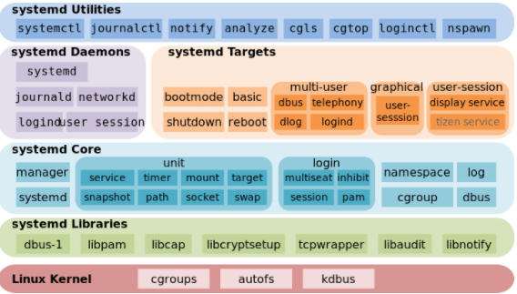

# 1. 【介绍】

* 当 Linux 系统启动时，systemd 是启动的第一个进程（代替了早期版本的 init 进程）
* 当 Linux 系统关闭时，systemd 也是最后一个结束的进程
* systemd 并不是一个命令，而是一组命令，涉及到系统管理的方方面面

    

* 查看 Systemd 的版本：`systemctl --version`

# 2. 【Unit】

* Systemd 可管理所有系统资源。不同的资源统称为 Unit（单位）
* 为了便于管理服务，systemd 使用的 unit 分类，并将该 unit 归类到不同的服务类型
* 常见 systemd 的服务类型：根据扩展名 （Systemd 默认后缀名为 `.service`）

> `systemctl -t help`：查看 unit 类型

| Unit 常见类型 | 文件扩展名 | 作用 |
| --- | --- | --- |
| Service unit | .service | 用于定义系统服务 |
| Target unit | .target | 用于模拟实现"运行级别" |
| Device Unit | .device | 用于定义内核识别的设备 |
| Mount Unit | .mount | 用于定义文件系统的挂载点 |
| Socket Unit | .socket | 用于标识进程间通信用到的socket文件 |
| Snapshot Unit | .snapshot | 用于管理系统快照 |
| Swap Unit | .swap | 用于标识swap设备 |
| Automount Unit | .automount | 自动挂载点 |
| Path Unit | .path | 文件或路径 |
| Scope Unit | .scope | 不是由 Systemd 启动的外部进程|
| Timer Unit | .timer | 定时器|

* **systemd 的配置文件放置目录**
    1. `/usr/lib/systemd/system/`
        * 每个服务最主要的启动脚本设置
        * 类似以前的 `/etc/init.d` 下面的文件

    2. `/run/systemd/system/`
        * 系统执行过程中所产生的服务脚本
        * 其优先序比 `/usr/lib/systemd/system/` 高

    3. `/etc/systemd/system/`
        * 管理员依据主机系统的需求所创建的执行脚本
        * 类似以前的 `/etc/rc.d/rc5.d/Sxx` 之类的功能
        * 执行优先序比 `/run/systemd/system/` 高
        
# 3. 【systemctl】

> systemctl 是 Systemd 的主命令，用于管理系统

## 3.1. 【查看系统上所有 Unit】

* **格式**：`systemctl [command] [--type=TYPE] [--all]`
    * `list-units`：依据单元分类列出正在运行的 Unit。加上 `--all` 会列出没启动的
    * `list-unit-files`：:point_right: 依据 `/usr/lib/systemd/system/` 内的文件，将所有文件列表说明
    * `--type=TYPE`：指定单元类型

```bash
systemctl                  # 默认就是 list-units 的意思，列出正在运行的 Unit

systemctl list-units --all # 列出所有 Unit

systemctl list-unit-files  # 列出所有已安装的单元
    ↘ enabled：已建立启动链接
    ↘ disabled：没建立启动链接
    ↘ static：该配置文件没有 [Install] 部分（无法执行），只能作为其他配置文件的依赖
    ↘ masked：该配置文件被禁止建立启动链接

systemctl list-units --type=service --all  # 列出所有 “*.service” 的项目
```

## 3.2. 【管理服务】

> 服务单元以 `.service` 文件扩展结尾

* 在 CentOS7.0 后很多服务不再使用 `service` 和 `chkconfig` ，而是 `systemctl`
* `service` 和 `chkconfig` 指令管理的服务在 `/etc/init.d` 查看

|service 功能|systemctl 功能|作用|
|----------- | -------- |------ |
| service name start | systemctl start name | 启动服务 |
| service name stop | systemctl stop name | 关闭服务 |
| service name restart | systemctl restart name | 重启服务 |
| service name reload | systemctl reload name | 重新载入配置文件而不中断服务<br />仅部分服务支持 reload |
| service name status | systemctl status name | 查看服务的运行状态 |
| service --status-all | systemctl list-units --type service --all | 列出所有正在运行的、类型为 service 的 unit |
| chkconfig name on | systemctl enable name | 设置服务开机启动 |
| chkconfig name off | systemctl disable name | 禁止服务开机自启 |
| chkconfig --list name | systemctl status name  systemctl is-enabled name | 检查服务在当前环境是启用还是禁用 |
| chkconfig --list | systemctl list-unit-files --type service | 输出在各个运行级别下所有服务的启动和禁用情况 |

* `systemctl kill apache.service`：杀死一个服务的所有子进程
* `systemctl show httpd.service`：显示某个 Unit 的所有底层参数
* `systemctl show -p CPUShares httpd.service`：显示某个 Unit 的指定属性的值
* `systemctl set-property httpd.service CPUShares=500`：设置某个 Unit 的指定属性

1. **强迫服务注销：mask**
    
    ```bash
    systemctl stop cups.service
    systemctl mask cups.service
    # 注销服务：让启动的脚本变成了空设备

    systemctl status cups.service
    systemctl start cups.service
    # 再也无法唤醒

    systemctl unmask cups.service
    # 取消注销

    systemctl status cups.service
    ```
    
2. **服务之间的依赖关系**
    > Unit 之间存在依赖关系：A 依赖于 B，就意味着 Systemd 在启动 A 的时候，同时会去启动 B

    * **格式**：`systemctl list-dependencies [unit] [--reverse]`
        * `--reverse`：反向追踪谁使用这个 unit 的意思
        
    ```bash
    systemctl list-dependencies
    systemctl list-dependencies nginx.service
    systemctl list-dependencies --all nginx.service
    systemctl list-dependencies graphical.target
    ```
    
## 3.3. 【运行目标】

1. **CentOS 6.x**
    * 通过 `/etc/inittab/` 配置文件来设置系统的默认运行级别
    * Linux 是通过 运行级别 来确定系统启动时到底启动哪些服务的
        > `0`：关机
        > `1`：单用户模式，相当于 Win 的安全模式，主要用于系统修复
        > `2`：不完全的命令行模式，不含 NFS（Network File System）服务
        > `3`：完全的命令行模式，就是标准字符界面
        > `4`：系统保留
        > `5`：图形模式
        > `6`：重新启动

    * `runlevel`：查看系统的运行级别
        > 输出：`N 3` => N（None）代表上一个级别是什么；3 代表当前级别

    * `init 0`：关机，建议使用 shutdown 命令

2. **CentOS 7.x**
    * RHEL7 采用 `systemd` 取代 `System V init` 来进行 `初始化进程` 服务
    * systemd 用目标（target）代替了 System V init 中运行级别的概念
    
    | System V init运行级别 | systemd目标名称 | 作用 |
    | --- | --- | --- |
    | runlevel0 | poweroff.target | 关机 |
    | runlevel1 | rescue.target | 单用户模式 |
    | runlevel2 | multi-user.target | 等同于级别3 |
    | runlevel3 | multi-user.target | 多用户的文本界面 |
    | runlevel4 | multi-user.target | 等同于级别3 |
    | runlevel5 | graphical.target | 多用户的图形界面 |
    | runlevel6 | reboot.target | 重启 |
    | emergency | emergency.target | 紧急 Shell |
    
    ```bash
    systemctl list-units --type target

    ll /usr/lib/systemd/system/runlevel*target

    ln -sf /lib/systemd/system/multi-user.target /etc/systemd/system/default.target

    systemctl get-default                    # 获取目前的 target
    systemctl set-default multi-user.target  # 设置默认 target

    systemctl isolate multi-user.target
    # 不重启的情况下，将目前的操作环境改为多用户模式
    ```

3. **切换操作模式**
    * `systemctl halt`：关机
    * `systemctl poweroff`：关机
    * `systemctl reboot`：重启
    * `systemctl suspend`：进入暂停模式
        > * 暂停模式会将系统的状态数据保存到内存中，然后关闭掉大部分的系统硬件，当然，并没有实际关机
        > * 当使用者按下唤醒机器的按钮，系统数据会在内存中恢复，然后重新驱动被大部分关闭的硬件，就开始正常运行

    * `systemctl hibernate`：进入休眠模式
        > * 休眠模式则是将系统状态保存到硬盘当中，保存完毕后，将计算机关机
        > * 当使用者尝试唤醒系统时，系统会开始正常运行，然后将保存在硬盘中的系统状态恢复回来

    * `systemctl rescue`：强制进入救援模式
    * `systemctl emergency`：强制进入紧急救援模式
    
## 3.4. 【针对 service 类型的配置文件】

```bash
[root@yyq-pc ~]# #cat /usr/lib/systemd/system/sshd.service
[root@yyq-pc ~]# systemctl cat sshd
# /usr/lib/systemd/system/sshd.service
[Unit]
Description=OpenSSH server daemon
Documentation=man:sshd(8) man:sshd_config(5)
After=network.target sshd-keygen.service
Wants=sshd-keygen.service

[Service]
Type=notify
EnvironmentFile=/etc/sysconfig/sshd
ExecStart=/usr/sbin/sshd -D $OPTIONS
ExecReload=/bin/kill -HUP $MAINPID
KillMode=process
Restart=on-failure
RestartSec=42s

[Install]
WantedBy=multi-user.target
```

1. `[Unit]`：用来定义 Unit 的元数据，以及配置与其他 Unit 的关系
    * `Description`：简短描述
    * `Documentation`：文档地址
    * `Requires`：当前 Unit 依赖的其他 Unit，如果它们没有运行，当前 Unit 会启动失败
    * `Wants`：与当前 Unit 配合的其他 Unit，如果它们没有运行，当前 Unit 不会启动失败
    * `BindsTo`：与Requires类似，它指定的 Unit 如果退出，会导致当前 Unit 停止运行
    * `Before`：如果该字段指定的 Unit 也要启动，那么必须在当前 Unit 之后启动
    * `After`：如果该字段指定的 Unit 也要启动，那么必须在当前 Unit 之前启动
    * `Conflicts`：这里指定的 Unit 不能与当前 Unit 同时运行
    * `Condition...`：当前 Unit 运行必须满足的条件，否则不会运行
    * `Assert...`：当前 Unit 运行必须满足的条件，否则会报启动失败

2. `[Service]`：只有 Service 类型的 Unit 才有这个区块
    * `Type`：定义启动时的进程行为。它有以下几种值
        > * `Type=simple`：默认值，执行ExecStart指定的命令，启动主进程
        > * `Type=forking`：以 fork 方式从父进程创建子进程，创建后父进程会立即退出
        > * `Type=oneshot`：一次性进程，Systemd 会等当前服务退出，再继续往下执行
        > * `Type=dbus`：当前服务通过D-Bus启动
        > * `Type=notify`：当前服务启动完毕，会通知 Systemd，再继续往下执行
        > * `Type=idle`：若有其他任务执行完毕，当前服务才会运行
    * `ExecStart`：启动当前服务的命令
    * `ExecStartPre`：启动当前服务之前执行的命令
    * `ExecStartPost`：启动当前服务之后执行的命令
    * `ExecReload`：重启当前服务时执行的命令
    * `ExecStop`：停止当前服务时执行的命令
    * `ExecStopPost`：停止当其服务之后执行的命令
    * `RestartSec`：自动重启当前服务间隔的秒数
    * `Restart`：定义何种情况 Systemd 会自动重启当前服务，可能的值包括always（总是重启）、on-success、on-failure、on-abnormal、on-abort、on-watchdog
    * `TimeoutSec`：定义 Systemd 停止当前服务之前等待的秒数
    * `Environment`：指定环境变量
    
3. `[Install]`：用来定义如何启动，以及是否开机启动
    * `WantedBy`：它的值是一个或多个 Target，当前 Unit 激活时（enable）符号链接会放入 /etc/systemd/system 目录下面以 Target 名 + .wants后缀构成的子目录中
    * `RequiredBy`：它的值是一个或多个 Target，当前 Unit 激活时，符号链接会放入/etc/systemd/system目录下面以 Target 名 + .required后缀构成的子目录中
    * `Alias`：当前 Unit 可用于启动的别名
    * `Also`：当前 Unit 激活（enable）时，会被同时激活的其他 Unit
    
# 4. 【systemd-analyze】

> 用于查看启动耗时

```bash
systemd-analyze                 # 查看启动耗时                                                                                 
systemd-analyze blame           # 查看每个服务的启动耗时
systemd-analyze critical-chain  # 显示瀑布状的启动过程流
systemd-analyze critical-chain network.service   # 显示指定服务的启动流
```

# 5. 【hostnamectl】

```bash
hostnamectl                     # 显示当前主机的信息
hostnamectl set-hostname rhel7  # 设置主机名
```

# 6. 【localectl】

```bash
localectl    # 查看本地化设置
localectl set-locale LANG=en_GB.utf8
localectl set-keymap en_GB
```

# 7. 【timedatectl】

* **时区的显示与设置**：`timedatectl [commamd]`
    * `list-timezones`：列出系统上所有支持的时区名称
    * `set-timezone`：设置时区位置
    * `set-time`：设置时间
    * `set-ntp`：设置网络校时系统

```bash
timedatectl
timedatectl list-timezones | grep -i Shanghai
timedatectl set-timezone "Asia/Shanghai"
timedatectl set-time "2015-09-01 12:02"
```

# 8. 【loginctl】

> 用于查看当前登录的用户

```bash
loginctl
loginctl list-sessions
loginctl list-users
loginctl show-user 用户名
```
