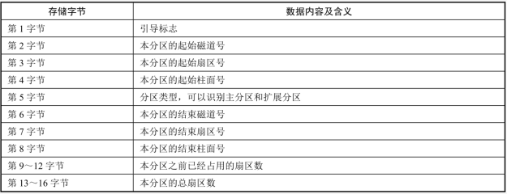

# 1. 【硬盘结构】

1. **机械硬盘（HDD）**：Hard Disk Drive
    > * 硬盘中一般会有多个盘片组成，每个盘片包含两个面，每个盘面都对应地有一个读/写磁头
    > * 盘片的编号自下向上从 0 开始，如最下边的盘片有0面和1面，再上一个盘片就编号为2面和3面

    

    1. **磁盘的外部结构**
        1. **磁盘主轴**：决定磁盘转速（rpm-round per minute）
            * 家用磁盘转速（7200 rpm 、 5400 rpm）
            * 企业磁盘转速（15k rpm 、 10k rpm）

        2. **磁盘盘片**：用于存储数据
        3. **磁盘磁头**：用于读取数据
        4. **磁盘接口**：用于连接主板、连接阵列卡
            * **IDE 接口**：早期机械硬盘的主要接口，已被 SATA 取代
            * **SATA 接口**：支持热插拔，一般个人电脑使用 SATA 接口
            * **SCSI 接口**：广泛应用在服务器上，已被 SAS 取代
            * **SAS 接口**：兼容 SATA，速度比 SATA 快，但成本贵
            * **PCI-E**

    2. **磁盘的内部结构**
        1. **磁头**（Head）
            * 盘面数量等于磁头数量，采用径向运动读写数据

        2. **磁道**（Track）
            * 由多个同心圆组成，最外面同心圆为 0 磁道
            * 磁盘默认按照磁道寻找数据

        3. **扇区**（Sector）
            * 磁盘存储的最小单位，默认磁盘扇区从1扇区开始，扇区大小为512字节
            * 系统存储最小单位是 block

        4. **柱面**（Cylinder）
            * 不同盘面上相同的磁道组成（圆柱体）
            * 磁盘默认按照柱面进行读写

        5. **单元块**（Units）
            * 表示单个柱面大小

    3. **磁盘容量计算**：存储容量 ＝ 磁头数 × 磁道（柱面）数 × 每道扇区数 × 每扇区字节数

2. **固态硬盘（SSD）**：Solid State Disk
    > 不再采用盘片进行数据存储，而采用存储芯片进行数据存储
    
# 2. 【系统启动引导记录】

1. **MBR引导记录**
    1. MBR 也就是主引导记录，位于硬盘的0磁道、0柱面、1扇区中，主要记录了启动引导程序和磁盘的分区表
        

        

        * MBR 共占用一个扇区，也就是 512Bytes。其中，446Bytes 安装启动引导程序，其后64Bytes描述分区表，最后的 2Bytes 是结束标记
        * 每块硬盘只能划分4个主分区，原因就是在 MBR 中描述分区表的空间只有64Bytes。其中每个分区必须占用16Bytes，那么64Bytes 就只能划分4个主分区。每个分区的16字节的规划如表

        

        1. **主分区**：最多只能有 4 个
        2. **扩展分区**
            * 最多只能有一个
            * 主分区加扩展分区最多有 4 个
            * 不能写入数据，只能包含逻辑分区

        3. **逻辑分区**：不管主分区加扩展分区有多少，逻辑分区始终从 5 开始

    2. MBR 的启动过程
        * step1. 启动主板自带的 BIOS 系统
        * step2. BIOS 加载 MBR
        * step3. MBR 通过 GRUB 加载器再启动操作系统

    > MBR 最多支持 2T，而 gpt 理论上是无限制的

2. **GPT 引导记录**
    * GPT 不存在扩展分区和逻辑分区，所有分区全都是主分区
    * GPT 是由 UEFI 启动的，兼容性和稳定性不如 BIOS + MBR
    * 如果硬盘超过 2T，那就必须选择 GPT + UEFI

# 3. 【df & du】

1. **显示磁盘空间使用情况**：`df [选项] [挂载点或分区设备文件名]` 
    * `-a`：显示所有的文件系统信息，包括特殊文件系统
    * `-T`：显示文件系统类型
    * `-h`：以容易阅读的方式显示（KB、MB、GB）
    * `-m`：以 MB 为单位显示容量
    * `-k`: 默认显示单位就是 KB
    
    ```bash
    df -Th
    ```

2. **查看文件或目录占用磁盘空间的大小**：`du [选项] 文件名或目录名` 
    * `-s`：仅显示总计，用于统计文件夹占用空间大小
    * `-h`：以易读方式显示文件大小

    ```bash
    # 按从小到大的顺序统计目录和文件的大小
    [root@yyq-pc ~]# du -sh / | sort -h
    2.2G    /

    [root@yyq-pc ~]# du -sh /* | sort -h
    0       /bin
    0       /dev
    0       /lib
    0       /lib64
    0       /media
    0       /mnt
    0       /opt
    0       /proc
    0       /sbin
    0       /srv
    0       /sys
    12K     /tmp
    40K     /home
    64K     /root
    7.7M    /run
    32M     /etc
    99M     /boot
    528M    /var
    1.6G    /usr

    [root@yyq-pc ~]# du -sh /tmp/* | sort -h
    0       /tmp/systemd-private-a4c0f8df32d9458687cccd098c0f0161-chronyd.service-G3KyWr
    4.0K    /tmp/pass.awk
    4.0K    /tmp/student.txt
    4.0K    /tmp/test.txt
    ```

3. **建议**：统计目录大小用 du 命令，统计文件大小用 ll 命令 
    1. **统计目录大小**
        
        ```bash
        du -hs /etc
        ll -d 目录
        # 记录的是父目录下的子目录名和子文件名到底占用了多少空间
        # 如果父目录下的子目录和子文件并不多，一个 block（4KB）就能放下
        ```  

    2. **统计文件大小**

        ```bash
        ll -h Hello
        du -h 文件
        # 统计的是文件占用空间的大小，不是文件本身的大小
        ```

4. **du 和 df 的区别** 
    * du（Disk Usage）命令是面向文件的，只会计算文件或目录占用的空间
    * df 命令针对的是某个分区，是从文件系统考虑的，不光要考虑文件占用的空间，还要统计被命令或程序占用的空间（最常见的就是文件已经删除，但是程序并没有释放空间）
    
    ```bash
    df -h /
    du -sh /
    ```
    
# 4. 【lsblk & blkid】

1. **列出所有磁盘与磁盘内的分区信息**：`lsblk [-dfimpt] [device]`
    * `-d`：仅列出磁盘本身，并不会列出该磁盘的分区数据
    * `-f`：同时列出该磁盘内的文件系统名称
    * `-m`：输出该设备在 `/dev` 下面的权限数据
    * `-p`：列出该设备的完整文件名
    * `-t`：列出该磁盘设备的详细数据

    ```bash
    [root@yyq-pc ~]$ lsblk
    NAME   MAJ:MIN RM  SIZE RO TYPE MOUNTPOINT
    sda      8:0    0   30G  0 disk
    ├─sda1   8:1    0  500M  0 part /boot
    ├─sda2   8:2    0  1.9G  0 part [SWAP]
    └─sda3   8:3    0 27.7G  0 part /
    sr0     11:0    1  973M  0 rom
    [root@yyq-pc ~]$ lsblk -f
    NAME   FSTYPE  LABEL           UUID                                 MOUNTPOINT
    sda
    ├─sda1 xfs                     e8b7740d-40a0-49b3-b1e2-cb462eb46e74 /boot
    ├─sda2 swap                    453f8763-65f8-4974-a860-8464e95b1f20 [SWAP]
    └─sda3 xfs                     fc7b6a9a-a223-417e-bd28-8121f6d4e139 /
    sr0    iso9660 CentOS 7 x86_64 2020-11-03-14-55-29-00
    ```

2.  **列出设备的 UUID 等参数**：blkid
    * 方式1. `lsblk -f`
    * 方式2. `blkid`

# 5. 【磁盘分区】

1. **三个分区命令**
    * `fdisk`：不支持大于 2TB 的分区
    * `gdisk`：主要针对 GPT，而 fdisk 主要支持 MBR
    * `parted`：可同时支持 GPT 和 MBR

2. **格式**：`fdisk [-l] [设备名称]`
    ```bash
    fdisk -l              # 列出所有的磁盘设备及分区表
    fdisk -l /dev/sdb     # 列出该设备的分区表
    fdisk /dev/sdb        # 对磁盘进行分区
    ```

3. **增加虚拟磁盘**
    * 在当前的虚拟机选项卡点击鼠标右键，选择 “设置”，此时会弹出 “虚拟机设置” 对话框
    * 在左侧选中 “硬盘”，然后点击下方的 “添加” 按钮  
    
        

    * 需要重启系统，才可以识别新添加的磁盘

4. **分区**

    ```bash
    fdisk -l           # 确定新添加的磁盘设备名
    fdisk /dev/sdb     # 进入交互界面
        【m】显示帮助菜单
        【d】删除一个分区
        【n】新建分区
        【l】显示已知的文件系统类型。82为Linux swap分区，83为Linux分区
        【t】改变一个分区的系统ID
        【g】创建一个新的空的GPT分区表（可以对大于2T的磁盘进行分区）
        【p】显示分区列表
        【q】不保存退出
        【w】保存退出

    ## 演示
    > m     # 帮助信息 (若输入错误，按Backspace键是无效的，应按Ctrl+Backspace)
    > p     # 显示分区列表
    > l     # 显示文件系统类型
    > n     # 新建分区
        >> p    # 主分区
            >>> 1     # 输入分区号(1~4)
                >>>> First sector: 保持默认(直接回车)  # 第一扇区起始位置，
                >>>> Last sector: +2G                 # 该分区大小为2GB
    > n
        >> e     # 扩展分区
            >>> 2     # 输入分区号(1~4)
                >>>> First sector: 保持默认(直接回车)
                >>>> Last sector: 保持默认(直接回车)    # 让剩余空间全部分配给扩展分区
    > p     # 显示分区列表
    > n
        >> l     # 逻辑分区
            >>> ... 略(直接回车，保持默认)
    > p
    > w
    ```

# 6. 【格式化磁盘分区】

* 磁盘分区虽然分好区了，但暂时还不能用，还须对每一个分区进行格式化
* 所谓格式化，其实就是安装文件系统（XFS、ext4、FAT32、NTFS）
* 扩展分区不能被格式化，主分区和逻辑分区必须格式化
* 分区格式化命令：`mke2fs`、`mkfs`、`mkfs.ext4`、`mkfs.xfs`

1. **格式**：`mkfs [选项] 分区设备文件名`
    * `-t 文件系统`：指定格式化的文件系统

    ```bash
    mkfs -t ext4 /dev/sdb1
    # 或者
    mkfs.ext4 /dev/sdb1

    # 在虚拟环境上没有问题
    # 但在生产环境上，执行 mkfs 命令之前还需要执行 “partprobe /dev/sdb1” 让系统可以加载识别分区文件
    ```

2. **调整分区默认参数**：`mke2fs [选项] 分区设备文件名`

    * `-t 文件系统`
        * 指定格式化成哪个文件系统，如 ext4
        * 不支持格式化成xfs类型，只能使用 mkfs.xfs
    * `-b 字节`
        * 设定每个数据区块占用的空间大小，目前，每个数据块支持1024B、2048B以及4096B
        * ext4文件系统的默认块大小为4096B，即4KB
    * `-L 卷标名`
        * 预设该分区的标签
        * 标签会在挂载磁盘时使用，也可以写入配置文件
        * 除非有需求，否则不需要指定块大小。即只需要记住 -t 和 -L 这两个选项即可
        * 如果没有特殊需要，那么还是 mkfs 命令简单易用

3. **查看或修改分区的标签**：e2label
    * 只支持 ext 格式的文件系统，不支持 XFS 文件系统

    ```bash
    e2label /dev/sdb5         # 查看分区的标签
    e2label /dev/sdb5 TEST    # 设置分区的标签为 TEST
    ```
    
# 7. 【挂载/卸载磁盘】

1. **格式化**：根据用户选定的文件系统，在磁盘的特定区域写入特定数据
2. **查看系统所支持的文件系统类型**：`cat /etc/filesystems`
3. Linux 中所有的存储设备都必须挂载之后才能使用（如硬盘、U盘、光盘）
4. swap 分区是系统直接调用的，不需要挂载
5. **挂载的定义**：将设备文件名（如 `/dev/sdb1`）和 挂载点（已建立的空目录）联系起来的过程
    > * 其实挂载点目录不为空并不影响所挂载分区的使用
    > * 但一旦挂载上了，该目录下以前的东西就看不到了（数据并没有丢失），除非卸载该分区

6. **挂载格式**：`mount [-t 文件系统] [-o 特殊选项] 设备文件名 挂载点`
    * `-t 文件系统`：指定挂载的类型（ext4、xfs、iso9660 等）
    * `-o 特殊选项`：指定挂载的额外选项，如果不指定，则默认值生效
        * `async/sync`：异步/同步，默认为异步
            * async 表示与磁盘和内存不同步。系统每隔一段时间就会把内存数据写人磁盘中
            * sync 则会时时同步内存和磁盘中的数据
        * `auto/noauto`：表示开机自动挂载/不自动挂载。默认为自动
        * `defaults`：定义默认值，相当于 `rw`、`suid`、`dev`、`exec`、`auto`、`nouser`、`async` 这 7 个选项
        * `exec/noexec`：是否允许在文件系统中执行可执行文件，默认是 `exec` 允许
        * `remount`：重新挂载已经挂载的文件系统，一般用于指定修改特殊权限
        * `ro`：表示按只读权限挂载
        * `rw`：表示按可读可写权限挂载
        * `suid/nosuid`：设定文件系统是否拥有 SetUID 和 SetGID 权限，默认是拥有
        * `user/nouser`：设定文件系统是否允许普通用户挂载，默认是不允许，只有 root 可挂载分区
        * `usrquota`：写入代表文件系统支持用户磁盘配额，默认不支持
        * `grpquota`：写入代表文件系统支持组磁盘配额，默认不支持
    * 设备文件名建议使用：`UUID=""`

```bash
mount        # 查询系统中已经挂载的设备
mount –a     # 根据 /etc/fstab 内容，自动挂载

mount -o remount,noexec /boot  # 重新挂载分区，并采用 “noexec” 权限禁止运行可执行文件
mount -o remount,exec /boot    # 记得改回来，否则会影响系统启动
# 这里可以省略掉磁盘分区，只写挂载点
```

## 7.1. 【挂载光盘、U盘】

1. **挂载光盘**

    ```bash
    mkdir /mnt/cdrom       # 创建挂载点，空目录
    mount [-t iso9660] /dev/sr0 /mnt/cdrom
    cd /mnt/cdrom
    ls
    ```

2. **卸载**
    * 方式1. `umount /dev/sr0`
    * 方式2. `umount /mnt/cdrom`

    > * umount 命令后面可以跟挂载点，也可以跟分区名，但是不可以跟 LABEL 和 UUID
    > * 有时候会遇到不能卸载的情况，那是因为当前目录还在卸载的分区上
    >     * **解决方法1**. 进入到其他目录卸载
    >     * **解决方法2**. 使用 umount 命令的 `-l` 选项

3. **挂载U盘**
    * 光盘的设备文件名是固定的（`/dev/sr0` 或 `/dev/cdrom`）
    * U盘的设备文件名是在插入U盘后系统自动分配的
    * 插入U盘前，鼠标必须进入虚拟机，否则是真实计算机识别U盘

        ```bash
        fdisk –l   # 查看U盘设备文件名
        mount -t vfat /dev/sdb1 /mnt/usb/
        ```

    * Linux 默认是不支持 NTFS 文件系统的

        ```bash
        # 【下载 NTFS-3G 插件】 http://www.tuxera.com/community/ntfs-3g-download/
        tar -zxvf ntfs-3g_ntfsprogs-2013.1.13.tgz
        cd ntfs-3g_ntfsprogs-2013.1.13
        ./configure && make && make install
        mount -t ntfs-3g 分区设备文件名 挂载点
        ```

## 7.2. 【开机自动挂载】

```bash
[root@yyq-pc ~]$ vi /etc/fstab
UUID=fc7b6a9a-a223-417e-bd28-8121f6d4e139 /            xfs     defaults    0 0
UUID=e8b7740d-40a0-49b3-b1e2-cb462eb46e74 /boot        xfs     defaults    0 0
UUID=453f8763-65f8-4974-a860-8464e95b1f20 swap         swap    defaults    0 0

# 【第1列】分区的标识：可以写分区的 LABEL、分区的UUID，也可以写分区名（/dev/sdal）
# 【第2列】挂载点
# 【第3列】文件系统类型
# 【第4列】挂载参数。一般情况下，直接写 defaults 即可
# 【第5列】指定分区是否被 dump 备份。1表示备份，0表示不备份
# 【第6列】指定开机时是否自检磁盘
#     1和2都表示检测，0表示不检测
#     自检时，1比2优先级高，所以先检测1，再检测2
#     如果有多个分区需要开机检测，就都设置成2，1检测完后会同时检测2
#     在 CentOS7 系统里，所有分区中该列的值都是0
```

1. 若配置文件写错，将导致系统崩溃，无法启动，故配置完成后应执行: `mount -a`，若有错，则会报错
2. `/etc/fstab` 文件修复
    * 假设配置自动挂载分区时，书写错误，系统将在重启时崩溃
    * 修复方法
        * 待系统重启一会后，会停留在某个界面，此时可通过输入 root 密码修复
        * 输入密码登录成功后

            ```bash
            mount -n -o remount,rw /
            vi /etc/fstab
            ```

# 8. 【创建GPT分区】

## 8.1. 【环境准备】

> 使用虚拟机添加一个大小为 3000 GB 的硬盘空间，然后重启虚拟机


## 8.2. 【创建分区】

1. **parted 交互命令**
    * `help [COMMAND]`：显示所有的命令帮助
    * `mklabel,mktable LABEL-TYPE`：创建一个分区表（默认为 MBR）
    * `print [devices|free|list,all|NUMBER]`：显示分区信息
    * `mkpart PART-TYPE [FS-TYPE] START END`：创建一个分区
    * `rm NUMBER`：删除分区
    * `quit`：退出分区状态

2. **查看分区表**
    * `/dev/sda`

        

    * `/dev/sdb`

        

3. **修改磁盘分区类型**：`mklabel gpt`

    

4. **分区方法**：`mkpart PART-TYPE [FS-TYPE] START END`

    

    * **继续分区**

        

5. **通过另一终端查看是否识别所分的区没有**

    ```bash
    [root@yyq-pc ~]# fdisk -l

    Disk /dev/sda: 32.2 GB, 32212254720 bytes, 62914560 sectors
    ...
    ...

    Disk /dev/sdb: 3221.2 GB, 3221225472000 bytes, 6291456000 sectors
    ...
    ...
    #         Start         End    Size  Type            Name
    1           34   4101562500    1.9T  Microsoft basic primary
    2   4101564416   4296873983   93.1G  Microsoft basic primary
    You have new mail in /var/spool/mail/root
    ```

    > 与 fdisk 不同，使用 parted 分区会立即生效，而 fdisk 需要按 w 保存

6. **删除分区与退出分区**

    

## 8.3. 【格式化与挂载】

* **加载磁盘分区**：`partprobe /dev/sdb`
* **格式化磁盘分区**：`mkfs.xfs /dev/sdb1`
* **挂载**：`mount /dev/sdb1 /mnt`
* **查看**：`df -h`

# 9. 【分配 swap 分区】

> 当内存不够用时，swap分区可存放内存中暂时不用的数据

1. **查看内存与swap分区使用状况**：`free -h`
2. **fdisk分配swap分区**
    
    ```bash
    # 1. 增加swap分区
    fdisk /dev/sdb
        ↘ n # 新建分区
        ↘ l # 逻辑分区
        ↘ t # 改变分区ID号为82

    # 2. 格式化
    mkswap /dev/sdb1
        ↘ 若报错，建议运行 partprobe 命令，仍不行，则重启系统再执行

    # 3. 加入swap分区
    swapon /dev/sdb1

    # 4. 取消swap分区
    swapoff /dev/sdb1

    # 5. swap分区开机自动挂载
    vi /etc/fstab
        ↘ /dev/sdb1 swap swap defaults 0 0
    ```
    
3. **建立一个swap文件增加虚拟内存**
    > **基本思路**：建立swapfile → 格式化为swap格式 → 启用该虚拟磁盘
    
    ```bash
    # 建立swapfile文件
    dd if=/dev/zero of=/tmp/newdisk bs=1M count=1024
        ↘ if 指定源，/dev/zero 可以源源不断地提供 “0”
        ↘ of 指定目标文件
        ↘ bs 定义块的大小
        ↘ count 定义块的数量

    mkswap /tmp/newdisk  # 格式化为swap格式
    free -h
    swapon /tmp/newdisk
    free -h
    ```
    
# 10. 【磁盘配额】

## 10.1. 【关于磁盘配额：Quota】

1. 用来限制普通用户或用户组在指定的分区或目录中所占用的磁盘容量或文件个数的限制
    > * 在 EXT 文件系统中，磁盘配额只能限制在整个分区上用户所占用的磁盘容量与文件个数，而不能限制某个目录所占用的磁盘容量
    > * 在 XFS 文件系统中，不仅可以限制整个分区，也能限制目录所占用的磁盘空间大小

2. 针对分区进行限制
    > * 限制的是用户在本分区中所占用的磁盘空间大小，限制的主体是用户
    > * 只有普通用户会被限制，而超级用户不会被限制

3. 针对目录进行限制
    > * 限制的是目录在本分区中所占用的磁盘空间大小，限制的主体是目录
    > * 不论是超级用户还是普通用户，在目录中所占用的磁盘空间大小和文件个数都受配额限制
    
> 磁盘配额既能限制用户所占用的磁盘容量大小（block），也能限制用户允许占用的文件个数（inode）

## 10.2. 【使用磁盘配额的前提条件】

1. **内核必须支持磁盘配额**
    > CentOS 7.x 版本的 Linux 默认支持磁盘配额，可查看内核配置文件，看是否支持磁盘配额

    ```bash
    [root@yyq-pc ~]$ grep CONFIG_QUOTA /boot/config-3.10.0-1160.el7.x86_64
    CONFIG_QUOTA=y
    CONFIG_QUOTA_NETLINK_INTERFACE=y
    # CONFIG_QUOTA_DEBUG is not set
    CONFIG_QUOTA_TREE=y
    CONFIG_QUOTACTL=y
    CONFIG_QUOTACTL_COMPAT=y
    ```

    * 如果内核不支持磁盘配额，则需要重新编译内核，加入 `quota supper` 功能

2. 关闭 SELinux，或者手工修改 SELinux 规则，否则磁盘配额功能无法正常使用
3. 要支持磁盘配额的分区必须开启磁盘配额功能。这项功能需要手工开启，不再是默认开启的

## 10.3. 【常见概念】

1. **用户配额和用户组配额**
    * 用户配额是指针对用户个人在分区中所占用磁盘空间大小和文件个数的配额
    * 用户组配额是指针对整个用户组的配额

2. **目录配额**
    * 指限制目录在分区中占用的磁盘空间大小的限制，任何用户，包括超级用户，在此目录下写入的数据都计算在配额限制内

3. **磁盘容量限制和文件个数限制**
    * 可以通过限制用户可用的 block 数量来限制用户可用的磁盘容量
    * 也可以通过限制用户可用的 inode 数量来限制用户可以上传或新建的文件个数

4. **软限制和硬限制**
    * 软限制可以理解为警告限制，硬限制就是真正的限制了
    * 比如，规定软限制为100MB，硬限制为200MB，那么，当用户使用的磁盘空间为100～200MB 时，还可以继续上传和新建文件，但在每次登录时都会收到一条警告消息，告诉用户磁盘将满

5. **宽限时间**
    * 如果用户的磁盘占用量处于软限制和硬限制之间，那么系统会在用户登录时警告用户磁盘将满
    * 但这个警告不会一直发出，而是有时间限制的，这个时间就是宽限时间，默认是7天
    * 如果到达宽限时间，用户的磁盘占用量仍超过软限制，那么软限制就会升级为硬限制
    * 即：如果软限制是100MB，硬限制是200MB，宽限时间是7天，此时用户占用了120MB，那么今后7天，在用户每次登录时都会出现磁盘将满的警告。如果用户置之不理，那么7天后，对这个用户的硬限制就会变成100MB，而不是200MB 了

## 10.4. 【配额的基本步骤】

1. step1. **建立要指定配额的分区**
    * 手工建立一个容量为 5GB 的 /dev/sdb1 分区，把它挂载到 /disk 目录当中
    * 不建议直接用根目录来做磁盘配额，因为这样会使文件系统变得无比复杂

2. step2. **建立需要被限制的用户和用户组**
    * 假设需要限制 user1、user2 和 user3 用户，这 3 个用户均属于 tg 用户组
    * tg用户组必须是user1、user2和user3用户的<mark>初始组</mark>，用户组配额才能生效；否则用户组配额不起作用
    * tg 用户组的磁盘容量硬限制为500MB，软限制为450MB，文件个数没有限制
    * user1 用户，设定磁盘容量硬限制为50MB，软限制为40MB；文件个数硬限制为10个，软限制为8个
    * user2 和 user3 用户的磁盘容量硬限制为300MB，软限制为250MB，文件个数没有限制
    * user1、user2和user3用户加起来的磁盘容量硬限制为650MB，超过了tg 用户组的磁盘容量硬限制500MB
    * 这样，某个用户可能还达不到自己的用户限制，而在达到用户组限制时就不能再写入数据了
    * 即如果用户限制和用户组限制同时存在，那么，哪个限制更小，哪个限制优先生效
    * 系统宽限时间为8天

3. step3. **进行磁盘配额的设置**
    * 在 CentOS 6.x 以前的系统中，可以通过 `mount -o remount,usrquota,grpquota /disk` 来临时开启分区的磁盘配额功能
    * 在 CentOS 7.x 中，磁盘配额功能是在挂载的时候就生效的，不能再通过 remount 选项来临时开启磁盘配额功能
    * 只能通过先修改 `/etc/fstab` 文件开启磁盘配额功能，然后卸载分区，再重新挂载分区的方式来开启磁盘配额功能

        ```bash
        [root@yyq-pc ~]# vi /etc/fstab
        /dev/sdb1   /disk    xfs   defaults,usrquota,grpquota   0  0

        [root@yyq-pc ~]# umount /dev/sdb1     # 卸载分区
        [root@yyq-pc ~]# mount -a             # 挂载分区
        ```

    * **设置磁盘配额**：`xfs_quota -x -c "命令" [挂载点]`
        * `-x`：专家模式。要想用 -c 来指定命令。必须使用专家模式
        * `-c "命令"`：通过命令来实现配额、查看配额
        * 命令
            > * limit：设置用户与用户组配额
            > * timer：设置宽限时间
            > * project：设置目录配额
            > * report：列出磁盘配额的限制值。主要用于查看磁盘配额的限制值，以及使用情况
            > * state：列出配额状态。主要用于查看分区是否开启了磁盘配额功能，以及查看宽限时间
            > * print：用于打印文件系统（分区）的基本情况
            > * df：列出文件系统的使用情况。和系统命令df非常类似，支持的选项也类似
            > * disable：暂时关闭磁盘配额功能

## 10.5. 【分区配额的实现过程】

1. **设置用户与用户组配额**：`xfs_quota -x -c "limit [选项] 用户名/用户组名" [挂载点]`
    * `-u`：设置用户配额
    * `-g`：设置用户组配额
    * `-p`：设置目录配额
    * `bsoft=n`：block软限制，可以指定单位
    * `bhard=n`：block硬限制，可以指定单位
    * `isoft=n`：inode软限制
    * `ihard=n`：inode硬限制

    ```bash
    xfs_quota -x -c "limit -u bsoft=40M bhard=50M isoft=8 ihard=10 user1" /disk
    xfs_quota -x -c "limit -u bsoft=250M bhard=300M user2" /disk
    xfs_quota -x -c "limit -u bsoft=250M bhard=300M user3" /disk

    xfs_quota -x -c "limit -g bsoft=450M bhard=500M tg" /disk
    ```

2. **查看磁盘配额**：`xfs_quota -x -c "查看命令" [挂载点]`
    * `report`：列出磁盘配额的限制值。主要用于查看磁盘配额的限制值，以及使用情况
    * `-u`：查看用户配额
    * `-g`：查看用户组配额
    * `-p`：查看目录配额
    * `-b`：查看block限制的大小
    * `-i`：查看inode限制的大小
    * `-h`：人性化显示
    * `state`：列出配额状态。主要用于查看分区是否开启了磁盘配额功能，以及查看宽限时间
    * `print`：用于打印文件系统（分区）的基本情况
    * `df`：列出文件系统的使用情况

    ```bash
    xfs_quota -x -c "report -ubih" /disk/  # 查看用户配额的限制值
    xfs_quota -x -c "report -gbih" /disk/  # 查看用户组配额的限制值
    xfs_quota -x -c "state" /disk/         # 查看分区的配额开启状态
    xfs_quota -x -c "print" /disk/         # 查看分区的挂载参数
    xfs_quota -x -c "df -h" /disk/         # 查看磁盘配额分区的空间使用情况
    ```

3. **设置宽限时间**：`xfs_quota -x -c "timer [-u|-g|-p] [-bir] ndays" [挂载点]`
    * `-u`：用户配额
    * `-g`：用户组配额
    * `-p`：目录配额
    * `-b`：block限制
    * `-i`：inode限制
    * `-r`：实时块限制

    ```bash
    # 宽限时间默认是7天，一般不需要修改
    xfs_quota -x -c "timer -ub 8days" /disk/  # 修改 block 的宽限时间为 8 天
    xfs_quota -x -c "state" /disk/            # 查看分区的配额状态
    ```

4. **测试配额是否生效**
    > 首先需要修改 /disk 分区的权限，让 user1、user2 和 user3 用户对这个分区拥有写入权限

    ```bash
    chgrp tg /disk/   # 修改 /disk 分区的所属组为 tg 用户组
    chmod 775 /disk/  # 修改权限
    ll -d /disk/      # 查看
    ```

    * 测试 user1 用户的磁盘配额限制

        ```bash
        # 1.【测试文件个数限制是否生效】
        [root@yyq-pc ~]# su - user1
        [user1@yyq-pc ~]$ cd /disk/
        [user1@yyq-pc ~]$ touch {1..11}.txt
        touch: 无法创建"11.txt": 超出磁盘限额
        [user1@yyq-pc ~]$ ls
        10.txt 1.txt 2.txt 3.txt 4.txt 5.txt 6.txt 7.txt 8.txt 9.txt

        [root@yyq-pc ~]# xfs_quota -x -c "report -ubih" /disk/
        # 在查看的时候记得切换回 root 身份
        ...
        ...
        # userl用户的文件个数已经占满10个，宽限时问也开始计算了

        # 2.【测试磁盘容量限制是否生效】
        ...
        ...
        dd if=/dev/zero of=test bs=1M count=60
        ll -h test
        xfs_quota -x -c "report -ubih" /disk/
        ```

5. **关闭或删除配额**：`xfs_quota -x -c "命令" [挂载点]`
    * `disable`：暂时关闭磁盘配额功能
        * `-u`：用户配额（以下命令都支持这3个选项）
        * `-g`：用户组配额
        * `-p`：目录配额
    * `enable`：开启磁盘配额功能。可以开启使用disable命令关闭的磁盘配额功能
    * `off`：完全关闭磁盘配额功能。在使用off命令关闭磁盘配额功能之后，不能使用enable命令开启，必须在卸载分区之后重新挂载分区才能再次开启。如果只是需要关闭磁盘配额功能，则使用disable命令。只有在需要使用remove命令时才会用到off命令
    * `remove`：删除磁盘配额的配置，需要在off状态下进行

    > 如果需要暂时关闭磁盘配额功能，但是不清除配额的各项限制，则可以直接使用disable命令关闭，也可以使用enable命令重新开启

    ```bash
    xfs_quota -x -c "disable -ug" /disk/    # 暂时关闭用户和用户组配额
    xfs_quota -x -c "state" /disk/
    xfs_quota -x -c "enable -ug" /disk/     # 重新开启磁盘配额功能
    xfs_quota -x -c "report -ubih" /disk/   # 各项配额限制依然存在

    xfs_quota -x -c "off -ug" /disk/        # 彻底关闭磁盘配额功能
    xfs_quota -x -c "remove -ug" /disk/     # 清除用户和用户组配额
    umount /dev/sdb1                        # 卸载
    mount -a                                # 按照 /etc/fstab 文件重新挂载分区
    xfs_quota -x -c "report -ubih" /disk/   # 查看配额，发现配额限制消失
    ```

## 10.6. 【目录配额的实现过程】

* 目录配额是 XFS 文件系统中新增的功能，限制的是目录在本分区中占用的磁盘空间大小，限制的主体是目录
* 不论是超级用户还是普通用户，在目录中占用的磁盘空间大小和文件个数都受配额限制

1. **在分区上开启目录配额功能**

    ```bash
    [root@yyq-pc ~]# vi /etc/fstab
    /dev/sdb1    /disk    xfs     defaults,prjquota  0  0
    [root@yyq-pc ~]# umount /dev/sdb1
    [root@yyq-pc ~]# mount -a
    [root@yyq-pc ~]# mount | grep /dev/sdb1
    ```

2. **给目录设置项目名称和项目ID**
    * 如果需要做目录配额，则需要给目录起一个项目名称和项目ID，而且需要写入 /etc/projects 和 /etc/projid 这两个文件中
    * 需要注意的是，这两个文件默认不存在，需要手工建立

    ```bash
    mkdir /disk/quota   # 建立一个测试目录 /disk/quota
    echo "11:/disk/quota" >> /etc/projects
    # 建立项目ID和目录名的对应关系，项目ID可以自定义
    echo "scquota:11" >> /etc/projid
    # 建立项目名称和项目ID的对应关系，项目名称可以自定义
    ```

3. **初始化项目名称**

    ```bash
    # 初始化项目名称
    xfs_quota -x -c "project -s scquota"  # -s：初始化项目名称

    # 查看目录配额
    xfs_quota -x -c "print" /disk
    ```

4. **设置目录配额限制**

    ```bash
    xfs_quota -x -c "limit -p bsoft=450M bhard=500M scquota" /disk
    xfs_quota -x -c "report -pbih" /disk
    ```

5. **测试目录配额**
    ```bash
    dd if=/dev/zero of=/disk/quota/test.root bs=1M count=510
    ll -h /disk/quota/test.root
    ```
    
# 11. 【逻辑卷管理：LVM】

1. **LVM**（Logical Volume Manager）

    > LVM 就是动态卷管理，可实现分区弹性缩容和扩容，可以将多个硬盘和硬盘分区做成一个逻辑卷，并把这个逻辑卷作为一个整体来统一管理，动态对分区进行扩缩空间大小，安全快捷方便管理

    * 真实的物理硬盘或分区称作物理卷（Physical Volume，PV）
    * 由多个物理卷组成一块大的逻辑硬盘，叫作卷组（Volume Group，VG）
    * 将卷组划分成多个可以使用的分区，叫作逻辑卷（Logical Volume，LV）
    * 在 LVM 中，保存数据的最小单元不再是 block，而是物理扩展（Physical Extend，PE）  

    

2. **四个概念**

    1. **物理卷**
        * 可以把分区或整块硬盘划分成物理卷。如果把分区划分成物理卷，则需要把分区ID改为8e（LVM的标识ID）
        * 如果把整块硬盘划分成物理卷，则可以直接划分，不需要提前把整块硬盘划分成一个分区

    2. **卷组**
        * 将多个物理卷合起来就组成了卷组
        * 组成同一个卷组的物理卷既可以是同一块硬盘上的不同分区，也可以是不同硬盘上的不同分区
        * 可以把卷组想象为一块逻辑硬盘

    3. **逻辑卷**
        * 卷组是一块逻辑硬盘，硬盘必须在分区之后才能使用，我们把这个分区称作逻辑卷
        * 逻辑卷可以被格式化和写入数据。可以把逻辑卷想象为分区

    4. **物理扩展**
        * PE 是用来保存数据的最小单元，我们的数据实际上都是被写入 PE 当中的
        * PE 的大小是可以配置的，默认为4MB
        * 不要把 PE 和 block 搞混了，block 是在格式化的时候写入文件系统时划分的，而 PE 是在划分 VG 的时候划分的

3. **建立LVM的步骤**
    * step1. 把物理硬盘划分成分区，并把分区ID改为8e
        > 当然也可以直接使用整块硬盘。如果直接使用整块硬盘，则不需要把硬盘提前分区
    
    * step2. 把物理分区建立成物理卷。也可以直接把整块硬盘建立成物理卷
    * step3. 把物理卷整合为卷组。在建立卷组的时候需要划分PE，默认大小为4MB
        > 卷组可以动态地调整大小。既可以把物理分区加入卷组中，也可以把物理分区从卷组中删除
    
    * step4. 把卷组再划分成逻辑卷。逻辑卷也是可以直接调整大小的
    * step5. 这时，逻辑卷就可以直接被当作分区来使用了。需要把逻辑卷格式化，之后挂载，就可以存储数据了

# 12. 【磁盘阵列：RAID】

* 磁盘阵列卡（Raid卡）：<font>将多块硬盘进行整合</font>
* 对 raid 卡进行配置：raid0 、raid1 、raid5、raid01、raid10
* 服务器板载 Raid 卡，缺点是只支持 Raid0 或 Raid1 级别
* 独立 Raid 卡，支持更多功能
* 互联网公司的服务器一般都会购买独立 Raid 卡，Raid卡上也是有缓存的
    * 冗余从好到坏：Raid1、Raid10、Raid5、Raid0
    * 性能从好到坏：Raid0、Raid10、Raid5、Raid1
    * 成本从低到高：Raid0、Raid5、Raid1、Raid10


## 12.1. 【raid0 & raid1 & raid5】

1. **raid0**

    

    > 没有冗余功能，如果一个磁盘损坏，则所有的数据都无法使用

2. **raid1**  
    

    > 磁盘的利用率最高只能达到 50%（使用两块盘的情况下），是所有 RAID 级别中最低的

3. **raid5**（至少需要3块硬盘）  
    

    

    > 存储量：浪费一块硬盘
    > 可理解为是 RAID 0 和 RAID 1 的折中方案

## 12.2. 【Raid01 & Raid10】

1. **Raid01**

    

2. **Raid10**

    
