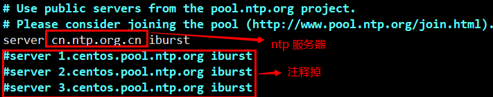

# 1. 【基础命令】

## 1.1. 【shutdown】

* `shutdown`：1分钟后关机
* `shutdown -h now`：现在关机
* `shutdown -h 5`：指定5分钟后关机
* `shutdown -h 05:30`：指定时间关机
* `shutdown -r +10`：10分钟之后重启
* `shutdown -c`：取消
* `shutdown +5 "System will shutdown after 5 minutes"`：5分钟后关机，并广播警告信息

1. **shutdown 命令的工作过程**

    * 当用户执行 shutdown 命令之后，其会通知所有的用户即将关机，并且在这个时间内禁止新用户登录
    * 当到了指定的关机时间时，shutdown 命令会根据参数选项，发送请求给系统的init进程，请求将系统调整到对应参数的状态
    * 系统的关机状态实际上对应的是 Linux 系统里的运行级别 0 ......

2. **所有关机与重启命令**

    * `init` / `shutdown` / `halt` / `poweroff` / `reboot` / `systemctl`

3. **halt、poweroff、reboot 都是 systemctl 命令的链接文件**
    ```
    [root@localhost ~]# ls -l `which reboot` `which poweroff` `which halt` `which shutdown`
    lrwxrwxrwx. 1 root root 16 11月 29 2020 /usr/sbin/halt -> ../bin/systemctl
    lrwxrwxrwx. 1 root root 16 11月 29 2020 /usr/sbin/poweroff -> ../bin/systemctl
    lrwxrwxrwx. 1 root root 16 11月 29 2020 /usr/sbin/reboot -> ../bin/systemctl
    lrwxrwxrwx. 1 root root 16 11月 29 2020 /usr/sbin/shutdown -> ../bin/systemctl
    ```

4. **命令  `sync`  的作用是把内存中的数据强制向硬盘中保存**
    * 此命令在常规关机的命令中其实会自动执行
    * 在关机或重启之前多执行几次 sync 命令，避免数据丢失，多一重保险总是好的

## 1.2. 【uname】
1. **查看系统与内核相关信息**：uname [选项]
    * `-a`：显示全部的信息
    * `-m`：显示电脑类型
    * `-n`：显示主机名称
    * `-r`：显示操作系统内核版本 （3.10.0-957.el7.x86_64）
        * 数字 3 表示主版本号，有结构性变化时才更改
        * 数字 10 表示次版本号，新增功能时才会发生变化，一般奇数表示测试版，偶数表示开发版
        * 数字 0 表示对次版本的修订次数或补丁包数
        * 957 代表编译的次数，每次编译可对少数程序进行优化或修改
        * e17 表示版本的特殊信息，有较大的随意性；el 代表企业版Linux；pp 代表测试版；fc 代表fedora core；rc 代表候选版本
        * x86_64 表示64位
    * `-s`：显示操作系统名称
    * `-v`：显示系统时间

2. **查询当前系统的发行版本**：`lsb_release -a`

3. **查看 centos 版本**
    ```bash
    cat /etc/centos-release
    cat /etc/redhat-release（软连接 -> centos-release）
    cat /etc/system-release（软连接 -> centos-release）
    ```

4. **派生自RHEL的版本**：`cat /etc/centos-release-upstream`
5. **查看系统是32位还是64位**：`getconf LONG_BIT`

## 1.3. 【type】

1. **显示指定命令的类型**
    * `alias`：别名
    * `keyword`：关键字，Shell保留字
    * `function`：函数，Shell函数
    * `builtin`：内建命令，Shell内建命令
    * `file`：文件，磁盘文件，外部命令
    * `not found`：没有找到

2. **格式**：`type [-ta] 命令`
    * `-t`：适用于脚本编程
    * `-a`：显示一个名字的所有可能

* `type -t ls`：alias
* `type -t if`：keyword
* `type -t type`：builtin
* `type -t vi`：file
* `type -t frydsh`：没有输出
* `type -a cd`：cd is a shell builtin 和 cd is /usr/bin/cd

## 1.4. 【hostname】

* `hostname`：查看主机名称
* `hostname 主机名`：临时修改
* **Centos6**：`vi /etc/sysconfig/network`
* **Centos7**：`vi /etc/hostname`

## 1.5. 【date & cal】

1. **date**：显示或设置当前系统的日期和时间
    ```bash
    # 打印系统当前日期或时间
    date                # Mon Oct 25 15:51:07 CST 2021
    date +%F            # 2021-10-25
    date +%Y-%m-%d      # 2021-10-25
    date +%T            # 15:39:27

    # 打印系统非当前日期或时间
    date -d '+3day' +%F        # 2021-10-28
    date -d '-3day' +%F        # 2021-10-22
    date -d '3day' +%F         # 2021-10-28
    date -d '1 day ago' +%F    # 2021-10-24

    # 设置系统日期或时间
    date -s 20211024
    date -s "2021-10-24 01:01:01"
    date -s "2021/10/24 14:30"
    ```

2. **hwclock**：查看或设置硬件时间
    ```bash
    hwclock      # 查看硬件主板时间
    hwclock –w   # 将系统时间同步到主板时间
    hwclock -s   # 通过硬件时间设置系统时间
    ```

3. **cal**：查看日历
    ```bash
    cal           # 显示当前月份的日历
    cal 2016      # 显示 2016 年的日历
    cal 2 2018    # 显示 2018 年 2 月份的日历
    ```

4. **网络时间**
    1. **方式1**
        * NTP（Network Time Protocol）：用来同步网络中各个计算机的时间的协议
        * NTP 授时网站：[http://www.ntp.org.cn/pool](http://www.ntp.org.cn/pool)
        * 安装：`yum install -y ntp ntpdate`
        * ntpd 服务配置文件位置：`/etc/ntp.conf`

        > 1. **手工同步**：`ntpdate cn.ntp.org.cn`
        > 2. **自动同步**：`systemctl start/enable ntpd`
    
    2. **方式2**
        1. `vim /etc/chrony.conf`
            

        2. `systemctl start/enable/restart chronyd.service`
        3. `chronyc -a makestep`：同步时间

## 1.6. 【bc & clear】

1. **bc**
    > * 支持 `+`、`-`、`*`、`/`、`%`、`^` 运算符

    ```
    echo 1+3 | bc

    bc   # 进入交互模式
    「
        10/100
        # 0; 默认 bc 仅输出整数
        # 执行scale=number, 可输出小数点(number: 小数点位数)
        ...
    」
    quit # 退出
    ```

2. **清除屏幕信息**：`clear`

# 2. 【进程与工作管理】

## 2.1. 【关于进程】

1. **进程管理的作用**
    > * 判断服务器健康状态
    > * 查看系统中所有进程
    > * 杀死进程（主要是针对通过正常途径无法结束程序的时候）

2. **创建进程的两种方式**：前台进程 和 后台进程

3. **父进程和子进程**
    > * 每个进程都会包含两个进程ID: 当前进程ID（pid）和父进程ID（ppid）
    > * 由用户运行的大部分命令都将 Shell 作为父进程，使用 `ps -f` 可查看当前进程ID和父进程ID

4. **僵尸进程和孤儿进程**
    1. **孤儿进程**
        > * 正常情况下，子进程被终止时会通过SIGCHLD信号通知父进程，父进程可做一些清理工作或者重新启动一个新进程
        > * 但在某些情况下，父进程会在子进程之前被终止，那么这些子进程就没有了“父亲”，被称为孤儿进程
        > * init 进程会成为所有孤儿进程的父进程。init 的 pid 为 1，是Linux系统的第一个进程，也是所有进程的父进程

    2. **僵尸进程**
        > * 如果一个进程被终止了，但是使用ps命令仍然可以查看该进程，并且状态为Z，那么这就是一个僵尸进程
        > * 僵尸进程虽然被终止了，但是仍然存在于进程列表中
        > * 一般僵尸进程很难杀掉，可先杀死他们的父进程，让他们变成孤儿进程，init进程会自动清理僵尸进程

5. **常驻进程**
    * 常驻进程一般是系统级进程，以root权限运行在后台，可处理其他进程的请求
    * 常驻进程没有终端，不能访问 `/dev/tty` 文件，如果使用 `ps -ef` 查看该进程，tty这一列会显示问号(?)
    * 常驻进程通常运行在后台，等待指定事件发生，例如打印进程是一个常驻进程

## 2.2. 【显示当前进程的快照：ps】

1. **选项**
    `a`：显示所有进程（包括其他用户的进程）
    `u`：显示进程的归属用户及其他详细信息
    `x`: 显示没有控制终端的进程
    `-l`：长格式显示。显示更加详细的信息
    `-e`：显示所有进程

    ```bash
    ps aux  # 查看系统中所有的进程，使用BSD操作系统格式，选项不能加入"-"
    ps -le  # 使用 Linux 标准命令格式
    ```

2. **命令输出信息代表的含义**
    * `F`：说明进程的权限。常见的标志有1和4
        > * 1 表示进程可以被复制，但是不能被执行
        > * 4 表示进程使用超级用户的权限

    * `S`：表示进程的状态
        > * D为不可中断的进程
        > * R为正在运行的进程
        > * S为正在睡眠的进程
        > * T为停止或被追踪的进程
        > * X为死掉的进程
        > * Z为僵死进程

    * `USER`：该进程是由哪个用户产生的
    * `PID`：进程的ID号
    * `PPID`：表示父进程ID
    * `UID`：表示运行此进程的用户ID
    * `C`：表示该进程的CPU使用率
    * `%CPU`：该进程占用CPU资源的百分比
    * `%MEM`：该进程占用物理内存的百分比
    * `SZ`：表示进程占用的内存
    * `PRI`：表示进程的优先级，数越小，优先级越高，越早被CPU执行
    * `NI`：也表示进程的优先级，数值越小，该进程越早被执行
    * `VSZ`：该进程占用虚拟内存的大小，单位KB
    * `RSS`：该进程占用实际物理内存的大小，单位KB
    * `ADDR`：表示该进程的内存位置
    * `TTY`：所在终端
    * `STAT`：进程状态（R：运行、S：睡眠、T：停止状态、s：包含子进程、Z：僵尸、+：位于后台）
    * `WCHAN`：表示该进程是否运行。“-” 代表正在运行
    * `START`：该进程的启动时间
    * `TIME`：该进程占用CPU的运算时间
    * `COMMAND`：产生此进程的命令名

## 2.3. 【实时显示进程动态：top】

1. **选项**
    * `-d 秒数`：指定top命令每隔几秒更新。默认是3秒

2. **交互命令**
    * `?或h`：显示交互模式的帮助
    * `u`：监听指定用户的进程（按u后会让你输入用户名）
    * `P`：以CPU使用率排序，默认就是此项
    * `M`：以内存的使用率排序
    * `N`：以PID排序
    * `q`：退出top

3. **命令输出信息代表的含义**
    * **第1行**
        > * 系统时间、运行时间、登录终端数
        > * 系统负载（分别为1分钟、5分钟、15分钟内的平均值）

    * **第2行**：进程总数、运行中的进程数、睡眠中的进程数、停止的进程数、僵尸进程数
    * **第3行**
        > * 用户占用资源百分比、系统内核占用资源百分比、改变过优先级的进程资源百分比
        > * 空闲的资源百分比、等待输入/输出的进程的占用CPU百分比等

    * **第4行**：物理内存总量、内存空闲量、内存使用量、作为内核缓存的内存量
    * **第5行**：虚拟内存总量、虚拟内存空闲量、虚拟内存使用量、已被提前加载的内存量

4. **非动态打印系统资源的使用情况**：`top -bn1`

## 2.4. 【查看进程树：pstree】

* `pstree [选项] [PID或用户名]`
    * `-a`：显示每个程序的完整指令，包括启动进程的路径、参数等
    * `-u`：显示进程的所属用户
    * `-h`：列出树状图时，特别标明现在执行的程序
    * `-p`：显示进程的PID
    * `-c`：不使用精简标示法
    * `-n`：跟据进程PID号来排序输出，默认是以程序名排序输出的

## 2.5. 【常用信号：进程间通信】

> * Linux系统中通常使用信号（signal）来控制进程
> * 一个信号就代表着一个消息可以传送给一个进程，而进程通过执行信号所要求的操作来响应信号
> * 信号是由一个信号号码和一个信号名来标识，每一个信号都有一个相关的操作

```bash
kill -l
```

| 信号号码 |  信号名  |      事件      |                                     描述                                      |  默认响应  |
| :------: | :-----: | :------------: | :---------------------------------------------------------------------------: | --------- |
|    1     | SIGHUP  |  挂起 Hang up  |                    会造成某些进程在没有终止的情况下重新初始化                     | 退出 Exit |
|    2     | SIGINT  | 中断 Interrupt |                      使用键盘产生的一个中断信号（Ctrl+C）                       | 退出 Exit |
|    9     | SIGKILL |   杀死 Kill    |                   杀死一个进程的信号，一个进程不能忽略这个信号                    | 退出 Exit |
|    15    | SIGTERM | 终止 Terminate | 以一种有序的方式终止一个进程。有些进程会<br>忽略这个信号。Kill 命令默认发送这个信号 |           |

* 8：SIGFPE :point_right: 发生算术运算错误时发出
* 14：SIGALRM :point_right: 时钟定时信号
* 18：SIGCONT :point_right: 恢复执行暂停的进程
* 19：SIGSTOP :point_right: 暂停前台进程，相当于Ctrl+Z

## 2.6. 【终止进程：kill】

1. **kill 格式**：`kill [-l][信号] PID`
    ```bash
    # 列出所有可以发送给系统的信号（信号号码和信号名称）
    kill -l
    
    # 使用 kill 得到指定数值
    kill -l KILL        # 9
    kill -l SIGKILL     # 9
    kill -l SIGHUP      # 1
    
    kill -1 pid号    # 重启进程
    kill -9 pid号    # 强制杀死进程
    ```

2. **killall 格式**：`killall [选项][信号] 进程名`
    * `-i`：交互式，询问是否要杀死某个进程
    * `-I`：忽略进程名的大小写
    * `-s`：发送指定的信号
    * `-v`：报告信号是否发生成功
    * `-e`：要求匹配进程名称
    * `-w`：等待所有被终止的进程停止工作。killall 命令会每秒检查一次，是否还有被杀的进程仍然运行，仅当进程全部停止后才返回

    > * 与 kill 命令不同，killall 命令不是根据PID来终止单个进程，而是通过程序的进程名称来杀死一类进程
    > * killall 命令常与 ps、pstree 等命令配合使用
    > * killall 发送一条信号给所有运行任意指定命令的进程，如果没有指定信号名，则发送 SIGTERM

    ```bash
    [root@yyq-pc ~]$ ps aux | grep "sshd" | grep -v "grep"
    root        757  0.0  0.4 112900  4368 ?        Ss   Nov15   0:00 /usr/sbin/sshd -D
    root      21949  0.0  0.6 161836  6952 ?        Ss   01:46   0:00 sshd: root@pts/1
    root      21951  0.0  0.6 161496  6336 ?        Ss   01:46   0:00 sshd: root@notty
    root      22187  0.0  0.6 161836  6864 ?        Ss   04:10   0:00 sshd: root@pts/0
    root      22189  0.0  0.6 161496  6344 ?        Ss   04:10   0:00 sshd: root@notty
    
    [root@yyq-pc ~]$ killall -i sshd
    Kill sshd(757) ? (y/N) n
    Kill sshd(21949) ? (y/N) n
    Kill sshd(21951) ? (y/N) n
    Kill sshd(22187) ? (y/N) n
    Kill sshd(22189) ? (y/N) n
    sshd: no process found
    ```

3. **pkill 格式**：`pkill [选项] [信号] 进程名`
    * `-t 终端号`：按照终端号踢出用户

    ```bash
    pkill -t -9 pts/1
    ```

## 2.7. 【进程优先级】

* 表示进程优先级的有两个参数：Priority 和 Nice
    
    > * 这两个值都表示优先级，数值越小代表该进程越优先被CPU处理

```bash
ps -le
「
    F S UID PID PPID C PRI NI ADDR SZ WCHAN TTY TIME CMD
    ...
」
    ↘ PRI 代表 Priority。由内核动态调整，用户不能直接修改
    ↘ NI 代表 Nice。可通过修改NI值来影响PRI值，间接地调整进程优先级
    ↘ PRI (最终值) = PRI (原始值) + NI
```

1. **修改 NI 值时的注意事项**
    * NI范围是 `-20~19`
    * 普通用户调整 NI 值的范围是 `0~19`，而且只能调整自己的进程
    * 普通用户只能调高 NI 值，而不能降低。如原本 NI 值为0，则只能调整为大于0
    * 只有root用户才能设定进程 NI 值为负值，而且可以调整任何用户的进程

2. **改变进程优先级**：nice、renice
    1. **nice**：可给新执行的命令直接赋予NI值，但是不能修改已经存在进程的NI值
        * **格式**：`nice [选项] 命令`
            * `-n NI值`：给命令赋予NI值

        ```bash
        nice -n -5 service httpd start
        ```

    2. **renice**：可修改已经存在进程的NI值
        * **格式**：renice [优先级] PID

        ```bash
        renice -10 2125
        ```

## 2.8. 【后台进程】

1. **把进程加入后台**
    * **方式1**：`命令 &` :point_right: 放入后台执行
    * **方式2**：`命令，Ctrl+Z` :point_right: 放入后台暂停

2. **查看后台的工作**
    * **格式**：`jobs [选项]`
        * `-l`：显示进程号
        * `-r`：仅列出正在后台run的工作
        * `-s`：仅列出正在后台当中暂停的工作

    > * `+` 号代表最近一个放入后台的工作，也是工作恢复时，默认恢复的工作
    > * `-` 号代表倒数第二个放入后台的工作

3. **将作业放到后台运行**：bg
    * `bg 1`： :point_right: 将任务号为1的任务放到后台继续执行
    * 使用 bg 命令与在指令后面添加符号 `&` 的效果是一样的

4. **将作业放到前台运行**：fg
    * 与 bg 命令一样，若后台任务中只有一个，则使用该命令时，可以省略任务号
    * `fg 1` :point_right: 将任务号为1的任务从后台执行转换到前台执行

5. **后台命令脱离终端运行**
    > * :question: 把命令放入后台，只能在当前登录终端执行。如果是远程管理的服务器，在远程终端执行了后台命令，这时退出登录，那么这个后台命令还能继续执行吗？当然是不行的，这个后台命令会被中止

    * **方法1**. 把需要在后台执行的命令加入 `/etc/rc.local` 文件
        
        > * :question: 服务器是不能随便重启的，如果有临时后台任务，就不能执行了
        
    * **方式2**. 使用系统定时任务。这样放入后台的命令与终端无关
    * **方式3**. 使用 nohup 命令
        > * 让后台工作在离开操作终端时，也能够正确地在后台执行
        > * **格式**：`nohup [命令] &`

## 2.9. 【根据进程名查询进程ID：pgrep】

* `-l`：同时显示进程名和PID
* `-o`：进程起始的ID
* `-n`：进程终止的ID

```bash
[root@yyq-pc ~]$ pgrep systemd
1
364
389
523

[root@yyq-pc ~]$ pgrep -l systemd
1 systemd
364 systemd-journal
389 systemd-udevd
523 systemd-logind

[root@yyq-pc ~]$ pgrep -lo systemd
1 systemd

[root@yyq-pc ~]$ pgrep -ln systemd
523 systemd-logind
```

# 3. 【系统资源查看】

## 3.1. 【显示虚拟内存状态：vmstat】

1. **格式**：`vmstat [刷新延时 刷新次数]`
2. **命令输出信息介绍**
    ```bash
    [root@yyq-pc /tmp]$ vmstat 1 3    # 监听3次每次间隔1秒
    procs -----------memory---------- ---swap-- -----io---- -system-- ------cpu-----
    r  b   swpd   free   buff  cache   si   so    bi    bo   in   cs us sy id wa st
    2  0      0 290672   2028 535348    0    0     3    14   14   20  0  0 100  0  0
    0  0      0 290672   2028 535348    0    0     0     0   14   17  0  0 100  0  0
    0  0      0 290672   2028 535348    0    0     0     0   18   21  0  0 100  0  0
    ```

    > * 建议多关注 r、b、free、bi、bo、id、wa 这几列

    * 【r】
        > * 表示运行和等待cpu时间片的进程数
        > * 若长期大于服务器cpu的个数，则说明cpu不够用了

    * 【b】等待资源的进程数。如果长时间大于1，则需要关注一下了
    * 【swpd】表示切换到交换分区中的内存数量
    * 【free】当前空闲的内存数量
    * 【buff】缓冲大小
    * 【cache】缓存大小
    * 【si】由交换区写入到内存的数据量
    * 【so】由内存写入到交换区的数据量
    * 【bi】从块设备读取数据的量(读磁盘)
    * 【bo】从块设备写入数据的量(写磁盘)
    * 【in】表示在某一时间间隔中观测到的每秒设备中断数
    * 【cs】表示每秒产生的上下文切换次数
    * 【us】显示了用户下所花费cpu时间的百分比
    * 【sy】显示系统花费cpu时间百分比
    * 【id】表示cpu处于空闲状态的时间百分比
    * 【wa】表示I/O等待所占用cpu时间百分比
    * 【st】表示被偷走的cpu所占百分比（一般都为0，不用关注）

## 3.2. 【显示开机信息：dmesg】

> * 用于检查和控制内核的环形缓冲区
> * kernel 会将开机信息存储在 ring buffer 中。如果开机时来不及查看信息，可利用 dmesg 来查看
> * 开机信息保存在 `/var/log/dmesg` 文件里

```bash
dmesg | grep -i memory
dmesg | grep -i cpu
dmesg -c   # 显示信息后，清除ring buffer中的内容
```

## 3.3. 【显示系统内存情况：free】

1. **文件方式**：`cat /proc/meminfo`
    ```
    MemTotal:        2030172 kB      --- 内存总的容量
    MemFree:         1738164 kB      --- 内存的空闲容量
    MemAvailable:    1714096 kB      --- 内存的可用容量
    Buffers:            2076 kB      --- baffer 空间
    Cached:            90616 kB      --- cacahe 空间
    SwapCached:            0 kB      --- 交换分区使用情况
    ```

    * **内存总的容量** = 进程占用空间 + buffer + cacahe + 可用容量
    * **空闲容量** = 可用容量 + buffer 和 cacahe 中的可用空间

2. **命令方式**：`free -h`

## 3.4. 【显示CPU有关信息：lscpu】

1. **文件方式查看**：`cat /proc/cpuinfo`

    ```
    model name: Intel(R) Core(TM) i5-8400 CPU @ 2.80GHz  -- CPU品牌型号
        physical id : 0                                      -- 表示CPU颗数  1颗
        processor : 0                                        -- 表示CPU核数  1核
        cpu cores : 1

        physical id : 0   第一段  physical id  : 0            -- 有两颗CPU
        physical id : 0   第二段
        physical id : 1   第三段  physical id  : 1
        physical id : 1   第四段

        physical id : 0   processor : 0                     -- 一颗CPU有两个核心
        physical id : 0   processor : 1
        cpu cores : 2

        physical id : 1   processor : 0                     -- 一颗CPU有两个核心
        physical id : 1   processor : 1
        cpu cores : 2

        总共服务器有多少颗CPU 有多少核心 ?
        有两颗CPU --> 2路的服务器
        有4核心
    ```

2. **命令方式查看**：`lscpu` :point_right: 调取 cpuinfo 文件中的内容

    ```
    Socket(s):(插槽)              2    --- 显示服务器CPU颗数
    Core(s) per socket:          2    --- 每颗CPU有几核
    CPU(s):                      4    --- 整个服务器有几核
    ```

## 3.5. 【负载】

> * **负载**：CPU 处理任务过多

1. **文件方式**：`cat /proc/loadavg`

    ```
    0.00         0.01           0.05              负载值CPU核数有关
    1分钟平均   5分钟平均负载   15分钟平均负载

    eg:
    服务器 4 核的服务器   -- 负载值3左右，就要关注
    服务器 128核的服务器 -- 负载值超过100，就要关注 (数据库服务器)
    ```

2. **命令方式**：`uptime` 、`w` 或 `top`

## 3.6. 【系统总的启动时间】

* **方式1**. `cat /proc/uptime` :point_right: 系统总的启动时间和空闲时间，以秒为单位
* **方式2**. `w`
* **方式3**. `top`
* **方式4**. `uptime`
    ```bash
    uptime
    # 13:35:22 up 1 day,  8:49,  1 user,  load average: 0.00, 0.01, 0.05
    
    uptime -p  # 以漂亮的格式显示机器正常运行的时间
    # up 1 day, 8 hours, 49 minutes
    
    uptime -s  # 系统自开始运行时间
    # 2021-11-15 04:46:18
    ```

## 3.7. 【系统挂载信息】

* **方式1**. `cat /proc/mounts`
* **方式2**. `df -h`
* **方式3**. `lsblk`

## 3.8. 【内核版本信息】

1. **文件方式**：`/proc/version`
2. **命令方式**：`uname  -r`

## 3.9. 【列出进程调用或打开文件的信息：lsof】

* **选项**
    * `-c 字符串`：只列出以字符串开头的进程打开的文件
    * `-u 用户名`：只列出某个用户的进程打开的文件
    * `-p pid`：列出某个PID进程打开的文件
    * `+d`：后面接目录，亦即找出某个目录下面已经被打开的文件

```bash
lsof         # 将目前系统上面已经打开的文件全部列出来
lsof -p 1    # 查询PID是1的进程调用的文件
lsof -u root | grep bash
lsof +d /dev
```

## 3.10. 【使用文件或文件结构识别进程：fuser】

* **格式**：`fuser [-umv] [-k [i] [-signal]] file/dir`
    * `-u`：显示进程所属的用户名
    * `-v`: 列出每个文件与指令的完整相关性
    * `-m`：指定一个被加载的文件系统或一个被加载的块设备；对umount不成功很有效
    * `-k`：杀死访问指定文件的所有进程
    * `-i`：必须与 `-k` 配合，杀死进程前需要用户进行确认
    * `-signal`：指定使用的进程信号；默认为-9

```bash
[root@yyq-pc /tmp]$ fuser -uv .
                     USER        PID ACCESS COMMAND
/tmp:                root      20554 ..c.. (root)bash
                     root      20701 ..c.. (root)vim
                     root      20702 ..c.. (root)vim

:<<EOF
ACCESS 项目代表的含义（指示进程如何使用文件）
    c => 此程序在当前的目录下（非次目录）
    e => 可被触发为执行状态
    f => 是一个被打开的文件
    r => 代表顶层目录
    F => 该文件被打开了，不过在等待回应中
    m => 可能为分享的动态函数库
EOF
```

## 3.11. 【性能检测工具：dstat】

> * dstat 命令是一个综合性能检测工具，被认为可以取代 vmstat、iostat、netstat、ifstat 等命令的功能
> * dstat 命令克服了这些命令的不足，增强了监控选项，使用起来也更加灵活
> * 还可以把 dstat 命令的执行结果保存到 `.csv` 文件中，供第三方工具或脚本分析利用

1. **格式**：`dstat [间隔时间] [刷新次数] [选项]`
    * **间隔时间**：设定数据刷新间隔时间
    * **刷新次数**：默认会一直输出信息，除非按 Ctrl+C 中止。设置次数，到次数自动中止
    * **选项**：
        * `-c`：显示CPU使用情况
        * `-l`：显示平均负载统计
        * `-m`：显示内存使用统计
        * `-d`：显示硬盘使用统计
        * `-g`：显示内存分页统计
        * `-n`：显示网络使用统计
        * `-s`：显示 swap 使用统计
        * `-y`：显示系统信息（system）统计
        * `--tcp`：显示TCP连接信息统计
        * `--udp`：显示UDP连接信息统计
        * `--top-cpu`：显示占用CPU资源最大的进程
        * `--top-mem`：显示占用内存资源最大的进程
        * `--top-io`：显示占用输入/输出资源最大的进程
        * `--proc-count`：显示进程总数

2. **dstat 命令基本输出信息解释**
```bash
[root@yyq-pc ~]# dstat 1 3
You did not select any stats, using -cdngy by default.
----total-cpu-usage---- -dsk/total- -net/total- ---paging-- ---system--
usr sys idl wai hiq siq| read  writ| recv  send|  in   out | int   csw
  0   0 100   0   0   0|2047B  925B|   0     0 |   0     0 |  14    20
  0   0 100   0   0   0|   0     0 |  60B  198B|   0     0 |  14    18
  0   0 100   0   0   0|   0     0 |  60B  118B|   0     0 |  17    20
  0   0 100   0   0   0|   0     0 |  60B  118B|   0     0 |  17    18
```

* `total-cpu-usage`：统计 CPU 使用信息
    > * `usr`：用户模式所占 CPU 百分比
    > * `sys`：系统模式所占 CPU 百分比
    > * `idl`：空闲 CPU 百分比
    > * `wai`：等待输入/输出的进程占用 CPU 的百分比
    > * `hiq`：硬中断请求服务占用 CPU 的百分比
    > * `siq`：软中断请求服务占用 CPU 的百分比

* `dsk/total`：磁盘使用统计
    > * `read`：读取总大小
    > * `writ`：写入总大小

* `net/total`：网络使用统计
    > * `recv`：接收数据包大小
    > * `send`：发送数据包大小

* `paging`：内存分页统计
    > * `in`：数据换入
    > * `out`：数据换出

* `system`：系统状态
    > * `int`：中断次数
    > * `csw`：上下文切换

```bash
# 1. 【查看系统中占用CPU资源最大的进程】
# --top-cpu 要写在刷新间隔时间和刷新次数前面，否则该选项不起作用
# 刷新间隔时间不要太短，否则有可能捕捉不到信息
[root@yyq-pc ~]# dstat --top-cpu 3 3
-most-expensive-
  cpu process
python2      0.0

kworker/0:0  0.3

# 2.【把 dstat 命令的执行结果保存到 .csv 文件中】
[root@yyq-pc ~]# dstat --output dstat.csv 1 3
```

# 4. 【系统定时任务】

* **软件种类**
    * `at`：一次性执行定时任务
    * `cronie`：循环执行定时任务
    * `cronie-anacron`：非 7*24 小时运行的服务器，应用在家用电脑
        
        > * anacron 会使用 1天、7天、一个月作为检测周期，用来判断是否有定时任务在关机之后没有执行。如果有这样的定时任务，那么 anacron 会在特定的时间重新执行这些定时任务

## 4.1. 【一次性执行定时任务】

1. **查看 atd 服务是否启动**

    ```bash
    systemctl status atd.service
    systemctl restart atd.service
    systemctl enable atd.service
    ```

2. **at 命令的访问控制**：设置白名单与黑名单
    * 系统中默认只有 `/etc/at.deny` 文件，而且这个文件是空的，这样系统中所有的用户都可以使用 at 命令
    * 如果系统中这两个文件都不存在，那么只有 root 用户可以使用at 命令
    * 写入 `/etc/at.deny` 中的用户不能使用 at 命令，当然，这个文件对 root 用户无效
    * `/etc/at.allow` 文件的优先级更高，如果 `/etc/at.allow` 文件存在，则 `/etc/at.deny` 文件失效

3. **格式**：`at [-mldv] time`
    * `-m`：当 at 调度完成后，以 email 通知使用者该工作已完成
    * `-l`：列出所有该使用者的 at 调度（at -l <=> atq）
    * `-d 工作号码`：取消指定工作号码对应的at调度（at -d <=> atrm）
    * `-c 工作号码`：列出指定工作的指令内容
    * `time`：定义执行 at 工作的时间
        * `HH:MM`：表示在今日 HH:MM 时刻进行，若该时刻已超过，则在明天的这个时候执行
        * `HH:MM YYYY-MM-DD`
        * `HH:MM[am|pm] [Month] [Date]`
            
            > * `04pm July 30`
            
        * `HH:MM[am|pm] + number [minutes|hours|days|weeks]`：在指定的时间 “再加多久” 执行命令
            
            > * `now + 5 minutes`、`05am +2 hours`
    
4. **范例**
    ```bash
    # 10分钟后，给自己发送一封邮件
    [root@yyq-pc ~]# at now + 1 minutes
    at> mail -s "您有新的消息，请注意查收!" root
    at> 邮件内容 ...
    at> 邮件内容 ...
    at> <EOT>       # 按 Ctrl + D 保存 at 任务
    job 1 at Tue Nov 23 14:34:00 2021
    
    # at可以在一个工作内输入多个指令
    [root@yyq-pc ~]# at 22:30
    at> echo "Linux"
    at> echo "Java"
    at> echo "PHP"
    at> <EOT>
    job 2 at Tue Nov 23 22:30:00 2021
    [root@yyq-pc ~]# at -c 2    # 将第2项工作内容列出来
    ```

    > * at 任务一旦使用 Ctrl+D 保存，实际上就将其写入了 `/var/spool/at` 目录中，这个目录中的文件可以直接被 atd 服务调用和执行

## 4.2. 【循环执行定时任务：crond】

> * crond 进程每分钟会定期检查是否有要执行的任务，如果有要执行的任务，则自动执行该任务

1. **查看 crond 服务是否启动**
    ```bash
    systemctl list-unit-files | grep crond
    systemctl status crond.service
    systemctl start crond.service
    systemctl enable crond.service
    ```

2. **使用者的设置**：`/etc/cron.allow` 和 `/etc/cron.deny`

3. **定时任务实现方法**
    * 方式1. **系统特殊目录**
        * 控制定时任务目录（按每小时）：`/etc/cron.hourly`
        * 控制定时任务目录（按每一天）：`/etc/cron.daily`
        * 控制定时任务目录（按每一周）：`/etc/cron.weekly`
        * 控制定时任务目录（按每个月）：`/etc/cron.monthly`

    * 方式2. **vi /etc/crontab**

        ```bash
        [root@yyq-pc ~]$ vi /etc/crontab
        SHELL=/bin/bash
        PATH=/sbin:/bin:/usr/sbin:/usr/bin
        MAILTO=root
        
        # For details see man 4 crontabs
        
        # Example of job definition:
        # .---------------- minute (0 - 59)
        # |  .------------- hour (0 - 23)
        # |  |  .---------- day of month (1 - 31)
        # |  |  |  .------- month (1 - 12) OR jan,feb,mar,apr ...
        # |  |  |  |  .---- day of week (0 - 6) (Sunday=0 or 7) OR sun,mon,tue,wed,thu,fri,sat
        # |  |  |  |  |
        # *  *  *  *  * user-name  command to be executed
        ```

        * 第1行 SHELL 变量指定了系统要使用哪个 Shell，这里是Bash
        * 第2行 PATH 变量指定了系统执行命令的路径
        * 第3行 MAILTO 变量指定了 crond 的任务执行信息将通过电子邮件发送给root用户
            
            > * 如果 MAILTO 变量的值为空，则表示不发送任务执行信息给用户
    
        > * 修改 `/etc/crontab` 这种方法只有 root 用户能用，用于直接给其他用户设置计划任务
    
    * 方式3. **crontab -e**
        * **用户定时任务查看**：`crontab -l`
            
            > * **定时任务保存文件**：`/var/spool/cron/用户名`
    
4. **格式**：`crontab [-u user] [file]` 或 `crontab [-u user] [-e|-l|-r |-i]`
    * `-u user`：用来设定某个用户的 crontab 服务。只有root才能进行该任务，即帮其他使用者创建/移除crontab工作调度
    * `file`：将file作为crontab的任务列表文件并载入crontab
    * `-e`：编辑crontab定时任务，如果不指定用户，则表示编辑当前用户的crontab文件
    * `-l`：查询crontab任务，如果不指定用户，则表示显示当前用户的crontab文件内容
    * `-r`：从 /var/spool/cron 目录中删除某个用户的 crontab 文件，如果不指定用户，则默认删除当前用户的crontab文件
    * `-i`：在删除用户的crontab文件时给确认提示

    ```bash
    [root@yyq-pc ~]$ crontab -e    # 进入 crontab 编辑界面
    # 【定时任务的格式】* * * * * 执行的任务
    ↘ 分 时 天 月 周
    ↘ 第一个 “*”  =>  1小时当中的第几分钟（0-59）
    ↘ 第二个 “*”  =>  1天当中的第几小时（0-23）
    ↘ 第三个 “*”  =>  1个月当中的第几天（1-31）
    ↘ 第四个 “*”  =>  1年当中的第几月（1-12）
    ↘ 第五个 “*”  =>  1周当中的星期几（0-7: 0和7都代表星期日）
    
    # 对于不指定的字段，要用 `*` 来填补其位置。同时，还可以使用以下特殊字符
    ↘ *  => 代表任何时间【比如第一个“*”就代表1小时中每分钟都执行一次的意思】
    ↘ ,  => 代表不连续的时间
    ↘ -  => 代表连续的时间范围
    ↘ */n  => 代表每隔多久执行一次
    ```

5. **范例**
    ```bash
    45 22 * * * 命令        # 在22点45分执行命令
    0 17 * * 1 命令         # 每周1的17点0分执行命令
    0 5 1,15 * * 命令       # 每月1号和15号的凌晨5点0分执行命令
    40 4 * * 1-5 命令       # 每周一到周五的凌晨4点40分执行命令
    */10 4 * * * 命令       # 每天的凌晨4点，每隔10分钟执行一次命令
    
    */1 * * * * echo "yiyiqiang $(date +\%Y-\%m-\%d)" >> /tmp/yyq.log
    # 因为 % 在 crontab 中有特殊含义，所以必须转义
    
    0 */2 * * * /usr/local/apache2/apachectl restart
    0 5 1,10,15 * * /bin/sh test.sh &>/dev/null
    ```

6. **定时任务排查方法**
    * 检查是否有定时任务配置文件：`cat /var/spool/cron/用户名`
    * 检查定时任务日志文件：`cat /var/log/cron`

6. **定时任务编写注意事项：（规范）**
    1. 编写定时任务要有注释说明
    2. 编写定时任务时，命令和路径信息尽量使用绝对路径
    3. 编写定时任务时，可以将输出到屏幕上的信息保存到黑洞中，避免占用磁盘空间
        > `* * * * * /bin/sh test.sh &>/dev/null`

        1. 定时任务中执行命令，如果有产生输出到屏幕的信息，都会以邮件方式告知用户
            > * `/var/spool/mail/用户名`：不断变大占用磁盘空间，占用的 block 空间
            > * 解决方法：将邮件服务关闭：`systemctl stop postfix`

        2. 将邮件服务关闭后，`/var/spool/postfix/maildrop/` 会不断产生小文件 占用磁盘空间，占用的 inode 空间
            > 解决方法1：删除小文件：`rm -f /var/spool/postfix/maildrop/*`
            > 解决方法1：`systemctl start postfix`

        > * **【总结】** 建议命令后都加上：`&>/dev/null` 即可

    4. 编写定时任务时，尽量不要产生屏幕输出信息
        
        > * 如压缩文件时，可去掉 "-v" 选项
        
    5. 当需要多个命令完成一个定时任务需求时，可以利用脚本编写定时任务
    
        ```bash
        vim backup.sh
            cp -a /data /backup
            tar zcvf /backup/data.tar.gz /data
    
        crontab -e
            * * * * *  /bin/sh /server/scripts/backup.sh &>/dev/null
        ```
    
    6. 定时任务执行的脚本要存放到规范路径下，如：`/server/scripts` 和 `/usr/local/sbin`

# 5. 【SELinux】

* **关闭 selinux**
    * `getenforce`：查看 selinux 服务是否开启
    * `setenforce 0`：临时关闭 selinux 服务
    * `setenforce 1`：临时开启 selinux 服务
    * `vi /etc/selinux/config`：永久关闭
        > * `enforcing`：selinux 服务处于正常开启状态
        > * `permissive`：selinux 服务被临时关闭了
        > * `disabled`：selinux 服务彻底关闭

        * 输入：`SELINUX=disabled`
        * 如果想让 selinux 配置文件生效，重启系统
