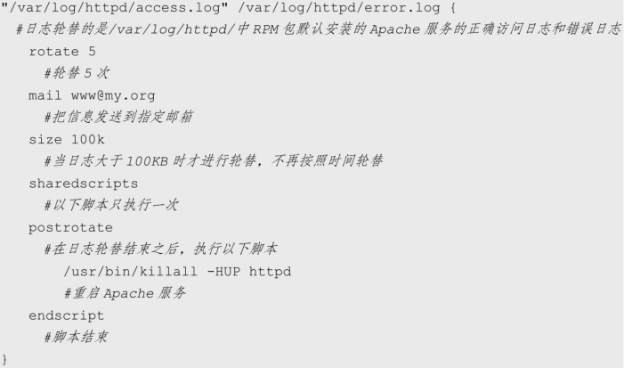
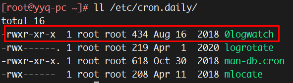

# 1. 【介绍】

1. **日志相关服务**
    * systemd 通过 `systemd-journald.service` 服务来管理日志
        > `systemd-journald.service` 服务产生的日志是保存在内存当中的。一旦系统重启，内存中的数据就会消失

    * `rsyslog.service` 服务在 CentOS 7.x 中依然生效
        > 通过 `rsyslog.service` 服务记录的日志是存储在硬盘上的，是永久生效的
    ```bash
    ps aux | grep rsyslogd   # 查看服务是否启动
    systemctl list-unit-files | grep rsyslog  # 查看服务是否自启动
    ```

    > * 系统中的绝大多数日志文件是由 rsyslogd 服务来统一管理的，只要各个进程将信息给予这个服务，它就会自动地把日志按照特定的格式记录到不同的日志文件中。也就是说，采用 rsyslogd 服务管理的日志文件，它们的格式应该是统一的
    > * 在 Linux 系统中，有一部分日志不是由 rsyslogd 服务来管理的，如 Apache 服务，它的日志是由 Apache 软件自己产生并记录的，并没有调用 rsyslogd 服务。但是，为了便于读取，Apache 日志文件的格式和系统默认日志文件的格式是一致的

2. **常见日志的作用**
    * `/var/log/message`：记录系统重要信息的日志
    * `/var/log/secure`：记录验证和授权方面的信息，只要涉及账户和密码的程序都会记录
    * `/var/log/cron`：记录系统定时任务相关的日志
    * `/var/log/cups/`：记录打印信息的日志
    * `/var/log/dmesg`：记录系统在开机时内核自检的信息
    * `/var/log/btmp`：要使用 `lastb` 命令查看
    * `/var/log/lastlog`：二进制文件，要使用 `lastlog` 命令查看
    * `/var/log/mailog`：记录邮件信息
    * `/var/log/wtmp`：需使用 `last` 命令查看
    * `/var/run/utmp`：要使用 `w`，`who`，`users` 等命令来查询

    > * 除系统默认的日志之外，RPM 包默认安装的系统服务也会默认把日志记录在 `/var/log/` 目录中
    > * 源码包安装的服务日志是在源码包指定目录中
    > * 系统默认日志之外的日志都不是由 rsyslogd 服务来记录和管理的，而是各个服务使用自己的日志管理文档来记录自身日志

3. **日志文件的格式**
    * 只要是由日志服务 rsyslogd 记录的日志文件，它们的格式都是一样的
    * 日志文件的格式包含以下 4 列：
        * 事件产生的时间
        * 产生事件的服务器的主机名
        * 产生事件的服务名或程序名
        * 事件的具体信息

    ```bash
    [root@yyq-pc ~]# tail -5 /var/log/secure
    Nov 23 14:33:26 yyq-pc polkitd[523]: Unregistered Authentication Agent for unix-process:4399:12779875 (system bus name :1.338, object path /org/freedesktop/PolicyKit1/AuthenticationAgent, locale en_US.UTF-8) (disconnected from bus)
    Nov 23 14:35:10 yyq-pc atd[4408]: pam_unix(atd:session): session opened for user root by (uid=0)
    Nov 23 22:48:00 yyq-pc atd[4578]: pam_unix(atd:session): session opened for user root by (uid=0)
    Nov 23 22:48:00 yyq-pc atd[4578]: pam_unix(atd:session): session opened for user root by (uid=0)
    Nov 23 22:48:00 yyq-pc atd[4578]: pam_unix(atd:session): session closed for user root
    ```

# 2. 【rsyslogd 服务的配置文件】

1. **配置文件的格式**
    * rsyslogd 服务的配置文件 `/etc/rsyslog.conf` 主要定义了服务名称、日志等级和日志记录位置

    ```bash
    [root@yyq-pc ~]# less /etc/rsyslog.conf
    ...
    uucp,news.crit            /var/log/spooler
    authpriv.*                /var/log/secure
    # 服务名称[连接符号]日志等级 日志记录位置
    ```

2. **常用服务**
    * `auth`：安全和认证相关消息
    * `authpriv`：安全和认证相关消息（私有的）
    * `cron`：系统定时任务 cront 和 at 产生的日志
    * `daemon`：和各个守护进程相关的日志
    * `ftp`：ftp 守护进程产生的日志
    * `kern`：内核产生的日志
    * `local0-local7`：为本地使用预留的服务
    * `mail`：邮件收发信息
    * `syslog`：syslogd 服务产生的日志信息
    * `user`：用户等级类别的日志信息

    > * 这些日志服务名称是 rsyslogd 服务自己定义的，并不是实际的 Linux 系统的服务
    > * 当有服务需要委托 rsyslogd 服务来代为管理日志时，只需要调用这些服务的名称就可以实现日志的委托管理

3. **连接符号**
    * `.`：只要比后面的等级高的（包含该等级）日志都记录下来
    * `.=`：只记录所需等级的日志，其他等级的都不记录
    * `.!`：除了该等级的日志外，其他等级的日志都记录

4. **日志等级**
    * `*`：代表所有日志等级
    * `debug`：一般的调试信息说明
    * `info`：基本的通知信息
    * `notice`：普通信息
    * `warning`：警告信息
    * `err`：错误信息
    * `crit`：临界状况信息，比 err 等级还要严重
    * `alert`：警告状态信息，比 crit 还要严重。必须立即采取行动
    * `emerg`：疼痛等级信息，系统已经无法使用了

    > 日志等级还可以被识别为 “none”。如果日志等级是 none，则说明忽略这个服务，该服务的所有日志都不再记录

# 3. 【日志记录位置】

1. **日志文件的绝对路径**：如 `/var/log/secure`
2. **发送给打印机设备**：如 `/dev/lp0`
3. **转发给远程主机**
    > * `@192.168.0.210:514`：把日志内容使用 UDP 协议发送到 192.168.0.210 的 UDP 514端口上
    > * `@@192.168.0.210:514`：把日志内容使用 TCP 协议发送到 192.168.0.210 的TCP 514端口上
    > * 当然，只要 192.168.0.210 同意接收此日志，就可以把日志内容保存在日志服务器上

4. **发送给指定用户名**
    > * 如果是 “root”，就会把日志发送给 root 用户，当然 root 用户要在线，否则接收不到日志信息
    > * 当发送日志给用户时，可以使用 `*` 代表发送给所有在线用户，如 `mail.*　*` 就会把 mail 服务产生的所有级别的日志发送给所有在线用户。如果需要把日志发送给多个在线用户，则用户名之间用 `,` 分隔

5. **忽略或丢弃日志**
    > * 如果接收日志的对象是 `~`，则代表这个日志不会被记录，而被直接丢弃  
    >    * 如 `local3.*　~` 代表 local3 服务类型所有的日志都不被记录

<hr style="height:20px;"/>

1. **自定义日志文件**

    ```bash
    [root@yyq-pc ~]# vi /etc/rsyslog.conf
    *.crit     /var/log/alert.log
    # 把所有服务的 “临界点” 以上的错误都保存在 /var/log/alert.log 日志文件中

    [root@yyq-pc ~]# systemctl restart rsyslog.service
    [root@yyq-pc ~]# ll /var/log/alert.log
    ```

2. **日志服务器的设置**

    ```bash
    # 【服务端设置】192.168.0.210
    [root@yyq-pc ~]# vi /etc/rsyslog.conf
    ...
    #$ModLoad imtcp
    #$InputTCPServerRun 514
    # 取消这两句话的注释，允许服务器使用 TCP 514 端口接收日志

    [root@yyq-pc ~]# systemctl restart rsyslog.service
    [root@yyq-pc ~]# netstat -tuln | grep 514

    # 【客户端设置】
    [root@yyq-pc ~]# vi /etc/rsyslog.conf
    *.*     @@192.168.0.210:514
    [root@yyq-pc ~]# systemctl restart rsyslog.service
    ```

    > 日志服务是通过主机名来区分不同的服务器的。所以，如果配置了日志服务，则需要给所有的服务器分配不同的主机名

# 4. 【日志轮替】

1. **日志文件的命名规则**
    > * 日志轮替最主要的作用就是把旧的日志文件移动并改名，同时建立新的空日志文件，当旧的日志文件超出保存的范围时就删除
    > * 日志文件的改名主要依靠 `/etc/logrotate.conf` 配置文件中的 dateext 参数

    1. 如果配置文件中拥有 “dateext” 参数
        * 日志会用日期来作为日志文件的后缀，例如 “secure-20130605”
        * 这样的话日志文件名不会重叠，所以也就不需要日志文件的改名
        * 只需要保存指定的日志个数，删除多余的日志文件即可

    2. 如果配置文件中没有 “dateext” 参数
        * 日志文件就需要进行改名了
        * 当第一次进行日志轮替时，当前的 “secure” 日志会自动改名为 “secure.1”，然后新建 “secure” 日志，用来保存新的日志
        * 当第二次进行日志轮替时，“secure.1” 会自动改名为 “secure.2”，当前的 “secure” 日志会自动改名为 “secure.1”，然后也会新建 “secure” 日志，用来保存新的日志，以此类推

2. **logrotate 配置文件**

    ```bash
    [root@yyq-pc ~]# egrep -v '^#|^$' /etc/logrotate.conf
    weekly        # 每周对日志文件进行一次轮替
    rotate 4      # 保存4个日志文件。也即，如果进行了5次日志轮替，就会删除第一个备份日志
    create        # 在进行日志轮替时，自动创建新的日志文件
    dateext       # 使用日期作为日志轮替文件的后缀
    include /etc/logrotate.d   # 日志轮替的子配置文件

    # 以上日志配置为默认配置。如果需要轮替的日志没有设定独立的参数，那么都会遵循以上配置
    # 如果轮替日志配置了独立参数，那么独立参数的优先级更高
    # 以下两个轮替日志有自己的独立参数，如果和默认的参数冲突，则独立参数生效
    /var/log/wtmp {
        monthly                 # 每月对日志文件进行一次轮替
        create 0664 root utmp   # 建立的新日志文件，权限是0664，所有者是root，所属组是utmp用户组
            minsize 1M          # 日志一定要超过1MB才会轮替，否则就算时间达到一个月，也不进行日志轮替
        rotate 1                # 仅保留一个日志备份。也就是只有wtmp和wtmp.1日志保留而已
    }
    /var/log/btmp {
        missingok               # 如果日志不存在，则忽略该日志的警告信息
        monthly
        create 0600 root utmp
        rotate 1
    }
    ```

    * **logrotate 配置文件的主要参数**
        * `daily`：日志的轮替周期是每天
        * `weekly`：日志的轮替周期是每周
        * `monthly`：日志的轮替周期是每月
        * `rotate 数字`：保留的日志文件的个数。0 指没有备份
        * `compress`：日志轮替时，旧的日志进行压缩
        * `create mode owner group`：建立新日志时指定新日志的权限与所有者和所属组
        * `mail address`：当日志轮替时，输出内容通过邮件发送到指定的邮件地址
        * `missingok`：如果日志不存在，则忽略该日志的警告信息
        * `notifempty`：如果日志为空文件，则不进行日志轮替
        * `minsize 大小`：日志轮替的最小值。即日志一定要达到最小值才会轮替，否则就算时间达到也不轮替
        * `size 大小`：日志只有大于指定大小才进行日志轮替，而不是按照时间轮替
        * `dateext`：使用日期作为日志轮替文件的后缀
        * `sharedscripts`：在此关键字之后的脚本只执行一次
        * `prerotate/endscript`：在日志轮替之前执行脚本命令。endscript标识prerotate脚本结束
        * `postrotate/endscript`：在日志轮替之后执行脚本命令。endscript标识postrotate脚本结束

            

        > * prerotate 和 postrotate 主要用于在日志轮替的同时执行指定的脚本，一般用于日志轮替之后重启服务
        > * 如果日志是写入 rsyslog 服务的配置文件中的，那么把新日志加入 logrotate 后，一定要重启 rsyslog 服务，否则就会发现，虽然新日志建立了，但数据还是写入了旧的日志当中。那是因为虽然 logrotate 知道日志轮替了，但是 rsyslog 服务并不知道。同理，如果采用源码包安装了 Apache、Nginx 等服务，则需要重启 Apache 或 Nginx 服务，同时还要重启 rsyslog 服务，否则日志也不能正常轮替

3. **把自己的日志加入日志轮替**
    * **方法1**. 通过 `/etc/logrotate.conf` 进行配置
    * **方法2**. 在 `/etc/logrotate.d/` 目录中建立该日志的轮替文件
        > * 该目录中的文件都会被包含到主配置文件中，所以也可以把日志加入轮替
        > * 推荐第二种方法，因为系统中需要轮替的日志非常多，如果全部写入 `/etc/logrotate.conf`，那将不利于文件的维护

    ```bash
    [root@yyq-pc ~]# chattr +a /var/log/mylog.log    # 加入 a 属性，保证日志文件的安全
    [root@yyq-pc ~]# vi /etc/logrotate.d/mylog
    /var/log/mylog.log {
        weekly
        rotate 6
        sharedscripts
        prerotate
            /usr/bin/chattr -a /var/log/mylog.log
            # 在日志轮替之前取消a属性，以便让日志可以轮替
        endscript

        sharedscripts
        postrotate
            /usr/bin/chattr +a /var/log/mylog.log
            /bin/kill -HUP $(/bin/cat /var/run/syslogd.pid 2> /dev/null) &>/dev/null
            # 重启 rsyslog 服务，保证日志轮替正常进行
        endscript
    }
    ```

4. **logrotate 命令**
    > 日志轮替之所以可以在指定的时间备份日志，是因为其依赖系统定时任务

    ```bash
    [root@yyq-pc ~]# cat /etc/cron.daily/logrotate
    #!/bin/sh

    /usr/sbin/logrotate -s /var/lib/logrotate/logrotate.status /etc/logrotate.conf
    EXITVALUE=$?
    if [ $EXITVALUE != 0 ]; then
        /usr/bin/logger -t logrotate "ALERT exited abnormally with [$EXITVALUE]"
    fi
    exit 0
    ```

    * **格式**：`logrotate [选项] 配置文件名`
        * 如果此命令没有选项，则会按照配置文件中的条件进行日志轮替
        * `-v`：显示日志轮替过程
        * `-f`：强制配置文件中所有的日志进行轮替，不管日志轮替的条件是否已经符合

        ```bash
        logrotate -v /etc/logrotate.conf
        ```
        
# 5. 【日志分析工具：logwatch】

* 在 CentOS 中自带了一个日志分析工具，就是 logwatch。不过，最小化安装时，这个工具默认没有安装，所以需要手工安装：`yum -y install logwatch`
* 默认配置文件是 `/etc/logwatch/conf/logwatch.conf` 不过，这个配置文件是空的，需要把模板配置文件复制过来

```bash
[root@yyq-pc ~]# cat /etc/logwatch/conf/logwatch.conf
# Local configuration options go here (defaults are in /usr/share/logwatch/default.conf/logwatch.conf)

[root@yyq-pc ~]# cat /usr/share/logwatch/default.conf/logwatch.conf \
> >> /etc/logwatch/conf/logwatch.conf

[root@yyq-pc ~]# egrep -v '^#|^$' /etc/logwatch/conf/logwatch.conf
LogDir = /var/log
# logwatch 会分析和统计 /var/1og/ 中的日志
TmpDir = /var/cache/logwatch
# 指定logwatch 的临时目录
Output = stdout
# 定义输出位置。“stdout" 是标准输出。也可以改为“mail", 输出到邮件
Format = text
Encode = none
# 定义日志标准输出及格式
MailTo = root
# 日志的分析结果，给root用户发送邮件
MailFrom = Logwatch
# 邮件的发送者是 Logwatch,在接收邮件时显示
Range = yesterday
# 分析哪天的日志。可以识别 “All” “Today” "Yesterday",用来分析“所有日志”“今天日志”“昨天日志
Detail = Low
# 日志的详细程度。可以识别"Low”"Med” “High”。 也可以用数字表示，范围为0~10，“0”代表最不详细，“10” 代表最详细
Service = All
# 分析和监控所有日志
Service = "-zz-network"
# 但是不监控 -zz-network 服务的日志。“-服务名” 表示不分析和监控此服务的日志
Service = "-zz-sys"
Service = "-eximstats"
mailer = "/usr/sbin/sendmail -t"
```

* 这个配置文件基本不需要修改（可把输出位置 Output 改为 mail，输出到邮件）
* 默认每天执行
    

* 如果想让这个日志分析工具马上执行，则只需执行 logwatch 命令即可

    ```bash
    [root@yyq-pc ~]# logwatch

    ################### Logwatch 7.4.0 (03/01/11) ####################
            Processing Initiated: Wed Nov 24 07:50:31 2021
            Date Range Processed: yesterday
                                ( 2021-Nov-23 )
                                Period is day.
            Detail Level of Output: 0
            Type of Output/Format: stdout / text
            Logfiles for Host: yyq-pc
    ##################################################################

    --------------------- Postfix Begin ------------------------

        915   Bytes accepted                                 915
        915   Bytes delivered                                915
    ========   ==================================================

    ...
    ...
    ```

* 如果把输出位置 Output 改为了 mail 则

    
