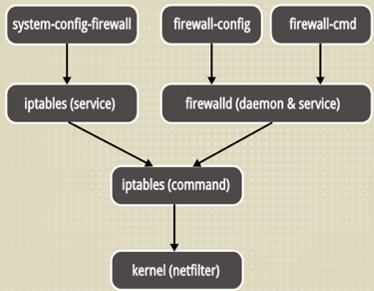
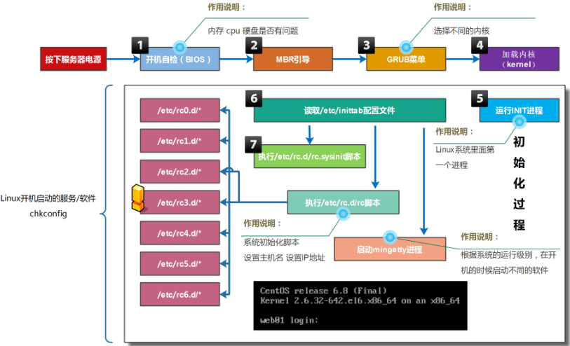
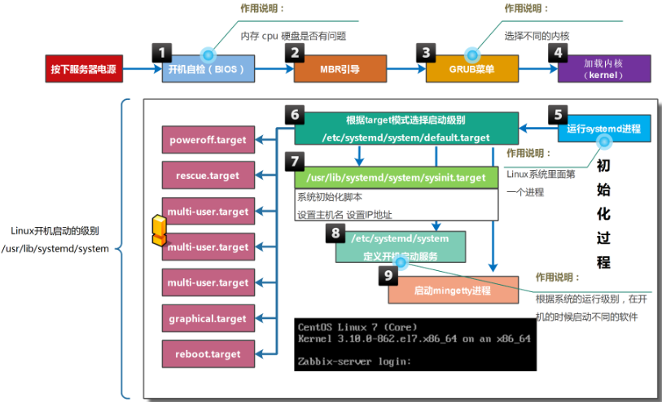

# 1. 【防火墙】

> 防范一些网络攻击。有软件防火墙、硬件防火墙之分

1. **centos 6**：iptables
    * `/etc/init.d/iptables status`
    * `/etc/init.d/iptables stop`：临时关闭防火墙服务
    * `/etc/init.d/iptables status`
    * `chkconfig iptables off`：永久关闭防火墙服务

2. **centos 7**：firewalld
    * `systemctl status firewalld`
    * `systemctl stop firewalld`：临时关闭防火墙服务
    * `systemctl disable firewalld`：永久关闭防火墙服务
    * `systemctl is-active firewalld`：检查服务是否正常运行
    * `systemctl is-enabled firewalld`：检查确认服务是否开机运行

## 1.1. 【iptables】

> iptables 全称为 netfilter/iptables，是 linux 平台下自带的的开源包过滤防火墙

1. **iptables 功能**
    * 包过滤
    * NAT
    * 协助实现策略路由和流量控制
    * 包标记

2. **iptables 组成**


## 1.2. 【firewalld】

* iptables 是自 2.4 内核以来，linux 自带的防火墙软件
* 在 centos7 里，又出现了一个叫 firewalld 的防火墙软件，它和 iptables 一样都是通过内核的 netfilter 来实现的
* 也即 iptables 和 firewalld 都是用于维护规则，只不过使用方式有所不同
* 在 centos7 里 iptables，firewalld 都可以使用，但不要用混乱了



1. **配置文件**
    ```bash
    # 1. firewalld 服务默认定义了一百多种服务，可直接使用
    ls /usr/lib/firewalld/services/
        # https.xml  http.xml  ftp.xml  mysql.xml  ...
    
    # 2. 区域配置模板目录
    ls /usr/lib/firewalld/zones
        # block.xml  drop.xml      home.xml      public.xml   work.xml
        # dmz.xml    external.xml  internal.xml  trusted.xml
    
    # 3. 默认区域配置文件
    ls /etc/firewalld/zones/
        # public.xml  public.xml.old
    ```

2. **firewalld zones**
    > **Zone**：简单来说就是防火墙方案，就是一套规则集

    * **查看所有区域**：`firewall-cmd --get-zones`

        |        区域         |                                                   默认策略                                                    |
        | :-----------------: | :------------------------------------------------------------------------------------------------------------: |
        |  trusted（信任）  |                                                允许所有数据包                                                |
        |   home（家庭）   | 拒绝流入的流量，除非与流出的流量相关，允许ssh,mdns,ippclient,amba-client,dhcpv6-client服务通过 |
        | internal（内部） |                                                  等同于home                                                  |
        |   work（工作）    |         拒绝流入的流量，除非与流出的流量相关，允许ssh,ipp-client,dhcpv6-client服务通过         |
        |  public（公共）   |                 拒绝流入的流量，除非与流出的流量相关，允许ssh,dhcpv6-client服务通过                  |
        | external（外部） |                          拒绝流入的流量，除非与流出的流量相关，允许ssh服务通过                           |
        |  dmz（非军事区）  |                          拒绝流入的流量，除非与流出的流量相关，允许ssh服务通过                           |
        |   block（限制）   |                       拒绝流入的流量，除非与流出的流量相关，非法流量采取拒绝操作                        |
        |   drop（丢弃）    |                       拒绝流入的流量，除非与流出的流量相关，非法流量采取丢弃操作                        |

    * **查看当前使用的 zone**：`firewall-cmd --get-default-zone`
    * **修改当前使用的 zone**：`firewall-cmd --set-default-zone=work`
    * **查看当前使用的 zone 的规则**：`firewall-cmd --list-all`
    * **查看指定的 zone 的规则**：`firewall-cmd --zone=work --list-all`
    * **列出所有的 zone 的规则**：`firewall-cmd --list-all-zones`

    > 默认 zone 是 public，规则默认只允许 ssh 和 ping 进来，其它都拒绝。出去访问别的服务器，本机的 firewalld 是允许的

3. **firewall-cmd 命令介绍**
    > * `firewall-cmd [--zone=zone] 动作 [--permanent]`
    >> * 如果不指定 `--zone` 选项，则为当前所在的默认区域
    >> * `--permanent`：将改动写入到区域配置文件中

    1. **Firewalld 状态查询及规则重载**
        ```bash
        firewall-cmd --state  # running，查看状态
        
        firewall-cmd --reload # success
        # 重新加载防火墙，中断用户连接，临时配置清除掉，加载配置文件中的永久配置
        
        firewall-cmd --complete-reload  # success
        # 重新加载防火墙，不中断用户的连接（防火墙出严重故障时使用）
        
        firewall-cmd --panic-on
        # 紧急模式，强制关闭所有网络连接
        ```

    2. **获取操作**
        ```bash
        firewall-cmd --get-zones          # 查看所有区域
        firewall-cmd --get-services       # 查看当前区域支持的服务
        firewall-cmd --get-icmptypes      # 查看支持的所有 ICMP 类型
        firewall-cmd --get-default-zone   # 查看当前的默认区域
        firewall-cmd --get-active-zones   # 查看当前正在使用的区域
        
        firewall-cmd --list-services      # 查看当前区域开放的服务列表
        firewall-cmd --list-services --zone=home  # 查看指定区域开放的服务列表
        firewall-cmd --list-all           # 查看默认区域内的所有配置
        firewall-cmd --list-all-zones     # 查看所有区域所有配置
        ```

    3. **新建规则**
        ```bash
        firewall-cmd --add-port=80/tcp --permanent # 添加端口到区域开放列表中
        firewall-cmd --add-port=5000-10000/tcp --permanent # 将端口范围添加到开放列表中
        
        firewall-cmd --add-service=ftp --permanent # 添加服务到区域开放列表中
        # 注意：服务的名称需要与此区域支持的服务列表中的名称一致
        
        firewall-cmd --add-source=192.168.1.1      # 添加源地址的流量到指定区域
        firewall-cmd --add-interface=eth0          # 将网络接口添加到默认的区域内
        firewall-cmd --add-masquerade              # 开启 SNAT（源地址转换）
        ```

    4. **删除规则**
        ```bash
        firewall-cmd --remove-service=http
        firewall-cmd --remove-interface=eth0
        firewall-cmd --remove-source=192.168.1.1
        ```

4. **firewalld 放行 WEB 服务策略配置**
    ```bash
    # 1. WEB 服务准备
    yum  -y install httpd
    echo "web page" > /var/www/html/index.html
    systemctl enable httpd
    systemctl start httpd
    
    # 2. WEB 服务访问放行规则
    firewall-cmd --get-default-zone
    firewall-cmd --list-all
    
    firewall-cmd  --add-port=80/tcp --permanent
    # 或：firewall-cmd  --add-service=http --permanent
    
    firewall-cmd --reload
    ```

# 2. 【系统启动流程】

1. **centos6 系统启动流程**
    > * 采用串行启动方式，由 init 进程进行控制
    

2. **centos7 系统启动流程**
    > * 采用并行启动方式，由 systemd 进程进行控制
    

# 3. 【备份策略】

> 主要的备份策略一般分为：<font>完全备份</font>、<font>增量备份</font> 和 <font>差异备份</font>

## 3.1. 【完全备份】

* 完全备份是指把所有需要备份的数据全部备份
* 完全备份可以备份整块硬盘、整个分区或某个具体的目录
* 完全备份的好处是数据恢复方便，因为所有的数据都在同一个备份中，所以只要恢复完全备份，所有的数据都会被恢复。如果完全备份备份的是整块硬盘，那么甚至不需要数据恢复，只要把备份硬盘安装上，服务器就会恢复正常。但是，完全备份的缺点也很明显，那就是需要备份的数据量较大，备份时间较长，占用的空间较大，所以完全备份不可能每天执行
* 一般会对关键服务器进行整盘完全备份，如果服务器出现问题，则可以很快地使用备份硬盘进行替换，从而减少损失。甚至会对关键服务器搭设一台一模一样的服务器，这样只要远程几个命令（或使用 Shell 脚本自动检测，自动进行服务器替换），备份服务器就会接替原本的服务器，从而使故障响应时间大大缩短

## 3.2. 【增量备份】

* 完全备份随着数据量的加大，备份耗费的时间和占用的空间会越来越多，所以完全备份不会也不能每天进行。这时增量备份的作用就体现出来了
* 增量备份是指先进行一次完全备份，在服务器运行一段时间之后，比较当前系统和完全备份的备份数据之间的差异，只备份有差异的数据。服务器继续运行，再经过一段时间，进行第二次增量备份。在进行第二次增量备份时，当前系统和第一次增量备份的数据进行比较，也只备份有差异的数据。第三次增量备份是和第二次增量备份的数据进行比较，以此类推


* 假设我们在第一天进行一次完全备份。在第二天进行增量备份时，只会备份第二天和第一天之间的差异数据，但是第二天的总备份数据是完全备份加第一次增量备份的数据。在第三天进行增量备份时，只会备份第三天和第二天之间的差异数据，但是第三天的总备份数据是完全备份加第一次增量备份的数据，再加第二次增量备份的数据。当然，在第四天进行增量备份时，只会备份第四天和第三天的差异数据，但是第四天的总备份数据是完全备份加第一次增量备份的数据，加第二次增量备份的数据，再加第三次增量备份的数据。
* 这种备份的好处是每次备份需要备份的数据较少，耗时较短，占用的空间较小；坏处是数据恢复比较麻烦，当进行数据恢复时，就要先恢复完全备份的数据，再依次恢复第一次增量备份的数据、第二次增量备份的数据和第三次增量备份的数据，最终才能恢复所有的数据

## 3.3. 【差异备份】

* 差异备份也要先进行一次完全备份，但是，和增量备份不同的是，每次差异备份都备份和原始的完全备份不同的数据。也就是说，差异备份每次备份的参照物都是原始的完全备份，而不是上一次的差异备份


* 相比较而言，差异备份既不像完全备份一样把所有数据都进行备份，也不像增量备份在进行数据恢复时那么麻烦，只要先恢复完全备份的数据，再恢复差异备份的数据即可。不过，随着时间的增加，和完全备份相比，变动的数据越来越多，那么差异备份也可能会变得数据量庞大、备份速度缓慢、占用空间较大

# 4. 【】

## 4.1. 【清空文件内容】

* 方式1. `echo "" > test.txt`：没有彻底清除，有空行
* 方式2. `cat /dev/null > test.txt`
* 方式3. `> test.txt`

## 4.2. 【不用 vi 向文件添加多行内容】

* **方式1**. `echo` 使用 `-e` 选项通过 `\n` 添加多行

* **方式2**.
    ```bash
    [root@yyq-pc tmp]# echo "Java
    > Python
    > Golang
    > PHP" >> test.txt
    ```

* **方式3**. 利用 `cat` 向文件添加多行内容

    ```bash
    # 读入数据，然后输出到屏幕
    [root@yyq-pc tmp]# cat <<EOF
    > Java
    > Golang
    > Python
    > EOF            # 输入标记，结束输入
    
    [root@yyq-pc tmp]# cat >> test.txt <<yyq
    > Hello World
    > Python Golang Java
    > yyq
    
    [root@yyq-pc tmp]$ cat >world.txt
    Python
    Linux     # 输入完内容后按回车键，然后再按 Ctrl+d 结束编辑
    ```

## 4.3. 【系统优化】

### 4.3.1. 【命令提示符优化】

```bash
# 1. 高亮显示命令提示符
# 2. 显示完整路径 \w

vim /etc/bashrc
↘ PS1="\e[1;31m[\u@\h \w]\\$ \e[0m"
```

### 4.3.2. 【SSH 远程连接优化】
> * 使 xshell 软件远程连接速度加快

* `vi /etc/ssh/sshd_config`
    * ↘ **79 行**：GSSAPIAuthentication no
    * ↘ **115 行**：UseDNS no

* `vi /etc/hosts`
    * ↘ 10.0.0.88  yyq.com

* `systemctl restart sshd`

## 4.4. 【文件】

1. `/sbin/nologin` 与 `/bin/false` 的区别
    1. `/bin/false`
        > * 最严格的禁止 login 选项，一切服务都不能用
        > * 将用户的 shell 设置为 `/bin/false`，用户会无法登录，并且不会有任何提示

    2. `/sbin/nologin`
        > * 只是不允许 login 系统，即使给了密码也不行
        > * 所谓 “无法登陆” 指的仅是这个用户无法使用 bash 或其他 shell 来登陆系统而已，并不是说这个账号就无法使用系统资源
        > * 比如，www服务器有apache这个账号管理，他们都可以进行系统程序的工作，但就是无法登陆主机而已
        > * 如果想让某个具有 `/sbin/nologin` 的用户知道，他们不能登陆主机时，可以新建 `/etc/nologin.txt` 这个文件，写上不能登陆的原因，当用户登录时，屏幕上就会出现这个文件里面的内容

2. `/etc/mtab` 和 `/etc/fstab` 的区别
    * `/etc/mtab`：记录的是操作系统已经挂载的文件系统（分区），包括操作系统建立的虚拟文件系统
    * `/etc/fstab`：记录的是操作系统准备挂载的文件系统，也就是在下次启动后系统会挂载的文件系统

## 4.5. 【其它命令】

```bash
showkey -a           # 查看终端发送的按键编码
time read            # 使用 CTRL+D 停止，最简单的计时功能
echo $[RANDOM%X+1]   # 获取 [1,X] 之间的随机数
```
