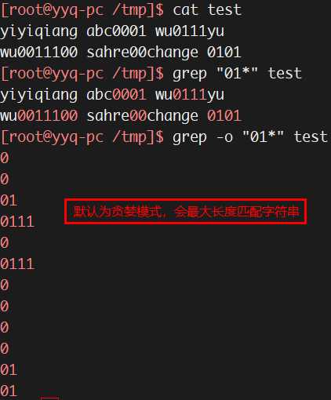

# 1. 【Shell 类别】

> * Shell运行程序流程图


1. **Shell 类别**：`csh`、`ksh`、`bash`、`zsh` 等

2. **查看当前使用的 shell**：`echo $SHELL`

3. **査询 Linux 支持的 Shell**：`cat /etc/shells`

4. **切换Shell**
    ```bash
    sh      # 进入到子shell，/bin/sh 为软链接文件，指向 bash
    exit    # 退回到父shel中
    ```

# 2. 【输出命令：echo】

* `echo [选项] [输出内容]`
    * `-e`：支持反斜线控制的字符转义
    * `\e`：转义（escape）
    * `-n`：内容输出后不换行

```bash
echo "Hello World"
echo -n "Hello World"   # 不会换行
echo -e "ab\bc"         # 输出 ac
echo -e "\0141\t\0142\t\0143\n\0144\t\0145\t\0146"
echo -e "\e[1;31m abcd \e[0m"     # 将 “abcd” 按照红色输出
    # 30m=黑色，31m=红色，32m=绿色，33m=黄色
    # 34m=蓝色，35m=洋红，36m=青色，37m=白色
```

# 3. 【记录命令历史：history】

* 退出 shell 时，会将历史命令缓冲区中的命令写入命令文件（`~/.bash_history`）
* 登录 shell 时，会读取历史命令文件到历史命令缓冲区
* 在内存中，默认仅能够存储 1000 条历史命令，该数量是由环境变量 `HISTSIZE` 进行控制

1. **history [选项]**
    * `–a`：将历史命令缓冲区中的命令追加到历史命令文件中
    * `-w`：将当前历史命令缓冲区命令写入历史命令文件中（覆盖）
    * `-c`：清空当前缓冲区的历史命令
    * `-r`：将历史命令文件中的命令读入当前历史命令缓冲区
    * `n`：打印最近的 n 条历史命令
    * `-d 4`：删除命令历史的第 4 条

2. **历史命令的调用**
    * `!!`：执行上一条命令
    * `!6`：执行命令历史中第 6 行命令
    * `!-1`：执行命令历史中的倒数第一个命令
    * `!命令`：执行最近的以指定命令开头的命令
    * `!命令:p`：仅打印最近以指定命令开头的命令，但不执行
    * `!$`：获取上一条命令的最后一个参数，相当于 `ESC + .` 和 `Alt + .`
    * `↑/↓`：切换命令历史记录

3. **相关变量信息**
    * `echo $HISTFILE`：查看历史文件所在路径
    * `echo $HISTSIZE`：缓存多少条命令
    * `echo $HISTFILESIZE`：命令历史文件能够保存多少条命令

4. **控制命令历史记录的方式**
    * `echo $HISTCONTROL`
        * `ignoredups`：不记录重复的命令（连续且相同）
        * `ignorespace`：记录以空格开头的命令
        * `ignoreboth`：上面两个功能同时生效
    * **更改**：`export HISTCONTROL = ignorespace`

# 4. 【命令别名：alias】

* `alias`：查询已定义好的别名
* `alias 别名='原命令'`：设定命令别名
* `unalias 别名`：删除别名
* `vi /root/.bashrc`：将命令别名添加到用户环境配置文件
* `vi /etc/bashrc`：添加命令别名，对所有用户生效
* **如何忽略别名功能**
    * **方式1**：使用命令的绝对路径
    * **方式2**：在命令执行前加 `\`
    * **方式3**：在 `xargs` 信息后面的命令会自动忽略别名

# 5. 【通配符】

* `?`：匹配一个任意字符
* `*`：匹配 0 个 或 多个 任意字符
* `[abc]`：匹配中括号中任意一个字符
* `[a-z]`：匹配中括号中任意一个字符，`-` 代表一个范围
* `[^]`：逻辑非，表示匹配不是中括号内的一个字符
* `[[:space:]]`：空格
* `[[:digit:]]` <=> `[0-9]`
* `[[:lower:]]` <=> `[a-z]`
* `[[:upper:]]` <=> `[A-Z]`
* `[[:alpha:]]` <=> `[a-Z]`

```bash
* `ls a*b`
* `ls a[^0-5]b`
* `ls a[^[:lower:]]b`
* `rm -rf *`
```

> * shell 通配符不匹配隐藏文件，除非明确指定 `.*`
> * `.*` 会匹配 `.` 和 `..`（当前目录和上级目录）。可使用 `.[^.]*` 或 `.??*` 来排除这两个目录

# 6. 【重定向与管道符】

## 6.1. 【输入输出重定向】

|  设备  |  设备文件名  | 文件描述符 |     类型     |
| ------ | ----------- | ---------- | ----------- |
| 键盘   | /dev/stdin  | 0          | 标准输入     |
| 显示器 | /dev/stdout | 1          | 标准输出     |
| 显示器 | /dev/stderr | 2          | 标准错误输出 |

1. **输出重定向**
    1. **标准输出重定向**
        * `命令 > 文件`： 以 覆盖 的方式，把命令的正确输出输出到指定的文件中
        * `命令 >> 文件`：以 追加 的方式，把命令的正确输出输出到指定的文件中
        * **清空文件内容**：`> 文件名`

    2. **标准错误输出重定向**
        * `错误命令 2> 文件`：以 覆盖 的方式，把命令的错误输出输出到指定的文件中
        * `错误命令 2>> 文件`：以 追加 的方式，把命令的错误输出输出到指定的文件中

    3. **正确输出和错误输出同时保存**
        * `命令 &> 文件`
        * `命令 &>> 文件`
        * `命令 >> 文件1 2>> 文件2`
        * `命令 >> 文件 2>&1`

    > * 如果文件 file 不存在，shell 会创建一个新文件 file

2. **输入重定向**
    * `wc [选项] [文件名]`
        * `-c`：统计字节数（包括换行符）
        * `-w`：统计单词数
        * `-l`：统计行数

    * `wc`：交互式输入，按 Enter, Ctrl+D 结束
    * `wc /etc/issue`
    * `wc < /etc/issue`：输入重定向
    * `wc <<标记符`：交互式输入，再次输入该标记符结束

## 6.2. 【管道符 & xargs】

1. **前一个指令的正确输出作为后一个指令的输入**：`命令1 | 命令2`
    * `ll -a /etc/ | more`
    * `netstat -an | grep "ESTABLISHED"`
    * `find /etc -name "*.conf" 2> /dev/null | grep rc`

2. **有些命令不支持管道技术来传递参数**
    ```bash
    # xargs 让 ls 支持管道技术
    find /etc -name "*.conf" | ls -l (错误)
    find /etc -name "*.conf" | xargs ls -l (正确)
    ```

    > * xargs 可以将管道或标准输入（stdin）数据转换成命令行参数，也能够从文件的输出中读取数据
    > * xargs 也可以将单行或多行文本输入转换为其他格式，例如多行变单行，单行变多行
    > * xargs 默认的命令是 echo，这意味着通过管道传递给 xargs 的输入将会包含换行和空白，不过通过 xargs 的处理，换行和空白将被空格取代

    ```bash
    [root@yyq-pc /tmp]$ cat word.txt
    h i j k l m n
    o p q
    r s t
    u v w x y z

    [root@yyq-pc /tmp]$ cat word.txt | xargs
    h i j k l m n o p q r s t u v w x y z

    [root@yyq-pc /tmp]$ cat word.txt | xargs -n3
    h i j
    k l m
    n o p
    q r s
    t u v
    w x y
    z
    ```

# 7. 【内部命令和外部命令】

1. **内部命令**：shell 程序自带的命令
2. **外部命令**：在系统的某个路径下的可执行程序，依赖于 PATH 变量
    * **查看 PATH 变量**：`echo $PATH`
    * **判断是内部命令还是外部命令**：`type 命令`
    * **外部命令缓存表**
        * 如果每次输入命令都到环境变量所配置的路径下查找，势必会影响效率
        * 所以系统会将我们输入的命令缓存起来，通过 `hash` 命令可查看
            1. **缓存命令所在位置**：`hash` :point_right: hits表示命令执行的次数
            2. **删除某命令的缓存**：`hash –d 命令`
            3. **清空缓存表**：`hash –r`

# 8. 【多命令顺序执行】

* `命令1 ; 命令2`：多个命令顺序执行，命令之间没有任何逻辑联系
* `命令1 && 命令2`：逻辑与；只有当命令 1 正确执行，命令 2 才会执行
* `命令1 || 命令2`：逻辑或；只有当命令 1 执行不正确，命令 2 才会执行

# 9. 【符号】

## 9.1. 【引号】
1. **单引号**
    > * 所见即所得，即输出单引号内容时会将单引号内的所有内容都原样输出，称为强引用

2. **双引号**
    > * 输出双引号内的所有内容时，如果内容中有命令（反引号括起）、变量、特殊转义符等，会先将变量、命令、转义字符解析出结果，然后再输出最终内容，称弱引用

3. **没有引号时**
    > * 如果内容中有命令（反引号括起）、变量等，则会先将变量、命令解析出结果，然后输出最终内容
    > * 如果字符串中带有空格等特殊字符，则有可能无法完整地输出，因此需要改加双引号
    > * 一般连续的字符串、数字、路径等可以不加任何引号赋值和输出，不过无引号的情况最好使用双引号替代之，特别是对变量赋值时

4. **反引号**
    > * 反引号括起来的内容是系统命令，在 bash 中会先执行它
    > * 和  `$()`  作用一样，不过推荐使用 `$()`，因为 反引号 非常容易看错

## 9.2. 【小括号和大括号】

|         小括号          |               大括号               |
| :--------------------: | :-------------------------------: |
|   作用域局限于小括号内   |           作用域不受影响           |
| 最后一条命令可以不用分号 |        最后一条命令要用分号         |
|  各命令不必和括号有空格  | 第一条命令和左括号之间必须有一个空格 |

```bash
name=sc
(name=liming;echo $name)     # liming

echo $name                   # sc

{ name=liming;echo $name;}   # liming
echo $name                   # liming
```

* 当需要让一组命令在不同的目录下执行时，采用 `()` 这种方法可以不修改主脚本的目录
    ```bash
    [root@yyq-pc ~]$ cd /usr; ls
    bin  etc  games  include  lib  lib64  libexec  local  sbin  share  src  tmp
    [root@yyq-pc /usr]$ cd
    [root@yyq-pc ~]$ (cd /usr; ls)
    bin  etc  games  include  lib  lib64  libexec  local  sbin  share  src  tmp
    [root@yyq-pc ~]$
    ```

## 9.3. 【序列 {}】

1. **单行显示**：`{}`
    ```bash
    echo {1..5}         # 1 2 3 4 5
    echo {01..100}      # 001 002 003 ... 099 100
    echo {a..z}         # a b c ... y z
    echo {A..Z}         # A B C... Y Z
    echo {1..10..2}     # 1 3 5 7 9
    echo {1,b,5,z}      # 1 b 5 z

    echo {A,B}{01,02}   # A01 A02 B01 B02
    echo A{01,02}       # A01 A02
    echo A{,02}         # A A02

    mkdir /tmp/{zz,yy}/a/b -p

    cp /oldboy/oldboy.txt{,.bak}
    # cp /oldboy/oldboy.txt /oldboy/oldboy.txt.bak

    mv /oldboy/alex.txt{.bak,}
    # mv /oldboy/alex.txt.bak /oldboy/alex.txt
    ```

2. **竖排显示**：`seq`
    ```bash
    [root@yyq-pc /tmp]$ seq 4
    1
    2
    3
    4

    [root@yyq-pc /tmp]$ seq 4 7
    4
    5
    6
    7

    [root@yyq-pc /tmp]$ seq 1 2 6
    1
    3
    5

    [root@yyq-pc /tmp]$ seq -w 6 10
    06
    07
    08
    09
    10

    [root@yyq-pc /tmp]$ seq -s" " 6 10
    6 7 8 9 10
    ```

## 9.4. 【关于减号 `-` 的用途】

* 管线命令中，常会使用到前一个指令的 stdout 作为这次的 stdin
* 某些指令需要用到文件名称（例如 tar）来进行处理时，该 stdin 与 stdout 可以利用减号来替代

* `tar -cvf - /home | tar -xvf - -C /tmp/homeback`
    * 将 `/home` 里面的文件打包，但打包的数据不是记录到文件，而是传送到 stdout
    * 经过管线后，传送给后面的 `tar -xvf -`
    * 后面的 `-` 号则是取用前一个指令的 stdout，因此，就不需要使用 filename

## 9.5. 【其他特殊符号】

* `$()`：和反引号作用一样，用来引用系统命令
* `#`：在 Shell 脚本中，`#` 开头的行代表注释
* `$`：用于调用变量的值
* `\`：转义符


# 10. 【脚本的执行方式】

> * 建议自定义脚本放到：/usr/local/sbin/ 目录下
> * 建议脚本文件的第1行要以 `#!/bin/bash` 开头，表示该文件使用的是 bash 语法

```bash
vi hello.sh
「
    #!/bin/bash
    #The first program
    #Author: yyq
    echo "Hello World"
」
```

* 方式1. **赋予执行权限，直接运行**
    * `chmod 755 hello.sh`
    * `./hello.sh`

* 方式2. **通过 bash 调用执行脚本**
    * `bash hello.sh`
        * `-n`：不执行脚本，仅查询语法问题
        * `-v`：在执行脚本前，先将脚本的内容输出到屏幕上
        * `-x`：显示脚本执行过程，便于调试脚本

    > * 以上两种方法都会使用一个新的 bash 环境来执行脚本
    > * 当脚本执行完毕后，子程序 bash 内的所有数据都会被移除，不会影响到父 bash

* 方式3. **使用 source 指令执行**
    * 其各项动作都会在原本的 bash 内生效
    * 无须注销、重启，就可使环境变量配置文件强制生效
    * 会忽略脚本文件的权限

    ```bash
    source /etc/profile
    source ~/.bashrc
    source 脚本文件
    . 脚本文件            # "." 就是 source 命令
    ```

# 11. 【变量】

* 变量的默认类型都是字符串型，如果要进行数值运算，则必须指定变量类型为数值型
* 赋值时等号左右两侧不能有空格
* 变量的值如果有空格，则需要使用引号括起
* 环境变量名建议大写，便于区分

## 11.1. 【变量分类】

1. **自定义变量**
    1. **变量定义**
        ```bash
        name="shen chao"

        var[1]="small min"   # 数组形式定义
        var[2]="big min"
        var[3]="nice min"
        echo "${var[1]}, ${var[2]}, ${var[3]}"
        ```

    2. **变量调用**：`echo $变量名` 或 `echo ${变量名}`
        > * 当变量后面连接有其他字符的时候，必须给变量加上大括号 `{}`

    3. **变量查看**：`set`
    4. **变量删除**：`unset 变量名`

2. **环境变量**

    * 主要保存的是和系统操作环境相关的数据
    * 用户自定义变量只在当前的 Shell 中生效，而环境变量会在当前 Shell 和所有子 Shell 中生效
    * 如果把环境变量写入相应的配置文件，那么这个环境变量就会在所有的 Shell 中生效

    1. **定义环境变量**
        * 方式1. **使用 export 直接声明**：`export age="18"`
        * 方式2. **本地变量转环境变量**：`gender=male ; export gender`

    2. **查询环境变量**：`env`
    3. **删除变量**：`unset 变量名`

## 11.2. 【PATH】

> * 系统查找命令的路径: PATH

* **查询 PATH 环境变量的值**：`echo $PATH`

* **临时修改**：`PATH="$PATH":/root/sh`

* **永久修改**：

    ```bash
    vi /etc/profile
    ↘ export PATH=/usr/local/sbin:/usr/local/bin:/usr/sbin:/usr/bin:/root/bin:/yyq
    ```

## 11.3. 【PS1】

* **命令提示符设置**： `PS1`
    * `\d`：显示日期，格式为“星期 月 日”
    * `\h`：显示简写主机名
    * `\t`：显示24小时制时间，格式为 “HH:MM:SS”
    * `\T`：显示12小时制时间，格式为 “HH:MM:SS”
    * `\A`：显示24小时制时间，格式为 “HH:MM”
    * `\u`：显示当前用户名
    * `\w`：显示当前所在目录的完整名称
    * `\W`：显示当前所在目录的最后一个目录
    * `\#`：执行的第几个命令
    * `\$`：提示符。如果是 root 用户会显示提示符为 `#`，如果是普通用户会显示提示符为 `$`

* `set`：查看变量 PS1 的值，该变量不属于环境变量，不能通过 env 命令查找
* `PS1="[\u@\h \W]\$ "`

## 11.4. 【LANG】

1. **查看当前系统的语系环境**：`echo $LANG`
2. **列出系统支持的语系种类**：`locale -a | more`
3. **定义当前系统主语系的变量**：`LANG`
4. **定义整体语系的变量，一般使用 LANG 变量来定义系统语系**：`LC_ALL`
    * 其他的变量会依赖这两个变量的值而发生变化
5. **定义系统的默认语系**
    * **CentOS 6**：`cat /etc/sysconfig/i18n`
    * **CentOS 7**：`cat /etc/locale.conf`
    * 默认语系是下次重启之后系统所使用的语系

## 11.5. 【位置参数变量】

* 用来向脚本当中传递参数或数据的，变量名不能自定义，变量作用是固定的
    * `$n`
        * `n` 为数字，`$0` 代表脚本本身的名字
        * `$1-$9` 代表第一到第九个参数
        * 十以上的参数需要用大括号包含，如 `${10}`
    * `$*`：代表命令行中所有的参数，`$*`  把所有的参数看成一个整体
    * `$@`：代表命令行中所有的参数，不过 `$@` 把每个参数区分对待
    * `$#`：代表命令行中所有参数的个数

* 案例1

    ```bash
    **【count.sh】**
    「
        #!/bin/bash
        num1=$1
        num2=$2
        sum=$(($num1 + $num2))
        echo $sum
    」
    ./count.sh 11 22
    ```

* 案例2

    ```bash
    ** 【parameter.sh】**
    「
        #!/bin/bash
        echo $#
        echo $*
        echo $@
    」
    ./parameter.sh 11 22 33
        「
            3
            11 22 33
            11 22 33
        」
    ```

* 案例3：`$*` 与 `$@` 的区别

    ```bash
    ** 【Hello.sh】 **
    「
        #!/bin/bash
        for i in "$*"
            do
                echo $i
            done
        for j in "$@"
            do
                echo $j
            done
    」
    ./Hello.sh 11 22 33
    ```

## 11.6. 【预定义变量】

* bash 中已经定义好的变量，变量名不能自定义，变量作用也是固定的
    * `$?`：最后一次执行的命令的返回状态
        * 0: 表示上一个命令正确执行
        * 非0: 表示上一个命令执行不正确
    * `$$`：当前进程的进程号（PID）
    * `$!`：后台运行的最后一个进程的进程号（PID）

```bash
ll
echo $?    # 0

lls        # 查找不到该命令
echo $?    # 127

ll yyq     # 查找不到该文件
echo $?    # 2


「 ** Hello.sh **
    #!/bin/bash

    echo $$
    # 输出当前进程的 PID，该 PID 就是 Hello.sh 这个脚本执行时， 生成的进程的 PID

    find /root -name hello.sh &     # 符号 & 的意思是把命令放入后台执行
    echo $!
」
./Hello.sh
```

## 11.7. 【read】

* **接收键盘输入**：`read [选项] [变量名]`
    * `-p`：“提示信息”
    * `-t`：默认会一直等待用户输入，使用此选项可指定等待时间(秒数)
    * `-n`：只接受指定的字符数就会执行
    * `-s`：隐藏输入的数据
* 如果不指定变量名，则会把输入保存到默认变量 REPLY 中
* 如果只提供一个变量名，则将整个输入行赋予该变量
* 如果提供了一个以上的变量名，则输入行分为若干字，一个接一个地赋予各个变量，而命令行上的最后一个变量取得剩余的所有字

```bash
read -t 10 -p "Please input your name: " name
echo -e "Name is $name\n"

read -s -t 10 -p "Please enter your age: " age
echo -e "\r"
echo -e "Age is $age\n"

read -n 1 -t 10 -p "Please select your gender[M/F]: " gender
echo -e "\r"
echo -e "Gender is $gender\n"

# 【脚本：first.sh】和用户交互
#!/bin/bash
read -p "Please input a number: " x
read -p "Please input another number: " y
sum=$[$x+$y]
echo "The sum of the two numbers is: $sum"

:<<EOF
[root@yyq-pc /usr/local/sbin]$ bash -x first.sh
+ read -p 'Please input a number: ' x
Please input a number: 12
+ read -p 'Please input another number: ' y
Please input another number: 4
+ sum=16
+ echo 'The sum of the two numbers is: 16'
The sum of the two numbers is: 16
EOF
```

# 12. 【环境变量配置文件】


1. **登录时生效的环境变量配置文件**
    * `/etc/profile`
    * `/etc/profile.d/*.sh`
    * `~/.bash_profile`
    * `~/.bashrc`
    * `/etc/bashrc`

    > * **对所有的登录用户生效**：`/etc/profile` 、 `/etc/profile_d/*.sh` 和 `/etc/bashrc`
    > * **对当前用户生效**：`~/.bash_profile` 和 `~/.bashrc`

    1. **用户登录过程中先调用 `/etc/profile` 文件**
        * `USER`：根据登录的用户给这个变量赋值
        * `MAIL`：根据登录的用户来定义用户的邮箱为 `/var/spool/mail/用户名`
        * `PATH`：根据登录用户的 UID 是否为 0，判断 PATH 变量是否包含 `/sbin`、`/usr/sbin` 和 `/usr/local/sbin` 这三个系统命令目录
        * `HOSTNAME`：根据主机名给这个变量赋值
        * `HISTSIZE`：定义历史命令的保存条数
        * `umask`：定义 umask 默认权限
        * 调用 `/etc/profile.d/*.sh` 文件
        * 调用 `~/.bash_profile` 文件
    2. `/etc/profile.d/*.sh`
        * 最常用的是 `lang.sh` 文件
    3. `~/.bash_profile`
        * 调用 `~/.bashrc`
        * PATH 变量加入 `$HOME/bin` 这个目录
    4. `~/.bashrc`
        * 定义默认别名
        * 调用 `/etc/bashrc`
    5. `/etc/bashrc`
        * `PS1` 变量
        * `umask`
            * 针对没有用户登录过程（如从一个终端切换到另一个终端，或进入子Shell）时生效的
            * 如果是 “有用户登录过程”，则 `/etc/profile` 文件中的 umask 生效
        * `PATH`：给 PATH 变量追加值，也是在 “没有用户登陆过程” 时才调用的

    ---

    * `/etc/profile`：当用户第一次登录时，该文件被执行
    * `/etc/bashrc`：为每一个运行 bash shell 的用户执行此文件
    * `~/.bash_profile`
        * 每个用户都可使用该文件输入专用于自己使用的 shell 信息
        * 当用户登录时，该文件仅仅执行一次
    * `~/.bashrc`
        * 当登录时以及每次打开新的 shell 时，该文件被读取
        * 函数和别名建议配置到 `bashrc` 文件

2. **注销时生效的环境变量配置文件**：`~/.bash_logout`

3. **其他的环境变量配置文件**：`~/.bash_history`

# 13. 【登陆信息及修改方法】

1. **本地终端登录信息**：`/etc/issue`
    * `\d`：显示当前系统日期
    * `\s`：显示操作系统名称
    * `\l`：显示登录的终端号，这个比较常用
    * `\m`：显示硬件体系结构，如i386、i686等
    * `\n`：显示主机名
    * `\o`：显示域名
    * `\r`：显示内核版本
    * `\t`：显示当前系统时间
    * `\u`：显示当前登录用户的序列号

2. **远程终端登录信息**：`/etc/issue.net`
    * 转义符在 `/etc/issue.net` 文件中不能使用
    * 是否显示此登录信息，由 ssh 的配置文件 `/etc/ssh/sshd_config` 决定
    * 加入 `Banner /etc/issue.net` 行才能显示（需要重启SSH服务：sshd）

3. **登录后欢迎信息**：`/etc/motd`
    * 不管是本地登录，还是远程登录，都可以显示此欢迎信息
    * 不能识别 `\d` 和 `\l` 等信息
    * `/etc/issue` 及 `/etc/issue.net` 文件是在用户登录之前显示欢迎信息的
    * `/etc/motd` 文件是在用户输入用户名和密码，正确登录之后显示欢迎信息的

# 14. 【文件操作命令】

## 14.1. 【替换或删除字符：tr】

1. **替换：字符一对一替换**

    ```bash
    echo 123456 | tr '123' 'abc'      # abc456
    echo 123456 | tr '123' 'abcdef'   # abc456
    echo 123456 | tr '12345' 'abc'    # abccc6
    echo abcbadef | tr 'abcba' '12345'  # 54345def  特殊情况
        a = 1  => 最终 a = 5
        b = 2  => 最终 b = 4
        c = 3
        b = 4
        a = 5

    tr ':' ' ' < /etc/passwd

    head -n2 /etc/passwd | tr '[a-z]' '[A-Z]'   # 小写字母变大写字母
    ```

2. **删除**
    * `-d`：删除在指定字符串中出现的每一个<mark>字符</mark>
    * `-s`：根据指定字符串出现的每一个字符删除在文件中连续出现的同一个字符，仅保留一个

    ```bash
    echo "yiyiqiang" | tr -d "yq"
    # iiiang

    echo "yyiqiang llliting yyy yi" | tr -s "yabc"
    # yiqiang llliting y yi
    ```

## 14.2. 【提取每行的指定字符或字段：cut】

```bash
cut -c 4 /etc/passwd       # 提取每行的第 4 个字符
cut -c 4,6 /etc/passwd     # 提取每行的第 4 个 和 第 6 个字符
cut -c 2-5  /etc/passwd
cut -c 4-  /etc/passwd     # 4- <=> 4-行尾
cut -c -5  /etc/passwd     # -5 <=> 1-5

cut -d : -f 5 /etc/passwd  # 按 : 分隔，提取第 5 个字段
cut -d : -f 1,5 /etc/passwd
cut -d : -f 2-4 /etc/passwd
cut -d : -f 4- /etc/passwd
cut -d : -f -4 /etc/passwd
```

## 14.3. 【对每行进行排序：sort】

* `sort [-t 分隔符] [-kn[,m]] [-nru]`
    * `-f`：忽略大小写
    * `-t`：作用跟 cut 的 -d 选项一样
    * `-n`：使用纯数字排序
    * `-r`：反向排序
    * `-u`：去重复
    * `-kn[,m]`：按照指定的字段范围排序。从第 n 字段开始，m 字段结束（默认到行尾）
    * `-h`：按照人类可读的数字排序

```bash
# 表示从首字符开始按 ASCII 码值进行比较，按升序输出
head -5 /etc/passwd | sort

# 对文件第一个字符进行排序，默认从小到大
sort -n file.txt

# 对排序结果反转，从大到小排序
sort -n -r file.txt

# 对排序结果去重
sort -u file.txt

# 指定分割符号，指定区域进行排序，从小到大排序
sort -n -t "." -k 4 ip.txt
```

## 14.4. 【删除重复行：uniq】

> * 针对文本中连续的重复行进行操作
> * 建议使用 `uniq` 命令之前先对文件进行排序

```bash
uniq hello.txt
sort hello.txt | uniq
sort hello.txt | uniq -c  # -c：统计重复的行数
```

## 14.5. 【把数据重定向到文件和屏幕上：tee】

> * 类似于重定向，但比重定向多一个功能，即把文件写入后面所跟的文件时，还显示在屏幕上
> * 常用于管道符 `|` 后
> * 选项 `-a`：以追加的方式，将数据加入文件中

## 14.6. 【文件分割：split】

> * `-b`：依据大小来分割文档，单位：byte
> * `-l`：依据行数来分割文档

```bash
split -b500 文件名
# 若不指定目标文件名，则会以 xaa xab... 这样的文件名来存取切割后的文件

split -b500 test 123
# 指定目标文件名，输出: 123aa  123ab  123ac  test

split -l10 文件名
```

## 14.7. 【按字段连接两个文件：join】

* `join [选项] file1 file2`
    * `-t`：指定分隔符（默认以空白符分隔数据），并且比对 “第一个字段” 的数据，如果两个文件相同，则将两笔数据联成一行，且第一个字段放在第一个
    * `-i`：忽略大小写
    * `-1`：代表 “第一个文件要用那个字段来分析” 的意思
    * `-2`：代表 “第二个文件要用那个字段来分析” 的意思

```bash
join -t ':' /etc/passwd /etc/shadow | head -n3
join -t ':' -1 4 text1 -2 3 text2 | head -n3
```

## 14.8. 【合并多个文件中同行数据：paste】
* `paste [-d] file1 file2`
    > * `-d`：后面接分隔符。默认以 tab 分隔
    > * `-`：如果 file 部分写成 `-` ，表示来自 standard input 的数据的意思

## 14.9. 【将其输入格式化为多个列：column】

```bash
[root@yyq-pc /tmp]$ echo 12312312312312312321312321 | column -s 3 -t
12  12  12  12  12  12  21  12  21

[root@yyq-pc /tmp]$ awk '/.*/' test
小明   男       :89:100:78
小华    男   :90:90:87
小红      女    :76:99:98
[root@yyq-pc /tmp]$ awk '/.*/' test | column -t
小明  男  :89:100:78
小华  男  :90:90:87
小红  女  :76:99:98
```

# 15. 【标准格式化输出命令：printf】

1. **在 awk 中可以识别 print 输出动作和 printf 输出动作**
    > * print 会在每个输出之后自动加入一个换行符
    > * printf 并不会自动加入换行符，如果需要换行，则需要手工加入换行符
    > * 在 Bash 中只能识别标准格式化输出命令 printf

2. **格式**：`printf '输出类型输出格式' 输出内容`
    1. **输出类型**
        * `%ns`：输出字符串。n 是数字，指代输出几个字符
        * `%ni`：输出整数。n 是数字，指代输出几个数字
        * `%m.nf`：输出浮点数
    2. **输出格式**：`\a`、`\b`、`\f`（清除屏幕）、`\n`、`\r`、`\t`、`\v`

```bash
[root@yyq-pc /tmp]# cat student.txt
ID      Name    PHP     Linux   MySQL   Average
1       Liming  82      95      86      87.66
2       Sc      74      96      87      85.66
3       Zhang   99      83      93      91.66

[root@yyq-pc /tmp]# printf '%s' $(cat student.txt)
IDNamePHPLinuxMySQLAverage1Liming82958687.662Sc74968785.663Zhang99839391.66[root@yyq-pc /tmp]#

[root@yyq-pc /tmp]# printf '%s\t %s\t %s\t %s\t %s\t %s\t \n' $(cat student.txt)
# 在printf命令的单引号中只能识别格式输出符号，而手工输入的空格是无效的
ID       Name    PHP     Linux   MySQL   Average
1        Liming  82      95      86      87.66
2        Sc      74      96      87      85.66
3        Zhang   99      83      93      91.66

[root@yyq-pc /tmp]# printf '%i\t %s\t %i\t %i\t %i\t %8.2f\t \n' $(cat student.txt | grep -v Name)
1        Liming  82      95      86         87.66
2        Sc      74      96      87         85.66
3        Zhang   99      83      93         91.66
```

# 16. 【正则表达式】
1. **正则表达式与通配符**
    1. **正则表达式**
        * 用于在文件中匹配符合条件的字符串
        * 正则是包含匹配
        * grep、awk、sed 等命令支持正则表达式
    2. **通配符**
        * 用于匹配符合条件的文件名
        * 通配符是完全匹配
        * ls、find、cp 等不支持正则，所以只能使用通配符来进行匹配

2. **元字符**
    * `.`：匹配除了换行符外任意一个字符
    * `[]`：匹配中括号中指定的任意一个字符
    * `[^]`：匹配除中括号的字符以外的任意一个字符

3. **匹配次数**
    * `\?`：匹配前一个字符 0 次或 1 次
    * `*`：匹配 0 次或任意多次
    * `\{n\}`：表示其前面的字符恰好出现 n 次
    * `\{n,\}`：表示其前面的字符出现不小于 n 次
    * `\{n,m\}`：表示其前面的字符至少出现 n 次，最多出现 m 次

    ```bash
    grep "aaa*" test.txt
    grep "s..d" test.txt
    grep "s.*d" test.txt
    grep "^M" test.txt
    grep -n "^$" test.txt       # 匹配空白行
    grep "^[^a-z]" test.txt     # 匹配不用小写字母开头的行
    grep "\.$" test.txt         # 匹配使用 “.” 结尾的行
    grep "[0-9]\{3\}" test.txt  # 匹配包含连续的三个数字的字符串
    echo 'ac asc assc asssc asbc' | grep 'a[a-z]\{0,2\}c' --color=auto
    ```

4. **分组匹配**

    ```bash
    # 1. 相邻
    echo 'xueithanhanhan51cto sdfa' | grep 'xueit\(han\)*51cto' --color=auto

    # 2. 分散
    grep '.*,math=\(.*\),english=\1' --color=auto text.txt
    grep '.*,math=\(.*\),english=\1,music=\(.*\),geography=\2' --color=auto text.txt
    ```

5. **锚定符**
    * `\<`：锚定词首
    * `\>`：锚定词尾
    * `\< \>`：锚定单词
    * `^`：锚定行首
    * `$`：锚定行尾

    ```bash
    grep '\<r..t\>' --color=auto text.txt
    grep 'r..t$' --color=auto text.txt
    ```

6. **字符类**
    * `[[:alpha:]]`：字母
    * `[[:lower:]]`：小写字母
    * `[[:upper:]]`：大写字母
    * `[[:alnum:]]`：字母和数字
    * `[[:digit:]]`：十进制数
    * `[[:xdigit:]]`：十六进制数
    * `[[:blank:]]`：仅表示空格或制表符
    * `[[:space:]]`：空白
    * `[[:cntrl:]]`：控制字符
    * `[[:graph:]]`：除了空白字符（空白键 与 tab键）外的其他所有按键
    * `[[:print:]]`：代表任何可以被打印出来的字符
    * `[[:punct:]]`：代表标点符号

7. **扩展正则表达式**
    1. **不需要转义字符**：`\`
        ```bash
        # ? 、{m,n}、()
        echo "rooteeeeer" | egrep 'ro+te{2,10}' --color
        echo 'a=10b=20c=10d=20' | egrep 'a=(..)b=(..)c=\1d=\2' --color
        ```

    2. **匹配次数**：`+`：至少匹配一次
    3. **锚定符**
        * `\<` <=> 新增 `\b`
        * `\>` <=> 新增 `\b`

        ```bash
        echo 'chroot root rooter123' | egrep '\broot\b' --color
        ```

    4. **或者**：`|`
        ```bash
        echo 'abcde abwde abc wde' | egrep 'abc|wde' --color
        # abc|wde 表示 abc 或 wde

        echo 'abcde abwde abc wde' | egrep 'ab(c|w)de' --color
        ```

    5. **不解析正则表达式**：`fgrep`
        ```bash
        echo 'abcfr123a{1,2}wde' | fgrep '{1,2}' --color
        ```

# 17. 【三剑客】

* 三剑客（grep、awk、sed）都有过滤字符串的功能
    * grep 功能最强
    * awk 比较擅长按列过滤文件内容
    * sed 擅长在文件中删除、修改、替换和添加内容
* 三剑客 配合正则表达式，是处理文件内容的杀手锏

## 17.1. 【grep】

* **提取符合条件的字符串行**：`grep [选项] 指定字串 文件名`
    * `-i`：不区分大小写
    * `-n`：输出行号
    * `-v`：显示不匹配的行
    * `-c`：只统计匹配的行数
    * `-o`：只显示匹配的串
    * `-w`：完全匹配
    * `--color=auto`：搜索出的关键字用颜色显示
    * `-An`：显示找到的行以及后面的行，`n=1,2,3 ...`
    * `-Bn`：显示找到的行以及前面的行
    * `-Cn`：显示找到的行以及前后的行
    * `-E`：启用扩展正则表达式；`grep -E` <=> `egrep`



## 17.2. 【sed】

> * 主要用来将数据进行选取、替换、删除、新增

1. **格式**： `sed [-nefr] [动作]`
    * `-n`：取消默认输出
    * `-e`：应用多条 sed 命令编辑
    * `-f 脚本文件名`：从 sed 脚本中读入 sed 操作
    * `-r`：支持扩展正则表达式。 默认是基础正则表达式语法
    * `-i`：用 sed 的修改结果直接修改读取数据的文件，而不是由屏幕输出动作

    * **动作说明**：`[n1[,n2]]function`
        * `n1,n2`：选择进行动作的行数
        * `function`
            * `a`：在当前行后添加一行或多行。当添加多行时，除最后一行外，每行末尾需要用 `\` 代表数据未完结
            * `c`：用 c 后面的字符串替换 n1,n2 之间（包括 n1,n2）的行
            * `i`：在当前行前插入一行或多行
            * `d`：删除指定的行
            * `p`：输出指定的行；通常会与参数 `sed -n` 一起运行
            * `s`：字符串替换。格式为 `行范围s/旧字串/新字串/g`

2. **以行为单位的新增/ 删除功能**
    ```bash
    nl /etc/passwd | sed '2,5d'
    # 没有 -e 也行，动作务必以单引号括住
    # 将文件的 2~5 行删除

    nl /etc/passwd | sed '2d'
    # 只删除第2行

    nl /etc/passwd | sed '3,$d'
    # 删除第3到最后一行

    nl /etc/passwd | sed '2a drink tea'
    # 在第2行后加上“drink tea”

    # 添加多行数据（末尾：\）
    nl /etc/passwd | sed '2a Drink tea or \
    > drink beer'

    # 添加多行数据（\n）
    nl /etc/passwd | sed '$a linux\njava'
    ```

3. **以行为单位的取代与显示功能**
    ```bash
    nl /etc/passwd | sed '2,5c No 2-5 number'
    # 将2-5行的内容取代成为“No 2-5 number”

    sed -n '5,7p' /etc/passwd
    # 列出文件内的第5-7行

    sed -n '/root/'p test.txt
    # 打印包含某个字符串的行，这种用法就类似于 grep 了
    ```

4. **部分数据的搜寻并取代的功能**

    ```bash
    cat /etc/man_db.conf | grep 'MAN' | sed 's/#.*$//g' | sed '/^$/d'
    # 不显示以#开头的行以及空白行
    ```

5. **直接修改文件内容**
    ```bash
    sed -i 's/\.$/\!/g' test.txt
    sed -i '$a # This is a test' test.txt

    # 修改数据的同时生成备份文件
    # 如果还有其它参数，则应该放在 i参数 的前面，否则是表示生成备份文件
    [root@yyq-pc /tmp]$ ls
    test
    [root@yyq-pc /tmp]$ sed -i.bak 's/Java/PHP/g' test
    [root@yyq-pc /tmp]$ ls
    test  test.bak

    # 避免 n 和 i参数同时使用
    # i参数 与 n参数同时使用时应注意的问题：发现替换数据以外的行也没有了
    [root@yyq-pc /tmp]$ cat test
    PHP Python
    Javascript
    Golang
    [root@yyq-pc /tmp]$ sed 's/Javascript/HTML/g' test        # 想要的效果
    PHP Python
    HTML
    Golang
    [root@yyq-pc /tmp]$ sed -n 's/Javascript/HTML/gp' test
    HTML
    [root@yyq-pc /tmp]$ sed -ni 's/Javascript/HTML/gp' test   # n 与 i 同时使用
    [root@yyq-pc /tmp]$ cat test                              # 最终显示的效果
    HTML
    ```

6. **演示 -e 选项的作用**
    ```bash
    sed 's/wu//g;s/yu//g'  test             # 使用分号
    sed -e 's/wu//g' -e 's/yu//g'  test     # 使用 -e 选项
    ```

7. **利用 & 符合：批量重命名扩展名**
    ```bash
    [root@yyq-pc /tmp]$ ls
    yyq01.txt  yyq02.txt  yyq03.txt
    [root@yyq-pc /tmp]$ ls | sed -r 's/(.*)txt/mv \1jpg/'
    mv yyq01.jpg
    mv yyq02.jpg
    mv yyq03.jpg
    [root@yyq-pc /tmp]$ ls | sed -r 's/(.*)txt/mv \1jpg/g'
    mv yyq01.jpg
    mv yyq02.jpg
    mv yyq03.jpg
    [root@yyq-pc /tmp]$ ls | sed -r 's/(.*)txt/mv & \1jpg/g'   # & 的作用类似于之前的 {}
    mv yyq01.txt yyq01.jpg
    mv yyq02.txt yyq02.jpg
    mv yyq03.txt yyq03.jpg
    [root@yyq-pc /tmp]$ ls | sed -r 's/(.*)txt/mv & \1jpg/g' | bash
    [root@yyq-pc /tmp]$ ls
    yyq01.jpg  yyq02.jpg  yyq03.jpg
    ```

## 17.3. 【awk】

```bash
[root@yyq-pc /tmp]$ ls -l `which awk`
lrwxrwxrwx. 1 root root 4 Oct 15 05:49 /usr/bin/awk -> gawk

[root@yyq-pc /tmp]$ awk --version
GNU Awk 4.0.2
...
```

* `sed` 常常作用于一整行的处理，而 `awk` 则比较倾向于一行当中分成数个 “字段” 来处理
* `awk` 默认的字段分隔符为 “空白键” 或 “tab键”
* `awk` 是 “以行为一次处理的单位”，而 “以字段为最小的处理单位”
* `awk` 的处理流程
    * 读入第一行，并将第一行的数据填入 `$0` , `$1` , `$2` ... 等变量当中
    * 依据 “条件类型” 的限制，判断是否需要进行后面的 “动作”
    * 做完所有的动作与条件类型
    * 若还有后续的 “行” 的数据，则重复上面 1~3 的步骤，直到所有的数据都读完为止

### 17.3.1. 【格式】

*  **格式**：`awk [选项] '条件1{动作1} 条件2{动作2} ...' filename`
    * `-F`：指定输入时用到的字段分隔符
    * `-v`：自定义变量
    * `-f`：从脚本中读取 awk 命令

1. **条件**
    

2. **动作**：格式化输出、流程控制语句

### 17.3.2. 【显示指定的行】

```bash
# 1. 【按行号查询】
# 显示第2行数据
awk 'NR==2' /etc/passwd
awk 'NR==2{print $0}' /etc/passwd

# 显示第2、3、4 行数据
awk 'NR==2,NR==4' /etc/passwd       # 逗号

# 显示 第2行 和 第4行
awk 'NR==2;NR==4' /etc/passwd       # 分号
awk 'NR==2{print $0} NR==4{print $0}' /etc/passwd

# 显示全部内容
awk 'NR>0' /etc/passwd              # 显示所有行

# 不显示第二行
awk 'NR!=2' /etc/passwd

# 2. 【按字符查询】
# 显示含有 root 的行
awk '/root/' /etc/passwd

# 显示从含root的行到含sshd行之间的所有行
awk '/root/,/sshd/' /etc/passwd

# 显示含root的行和含sshd的行
awk '/root/;/sshd/' /etc/passwd
awk '/root/{print $0} /sshd/{print $0}' /etc/passwd
```

### 17.3.3. 【显示指定的字段】

```bash
# 1.【-F 选项指定分隔符】默认以空白符作为分隔符
awk -F ":" '/root/{print $1 $3}' /etc/passwd    # 显示出的字段数据挨在一起了（$1 $3）
awk -F ":" '/root/{print $1,$3}' /etc/passwd    # 显示出的字段数据以空格分隔（$1,$3）
awk -F ":" '/root/{print $1","$3}' /etc/passwd  # 字段以逗号分隔
awk -F ":" '/root/{print $NF}' /etc/passwd      # 显示最后一列
awk -F ":" '/root/{print $(NF-1)}' /etc/passwd  # 显示倒数第二列
# print 的动作要用 {} 括起来，否则会报错
# print 可以打印自定义的内容，但是自定义的内容要用双引号括起来

# 2. 【指定多个分隔符】
# -F"[ ]" 表示以单个空格作为分隔符
# -F"[ :]" 表示以单个空格和冒号作为分隔符
# -F"[ ]+" 表示以连续的空格作为分隔符（仅限空格）
# -F"[ ]+" 不等于 -F" "（等价于默认分隔符，包括空格、制表位\t等）

[root@yyq-pc /tmp]$ cat test
小明    男     :89:100:78
小华    男     :90:90:87
小红    女     :76:99:98

[root@yyq-pc /tmp]$ awk -F"[ :]+" '{print $1,$4}' test
小明 100
小华 90
小红 99

[root@yyq-pc /tmp]$ awk -F"[ :]+" '{print $1,$(NF-1),"NF=",NF}' test
小明 100 NF= 5
小华 90 NF= 5
小红 99 NF= 5
```

### 17.3.4. 【字段作为匹配条件】

```bash
# 让某个段去匹配（~）
awk -F":" '$1~/root/{print $1,$NF}' /etc/passwd
awk -F":" '$1~/root|sshd/{print $1,$NF}' /etc/passwd

# 不显示注释行和空白行
grep -vE '^#|^$'  /etc/ssh/sshd_config   # 方式1
awk '!/^#|^$/'  /etc/ssh/sshd_config     # 方式2
awk '$0!~/^#|^$/'  /etc/ssh/sshd_config  # 方式3

# 获取IP地址
[root@yyq-pc /tmp]$ ip a s ens33
2: ens33: <BROADCAST,MULTICAST,UP,LOWER_UP> mtu 1500 qdisc pfifo_fast state UP group default qlen 1000
    link/ether 00:0c:29:66:76:4e brd ff:ff:ff:ff:ff:ff
    inet 10.0.0.66/8 brd 10.255.255.255 scope global noprefixroute ens33
       valid_lft forever preferred_lft forever
    inet6 fe80::cd68:2c70:8704:efad/64 scope link noprefixroute
       valid_lft forever preferred_lft forever

[root@yyq-pc /tmp]$ ip a s ens33 | awk -F "[ /]+" 'NR==3{print $3}'
10.0.0.66

# 在和数字比较时，若把数字用双引号括起，则 awk 会认为是字符，不加双引号就会认为是数字
awk -F ':' '$3>=10' /etc/passwd
awk -F ':' '$3>$4' /etc/passwd
awk -F ':' '$3>5 && $3<7' /etc/passwd
awk -F ':' '$3>1000 || $7=="/bin/bash"' /etc/passwd
```

### 17.3.5. 【替换数据】

```bash
# 【格式】gsub(/需要替换的数据/, "修改成什么信息", 将哪列信息进行修改)
[root@yyq-pc /tmp]$ cat test
小明    男      :89:100:78
小华    男      :90:90:87
小红    女      :76:99:98

[root@yyq-pc /tmp]$ awk '{gsub(/:/,"$",$NF); print $NF}' test
$89$100$78
$90$90$87
$76$99$98
```

### 17.3.6. 【awk内置变量】

* `OFS`：和-F选项有类似的功能，也是用来定义分隔符的，但是它是在输出的时候定义
* `FS`：目前的分隔字符，默认是空白符
* `NF`：每一行 `$0` 拥有的字段总数
* `NR`：表示行号

```bash
# 【演示】OFS
awk -F ":" '{OFS="#"}{print $1,$2,$3}' /etc/passwd    # root x 0 => root#x#0

awk -F ":" '{OFS="#"}{if($3>=1000){print $1,$2,$3}}' /etc/passwd
# 或者
awk -F ":" '{OFS="#"} $3>=1000{print $1,$2,$3}' /etc/passwd

# 【演示】NF
awk -F ":" '{print NF}' /etc/passwd   # 显示字段数
awk -F ":" '{print $NF}' /etc/passwd  # 显示最后一列

# 【演示】NR
awk -F ":" '{print NR}' /etc/passwd
awk 'NR>20' /etc/passwd
awk -F ":" 'NR<20 && $1~/root/' /etc/passwd

#【演示】FS
awk 'BEGIN {FS=":"} $3 < 10 {print $1 "\t " $3}' /etc/passwd
```

### 17.3.7. 【awk中的数学运算】

```bash
#　更改段值（赋值号）
awk -F ":" '$1="root"' /etc/passwd

# 对各个段的值进行数学运算
# 第7列数据发生更改
awk -F ":" '{$7=$3+$4; print $0}' /etc/passwd

#　计算某个段的总和
awk -F ":" '{tot=tot+$3} END{print tot}' /etc/passwd
```

### 17.3.8. 【BEGIN & END】

1. **BEGIN{}**
    ```bash
    # 添加字段的说明信息
    awk -F":" 'BEGIN{print "用户名","家目录"}{print $1,$6}' /etc/passwd | column -t

    # 数学计算
    awk 'BEGIN{print 1+4}'
    awk 'BEGIN{print 1/4}'

    # 指定分隔符
    awk 'BEGIN{FS=":"} {print $1}' /etc/passwd      # 利用 BEGIN 和 内置变量 FS 指定分隔符
    awk 'BEGIN{FS="[ :]+"} {print $1}' test.txt     # 利用正则指定分隔符
    ```

2. **END{}**

    ```bash
    # 显示操作完成的提示信息
    awk 'NR==1;END{print "操作结束"}' /etc/passwd

    # 统计空行的个数
    grep -c '^$' /etc/services
    awk '/^$/' /etc/services | awk 'END{print NR}'
    awk '/^$/{i++} END{print i}' /etc/services

    # 统计虚拟用户的个数
    # 变量的默认值为0，不需要事先声明赋值为0
    awk '$NF!~/\/bin\/bash/{i++} END{print i}' /etc/passwd

    # 求和运算
    seq 10 | awk '{sum+=$1; print sum}'      # 显示每一行的求值过程
    seq 10 | awk '{sum+=$1} END{print sum}'  # 只显示最终求和结果
    ```

### 17.3.9. 【选项 -v】

```bash
awk -vFS=":" '{print $1}' /etc/passwd           # 利用 -v 和 FS 指定分隔符
awk -vname="yyq" '{print name}' /etc/passwd
```

### 17.3.10. 【使用函数】

```bash
awk -F":" 'function test(a,b){printf a "\t" b "\n"}{test($1,$NF)}' /etc/passwd
```

### 17.3.11. 【脚本调用】

```bash
[root@yyq-pc /tmp]# vi pass.awk
BEGIN{FS=":"}{print $1 "\t" $3}

[root@yyq-pc /tmp]# awk -f pass.awk /etc/passwd
```
