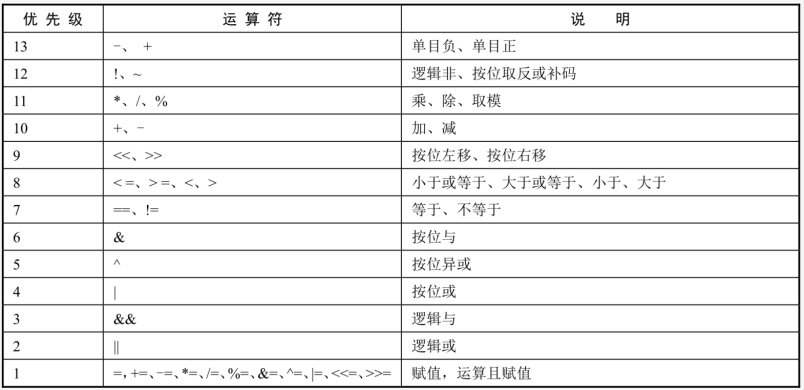
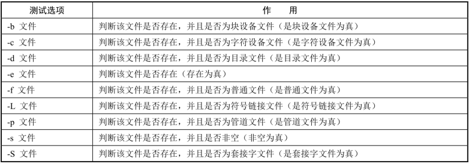
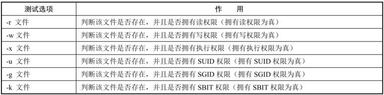
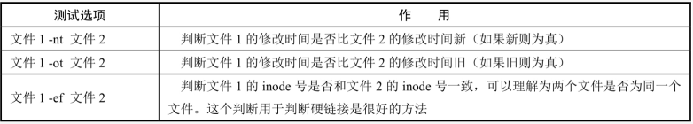
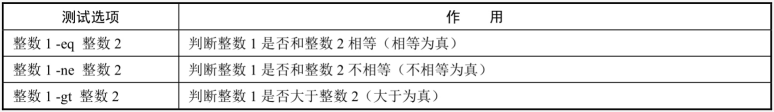
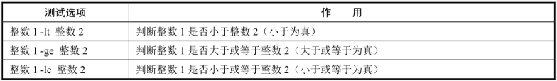
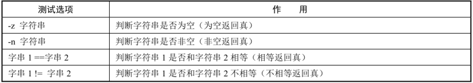
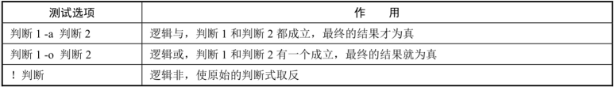

# 1. 【数值运算】

1. **声明变量类型**：`declare [+/-][选项] 变量名`
    * `-`：给变量设定类型属性
    * `+`：取消变量的类型属性
    * `-i`：将变量声明为整数型
    * `-a`：将变量声明为数组型
    * `-r`：将变量声明为只读变量
        * 既不能修改变量的值，也不能删除变量
        * 不能通过 `+r` 取消只读属性
    * `-x`：将变量声明为环境变量
    * `-p`：显示指定变量的被声明的类型

2. **数值运算**
    * 方法1

        ```bash
        aa=11
        bb=22
        declare -i cc=$aa+$bb
        ```

    * 方法2：expr 或 let 数值运算工具

        ```bash
        aa=11
        bb=22

        dd=$(expr $aa + $bb)   # “+”号左右两侧必须有空格
        或
        let dd=$aa+$bb
        ```

    * 方法3：`$((运算式))` 或 `$[运算式]`

        ```bash
        aa=11
        bb=22
        ff=$(($aa+$bb))
        gg=$[$aa+$bb]
        ```

3. **数组**

    ```bash
    name[0]="zhang san"
    name[1]="li ming"
    name[2]="gao luo feng"

    echo ${name}
    # 只写数组名，则只会输出第一个下标变量：zhang san

    echo ${name[*]}
    # 输出数组所有的内容：zhang san li ming gao luo feng
    # 调用数组的元素时，需要使用 "${数组[下标]}" 方式来读取
    ```

# 2. 【运算符】



```bash
aa=$(( (11+3)*3/2 ))
bb=$(( 14%3 ))
cc=$(( 1 && 0 ))    # 0为假，非0为真；逻辑运算的结果真用 1 表示，假用 0 表示
```

# 3. 【变量测试与内容置换】

> * 在脚本中，有时需要判断变量是否存在或是否被赋值
> * 如果变量已经存在并且被赋值，则不改变变量
> * 如果变量不存在或没有被赋值，则赋予其新值
> * 这时就可以使用变量测试与内容置换
> * 在脚本中，可以使用条件判断语句 if 来代替这种测试方法，不过，使用 Shell 自带的变量测试与内容置换方式更加方便

| 变量置换方式 | 变量y没有设置| 变量y为空值 | 变量y设置值  |
| ------------ | ---------- | -----------| ---------|
| `x=${y-新值}`  | `x=新值`   | `x为空`| `x=$y` |
| `x=${y:-新值}` | `x=新值`   | `x=新值`| `x=$y`|
| `x=${y+新值}`  | `x为空`    | `x=新值`| `x=新值`|
| `x=${y:+新值}` | `x为空`    | `x为空` | `x=新值`|
| `x=${y=新值}` | `x=新值 y=新值` | `x为空 y值不变`| `x=$y y值不变`|
| `x=${y:=新值}` | `x=新值 y=新值`| `x=新值 y=新值`| `x=$y y值不变`|
| `x=${y?新值}`  | 新值输出到标准错误输出 | `x为空` | `x=$y`|
| `x=${y:?新值}` | 新值输出到标准错误输出 | 新值输出到标准错误输出 | `x=$y`|

* 如果在大括号中没有 `:`，则变量 y 为空值或没有被设置，处理方法是不同的
* 如果在大括号中有 `:`，则变量 y 不论是为空值，还是没有被设置，处理方法是一样的
* 如果在大括号中是 `-` 或 `+`，则在改变变量 x 的值的时候，变量 y 的值是不改变的
* 如果在大括号中是 `=`，则在改变变量 x 的值的同时，变量 y 的值也会改变
* 如果在大括号中是 `?`，则当变量 y 不存在或为空值时，会把“新值”当成报错输出到屏幕上

```bash
# 范例: x=${y-新值}

unset y     # 删除变量 y
x=${y-new}  # 进行测试
echo $x     # new

y=""        # 给变量 y 赋值为空
x=${y-new}  # 进行测试
echo $x

y=old       # 给变量 y 赋值
x=${y-new}  # 进行测试
echo $x     # old
```

# 4. 【条件判断】

1. **按照文件类型进行判断**
    

    ```bash
    # 方式1
    [root@yyq-pc /tmp]# test -e /root/sh
    [root@yyq-pc /tmp]# echo $?

    # 方式2  ※推荐※
    [root@yyq-pc /tmp]# [ -e /root/sh ]    # “[]” 的内部和数据之间必须使用空格
    [root@yyq-pc /tmp]# echo $?

    [root@yyq-pc /tmp]# [ -d /root/sh ] && echo "yes" || echo "no"
    ```

2. **按照文件权限进行判断**
    

    * 在使用 test 命令判断文件的权限时，并不能区分所有者、属组和其他人
    * 只要文件拥有权限，test 判断就为真，而不能区分哪个用户身份拥有权限

3. **在两个文件之间进行比较**
    

4. **在两个整数之间进行比较**
    
    

5. **字符串判断**
    

6. **多重条件判断**
    

# 5. 【流程控制】

## 5.1. 【if else 语句】

1. **单分支 if 条件语句**
    ```bash
    if [ 条件判断式 ]; then
        程序
    fi

    # [ 条件判断式 ] 就是使用 test 命令进行判断，所以，在中括号和条件判断式之间必须有空格
    # then 后面跟符合条件之后执行的程序，可以放在 [] 之后，用 “;” 分隔；也可以换行写入，就不需要 “;” 了

    if [ 条件判断式 ]
        then
            程序
    fi
    ```

2. **双分支 if 条件语句**
    ```bash
    if [ 条件判断式 ]
        then
            当条件判断式成立时，执行的程序
        else
            当条件判断式不成立时，执行的另一个程序
    fi
    ```

3. **多分支 if 条件语句**
    ```bash
    if [ 条件判断式1 ]
        then
            当条件判断式1成立时，执行程序1
    elif [ 条件判断式2 ]
        then
            当条件判断式2成立时，执行程序2
    ...省略更多条件...
    else
        当所有条件都不成立时，最后执行此程序
    fi
    ```

## 5.2. 【case in语句】

```bash
case $变量名 in
    "值1")
        如果变量的值等于值1，则执行程序1
        ;;
    "值2")
        如果变量的值等于值2，则执行程序2
        ;;
    ... 省略其它分支...
    *)
        如果变量的值都不是以上的值，则执行此程序
        ;;
esac
```

## 5.3. 【for 循环】

```bash
# 语法1
for 变量 in 值1 值2 值3 ...
    do
        程序
    done

# 语法2
for(( 初始值; 循环控制条件; 变量变化 ))
    do
        程序
    done
```

## 5.4. 【while & until 循环】

1. **while 循环**
    ```bash
    while [ 条件判断式 ]
        do
            程序
        done
    ```

2. **until 循环**
    > * 和 while 循环相反，只要条件判断式不成立，则进行循环，并执行循环程序；一旦条件判断式成立，则停止循环

    ```bash
    until [ 条件判断式 ]
        do
            程序
        done
    ```

# 6. 【函数】

```bash
function 函数名() {
    程序
}

# 函数定义时也可以不写 function 关键字
# 如果写了 function 关键字，也可以省略函数名后面的小括号
```

1. **函数调用**
    * 如果不传递参数，直接给出函数名字即可：`name`
    * 如果传递参数，那么多个参数之间以空格分隔：`name param1 param2 param3`

    > * 不管是哪种形式，函数名字后面都不需要带括号
    > * Shell 函数在定义时不能指明参数，但是在调用时却可以传递参数，并且给它传递什么参数它就接收什么参数
    > * Shell 也不限制定义和调用的顺序，你可以将定义放在调用的前面，也可以反过来，将定义放在调用的后面

2. **实例演示**
    ```bash
    # 【案例1】
    #!/bin/bash
    # 函数定义
    function url(){
        echo "Linux"
    }
    # 函数调用
    url

    # 【案例2】
    #!/bin/bash
    function getsum(){
        local sum=0
        for n in $@
        do
            ((sum+=n))
        done
        return $sum
    }
    getsum 10 20 55 15  # 调用函数并传递参数
    echo $?
    ```

    > * 默认情况下，函数的退出状态码是函数中最后一条命令返回的退出状态码
    > * 在函数执行结束之后，可以使用标准变量 `$?` 来确定函数的退出状态码
    > * 退出状态可以由 return 来指定 statement，否则函数的退出状态是函数最后一个执行命令的退出状态（0表示成功，非0表示出错代码）

# 7. 【特殊的流程控制语句】

1. **exit 语句**
    * 在 Linux 系统中是有 exit 命令的，用于退出当前用户的登录状态
    * 在 Shell 脚本中，exit 语句是用来退出当前脚本的：`exit [返回值]`
    * 如果在 exit 之后定义了返回值，那么这个脚本执行之后的返回值就是我们自己定义的返回值。可通过 `$?` 变量来查看返回值
    * 如果在 exit 之后没有定义返回值，那么这个脚本执行之后的返回值是执行 exit 语句之前最后执行的一条命令的返回值

2. **break 语句**：结束整个当前循环

3. **continue 语句**：结束单次当前循环，继续下一循环

