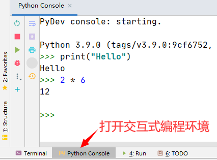
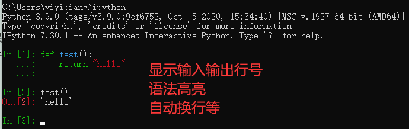
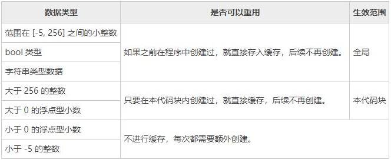

# 1. 【Python 初探】
 
## 1.1. 【Python 解释器】
1. **CPython**
    * 使用 c语言 实现的解释器，通常说的解释器指的就是它。逐行解释成机器码
2. **IPython**
    * 基于 CPython 之上的一个交互式解释器
3. **PyPy**
    * 采用 JIT 技术，对 Python 代码进行动态编译（注意不是解释），所以可显著提高执行速度
    * 绝大部分 Python 代码都可以在 PyPy 下运行，但是 PyPy 和 CPython 有一些是不同的。所以如果代码要放到 PyPy 下执行，就需要了解 PyPy 和 CPython 的不同点
4. **Jython**
    * 运行在 Java 平台上的 Python 解释器，可直接把 Python 代码编译成 Java 字节码执行
5. **IronPython**
    * 运行在 .Net 平台上的 Python 解释器，可直接把 Python 代码编译成 .Net 的字节码
      
> * 如果要和 Java 或 .Net 平台交互，最好的办法不是用 Jython 或 IronPython，而是通过网络调用来交互，确保各程序之间的独立性

## 1.2. 【python 特点】

* Python 是严格 区分大小 的
* 不要求语句使用 分号 结尾；当然也可以使用分号
* 严格缩进，同一级别的代码块的缩进量必须一样，否则报错
    * 行尾的冒号 和 下一行的缩进，表示下一个代码块的开始，而缩进的结束则表示此代码块的结束
    * 可使用 空格 或 Tab 键实现缩进。通常情况下都是采用 4 个空格长度作为一个缩进量

* 字符串使用 双引号 或 单引号 其效果是一样的
* 单行注释使用 `#` ， 多行注释使用 `三个单引号` 或者 `三个双引号`
* Python 没有从语法上定义常量的修饰符，而是靠程序员以全部大写的方式约定俗成的定义
* Python 使用 `+` 进行字符串拼接时，左右操作数必须都是字符串

## 1.3. 【2.7 和 3.X 区别】

1. **print**
    1. **python2**：<font>语法结构</font>
        * `print 'hello world'` 或 `print("hello world")`
    2. **python3**：<font>函数</font>
        * `print("hello world")`
        
2. **编码方式**
    1. **python2**：<font>ASCII</font>
        * 让 python2 支持中文：首行增加 `#coding:utf-8`，再将源文件保存为 UTF-8 字符集
            
    2. **python3**：<font>UTF-8</font>

3. **除法运算**
    1. **python2**：整数相除的结果是一个整数，把小数部分完全忽略掉
    2. **python3**：对于整数之间的相除，结果也会是浮点数

4. **不等运算符**
    1. **python2**：`!=` 或 `<>`
    2. **python3**：`!=`

5. **input**
    1. **python2**
        * `raw_input()`：将所有输入作为字符串看待，返回字符串类型。和 3.x 版本 input() 效果是一样的
        * `input()`：只能接收 "数字" 的输入
    
    2. **python3**：去除了 raw_input()，仅保留了 input() 函数
    
> * 2.x 转成 3.x 版本：`C:\Develop\Python\Python38\Tools\scripts\2to3.py`
>> `Python 2to3.py -w demo.py`

## 1.4. 【Python 的设计哲学】

> * 优雅、明确、简单

* 在 Python 的交互编程终端里输入：`import this` 可以查看原文

```python
>>> import this
The Zen of Python, by Tim Peters

Beautiful is better than ugly. 优美胜于丑陋

Explicit is better than implicit. 明了胜于晦涩

Simple is better than complex. 简单胜过复杂

Complex is better than complicated. 复杂胜过凌乱

Flat is better than nested. 扁平胜于嵌套

Sparse is better than dense. 间隔胜于紧凑

Readability counts. 可读性很重要

Special cases aren't special enough to break the rules. 即使假借特例的实用性之名，也不违背这些规则

Although practicality beats purity. 虽然实用性次于纯度

Errors should never pass silently. 错误不应该被无声的忽略

Unless explicitly silenced. 除非明确的沉默

In the face of ambiguity, refuse the temptation to guess. 当存在多种可能时，不要尝试去猜测

There should be one-- and preferably only one --obvious way to do it. 应该有一个，最好只有一个，明显能做到这一点

Although that way may not be obvious at first unless you're Dutch. 虽然这种方式可能不容易，除非你是 python 之父

Now is better than never. 现在做总比不做好

Although never is often better than *right* now. 虽然过去从未比现在好

If the implementation is hard to explain, it's a bad idea. 如果这个实现不容易解释，那么它肯定是坏主意

If the implementation is easy to explain, it may be a good idea. 如果这个实现容易解释，那么它很可能是个好主意

Namespaces are one honking great idea -- let's do more of those! 命名空间是一种绝妙的理念，应当多加利用
```

## 1.5. 【pip 的使用】

1. **环境变量**
    * `python` => `C:\Develop\Python\Python39`
    * `pip` => `C:\Develop\Python\Python39\Scripts`

2. **Python 包管理工具**：`pip`
    
    ```python
    pip -V                 # 查看 pip 的版本
    pip install <包名>     # 安装指定的包
    pip uninstall <包名>   # 删除指定的包
    pip list               # 显示已经安装的包
    pip freeze             # 显示已经安装的包，并且以指定的格式显示
    pip install -r required.txt  # 安装 required.txt 文件里列出的安装包
    ```

3. **修改 pip 下载源**
    * 默认是从 `https://files.pythonhosted.org/` 网站上下载
    * 修改 pip 下载源：`pip install 包名 -i 国内源地址`
    * 国内常用的 pip 下载源列表
        * **阿里云**：`http://mirrors.aliyun.com/pypi/simple/`
        * **百度**：`https://mirror.baidu.com/pypi/simple`
        * **中国科技大学**：`https://pypi.mirrors.ustc.edu.cn/simple/`
        * **豆瓣**：`http://pypi.douban.com/simple/`
        * **清华大学**：`https://pypi.tuna.tsinghua.edu.cn/simple/`
        * **中国科学技术大学**：`http://pypi.mirrors.ustc.edu.cn/simple/`

## 1.6. 【交互式编程】

* 直接在终端中运行解释器，而不使用文件名的方式来执行文件。这种交互式的编程环境，称之为 **REPL**
    * **R**：读取（Read）输入的内容
    * **E**：执行（Eval）用户输入的指令
    * **P**：打印（Print）执行结果
    * **L**：然后进行循环（Loop）

---

1. **Python 的交互式编程**
    
    ```
    C:\Users\yiyiqiang>python
    Python 3.9.0 (tags/v3.9.0:9cf6752, Oct  5 2020, 15:34:40) [MSC v.1927 64 bit (AMD64)] on win32
    Type "help", "copyright", "credits" or "license" for more information.
    >>> 1+2
    3
    >>> 6/3
    2.0
    >>> 3*"Hello "
    'Hello Hello Hello '
    >>> exit()
    ```
    
2. **Pycharm 进入交互式编程**
    
    
3. **IPython 的安装和使用**
    * python 自带的交互式编程，功能不够强大，例如，不能实现语法高亮，自动换行等功能
    * 可以使用第三方的包 `IPython` ，来对自带的 Python shell 进行功能扩展
    * **安装 IPython**：`pip install ipython`
    * **使用 IPython**
        
        
## 1.7. 【标识符命名规范】

1. **以下划线开头的标识符有特殊含义**
    * 以<mark>单下划线</mark>开头的标识符，表示不能直接访问的类属性，其无法通过 `from ... import *` 的方式导入
    * 以<mark>双下划线</mark>开头的标识符，表示类的私有成员

    * 以<mark>双下划线</mark>作为<mark>开头</mark>和<mark>结尾</mark>的标识符（如 `__init__`），是专用标识符

    > * 因此，除非特定场景需要，应避免使用以下划线开头的标识符

2. **命名规范**
    * **模块和包名**：全小写字母，尽量简单。若多个单词之间用下划线
    * **函数方法名**：全小写字母，多个单词之间用下划线隔开
    * **类名**：首字母大写，采用驼峰原则
    * **常量名**：全大写字母，多个单词使用下划线隔开
    
## 1.8. 【关键字】

```python
>>> import keyword
>>> keyword.kwlist    # 列出所有关键字
```

## 1.9. 【编码规范】

* 不要在行尾加<mark>分号</mark>，也不要用分号将两条命令放在同一行
* 不要在返回语句或条件语句中使用<mark>括号</mark>
* 用 4 个空格来缩进代码
    > * 不限定用 tab 键还是空格。但记住：**不可混用！**

* 每行不超过 80 个字符，建议使用<mark>小括号</mark>连接多行，而不推荐使用<mark>反斜杠</mark>连接
    
    ```python
    # 推荐
    s = ("C语言中文网是中国领先的C语言程序设计专业网站，"
	    "提供C语言入门经典教程、C语言编译器、C语言函数手册等。")

    # 不推荐
    s = "C语言中文网是中国领先的C语言程序设计专业网站，\
	    提供C语言入门经典教程、C语言编译器、C语言函数手册等。"
    ```
    
* 用<mark>两行</mark>分割顶层函数和类的定义
* 用<mark>一行</mark>分割类成员方法的定义
* 在一个函数内使用<mark>空行</mark>时请注意谨慎使用于一个逻辑段
* 括号内不要有<mark>空格</mark>
    
    ```python
    Yes: spam(ham[1], {eggs: 2}, [])
    No:  spam( ham[ 1 ], { eggs: 2 }, [ ] )
    ```

* 不要在逗号，分号，冒号前面加<mark>空格</mark>，但应该在它们后面加（除了在行尾）
* 在<mark>二元操作符</mark>两边都加上一个<mark>空格</mark>
* 当 `=` 用于指示<mark>关键字参数</mark>或<mark>默认参数值</mark>时，不要在其两侧使用空格

    ```python
    Yes: def complex(real, imag=0.0): return magic(r=real, i=imag) 
    No: def complex(real, imag = 0.0): return magic(r = real, i = imag)
    ```

* 每个模块都应该以 `#!/usr/bin/env python<version>` 开头
* 每个导入应该独占一行
    
    ```python
    import os 
    import sys
    ```
    
    * import 也是有顺序的：
        * Python 标准库的 import
        * 第三方库的 import
        * 自定义的库的 import
       
    > * 并且在每组的 import 之间使用一行空行分割
    
* 多行文档字符串结尾的 `"""` 应该单独成行
    
    ```python
    """Return a foobang
    Optional plotz says to frobnicate the bizbaz first.
    """
    ```
    
    * 对单行的文档字符串，结尾的 `"""` 在同一行也可以

* 与像 None 之类的单值进行比较的时候，应永远使用：`is` 或 `is not`
* 使用字符串方法代替字符串模块：字符串方法总是非常的快
* 在检查前缀或后缀时避免对字符串进行切片
    * 用 `startswith()` 和 `endswith()` 代替，因为它们是明确的并且错误更少

    ```python
    No: if foo[:3] == 'bar':
    Yes: if foo.startswith('bar'):
    ```
    
* 对象类型的比较应该始终用 `isinstance()` 代替直接比较类型

    ```python
    No: if type(obj) is type(1):
    Yes: if isinstance(obj, int):
    ```

* 对序列（字符串、列表、元组），使用空列表是 false 这个事实，因此 `if not seq` 或 `if seq`  比 `if len(seq)` 或 `if not len(seq)` 好
* print 时请使用 "%d"、"%s" 等标准输出格式，请勿 str 和变量混合连接使用

---

```python
#!/usr/bin/env python
# -*- coding:utf-8 -*-

__version__= "1.0.0.0"
__author__= "cuijingjing"
__date__= "Thu Nov 18 14:52:47 CST 2010"
__copyright__= "Baidu"

import sys
import os
import shutil
import stat

...
```

# 2. 【数据类型与运算符】

## 2.1. 【一切皆对象】

* Python 中，一切皆对象。每个对象由：`标识`、`类型`、`值` 组成
* 使用内置函数 `id(obj)` 可返回 变量（对象）所在的内存地址

```python
a = 3           # 假设不考虑缓存重用机制
print(id(a))    # 140709195990752
print(id(3))    # 140709195990752    
print(type(3))  # <class 'int'>

b = "我爱你"
print(id(b))           # 2951107206000
print(id("我爱你"))    # 2951107206000
print(type(b))         # <class 'str'>
```

* **Python 缓存重用机制**
    * 初始化变量，并不一定开辟新的内存！
    * 为减少数据创建时申请内存和销毁时撤销内存的开销，提高执行效率，解释器在启动时从内存空间中开辟出了一小部分，用来存储高频使用的数据

    
    
## 2.2. 【变量的定义和使用】

1. **变量的赋值**：`变量名 = 值`
    * **链式赋值**：`x = y = 123`
    * **序列解包赋值**

        ```python
        a, b, c = "123"
        a, b, c = [4, 5, 6]
        a, b, c = 7, 8, 9
        a, b, c = range(3)
        a, b, c = {10, 11, 12}
        a, b, c = {"a": 1, "b": 2, "c": 3}  # 默认对键进行操作
        print(a)
        print(b)
        print(c)

        a, b, c = {"a": 1, "b": 2, "c": 3}.items()
        print(a)  # ('a', 1)

        ## 无须第三方变量实现变量交换
        >>> a,b=1,2        ## a = 1, b = 2
        >>> a,b=b,a        ## a = 2, b = 1
        >>> print(a,b)
        ```
        
2. **动态类型语言**：变量不需要显式声明类型。根据变量引用的对象，解释器自动确定数据类型
3. **强类型语言**：每个对象都有数据类型，只支持该类型支持的操作
4. **删除变量和垃圾回收机制**
    * 可通过 `del` 语句删除不在使用的变量
    * `del` 删除的仅仅是变量，而其指向的数据并没有删除
    
        ```python
         >>> a = 123
         >>> del a
            
         #如果对象没有变量引用，就会被垃圾回收器回收，清空内存空间
        ```
        
